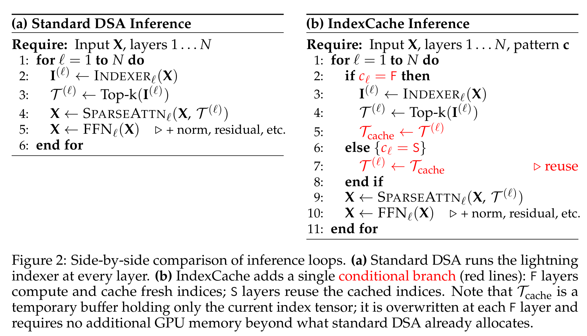

# 稀疏注意力机制对比

把 2025–2026 出现的几种"natively trainable 稀疏注意力 + 推理优化"放在一起看。各方案不是相互替代，而是在三条独立的优化轴上分别下注：**选择粒度、跨头共享、跨层共享**。理解了这三条轴，再看具体方案就只是组合问题。

## 三条独立的优化轴

| 轴 | 含义 | 极端取值 |
| --- | --- | --- |
| 选择粒度 | 一次选择动作覆盖多少 token | token-level（最细，访存碎片化）↔ block-level（最粗，IO 规整） |
| 跨头共享 | 一个 top-k 集合服务多少 query head | 所有 head 共享 ↔ 每 GQA group 独立 ↔ 每 head 独立 |
| 跨层共享 | 一个 top-k 集合服务多少层 | 每层各算（无共享）↔ anchor 层算、其他层复用 |

每一条轴都在拿"模型质量"换"系统效率"，但拿掉的代价不同：粒度换 IO 规整、跨头共享换并行 kernel 简化、跨层共享换 indexer FLOPs。三条轴可以正交叠加。

## 主要方案对照表

下表里"主注意力 sparsity"指对核心 softmax 注意力是否做 top-k 选择，"indexer 是否独立训练"指 token 选择器是否带专门训练目标。

| 方案 | 底层 | 选择粒度 | 跨头共享 | 跨层共享 | indexer 训练方式 | 主要主张 |
| --- | --- | --- | --- | --- | --- | --- |
| [DSA](../concepts/deepseek-sparse-attention.md) | MLA / MQA 模式 | token | **所有 query head 共享** 1 个 top-k | 每层独立 | KL 蒸馏 vs full attention，dense warmup + sparse 训练 | "lightning indexer + 共享 top-k"是 production 友好的稀疏 |
| [MSA](../sources/msa.md) | GQA | **block**（B=128, n=16） | 每 GQA group 独立 top-k | 每层独立 | KL 对齐 vs Main Branch group-averaged 分布 | block 让 IO 规整、KV-outer kernel 拿满 tensor core |

> Figure 1（原文截图，§ Overview）：MSA 的两路结构——Index Branch（轻量选择）和 Main Branch（完整注意力）。block-level 选择（B=128）让 IO 规整、KV-outer kernel 拿满 tensor core。

| NSA（DeepSeek 早期） | MQA / MHA | 三分支：compressed / selected block / sliding window | 共享 | 每层独立 | 端到端 with LM loss | 用三个并行分支同时覆盖粗、细、局部 |
| MoBA | GQA | 极大 KV block，块均值 key 打分 | 共享 | 每层独立 | 仅 LM loss，无显式 indexer 蒸馏 | 训练简单，indexer 直接靠主任务梯度学 |
| InfLLM-V2 | — | 块级，无参数选择 + sliding window | 共享 | 每层独立 | 无（参数自由） | 零样本 dense→sparse 切换 |
| CSA / HCA（[DeepSeek-V4](../models/deepseek-v4.md)） | MLA query + **Shared-KV MQA** core | 先 KV 压缩成块，再 token-level top-k（CSA）或对压缩态做密集（HCA）+ 滑窗补齐 | 共享（MQA：所有 query head 共用一份 K=V 压缩 entry） | 每层独立 | KL 蒸馏 + 异构 KV-cache 系统 | 同时压 attention FLOPs 和 KV-cache（1M context 下 2% KV） |
| [IndexCache](../sources/indexcache.md)（叠加在 DSA 上） | MLA + DSA | token（继承 DSA） | 共享（继承 DSA） | **F 层算、S 层复用 anchor top-k**（1/4 retention 起步） | 无新训练（training-free 贪心搜索）/ 多层 KL 蒸馏（training-aware） | 干掉 indexer 自己的 O(NL²) 项 |

> Figure 2（原文截图，§ Inference Loop）：IndexCache 仅在标准 DSA 循环中加一个条件分支——F 层算 + 缓存，S 层复用。T_cache 只存当前一份 index tensor，零额外显存。1/4 retention 即可保质量、端到端 1.3× 起步。

| 推理时稀疏化（H2O / SnapKV / Quest / MInference / FlexPrefill） | 任意 dense 模型 | 视方法而定 | 视方法而定 | 视方法而定 | 无（基于注意力统计或启发式） | 不改训练、只改 serving；在长 prefill 上还能保留近 dense 速度的至少一支 |

## 训练分阶段对比（第四条轴）

除了上面三条轴，**从 dense 到 sparse 的训练路径**是一条独立变量。DSA 和 MSA 的高层阶段同构（「先 dense 把新加的 indexer 训稳 → 再切稀疏」），但具体拆法不一样。

| 阶段 | DSA（GLM-5 采用） | MSA |
| --- | --- | --- |
| 起点 | **必须**从 dense MLA mid-training 末的 checkpoint 起 | 两路均可：MSA-PT 从头，MSA-CPT 从 2.6T GQA full-attention checkpoint |
| Warmup 训什么 | 只训 indexer，base 冻结（主文本未明写「只训 indexer」，但附录 GLM-4.7-Flash 消融明说 base 冻结） | 两路都跑 full attention，stop-gradient 让 KL 只更新新加的 idx 投影 |
| Warmup 预算 | 1000 步 × 14 条/步 × 202,752 token/条；max LR 5e-3 → 2e-4 | MSA-PT：40B token；MSA-CPT：前 40B token |
| Warmup 后的独立阶段 | **独立的 sparse adaptation 阶段**：沿用 mid-training 数据与超参，恒定 1e-5 再训 **20B tokens** | **无独立 adaptation 段**：warmup 一结束直接跑完剩余预算（PT ♈2.96T，CPT 360B），靠 KL + stop-grad 把 backbone 和 sparse 收敛绑在一起 |
| 是否支持 from-scratch native sparse | 不支持（报告明说是为了避开从头训的「天文成本」） | 支持（MSA-PT 是论文明确交付的主路径之一，3T 预算） |
| Post-training/RL 中的 indexer | **默认冻结** + deterministic `torch.topk`（RL 踩坑结论） | 论文 Outlook 将 RL post-training 列为待做项；实际报告仅覆盖 pretraining |

几个推论：

- **DSA 的两阶段是「dense warm-up + sparse training adaptation」**，这个范式由 DeepSeek-V3.2-Exp 引入并命名，GLM-5 沿用。它本质上是「拿 dense base 的能力作为安全网」的依赖变换，不是让模型从一开始就学会稀疏。
- **MSA 的 warmup 让两路都跑 full attention** 是另一种思路：不是冻 backbone，而是用 stop-gradient 把 KL loss 的作用范围限在新加的 idx 投影上，backbone 照常跑主任务。这是为什么 MSA 不需要独立 adaptation 阶段就能顺出。
- **两者在工程意义上不能互换**：如果手里只有 dense base 且要控制增量预算，DSA 的 1000 步 warmup + 20B adaptation 是最小可行报价；MSA 的 40B warmup 只训 idx 投影，原则上代价更低，但它依赖于躚 backbone「还能接着正常训」，对于已在预训末期冻住设计的 stack 未必适用。

## 几个值得记住的判断

**粒度 vs 跨头共享 是耦合的**。block-level + per-group 让单个 group 内 query head 都看同一组 KV 块，是在"不让组间共享拖慢 kernel"的前提下保住检索多样性。如果想要 token-level 又每 head 独立，访存模式会碎到无法做 tensor-core MMA；这是为什么 DSA 选了 token-level 就只能"所有 head 共享"，而 MSA 选 block-level 就能放开"每 group 独立"——两条路都是 IO/质量的折中产物。**主注意力稀疏化和 indexer 跨层复用是两件独立的事**。DSA 把主注意力从 O(L²) 压到 O(L·k)，但 lightning indexer 自己仍是 O(L²)/层、O(NL²)/模型；30B-A3B DSA 的 prefill 50–81% 时间花在 indexer 上。MSA 同理（Index Branch 仍是 per-token 全量打分）。把 indexer 自己的成本压下去要靠跨层复用——而跨层复用又有两个亚种：依赖 full-attention 作 oracle（Kascade、HySparse、TidalDecode）和依赖稀疏 indexer 作 oracle（IndexCache，第一次系统化）。详见 [跨层索引复用](../concepts/cross-layer-index-reuse.md)。

**多层 KL 蒸馏 = 对均值分布的单 KL（梯度等价）**。这条事实在 MSA（同一层多 head 取平均）和 IndexCache（同一 anchor 多层取平均）里都被独立用到。意味着只要 teacher 与待训练 q 不依赖参数，多 KL 项都可以直接折叠成对质心分布的 KL，便于推断"indexer 学到的是什么"——不是过拟合到某一层/某一 head，而是被服务集合的注意力质心。

**RL 稳定性是第二轴评判**。GLM-5 报告显式提到 DSA 在 RL 阶段会因为 top-k 算子非确定性导致训练/推理 selection 不一致、entropy 几步崩塌；处理方式是 deterministic `torch.topk` + 默认冻结 indexer。MSA 论文本身止于 pretraining，Outlook 那节明说「把 selector-only 设计扩展到 pretraining 之外的场景、包括 reinforcement-learning post-training 和 agentic deployment」是待做工作。换句话说，MSA / NSA / MoBA 在 RL 阶段的稳定性目前是 open problem，部署到 agentic post-training 时这是必查项。

**部署前要看的是 4 件事，不是 1 件**：主注意力 FLOPs + indexer/选择器 FLOPs + KV-cache 访存 + RL/serving 稳定性。光看主注意力的 28× / 90% 这种数字会忽略另外 3 项中可能反吃掉的成本。

## 选哪个

- 已经有 GQA full-attention checkpoint，想低成本上长上下文：MSA-CPT 路线最直接。
- 已经有 MLA + DSA 的 production stack，想再榨一档延迟：叠 IndexCache，1/4 retention 是公开数据下的甜点。
- 目标是百万 token + 共享前缀复用：CSA/HCA + 异构 KV-cache（DeepSeek-V4 路线）系统更完整，但实现复杂度也最高。
- 训练预算紧张，希望最小新增结构：MoBA / InfLLM-V2 这种"少新增参数、靠主任务梯度学"的方案值得评估。

## 相关页面

- [DeepSeek Sparse Attention](../concepts/deepseek-sparse-attention.md)
- [跨层索引复用](../concepts/cross-layer-index-reuse.md)
- [高效长上下文注意力](../concepts/efficient-long-context-attention.md)
- [百万 token 上下文服务](../concepts/million-token-context-serving.md)
- 来源：[MSA](../sources/msa.md)、[IndexCache](../sources/indexcache.md)
