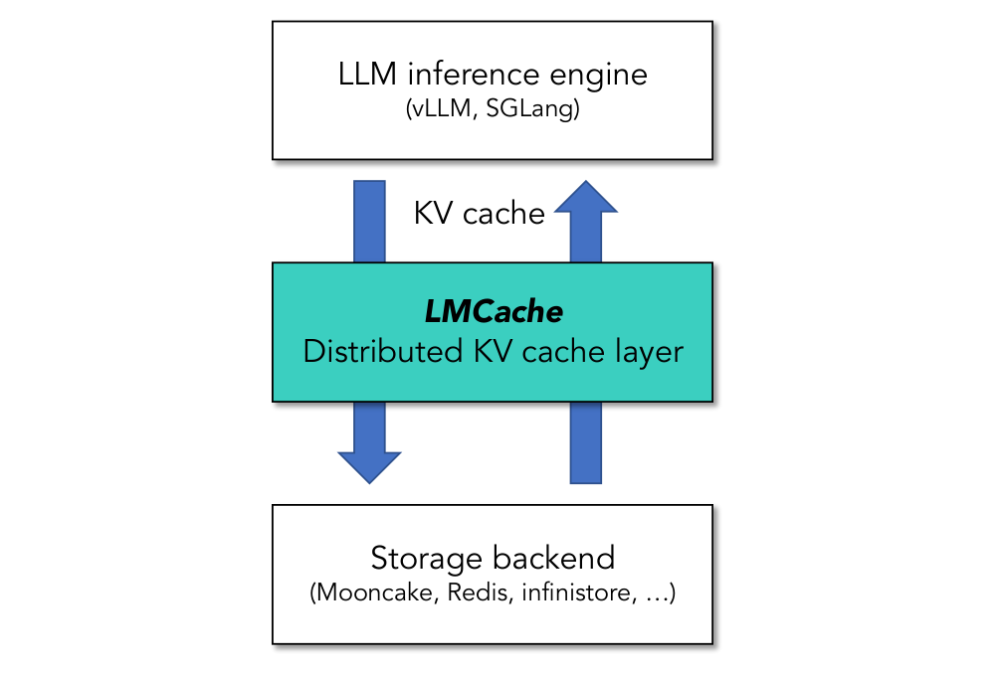
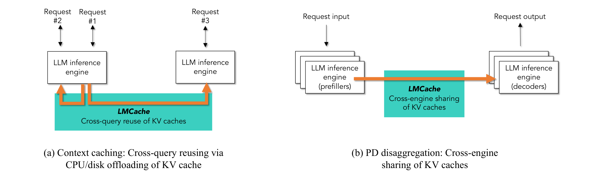

# KV cache 层

## 定义

**KV cache 层**处理的不是「attention 怎么算」，而是：已经算出来的 K/V 要不要离开 GPU、存在哪、谁可以再加载、以及 paged 小块怎么才能吃满 PCIe / RDMA / NVLink。

传统 LLM serving 把 KV 当作单次 query 的 GPU 私有状态：prefill 写入、decode 读取、请求结束释放。两条工业需求把它变成跨请求、跨设备的数据：

1. **Context caching**：同一文档、system prompt、对话历史被多次问，prefix 不该每次重算。
2. **Prefill–decode disaggregation**：prefill 与 decode 拆到不同 GPU / 节点，KV 必须作为 payload 在引擎之间搬。

[LMCache](../sources/lmcache.md) 给出的抽象是夹在 inference engine 与异构存储 / 网络之间的一层：engine 继续管 paged attention 与 batching；这一层负责抽出、分块搬运、层次存储和显式编排。

> Figure 5（[LMCache](../sources/lmcache.md) 原文截图，§ 4）："LMCACHE sits between LLM inference engines and heterogeneous storage/network devices."

这和另外三条 serving 轴的差别：

| 轴 | 搬走的对象 | 典型系统 |
| --- | --- | --- |
| KV cache 层 | 已算好的 paged K/V | [LMCache](../sources/lmcache.md) |
| 模型侧长上下文 cache policy | 压缩块 / SWA 窗口 / indexer KV | [百万 token 上下文服务](million-token-context-serving.md)（DeepSeek-V4） |
| Any-to-any stage graph | hidden / embedding / codec / 音视频 tensor | [vLLM-Omni](../sources/vllm-omni.md) |
| 端侧 MoE | routed expert 权重 | [FreeToken](../sources/freetoken.md) |

## 跨报告信号

### LMCache：paged 小块是 I/O 瓶颈，不是语义瓶颈

[LMCache](../sources/lmcache.md) 的原文主张：vLLM / SGLang 的 paged attention（典型 16 token / page，Llama-3.1-8B 约 62.5 KB）对 batching 有利，但对持久化 / 跨机传输不利——要饱和网络至少要 16 MB 级消息，PCIe 5.0 也要 1–2 MB 才到 75–80% 理论带宽（§ 3.1.1，Table 1）。因此层的核心不是新的 eviction 启发式，而是 **chunked DMA + layer-wise compute/I/O overlap + 零拷贝多目标写**，外加与 engine 解耦的 connector。评测上 CPU 加载带宽 400 vs vLLM native 88 Gbps；同 TTFT 吞吐 2.3–14×。

生产课把语义约束说死了：滑动窗口截断把 Company F 的 prefix hit 从约 85% 打到 45%；远程对象存储（S3 Express 级）反而可以比 full prefill 更快（Company C TTFT −22–32%）。「KV 要不要加载」变成带宽 × 上下文长度的 crossover，不是永远 offload。

> Figure 2（[LMCache](../sources/lmcache.md) 原文截图，§ 2.3）：context caching 与 PD disaggregation 是同一 KV 层的两个调用方。

### DeepSeek-V4：模型把 KV 变成多种大小之后，层还是要搬

[百万 token 上下文服务](million-token-context-serving.md) 里，V4 的 CSA / HCA 压缩块、SWA 窗口、indexer KV 和未压缩 tail 不能套「一种 PagedAttention」。on-disk cache 给了 Full SWA / periodic checkpoint / Zero SWA 三种策略。LMCache 不解决这些 **类型** 怎么对齐 kernel；它解决的是任意 paged 布局一旦要离开 GPU，I/O 粒度不能跟着 16-token page 走。两者叠：压缩减小体积，chunked 层决定体积能不能按时回来。

### vLLM-Omni：把「PD 的 KV transfer」泛化成任意中间态

[Any-to-any 多模态 serving](any-to-any-multimodal-serving.md) 的 unified connector 受 vLLM PD KV transfer 启发，但 payload 是 Thinker hidden、Talker codec、音视频 tensor。LMCache 是同一直觉在纯 KV 上的生产实现（vLLM production stack / Dynamo / llm-d / AIBrix / KServe 采用）；Omni 把接口从 KV 扩到 stage edge。读论文时先问：这条边传的是 K/V，还是别的激活。

### FreeToken / JoyAI：prefix 能不能命中，取决于谁改历史

[端侧 MoE serving](edge-native-moe-serving.md) 的 expert 搬运与 KV 搬运正交；但 FreeToken 的 semantic-anchor checkpoint 与 LMCache 的「不要截断」是同一条 prefix 约束：agent harness 在 thinking / tool-call 边界改写历史，滑动窗口从头部砍 token，都会让已经存下的 KV key 失效。[JoyAI-VL-Interaction](../sources/joyai-vl-interaction.md) 则把非短期记忆存成文本 chunk，主动制造稳定 prefix 给 vLLM cache——这是应用侧在为 KV 层提供可哈希的 key。

GLM-5 的 DP-aware routing（同一 rollout 钉在同一 DP rank，避免工具调用后重复 prefill）是 **调度侧** 的 prefix 保护，和 LMCache 的 cache-aware `lookup` 同类，对象仍是 KV 位置而不是 expert。

## 为什么重要

1. **长上下文主张落地的第一公里是 I/O，不是再写一个 attention kernel。** 模型侧稀疏 / 线性 / 压缩决定 KV **有多大**；这一层决定这么大的东西 **能不能** 跨查询、跨 GPU 复用。
2. **Prefix hit 是产品约束，不是 cache 实现细节。** 截断、动态插入、tool output 替换都会让 KV 层的 key 对不上；这和 agent harness、记忆系统、context 管理是同一条设计链。
3. **PD disaggregation 的瓶颈经常是 page-by-page 传输，不是 NCCL 拓扑。** LMCache 与 vLLM native PD 的差距主要在传输粒度（Figure 14）。
4. **KV 需要一等 API。** pin / move / lookup 让 router 和行业应用（钉财报、压 KV 再跨节点）能显式管缓存；没有这层，上层只能猜 GPU 里还剩什么。

## 待追问

- Connector 对 MLA / DSA / CSA-HCA / GDN 等非标准 KV 的适配是「改翻译」还是要改 chunk 对齐？本 wiki 的长上下文模型几乎都不是纯 GQA paged KV。
- Load vs prefill 的带宽–长度 crossover 有没有在线策略，还是只是评测观察？
- 压缩 API 存在但无评测：lossy KV 压缩进这一层之后，和模型侧 CSA/HCA 压缩是替代还是叠加？
- 多租户下 pin 住热文档会不会把 CPU / 远程容量钉死，驱逐策略如何与 vLLM 自己的 prefix cache 协同？

## 相关页面

- 来源：[LMCache 技术报告](../sources/lmcache.md)、[DeepSeek-V4 技术报告](../sources/deepseek-v4.md)、[vLLM-Omni 技术报告](../sources/vllm-omni.md)、[FreeToken](../sources/freetoken.md)、[JoyAI-VL-Interaction 技术报告](../sources/joyai-vl-interaction.md)
- 相邻概念：[百万 token 上下文服务](million-token-context-serving.md)、[Any-to-any 多模态 serving](any-to-any-multimodal-serving.md)、[端侧 MoE serving](edge-native-moe-serving.md)
