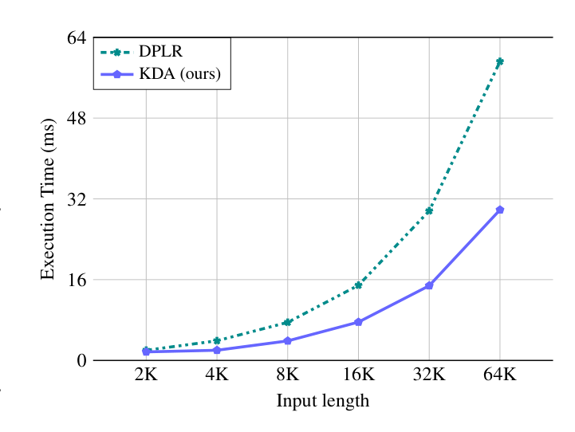

# 线性注意力与 delta rule

## 定义

**线性注意力**是 softmax 注意力的一条替代路线：不再为每个 query 对全部历史 token 做 $O(L^2)$ 的两两点积，而是把历史压进一个**固定大小的矩阵状态** $S_t\in\mathbb{R}^{d_k\times d_v}$，像 RNN 一样递推。最朴素的形式（[Kimi Linear 报告](../sources/kimi-linear.md) § 2.2）：

$$S_t = S_{t-1} + k_t v_t^\top,\qquad o_t = S_t q_t$$

从「快速权重 / 在线学习」视角看，$S_t$ 是一块存「键→值」映射的关联记忆。它的代价与序列长度**线性**、且 decode 时**没有随长度增长的 KV cache**——这正是它对长上下文和 RL test-time scaling 有吸引力的原因。代价是：固定状态容量有限，长程精确检索（copying、关联召回）理论上吃亏，历史上质量长期落后 softmax。

> 这是 wiki 里与 [稀疏注意力机制](../comparisons/sparse-attention-mechanisms.md) **正交的另一条路线**：稀疏注意力仍是 softmax，只是少看 token；线性注意力把 token mixer 整个换成线性 RNN。

## 一条演进链：从朴素线性到 KDA

朴素线性注意力只会累加、从不遗忘，状态无界增长 → 长上下文里互相干扰。后续工作沿两个方向补救——**遗忘门 / decay** 和 **delta rule**——一步步把质量追回来：

| 阶段 | 状态更新（简化） | 关键改动 | 解决的问题 |
| --- | --- | --- | --- |
| 朴素线性注意力 | $S_t = S_{t-1} + k_t v_t^\top$ | 无遗忘 | 复杂度从 $O(L^2)$ 降到 $O(L)$ |
| DeltaNet | $S_t = (I-\beta_t k_t k_t^\top)S_{t-1} + \beta_t k_t v_t^\top$ | 把递推看成对重构损失 $\tfrac12\lVert S k_t - v_t\rVert^2$ 做在线梯度下降（经典 **delta rule**）；rank-1 更新等价于广义 Householder 变换，可 chunkwise 并行 | 让记忆「自我纠错」，但旧关联仍永久保留 |
| Gated DeltaNet（GDN） | $S_t = \alpha_t(I-\beta_t k_t k_t^\top)S_{t-1} + \beta_t k_t v_t^\top$ | 加一个 **head-wise 标量遗忘门** $\alpha_t\in[0,1]$（作用类似对快速权重的 weight decay / 数据相关 L2 正则）。GDN 原文（[来源页](../sources/gated-delta-net.md)）的洞察：门控负责「快速整块清空」、delta rule 负责「定向精确更新」，两者互补——$\alpha_t\to0$ 瞬间清空记忆，$\alpha_t\to1$ 退化成纯 delta rule | 可控的记忆寿命，缓解干扰，改善稳定性与长上下文泛化 |
| **KDA**（Kimi Linear） | $S_t = (I-\beta_t k_t k_t^\top)\mathrm{Diag}(\alpha_t)S_{t-1} + \beta_t k_t v_t^\top$ | 把 GDN 的标量门换成 **channel-wise 细粒度门** $\mathrm{Diag}(\alpha_t)$——每个特征维独立遗忘速率（思路承自 GLA） | 更精细地调度有限状态记忆，在合成检索任务上超过 GDN、Mamba2 |

GDN 的一个有趣视角（报告 § 2.2）：标量遗忘门可被解读成一种**数据相关、可学习的乘性位置编码**，放松了 RoPE 的正交性约束——这也是 Kimi Linear 敢于在全局 MLA 层用 NoPE、把位置编码责任全交给 KDA 层的依据。

> Figure 3（原文截图，§ 4 The Kimi Linear Model Architecture）：\"Illustration of our Kimi Linear model architecture, which consists of a stack of blocks containing a token mixing layer followed by a MoE channel-mixing layer. Specifically, we interleave N KDA layers with one MLA layer for token mixing, where N is set to 3 in our implementation.\"（图中只标注泛化的 N×/1×，3:1 是正文给定的 N=3）

## KDA 的硬件效率（已据 Kimi Linear 原文核实）

细粒度门理论上要求用 **Diagonal-Plus-Low-Rank（DPLR）** 转移矩阵 $S_t=(D-a_t b_t^\top)S_{t-1}+k_t v_t^\top$，但通用 DPLR 算力贵、且细粒度衰减的除法在 intra-chunk 计算里有数值精度问题（GLA 为此要在对数域 + 二级 full-precision chunking，牺牲半精度 matmul）。

KDA 的做法是用一个**专门化 DPLR 变体**：把低秩两支 $a,b$ 都**绑定到 $k$**。配合 WY representation（打包 rank-1 更新，借 Comba 的 $P$ 形式省一次矩阵求逆）和 UT transform（减少 non-matmul FLOPs），把二级 chunk 矩阵计算从 4 次降到 2 次，再省掉 3 次额外矩阵乘。结果：算子效率比通用 DPLR 提升约 **100%**（报告 § 3.2，Figure 2 实测 2K–64K 输入长度 KDA 显著快于 DPLR）。

> Figure 2（原文截图，§ 3.2 Efficiency Analysis）：\"Execution time of kernels for varying input lengths, with a uniform batch size of 1 and 16 heads.\"

## 跨报告信号

- **[Gated DeltaNet（GDN）](../sources/gated-delta-net.md)（Yang 等，ICLR 2025，原文已入库）**：演进链中间一环的**一手出处**。提出 gated delta rule——门控（快速整块清空）+ delta rule（定向精确更新）互补合体，超过 Mamba2 和 DeltaNet，并自提「GDN + 滑窗/Mamba2」混合架构。KDA 与 Qwen3-Next 系的线性层都建在它之上。

  

  > Figure 1（原文截图，§ 架构）：\"Visualization of the (hybrid) architecture and block design of Gated DeltaNet models. Gated DeltaNet-H1 and H2 use Gated DeltaNet + SWA and Mamba2 + Gated DeltaNet + SWA patterns, respectively.\"
- **[Kimi Linear](../sources/kimi-linear.md)（KDA，2025）**：本 wiki 首篇线性注意力路线报告。KDA 是 GDN 的细粒度门升级（head-wise 标量门 → channel-wise $\mathrm{Diag}(\alpha_t)$）；模型层面用 **3:1 layerwise 混合**（3 KDA : 1 Full MLA），首次让混合线性注意力在公平对比下全面追平/超过 full attention，1M context KV cache 降 75%、decode 吞吐 6.3×。
- **Qwen3-Next 系（[Qwen3-Coder-Next](../sources/qwen3-coder-next.md)、[Qwen3.5-Omni](../sources/qwen3.5-omni.md)）**：另一条把 GDN 放进生产模型的路线，且**全局层选择不同**——用「带输出门的 full attention（[gated attention](attention-gating.md)）」而非 Kimi Linear 的 MLA，同样 3:1 混合。据第三方分析，Kimi Linear 本质就是把 Qwen3-Next 那个 gated-attention 全局层换成了 MLA（来源：[Sebastian Raschka, Beyond Standard LLMs](https://magazine.sebastianraschka.com/p/beyond-standard-llms)）。Qwen3.5-Omni 还把 GDN 降 KV-cache I/O 的价值延伸到长音视频序列。
- **混合而非纯线性**：纯线性注意力的有限状态做不好长程检索，所以 Kimi Linear 保留 1/4 的全局 [MLA](multi-head-latent-attention.md) 层、Qwen3-Next 保留 1/4 的全局 gated attention 层维持全局信息流——这与「稀疏注意力在 MLA 上加 top-k」是两种不同的省法（一个换 token mixer，一个少看 token）。
- **门的两种含义别混**：线性注意力里的「门」（GDN/KDA 的遗忘门 $\alpha_t$）控制 RNN 状态记忆寿命；softmax 注意力里的「门」（见 [注意力门控](attention-gating.md)）是给 SDPA 输出注入非线性 + 去 attention sink。同名不同事。

## 为什么重要

- **它是稀疏注意力之外的第二条长上下文路线**。DSA/MSA/CSA 都在「softmax + 少看 token」框架内；线性注意力直接换掉 token mixer，decode 时连随长度增长的 KV cache 都没有。理解这条轴才看得清 2025–2026 长上下文架构的全貌。
- **delta rule + 门控是把线性注意力质量追回 softmax 的两大杠杆**。这条 DeltaNet → GDN → KDA 的链条，本质是不断给「固定状态怎么写、怎么忘」加更精细的控制。
- **混合比例是新的架构超参**。3:1 不是拍脑袋，是消融选出的质量/吞吐折中；它把「全局层占多少」变成和 MoE sparsity 并列的可调维度。

## 待追问

- KDA 的 channel-wise 门相比 GDN 的 head-wise 门，参数/显存增量具体多少？报告强调低秩投影控制，精确数字需查配置表。
- 线性注意力在长 trajectory RL 上，固定状态会不会比 softmax 更易丢失关键中间信息？Kimi Linear 称 RL 阶段也追平，但机制层面的稳健性证据有限。
- DeltaNet/GDN/KDA 之外，Mamba2、GLA、RWKV 等线性/SSM 变体与这条链的关系，值得补一张更全的谱系图（GDN 原文已把 Mamba2/DeltaNet 作为对照基线，可据其 § 2 补全 delta-rule 之外的一支）。
- DPLR「把 $a,b$ 绑定到 $k$」是否损失了通用 DPLR 的某些表达力？报告说「representational capacity 与通用 DPLR 对齐」，但这是 KDA 自述，外部尚无独立验证。

## 相关页面

- 来源：[Gated DeltaNet 报告](../sources/gated-delta-net.md)（GDN 一手出处）、[Kimi Linear 技术报告](../sources/kimi-linear.md)、[Qwen3-Coder-Next](../sources/qwen3-coder-next.md)、[Qwen3.5-Omni](../sources/qwen3.5-omni.md)
- [注意力门控](attention-gating.md)
- [Multi-Head Latent Attention](multi-head-latent-attention.md)（Kimi Linear 的全局层底座）
- [高效长上下文注意力](efficient-long-context-attention.md)
- [稀疏注意力机制对比](../comparisons/sparse-attention-mechanisms.md)（正交的另一条路线）
- 模型：[Kimi Linear](../models/kimi-linear.md)
