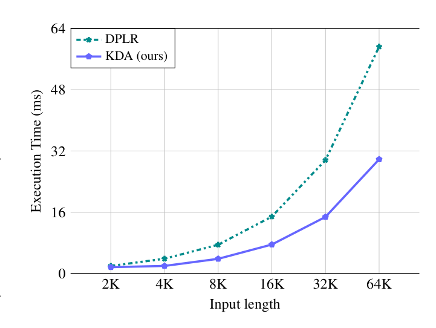

# 线性注意力与 delta rule

## 定义

**线性注意力**是 softmax 注意力的一条替代路线：不再为每个 query 对全部历史 token 做 $O(L^2)$ 的两两点积，而是把历史压进一个**固定大小的矩阵状态** $S_t\in\mathbb{R}^{d_k\times d_v}$，像 RNN 一样递推。最朴素的形式（[Kimi Linear 报告](../sources/kimi-linear.md) § 2.2）：

$$S_t = S_{t-1} + k_t v_t^\top,\qquad o_t = S_t q_t$$

从「快速权重 / 在线学习」视角看，$S_t$ 是一块存「键→值」映射的关联记忆。它的代价与序列长度**线性**、且 decode 时**没有随长度增长的 KV cache**——这正是它对长上下文和 RL test-time scaling 有吸引力的原因。代价是：固定状态容量有限，长程精确检索（copying、关联召回）理论上吃亏，历史上质量长期落后 softmax。

> 这是 wiki 里与 [稀疏注意力机制](../comparisons/sparse-attention-mechanisms.md) **正交的另一条路线**：稀疏注意力仍是 softmax，只是少看 token；线性注意力把 token mixer 整个换成线性 RNN。

## 一条演进链：从朴素线性到 KDA

朴素线性注意力只会累加、从不遗忘，状态无界增长 → 长上下文里互相干扰。后续工作沿两个方向补救——**遗忘门 / decay** 和 **delta rule**——一步步把质量追回来：

> **「delta rule」名字的来历。** 它是一条 1960 年的经典学习规则（Widrow & Hoff，GDN 原文 § 2.2 引 `Widrow et al., 1960`，亦称 Widrow-Hoff rule / LMS）。其中的 **delta 指误差项 $\delta = y-\hat y$（目标减预测）**——希腊字母 Δ/δ 历来表示「差」，规则的更新量正比于这个误差（**错得越多改得越多**，区别于只看对错符号、定步长改的 perceptron rule），本质是对最小二乘做梯度下降。搬到线性注意力里（GDN § 3.1 的 fast-weight / test-time SGD 视角）：把状态 $S$ 看成快速权重，目标是从 key 重建 value，损失 $L=\tfrac12\lVert Sk_t-v_t\rVert^2$，对它走一步 SGD 就得到 $S_t = S_{t-1}(I-\beta_t k_tk_t^\top)+\beta_t v_tk_t^\top$。括号里的 $(S_{t-1}k_t-v_t)$ 正是 **delta**：「用旧状态查 key 得到的旧 value」与「要写入的新 value」之差。所以 delta rule = 「按当前 key 的重建误差去**定向**擦旧写新、误差为零就不动」；这里 $\beta_t$ 就是学习率 $\eta$，GDN 后来加的 $\alpha_t$ 则相当于给这步 SGD 加 **weight decay**。

| 阶段 | 状态更新（简化） | 关键改动 | 解决的问题 |
| --- | --- | --- | --- |
| 朴素线性注意力 | $S_t = S_{t-1} + k_t v_t^\top$ | 无遗忘 | 复杂度从 $O(L^2)$ 降到 $O(L)$ |
| DeltaNet | $S_t = (I-\beta_t k_t k_t^\top)S_{t-1} + \beta_t k_t v_t^\top$ | 把递推看成对重构损失 $\tfrac12\lVert S k_t - v_t\rVert^2$ 做在线梯度下降（经典 **delta rule**）；rank-1 更新等价于广义 Householder 变换，可 chunkwise 并行 | 让记忆「自我纠错」，但旧关联仍永久保留 |
| Gated DeltaNet（GDN） | $S_t = \alpha_t(I-\beta_t k_t k_t^\top)S_{t-1} + \beta_t k_t v_t^\top$ | 加一个 **head-wise 标量遗忘门** $\alpha_t\in[0,1]$（作用类似对快速权重的 weight decay / 数据相关 L2 正则）。GDN 原文（[来源页](../sources/gated-delta-net.md)）的洞察：门控负责「快速整块清空」、delta rule 负责「定向精确更新」，两者互补——$\alpha_t\to0$ 瞬间清空记忆，$\alpha_t\to1$ 退化成纯 delta rule | 可控的记忆寿命，缓解干扰，改善稳定性与长上下文泛化 |
| **KDA**（Kimi Linear） | $S_t = (I-\beta_t k_t k_t^\top)\mathrm{Diag}(\alpha_t)S_{t-1} + \beta_t k_t v_t^\top$ | 把 GDN 的标量门换成 **channel-wise 细粒度门** $\mathrm{Diag}(\alpha_t)$——每个特征维独立遗忘速率（思路承自 GLA） | 更精细地调度有限状态记忆，在合成检索任务上超过 GDN、Mamba2 |
| **KDA（Kimi K3 升级）** | 同上结构，但 decay 参数化从无界 negative-Softplus 换成 **scaled sigmoid**（有下界）；输出门从低秩换成 **full-rank** | `g_t = g_min·Sigmoid(e^A·z_t) ∈ (g_min, 0)`，`g_min=-5` 固定 → retention factor `α > e^-5 ≈ 6.7e-3`，16-token tile 累积 log-decay ∈ (-80, 0) → reciprocal `1/Γ` 不溢出 BF16 → **所有因果 tile（含对角）用 dense Tensor Core MMA**，消掉 position-pair diagonal 路径 | 解锁 KDA 在 3T 级生产模型的硬件效率；K3 用 69 KDA + 24 MLA 的 3:1 混合栈，1M context NoPE 外推 |

> **Qwen3-Next / Qwen3.5 停在 GDN 这一环，机制上未升级到 KDA。** 它们的线性层用的就是 GDN 原版的 gated delta rule（$\alpha_t$ 是 **head-wise 标量门**，不是 KDA 的 channel-wise 向量门），且 $\alpha_t$ 沿用 GDN 自己规定的 Mamba2 式参数化（原文脚注「We use Mamba2's parameterization for α」）——所以「用 Mamba2 式 α」恰恰是忠实沿用 GDN、不是 Qwen 的改动。判据：HF `config.json` 的 `linear_num_*_heads` + 每 head 一个 `A_log`/`dt_bias` 坐实标量门（代码/config tier-1）。机制沿用 ≠ 模块实现无改动——Qwen 在 block 实现层有工程化改动（value head 2× key head、投影与输出门融合等），那是另一层，见官方 `transformers` modeling，不在本机制演进链内。

GDN 的一个有趣视角（报告 § 2.2）：标量遗忘门可被解读成一种**数据相关、可学习的乘性位置编码**，放松了 RoPE 的正交性约束——这也是 Kimi Linear 敢于在全局 MLA 层用 NoPE、把位置编码责任全交给 KDA 层的依据。

## GDN block 怎么读写那块状态（已据 GDN 原文核实）

把状态递推放回一个完整的 token mixer 层里看，几个常被问到的点：

**状态就是一个固定大小的矩阵 cache。** GDN 层维护的不是随长度增长的 KV 列表，而是一个**矩阵值状态** $S_t\in\mathbb{R}^{d_v\times d_k}$（原文 § 2.1，"reframing as a linear RNN with **matrix-valued states**"）。两个维度的含义：$d_k$ 是 query/key 的（per-head）维度、$d_v$ 是 value 的维度。状态本质是 $\sum v\,k^\top$ 形式的 **outer-product 关联记忆**（一张「key→value」映射表），写入时把 $v_t k_t^\top$ 叠进去、读取时 $o_t=S_t q_t$ 用 query 去查。多 head 则每 head 各持一个 $d_v\times d_k$ 矩阵。关键：**它和序列长度 $L$ 无关**——decode 100 token 和 1M token 这块矩阵一样大，这正是 GDN 省 KV-cache 的根。代价是容量有限：原文 § 1 指出能存的正交 key-value 对数受限于维度，序列超过维度就发生 **memory collision**（信息叠加、精确检索崩坏）——这就是为什么生产模型不做纯 GDN、要保留少量全局层兜底长程检索。

**输入和普通 attention 一样，是同一份 hidden state。** GDN「follows Llama's macro architecture ... replaces self-attention with gated delta rule token mixing」（原文 § 3.4）——宏观就是标准 Transformer 的 `Norm→token-mixer→残差→Norm→MLP→残差`，只是把 token-mixer 那一格的 self-attention 换成 gated delta rule。输入接口不变，所以才能和全局 attention 层在同一栈里交替堆叠。

**hidden state 进来后分五支投影**（原文 § 3.4 + Figure 1 右）——比普通 attention 的 q/k/v 多两支门：

| 支路 | 从 hidden state 怎么来 | 作用 |
| --- | --- | --- |
| **q** | Linear → ShortConv → SiLU → **L2Norm** | 读取：$o_t=S_t q_t$ |
| **k** | Linear → ShortConv → SiLU → **L2Norm** | 寻址：构造 $k_tk_t^\top$、$v_tk_t^\top$ 写进状态 |
| **v** | Linear → ShortConv → SiLU | 要写入的值 |
| **α**（遗忘门 / decay） | **仅 Linear**（用 Mamba2 的参数化） | 控制旧状态忘多少（$\alpha_t\to0$ 整块清空，$\to1$ 全保留） |
| **β**（写入强度 / 学习率） | **仅 Linear** | 控制当前 token 写多用力（test-time SGD 视角下就是 learning rate） |

α、β 是 per-head 标量门，只用一个极小 Linear，没有 conv/SiLU/L2Norm——因为它们出的是数不是特征向量。**普通 attention 不产门**，这两支是 GDN 区别于 softmax attention 的关键：α 负责「整块忘」（gating），β + delta 负责「定向写」（delta rule），两者互补即 gated delta rule。

**那个 short conv 不是升维，是逐通道因果短卷积。** 它是 depthwise causal convolution（典型 kernel size 3–4），沿**时间轴**对每个 channel 独立做小窗口加权，输入输出维度完全一致（不改特征维度，升维发生在前面那个 Linear）。作用是给 q/k/v 注入**局部上下文**，补线性注意力「modeling local shifts and comparisons」偏弱的短板（原文 § 3.4）。附录 S.1 消融坐实它是质量关键件：去掉 short conv，ppl 27.35→28.95、平均准确率 47.26→46.16。

**q 不和 k 做 softmax 式两两点积。** 这是线性注意力和 softmax attention 的本质分叉：softmax 先算 $L\times L$ 的 $QK^\top$ 分数矩阵（$O(L^2)$、KV cache 随长增长），GDN 靠矩阵乘法**结合律换序**——$q^\top(k v^\top)$ 取代 $(q^\top k)v$，即 k 先和 v/自己结合写进状态 $S$、q 最后乘 $S$ 读出，永远只碰固定大小的 $S$。q 读的就是这块 cache，**不看任何原始历史 token**（原始 K/V 不留）。按原文 Eq. 10 的时序是**先写后读**：$o_t=S_t q_t$ 里的 $S_t$ 已经包含了当前 token 自己的 $v_tk_t^\top$ 贡献（对应 causal mask 含对角线、query 能 attend 到当前位置）。

**训练并行、推理才递推。** 写成 $S_t$ 从 $S_{t-1}$ 滚来的递推只是数学形式；训练/prefill 走 **chunkwise parallel form**（原文 § 3.3：切块、块内 matmul 并行吃满 tensor core、块间传状态），只有 decode 才真正逐 token 更新 $S_t$、$q_t$ 读 $S_t$ 的 $O(1)$ 递推。两形态经 state space duality 等价。**teacher-forcing 训练（预训练 / SFT / 偏好优化）整条序列一次喂入，都走并行路径**——这点 GDN 原文按训练态描述、未区分预训练与 SFT（对算子是同一件事）；官方 `transformers` 的 `Qwen3NextGatedDeltaNet` 也确实持 `chunk_*`（训练/prefill）与 `recurrent_*`（decode）两套 kernel。

> Figure 3（原文截图，§ 4 The Kimi Linear Model Architecture）：\"Illustration of our Kimi Linear model architecture, which consists of a stack of blocks containing a token mixing layer followed by a MoE channel-mixing layer. Specifically, we interleave N KDA layers with one MLA layer for token mixing, where N is set to 3 in our implementation.\"（图中只标注泛化的 N×/1×，3:1 是正文给定的 N=3）

## KDA 的硬件效率（已据 Kimi Linear 原文核实）

**先厘清「KDA 比 GDN 多存什么」——多的不是状态 cache。** 把 GDN 的 head-wise 标量门换成 channel-wise 向量门，常被误解成「状态变大了」。其实需要**长期 cache 的 recurrent 状态** $S_t$（$d_v\times d_k$ per head）GDN 与 KDA **完全一样**——遗忘门不管标量还是向量都只是**乘在状态上的衰减系数**（$\mathrm{Diag}(\alpha_t)$ 是每步临时算、用完即弃的对角缩放），不进入也不撑大 $S_t$。channel-wise 门真正多出来的是三处、且都不是状态显存：(a) **每步瞬时的门值**从「每 head 1 个数」变成「每 head $d_k$ 个数」（激活/寄存器里的临时量，非持久 cache）；(b) **门投影的参数**从 `hidden→num_heads` 变成 `hidden→num_heads×d_k`，报告强调用**低秩投影**压住这个增量；(c) **算子复杂度**——细粒度门要求 DPLR 转移矩阵，通用 DPLR 很贵，这才是主要成本，KDA 用下述专门化算子去抵消。一句话：KDA 靠「把门做细」而非「把状态撑大」来提升有限状态的利用率。

细粒度门理论上要求用 **Diagonal-Plus-Low-Rank（DPLR）** 转移矩阵 $S_t=(D-a_t b_t^\top)S_{t-1}+k_t v_t^\top$，但通用 DPLR 算力贵、且细粒度衰减的除法在 intra-chunk 计算里有数值精度问题（GLA 为此要在对数域 + 二级 full-precision chunking，牺牲半精度 matmul）。

KDA 的做法是用一个**专门化 DPLR 变体**：把低秩两支 $a,b$ 都**绑定到 $k$**。配合 WY representation（打包 rank-1 更新，借 Comba 的 $P$ 形式省一次矩阵求逆）和 UT transform（减少 non-matmul FLOPs），把二级 chunk 矩阵计算从 4 次降到 2 次，再省掉 3 次额外矩阵乘。结果：算子效率比通用 DPLR 提升约 **100%**（报告 § 3.2，Figure 2 实测 2K–64K 输入长度 KDA 显著快于 DPLR）。

> Figure 2（原文截图，§ 3.2 Efficiency Analysis）：\"Execution time of kernels for varying input lengths, with a uniform batch size of 1 and 16 heads.\"

## Kimi K3 的 KDA 升级：scaled sigmoid + full-rank gate（已据 Kimi K3 原文 § 2.1.1 核实）

[Kimi K3](../sources/kimi-k3.md)（2026-07，首个开源 3T 级模型）沿用 Kimi Linear 的 KDA 结构（channel-wise 细粒度门 + delta rule），但改了两处参数化，让 KDA 能在 2.8T 规模、1M 上下文下高效跑起来：

**1. Lower-bounded decay（scaled sigmoid 替代 negative-Softplus）**

Kimi Linear 用 `g_t = -e^A · Softplus(z_t) ∈ (-∞, 0)`（无下界）。问题在 chunkwise 计算（Eq. 4）：keys 要乘以 reciprocal cumulative decay `1/Γ_{1→C}`，`Γ` 是 retention factors `α ∈ (0,1)` 的乘积，无界趋零 → reciprocal 无界增长 → **溢出 BF16 动态范围**。于是对角 tile 被迫走 position-pair diagonal 专用路径（无法用 dense Tensor Core MMA），非对角 tile 才走 dense MMA——KDA 算力的一个结构性瓶颈。

K3 改成 `g_t = g_min · Sigmoid(e^A · z_t) ∈ (g_min, 0)`，`g_min = -5` 固定。于是每个 retention factor `α_t > e^-5 ≈ 6.7e-3`，16-token tile 的累积 log-decay落在 `(-80, 0)`，reciprocal rescaling factor < e^80 **仍在 BF16 动态范围内**。结果：**所有因果 tile（对角 + 非对角）都能用 dense Tensor Core matrix multiplication**，消掉 position-pair diagonal 路径。

> Figure 3（原文截图，§ 2.1.1）："Lower-bounded decay and its effect on chunkwise KDA computation. (a) Kimi Linear uses an unbounded negative-Softplus mapping, whereas Kimi K3 bounds the log-decay with a scaled sigmoid … (b) Kimi Linear evaluates each diagonal tile with an explicit position-pair computation, while the bounded range in Kimi K3 allows all causal tiles to use dense Tensor Core matrix multiplications."

> 这个参数化与 prior work 的 lower-bounded recurrence gates（[97, 27, 91]）相关。`A_h` 是 per-head learnable log-scale，初始化为 0；`b_α^h` 按 Kimi Linear/GDN/Mamba2 初始化。

**2. Full-rank output gate**

Kimi Linear 的 KDA 输出门是低秩参数化（省参数）。K3 换成 input-dependent **full-rank** 投影：`y = W_o[Sigmoid(W_g x) ⊙ RMSNorm(~o)]`，让每个 token 用全秩门调制从 recurrent state 读出的通道。Gated MLA 层也用同款 full-rank 门（见 [注意力门控](attention-gating.md)）。

**配套的 KDA Context Parallelism（KCP）**：K3 在 1M 上下文下需要跨设备 CP。朴素线性注意力的 CP 靠 summing local states（`S_t` 从 `S=0` 算）即可，但 KDA 的 delta rule 有 token-dependent 转移矩阵 `M_t`，local segment 效果依赖进入状态。KCP 把每段效果分解成 cumulative transition `M_{t←1}`（作用于进入状态）+ zero-state 生成的 `~S_t`，每 rank 本地算后一次 all-gather + prefix scan 重组。**只需固定大小 all-gather，线性 compute scaling**（§ 5.1.2）。实现见 FLA PR #691。

## 跨报告信号

- **[Gated DeltaNet（GDN）](../sources/gated-delta-net.md)（Yang 等，ICLR 2025，原文已入库）**：演进链中间一环的**一手出处**。提出 gated delta rule——门控（快速整块清空）+ delta rule（定向精确更新）互补合体，超过 Mamba2 和 DeltaNet，并自提「GDN + 滑窗/Mamba2」混合架构。KDA 与 Qwen3-Next 系的线性层都建在它之上。

  

  > Figure 1（原文截图，§ 架构）：\"Visualization of the (hybrid) architecture and block design of Gated DeltaNet models. Gated DeltaNet-H1 and H2 use Gated DeltaNet + SWA and Mamba2 + Gated DeltaNet + SWA patterns, respectively.\"
- **[Kimi Linear](../sources/kimi-linear.md)（KDA，2025）**：本 wiki 首篇线性注意力路线报告。KDA 是 GDN 的细粒度门升级（head-wise 标量门 → channel-wise $\mathrm{Diag}(\alpha_t)$）；模型层面用 **3:1 layerwise 混合**（3 KDA : 1 Full MLA），首次让混合线性注意力在公平对比下全面追平/超过 full attention，1M context KV cache 降 75%、decode 吞吐 6.3×。
- **[Kimi K3](../sources/kimi-k3.md)（KDA 升级，2026-07，首个开源 3T 级）**：K3 把 Kimi Linear 的 KDA 推进到生产 3T 规模。沿用 3:1 混合（69 KDA + 24 Gated MLA），但 decay 参数化从无界 negative-Softplus 换成 **scaled sigmoid**（`g_min=-5` 有下界）→ 所有因果 tile 用 dense Tensor Core MMA；输出门从低秩换成 full-rank。配套 KCP（KDA Context Parallelism）解跨设备 CP 的 delta-rule 依赖问题。MLA 层用 **NoPE**（位置编码全靠 KDA 隐式编码，1M 外推零修改）。这是 KDA 从研究模型（Kimi Linear 48B）进入 2.8T frontier 模型的里程碑，证明混合线性注意力路线在 3T 规模仍成立且是 scaling efficiency 2.5× 的贡献者之一。
- **[Linear Attention Architectures](../sources/linear-attention-architectures.md)（ETH Zurich，2026-07）**：把 DeltaNet / GDN / KDA / GDN-2 放进一套关联记忆记号做匹配训练比较，并将问题从“单层状态如何写 / 忘”延伸到“跨层该传什么”。其 CLER 直接传 write error 到接收层 value target 未获稳定收益；改为将**完整 write value**零初始化投影、加到共享 residual stream 的 CLVR，在所有已报 single-run 匹配行有小幅 loss 降低，但随规模 / 训练长度缩小，不能超出初步机制证据解读。它说明 delta-rule 的 write error 是本层纠错量，不等于适合跨层复用的表示。
- **Qwen3-Next 系（[Qwen3-Coder-Next](../models/qwen3-coder-next.md)、[Qwen3.5](../models/qwen3.5.md)/Omni）**：另一条把 GDN 放进生产模型的路线，且**全局层选择不同**--用「带输出门的 full attention（[gated attention](attention-gating.md)）」而非 Kimi Linear 的 MLA，同样 3:1 混合。Qwen3-Next 无技术报告，但[官方博客](../sources/qwen3-next-blog.md)把这条设计讲明白了：3:1 是「**75% layers use Gated DeltaNet, 25% keep standard attention**」的官方原话（不只是 HF config `layer_types` 推断），选 GDN 的理由是「systematic experiments」下它的 **in-context learning 强于 Sliding Window Attention 或 Mamba2**；全局 attention 层加 output gating 是为「eliminate Attention Sink and Massive Activation」。据第三方分析，Kimi Linear 本质就是把 Qwen3-Next 那个 gated-attention 全局层换成了 MLA（来源：[Sebastian Raschka, Beyond Standard LLMs](https://magazine.sebastianraschka.com/p/beyond-standard-llms)）。Qwen3.5-Omni 还把 GDN 降 KV-cache I/O 的价值延伸到长音视频序列。
- **[InternVLA-A1.5](../models/internvla-a1.5.md)（上海 AI Lab，2026-07，VLA 机器人操作）**：GDN 混合注意力跨出语言/多模态对话、进入**机器人实时控制**领域的采用证据。该模型用 Qwen3.5 2B（3:1 GDN:full attention）做 VLM backbone，处理多视角图像 token 序列做机器人操作决策。GDN 降 KV-cache I/O 的价值在实时控制的多视角图像序列场景同样成立。论文明写 backbone "employs an efficient hybrid attention mechanism that interleaves 3 Gated DeltaNet linear attention layers with 1 standard full attention layer"（§ 2，原文确证）。这是 GDN 作为通用 token mixer（不只服务于语言模型）的信号。
- **[Ling-2.6](../sources/ling-2.6.md)（Inclusion AI，2026-06，万亿参数 agentic）**：另一条混合线性注意力生产路线，但线性层用的**不是 GDN/KDA 的 delta rule 家族**，而是 **Lightning Attention**（Qin et al. 2024，FlashLinearAttention kernel），gating 机制不同。混合比例为 **7:1**（7 Lightning Attention : 1 MLA），比 Kimi Linear / Qwen3-Next 的 3:1 更激进——scaling law 实验在 M=2/4/8/16 中选 M=8 最优，M=16 已退化，说明线性注意力仍有容量上限。全局层选 MLA（与 Kimi Linear 同路、与 Qwen3-Next 的 gated attention 不同）。独特之处是 **retrofit 而非从头训练**：从 Ling-2.0 的 GQA checkpoint 经四阶段迁移（Lightning Attention 转换 -> MLA 转换，含 QK Norm absorption + Partial RoPE adaptation）无损转换为 hybrid 架构。Lightning Attention 的内部机制（是否也用 delta rule、还是纯 gated linear recurrence）报告未展开，待追问。
- 混合而非纯线性：纯线性注意力的有限状态做不好长程检索，所以 Kimi Linear 保留 1/4 的全局 [MLA](multi-head-latent-attention.md) 层、Qwen3-Next 保留 1/4 的全局 gated attention 层、Ling-2.6 保留 1/8 的全局 MLA 层、**Kimi K3 保留 1/4 的 Gated MLA 层**维持全局信息流——这与「稀疏注意力在 MLA 上加 top-k」是两种不同的省法（一个换 token mixer，一个少看 token）。混合比例本身成为新的架构超参：3:1（Kimi Linear/K3/Qwen）vs 7:1（Ling-2.6），选哪个取决于线性注意力变体的质量和模型规模。K3 在 3T 规模仍选 3:1，说明 KDA 升级（scaled sigmoid）提升了线性层质量但未到能再压低全局层比例的程度。
- **门的两种含义别混**：线性注意力里的「门」（GDN/KDA 的遗忘门 $\alpha_t$）控制 RNN 状态记忆寿命；softmax 注意力里的「门」（见 [注意力门控](attention-gating.md)）是给 SDPA 输出注入非线性 + 去 attention sink。同名不同事。

## 为什么重要

- **它是稀疏注意力之外的第二条长上下文路线**。DSA/MSA/CSA 都在「softmax + 少看 token」框架内；线性注意力直接换掉 token mixer，decode 时连随长度增长的 KV cache 都没有。理解这条轴才看得清 2025–2026 长上下文架构的全貌。
- **delta rule + 门控是把线性注意力质量追回 softmax 的两大杠杆**。这条 DeltaNet → GDN → KDA 的链条，本质是不断给「固定状态怎么写、怎么忘」加更精细的控制。
- **混合比例是新的架构超参**。3:1 不是拍脑袋，是消融选出的质量/吞吐折中；它把「全局层占多少」变成和 MoE sparsity 并列的可调维度。

## 待追问

- KDA 的 channel-wise 门相比 GDN 的 head-wise 门，参数/显存增量具体多少？**已部分厘清**（见「KDA 的硬件效率」开头）：需 cache 的状态 $S_t$ 大小不变，增量在「瞬时门值（×$d_k$，激活非持久）+ 门投影参数（低秩压住）+ DPLR 算子复杂度」三处。**仍待补的精确数字**：低秩门投影的秩与具体参数增量、相对 GDN 的端到端显存/吞吐差，需查配置表与实测。
- 线性注意力在长 trajectory RL 上，固定状态会不会比 softmax 更易丢失关键中间信息？Kimi Linear 称 RL 阶段也追平，但机制层面的稳健性证据有限。
- DeltaNet/GDN/KDA 之外，Mamba2、GLA、RWKV 等线性/SSM 变体与这条链的关系，值得补一张更全的谱系图（GDN 原文已把 Mamba2/DeltaNet 作为对照基线，可据其 § 2 补全 delta-rule 之外的一支）。
- DPLR「把 $a,b$ 绑定到 $k$」是否损失了通用 DPLR 的某些表达力？报告说「representational capacity 与通用 DPLR 对齐」，但这是 KDA 自述，外部尚无独立验证。
- CLVR 的小幅收益能否经多 seed、长上下文 associative recall 和 KDA / GDN-2 host 复现？目前只覆盖 DeltaNet / GDN，且论文未给 inference benchmark；不要把训练 loss 的方向性外推为 serving 收益。

## 相关页面

- 来源：[Linear Attention Architectures 技术报告](../sources/linear-attention-architectures.md)（CLVR 跨层 write-value 路由）

- 来源：[Gated DeltaNet 报告](../sources/gated-delta-net.md)（GDN 一手出处）、[Kimi Linear 技术报告](../sources/kimi-linear.md)、[Kimi K3 技术报告](../sources/kimi-k3.md)（KDA scaled sigmoid 升级 + KCP）、[Qwen3-Coder-Next](../sources/qwen3-coder-next.md)、[Qwen3.5-Omni](../sources/qwen3.5-omni.md)、[InternVLA-A1.5 技术报告](../sources/internvla-a1.5.md)（GDN 在 VLA 机器人领域的采用）、[Ling-2.6 技术报告](../sources/ling-2.6.md)（Lightning Attention 7:1 hybrid，retrofit 路线）
- [注意力门控](attention-gating.md)
- [Multi-Head Latent Attention](multi-head-latent-attention.md)（Kimi Linear 的全局层底座）
- [高效长上下文注意力](efficient-long-context-attention.md)
- [稀疏注意力机制对比](../comparisons/sparse-attention-mechanisms.md)（正交的另一条路线）
- 模型：[Kimi Linear](../models/kimi-linear.md)、[Kimi K3](../models/kimi-k3.md)（3T 级 KDA 生产采用）、[InternVLA-A1.5](../models/internvla-a1.5.md)（VLA 机器人，用 Qwen3.5 backbone）
