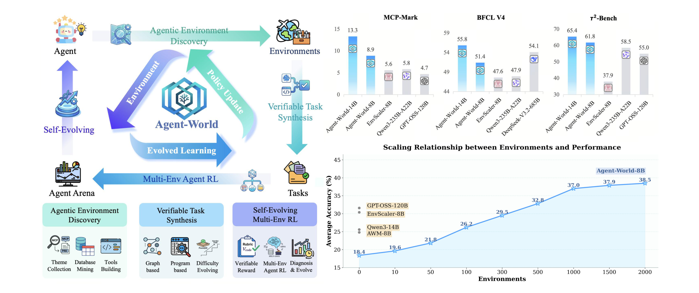
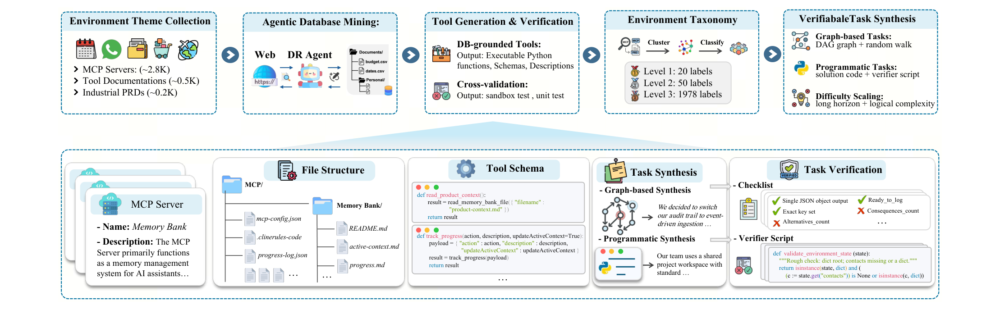
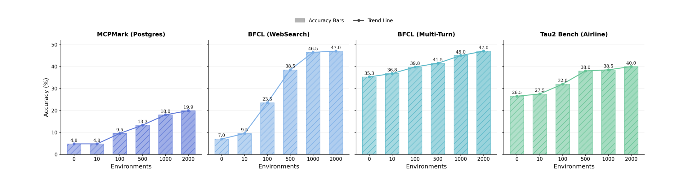

# Agent-World: Scaling Real-World Environment Synthesis for Evolving General Agent Intelligence

## 来源

- **PDF**：`raw/2604.18292v1.pdf`（arXiv:2604.18292v1，48 页）
- **日期**：2026-04-20（Date: April 21, 2026）
- **团队**：中国人民大学高瓴人工智能学院（Ji-Rong Wen、Zhicheng Dou 等）+ 字节跳动 Seed（Wanjun Zhong 等）；第一作者 Guanting Dong（董观挺，人大，曾在 Seed 实习）
- **模型**：[Agent-World](../models/agent-world.md)（8B / 14B，Qwen3 backbone）

## 核心结论

Agent-World 把"训练通用 agent"的瓶颈定位在**可扩展的真实环境合成**与**连续自演化训练机制**两件事上，而不是单纯堆参数。论文提出一个自演化训练场（self-evolving training arena），由两个紧耦合组件构成闭环：

1. **Agentic Environment-Task Discovery**——从真实 MCP servers / 工具文档 / 工业 PRD 挖掘数千主题，用 deep-research agent 从 web 自动建主题对齐数据库、生成并验证可执行工具，再合成可验证、难度可控的任务（graph-based + programmatic 两条路）。最终得到 **1978 个环境、19822 个工具**的生态。
2. **Continuous Self-Evolving Agent Training**——在该生态上做多环境 GRPO RL（可执行 reward），并把同一生态当作动态诊断 arena：每轮重新合成评测任务 → 诊断弱环境 → 定向扩展任务 → 继续 RL，形成 **agent 与环境的 co-evolution**。

在 23 个 agent benchmark 上，Agent-World-8B/14B 一致超过强基线；分析还揭示了"环境数量"与"自演化轮数"对下游性能的正向 scaling 关系。

> Figure 1 Overview of Agent-World (left) and downstream general agent performance (right). The environment-scaling analysis reports the average score across representative subdomains of MCP-Mark, BFCL V4, and τ2-Bench.（§ 1 Introduction）

## 架构与训练

### 形式化：多环境 agentic 交互为 POMDP

沿用 AgentSkiller，把多轮 agentic 交互建模为 POMDP `(U, S, A, O, P)`。关键设计是把**环境显式参数化为 `(D, F)`**——`D` 是环境数据库（结构化记录/文件，承载可变外部世界），`F` 是可执行工具集（每个工具是对 `D` 读写、引发状态转移的可调用算子）。状态 `S = S_E × S_H` 拆成环境状态与对话状态；动作 `A = A_tool ∪ A_resp`（工具调用 / 自然语言回复）；环境状态 `s_E` 不直接观测，只能从工具观测 `O_E` 间接推断。这一参数化是"agent–tool–database"三元 rollout 的基础，也让 reward 可以基于数据库状态做可执行验证。

### 组件一：Agentic Environment-Task Discovery

> Figure 2 The Pipeline of Agentic Environment-Task Discovery.（§ 3.1）

**主题收集**。三类真实来源合并成种子主题集 `M = M1 ∪ M2 ∪ M3`：

- **MCP Servers（~2.8K）**：从 Smithery 获取真实 MCP server 规格，每个附带含源数据描述与标准化工具定义的 JSON。
- **工具文档（~0.5K）**：收集开源真实工具用例数据集，提取工具定义文档，用 LLM 反向映射到环境主题。
- **工业 PRD（~0.2K）**：产品需求文档天然含背景、领域工作流与系统接口，作为主题锚点。

**Agentic Database Mining**。区别于强调 LLM 合成数据库的 prior work，本文主张 Web 本身就含大量可实时更新的高价值结构化数据。构建以策略模型 `π_θ` + 外部工具集 `T`（search / browser / code compiler / OS tools）为中心的 deep-research agent `G`，对每个主题做迭代检索与数据挖掘，再用 OS 工具结构化持久化得到 `D(m) = G(m; π_θ, T)`。单次挖掘规模/结构有限，因此引入**数据库复杂化过程 `φ`**：迭代提示 deep-research agent 扩展丰富主题库 `D^(n+1)(m) = φ(D^(n)(m), m, T)`，重复 `N` 轮得到更贴近真实需求的 `D^(N)(m)`。

**工具接口生成与验证**。coding agent `ψ`（配 code compiler + OS tools `T̂`）对 `(m, D^(N)(m))` 生成候选工具 `f̂` 及其单元测试集 `Ĉ_f̂`。借鉴 execution-based 验证，做交叉质控——工具被保留需同时满足：Python 编译通过、测试准确率 `Acc(f̂; Ĉ_f̂) > 0.5`、环境至少含一个有效工具与一个有效测试。最终得到质控后的工具集 `F(m)`，环境生态 `E = {(D^(N)(m), F(m)) | m ∈ M}`。

**环境分类体系**。对数千主题做层次聚类得 50 个簇心，基于 TOUCAN 分类法用 GPT-OSS-120B 做监督式摘要识别每簇中心主题，得 50 个二级标签；再请 3 位标注者合并抽象出 20 个一级类型。最终分类体系含 **20 一级 / 50 二级 / 1978+ 三级标签**，为跨环境任务合成与分层 arena 构造奠基。

**可验证任务合成**。两条互补路径，均依赖 sandbox 执行收集 trace、推导 ground-truth、保留可验证性：

- **Graph-based（建模顺序工具依赖）**：反向工程范式——先合成合法工具调用序列再生成任务描述。对每个环境建全连接加权有向图 `G=(V,E)`，节点=工具，三类边由 LLM 评估赋权：强依赖 `fi→fj`（w=3，`fj` 输入严格依赖 `fi` 输出，严格有向）、弱依赖 `fi↔fj`（w=2，可从 `fi` 输出推导也可他途获取，双向）、独立边 `fi↔fj`（w=1，无参数依赖，保连通防死胡同）。在图上随机游走得原始序列 `τ`，优先选"有输出但无强依赖前驱"的起始节点，按边权偏置采样后继。实例化参数（强/弱依赖传前驱输出，独立边从库随机采样），LLM 审查剪枝得 `τ*`。LLM 起草任务描述 `q_init`（**禁止含工具名/库 schema 防泄漏**），sandbox 逐步执行 `τ*` 记录 trace，LLM 据真实字段/格式精炼成 `q_final` 并生成严格 JSON ground-truth `a*` 与多维权评测规 `R`（字段完整性 / schema 匹配 / 数值容差等）。质量一致性：ReAct agent 跑 5 次，至少 2 次一致才保留。
- **Programmatic（建模非线性推理/控制流）**：直接生成可执行 Python 解。LLM 据工具 schema + 库描述生成复杂任务 `q_prog`（同样禁露工具/库细节），再作为 solver 生成端到端可执行脚本 `π_code`（须用 for / if-else / 统计聚合等复杂控制流），包在 ReAct 循环里迭代 debug。执行成功得 `a*`。再输入 `(q_prog, π_code, a*)` 让 LLM 生成可执行验证脚本 `V_code(a, a*)`（多级断言 + 自定义逻辑，验证候选答案与库状态 `s_E` 是否满足约束），同样 ReAct debug。质量一致性同 graph-based（5 次、≥2 次稳定通过）。

**难度扩展**。两条路都提升难度：graph-based 增大随机游走最大步数扩展工具链、提高弱/独立边采样概率降低对顺序输出的依赖、改写任务描述隐去工具名与执行逻辑；programmatic 增加独特工具与调用数、注入条件分支等工具间逻辑、要求跨库聚合/排序/过滤。Figure 4 统计显示：所有合成任务至少 7 轮交互、平均 >20 轮、部分 >40 轮；用 Doubao-Seed-2.0-pro 测 Pass@10，多数任务 10 次只解 1 次甚至全败，印证难度扩展有效。

### 组件二：Continuous Self-Evolving Agent Training

> Figure 5 The Overall Framework of Continuous Self-Evolving Agent Training.（§ 3.2）

**多环境 Agent RL**。闭环交互三件套：LLM policy `π_θ`（据对话历史+工具反馈产出下一步动作）、tool interface/runtime（执行环境工具集 `F(m)`、维护数据库连接/缓存等环境侧状态）、数据库状态 `D^(N)(m)`（读写基底）。每步模型同时产自然语言推理与工具/动作决策；触发工具调用时在 sandbox 执行、读写库状态、回传结构化观测。按 GRPO 每 task 采 `N` 条输出，每 global batch 内任务配独立动态环境实现多环境 rollout。

**结构化可验证 reward**。区别于静态 tool-RL，环境 agent 的 reward 除答案正确性还要兼顾环境状态、效率与格式：

- graph-based 任务（`X_graph`）：rubric `R={r_j}` 经 rubric-conditioned LLM-as-judge 逐条评估，整体 pass rate 取均值。
- programmatic 任务（`X_prog`）：每任务一个可执行验证脚本 `V_code`，sandbox 里验证预测答案或结果库状态是否满足 ground truth。

`r(x,y) = (1/n)Σ 1[Judge(x,y,r_j)==1]`（graph）或 `1[Execute(V_code(y,y*)))]`（prog）。

**Policy update**。采用 GRPO 直接最大化上述可验证回报：clip 重要性比率 + KL 惩罚参考策略，token-level advantage `Â_i,t` 按组内归一化。

**自演化 Agent Arena**。环境生态 `E` 同时作训练源与诊断 arena：

1. **Arena 构造**：基于层次分类，对每个一级类别 `c ∈ C` 随机选 `K=5` 个环境并入 `E_arena`，广覆盖又控成本。
2. **动态评测任务合成**：每轮迭代对每个 arena 环境按 §3.1.1 重新合成一批全新可验证任务（graph + programmatic，配 `R` 或 `V_code`），环境与任务跨轮动态变化，防过拟合静态评测。
3. **Agentic Diagnosis**：在合成任务上评测当前 `π_θ^(r)`，用配 Python 解释器 + search 的 auto-diagnosis agent `δ` 分析失败模式。输入：逐任务失败 trace（工具日志 / 中间观测 / validator 反馈）、按环境与分类的错误分布统计、环境元数据（工具 schema / 库描述）。输出：(a) 排序的弱环境集 `W^(r) ⊆ E_arena`；(b) 环境级任务生成指南 `G_guide^(r)(m)` 刻画缺失能力（如错误工具使用 / 状态更新失误）。
4. **Agent-Environment Co-Evolution**：据 `W^(r)` 与 `G_guide^(r)` 重跑可验证任务合成管线生成定向训练集 `X_target^(r)`（弱点源于状态多样性不足时可选数据库复杂化扩展环境），再从 `π_θ^(r)`做多环境 RL 得 `π_θ^(r+1)`。迭代形成 `evaluate → diagnose+target → continue RL` 的自演化循环（Algorithm 1）。

核心定位：把可扩展环境当作**持久诊断 arena**，通过 agent-environment co-evolution 实现持续策略提升，本质区别于一次性静态训练。

## 后训练

- **冷启动 SFT**：用与 Environment-Task Discovery 相同的合成策略，由 Doubao-Seed-1.8 policy 版本模型生成 **40K 轨迹**做 SFT。
- **RL 初始化与算法**：SFT 后初始化 **Qwen3-8B / 14B backbone**，合成 **5K RL 样本**，用 **GRPO（RLVR）** 训练。
- **稳定性配置**：clip ratio `ε_low=0.2`、`ε_high=0.28`（即 DAPO 的 Clip-Higher 思路，上限放宽以鼓励探索）；最大轨迹长度 **80K tokens**，每步最大生成长度 32K；每训练步采 32 任务、8 rollouts，temperature=1.0、top_p=1.0（评测同样 temp=1.0/top_p=1.0）。
- **策略模型（数据/诊断侧）**：环境挖掘、任务合成、代码/rubric 生成、agentic diagnosis 均用 **GPT-OSS-120B**。
- **方差控制**：每个实验重复 8 次取平均。

## 评测要点

### 主结果（Table 1，三套 agentic tool-use benchmark 的 Avg 列）

| 模型 | MCP-Mark Avg | BFCL V4 Avg | τ2-Bench Avg |
| --- | ---: | ---: | ---: |
| GPT-5.2 High | 53.1 | 62.9 | 80.2 |
| ○Claude Sonnet-4.5 | 33.3 | 73.2 | 84.7 |
| Gemini-3 Pro | 50.8 | 72.5 | 85.4 |
| Seed 2.0 | 54.7 | 73.4 | 83.0 |
| DeepSeek-V3.2-685B | 36.7 | 54.1 | 80.3 |
| GPT-OSS-120B | 4.7 | – | 55.0 |
| Qwen3-8B（backbone） | 2.4 | 40.4 | 26.2 |
| Qwen3-14B（backbone） | 3.4 | 41.0 | 32.4 |
| Qwen3-32B | 7.5 | 46.7 | 44.9 |
| Qwen3-235B-A22B | 5.8 | 47.9 | 58.5 |
| Simulator-8B | 2.4 | 23.9 | 31.8 |
| TOUCAN-7B | 1.0 | 36.6 | 17.7 |
| EnvScaler-8B | 5.6 | 47.6 | 37.9 |
| AWM-8B | 2.4 | 40.0 | 34.4 |
| AWM-14B | 5.1 | 42.4 | 39.0 |
| ScaleEnv-8B | – | – | 38.5 |
| **Agent-World-8B** | **8.9** | **51.4** | **61.8** |
| **Agent-World-14B** | **13.3** | **55.8** | **65.4** |

> 表为 Table 1 的 Avg 列（MCP-Mark / BFCL V4 / τ2-Bench 各自的子域均值）。原文 Table 1 另含 MCP-Mark 的 File/Github/Notion/Play./Post.、BFCL V4 的 WebSearch/Memory/Multi-T/No live/Live/Relev./Irrelev.、τ2-Bench 的 Retail/Telecom/Airline 细分；"–"表示原文未报告。环境扩展开里每列最优加粗、次优下划线（此处从略）。

三条主要发现（原文 §4.2）：

1. **基础模型在复杂 agentic tool-use 上仍受限**。即便先进私有模型也明显受限：GPT-5.2 High 在 MCP-Mark 仅 53.1%，Gemini-3 Pro 50.8%；开源基础模型更弱，GPT-OSS-120B 与 Qwen3-235B-A22B 在 MCP-Mark 仅 4.7% / 5.8%——这些 benchmark 覆盖多样有状态环境，说明当前基础模型在需多步规划、工具编排与状态追踪的长周期工具使用上仍吃力。
2. **既有环境扩展方法能力提升不均**。相比 Qwen3 backbone，Simulator-8B 这类模拟器方法在 τ2-Bench 不错但 MCP-Mark / BFCL V4 仍差，说明模拟环境不足以捕获复杂真实状态转移；EnvScaler-8B / AWM 等 programmatic 方法覆盖更广但在 GitHub / Notion 等具体环境仍弱——稳健泛化不只靠真实反馈，还靠合成环境的多样性与质量。
3. **Agent-World 跨环境泛化更一致**。同设置下三套 benchmark 一致超越既有环境扩展基线：8B 在 τ2-Bench 61.8% / BFCL V4 51.4% / MCP-Mark 8.9%，超过 EnvScaler-8B、ScaleEnv-8B 甚至 Qwen3-235B-A22B；14B 再加约 5 个点，BFCL V4 55.8% 与 DeepSeek-V3.2-685B（54.1%）颇具竞争力。归因于统一框架把可扩展环境-任务发现与连续自演化训练紧耦合。

### 长周期 agentic 推理泛化（Figure 6，17 benchmark 三视角）

Agent-World-8B 对比 Qwen3-8B / EnvScaler-8B，三组能力：

- **General Reasoning**（MATH500/GSM8K/MATH/AIME24/AIME25/KOR-Bench/OlympiadBench）：整体最优，多数维度有增益且核心数学推理无退化——说明训练管线提升难多步推理但不牺牲基础推理。
- **Agentic Search & Coding**（WebWalkerQA/SWE-bench Verified/SWE-bench Multilingual/Terminal 1.0/Terminal 2.0/GAIA/HLE）：增益最大，一致超过两个基线——这些 benchmark 考验迭代规划、长周期软件工程、深度信息检索与多工具协调，说明 Agent-World 习得可迁移的 agentic 策略而非 benchmark 特定启发式。注意 EnvScaler-8B 在 SWE 与 Terminal 1.0 上反低于其 Qwen3-8B backbone，可能因其环境扩展不能有效激发复杂软件工程推理。
- **Knowledge & MCP**（MMLU/SuperGPQA + MCP-Universe 五子域：Browser Automation/Web Searching/Location Navigation/Repository Management/Financial Analysis）：在五个相对正交的 MCP-Universe 能力上大幅领先，知识维度（MMLU/SuperGPQA）也稳步提升。

### 高级 agentic assistant 泛化（Figure 7）

SkillsBench / ARC-AGI-2 / Claw-Eval 三个高难 assistant benchmark：

- 既有开源基线普遍挣扎（三 benchmark 均分多低于 20%，8B→14B 无稳定增益，如 Qwen3 在 ClawEval 25.6%→24.7% 反降），说明朴素参数扩展不足以稳定长周期 agentic 泛化。
- Agent-World 无 benchmark 专项训练仍强泛化：8B 为 9.2% / 6.5% / 30.5%，三任务全超 Qwen3-8B / EnvScaler-8B / AWM-8B。
- 跨规模稳定增益：8B→14B（SkillsBench 9.2→12.6、ARC-AGI-2 6.5→8.5、Claw-Eval 30.5→31.5），与多数基线的不稳定 scaling 对比鲜明。

### 环境数量 scaling（Figure 8）

> Figure 8 Scaling relationship of training environments: Downstream agent performance scales positively with the number of synthesized training environments.（§ 4.3.3）

环境数 0→10→100→500→1000→2000(1978) 递增，四代表域（MCPMark-Postgres / BFCL-WebSearch / BFCL-Multi-Turn / τ2-Airline）一致上升。平均分从 **18.4% → 38.5%（+20.1，翻倍以上）**。阶段性增益：10→100 与 100→500 两段跳升显著（MCPMark-Postgres 4.8%→19.9%，BFCL-WebSearch 7.0%→47.0%），说明中等规模扩展能迅速补齐关键交互模式覆盖；500→2000 仍上升但边际递减，说明早期扩展主要捕获缺失的高影响环境多样性，后期贡献更细粒度的鲁棒性。

### 连续自演化效果（Table 2）

对 Agent-World-14B 与 EnvScaler-8B 两个起点各跑两轮自演化 arena 循环：

| 模型 / 轮次 | τ2-Bench | BFCL-V4 | MCP-Mark (Post.) |
| --- | ---: | ---: | ---: |
| Agent-World-14B (base) | 60.2 | 52.4 | 29.5 |
| +1 round | 63.5 (+3.3) | 54.9 (+2.5) | 36.3 (+6.8) |
| +2 rounds | 65.4 (+1.9) | 55.8 (+0.9) | 38.1 (+1.8) |
| EnvScaler-8B (base) | 37.9 | 47.6 | 9.5 |
| +1 round | 40.2 (+2.3) | 49.1 (+1.5) | 13.9 (+4.4) |
| +2 rounds | 41.6 (+1.4) | 50.0 (+0.9) | 15.1 (+1.2) |

两模型三套评测均单调提升；EnvScaler-8B 不依赖 Agent-World 初始化也能持续受益，说明该循环对其它环境扩展基线同样有效。最大增益出现在 MCP-Mark（Agent-World +8.6、EnvScaler +5.6）——该 benchmark 需更强状态追踪与真实 MCP server 深度交互，正契合自演化"诊断定位环境特定弱点→定向合成更难实例"的目标。第二轮增益小于第一轮但保持正向（diminishing yet positive），早期主要修不熟悉环境交互的模式级错误，后期聚焦长周期复杂交互的残余失败。

> **内部矛盾（已据原文核实）**：§4.3.4 prose（p17）称 Agent-World-14B 的 τ2-Bench 从 45.3%->50.5%，但同节 Table 2（p16）实为 60.2%->65.4%；BFCL-V4（52.4->55.8）与 MCP-Mark（29.5->38.1）两列 prose 与表一致，仅 τ2 列不一致，且增量 (+5.2) 一致。主表 Table 1 的 Agent-World-14B τ2 Avg=65.4 与 Table 2 的 +2 rounds 值吻合，故以表值为准，prose 的 45.3/50.5 为论文自身笔误（疑似早期草稿残留，增量恰好一致说明只是起点被整体下移）。

### 训练动力学（Figure 9）

Qwen3-8B / 14B backbone 在 GRPO 下 reward 稳步上升；entropy 随时间相对稳定增长——模型适应未见 API 与异构状态转移时维持甚至扩展探索空间，习得新交互模式而非过早塌缩到窄 exploitation，说明在结构多样、高交互的真实 MCP 环境中能持续探索 agent 执行模式。

## 评测体系说明

23 个 benchmark 分五类：核心 agentic tool-use（MCP-Mark / BFCL V4 / τ2-Bench）、高级 AI assistant（SkillsBench / ARC-AGI-2 / Claw-Eval）、通用推理（MATH500 / GSM8K / MATH / AIME24 / AIME25 / KOR-Bench(Cipher) / OlympiadBench）、agentic search & coding（WebWalkerQA / SWE-bench Verified / SWE-bench Multilingual / Terminal-Bench 1.0 / Terminal-Bench 2.0 / GAIA / HLE）、知识与 MCP（MMLU / SuperGPQA / MCP-Universe 五子域）。用 in-house 评测框架、对齐官方分数，部分 benchmark（GAIA / HLE）用采样子集加速。

## 待追问

- **MCP-Mark 绝对分偏低**：Agent-World-14B 在 MCP-Mark Avg 仅 13.3%，远低于 Gemini-3 Pro 50.8% / GPT-5.2 53.1%。报告把 MCP-Mark 列为主战场之一却差距明显，是否因 MCP-Mark 子域（File/Github/Notion/Play./Post.）对真实 MCP server 覆盖不足？需看分项分布。
- **GPT-OSS-120B 的双重角色**：它既是环境挖掘/任务合成/诊断的策略模型，又被列为被比较的基础模型（MCP-Mark 仅 4.7%）。用它造的训练数据是否存在能力上限天花板？换更强策略模型（如 Doubao-Seed-2.0）能否进一步提升环境/任务质量？
- **5K RL 样本 + 40K SFT 的规模**：相对环境生态（1978 环境 / 19822 工具）显得偏小，是否靠多环境 rollout 与自演化循环弥补了数据量？更大 RL 样本量的 scaling 未见分析。
- **自演化轮数的上限**：仅测了 2 轮且边际递减，更多轮是否会出现环境多样性枯竭或过拟合 arena 评测分布？
- **DB complexification 的轮数 `N`** 与 arena `K=5` 的取值依据未给消融；环境分类体系依赖 GPT-OSS-120B 摘要 + 3 标注者，标注偏差如何控制？
- **与 MCP-Atlas 的关系**：报告引用 MCP-Atlas [6] 但评测用的是 MCP-Mark [106] 与 MCP-Universe，三者关系未澄清。

## 相关页面

- [Agent-World](../models/agent-world.md) - 模型页
- [Agentic Engineering](../concepts/agentic-engineering.md) - 环境合成作为 agentic engineering 基础设施
- [Agentic 模型的后训练](../concepts/post-training-for-agentic-models.md) - 多环境 GRPO + 自演化 arena
- [Agentic 评测体系](../concepts/agentic-evaluation-benchmarks.md) - 23 benchmark + 动态 arena 评测方法论
- [Forge Agent-Native RL](../concepts/forge-agent-native-rl.md) - 另一类 self-evolution 路线对照
- [LLM RL policy optimization 对比](../comparisons/llm-rl-policy-optimization.md) - GRPO + Clip-Higher 落地
- [Qwen-AgentWorld](qwen-agent-world.md) - learned neural simulator 路线（互补对照：code-driven 确定性 vs LWM 通用性）
