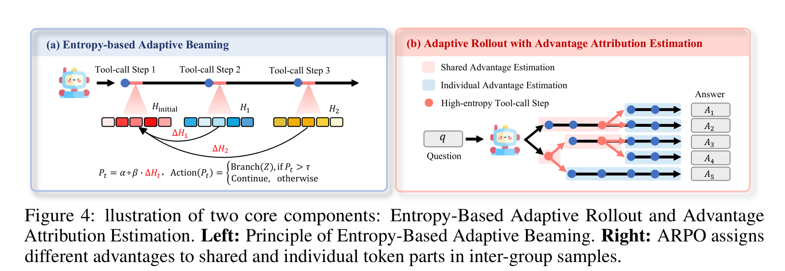
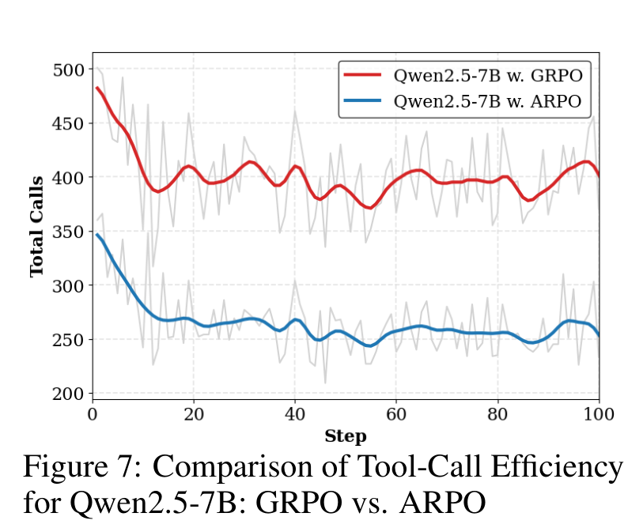
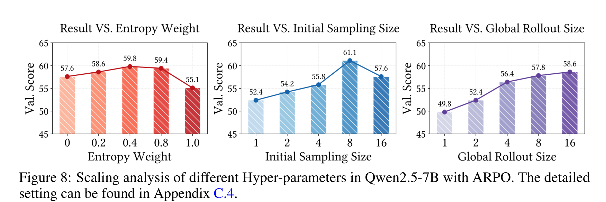

# Agentic Reinforced Policy Optimization（ARPO）

## 来源

- 文件：`raw/Dong 等 - 2025 - Agentic reinforced policy optimization.pdf`
- 标题：Agentic Reinforced Policy Optimization
- 团队 / 日期：中国人民大学 + 快手，arXiv:2507.19849v1，2025-07-26
- 代码：<https://github.com/dongguanting/ARPO>
- 定位：面向多轮 tool-use agent 的 RL 算法论文；不是新模型技术报告。实验把 ARPO 套到 Qwen2.5 / Llama3.1 / Qwen3 等开源 backbone 上，验证「step-level tool-use 行为」比纯 trajectory-level RL 更值得探索。

## 核心结论

1. **问题定义**：GRPO / DAPO / REINFORCE++ 这类 trajectory-level RL 在 agentic 任务里主要比较完整轨迹，容易漏掉工具反馈之后的细粒度决策点；论文把这个缺口定义成「多轮工具交互中的 step-level tool-use behavior」学习不足（§1、§2.2）。
2. **关键观察**：模型收到工具返回后，后续前 10–50 个 token 的 entropy 会显著升高；搜索反馈引入的不确定性高于 Python 反馈（Figure 2、§2.2）。这给 ARPO 的「高熵处才分支」提供经验动机。
3. **算法核心**：ARPO = entropy-based adaptive rollout + advantage attribution estimation。前者在高熵工具调用步从当前节点分叉 partial rollouts，后者处理共享前缀与分叉段的 advantage 归因（§3.1–§3.2）。
4. **效果主张**：13 个 benchmark 覆盖数学、知识密集推理和 deep search；ARPO 在同设置下优于 GRPO / DAPO / REINFORCE++，并在 Qwen2.5-7B tool-call efficiency 对比中用约一半工具调用数取得更高总体准确率（Table 1、Table 2、Figure 7）。
5. **边界**：论文主要验证「算法层」而非交付新模型；deep search 只用 1K RL 样本，但结果依赖搜索引擎、browser agent、LLM-as-judge、token-level F1 等环境设定，和真实生产 agent 的可比性仍需谨慎（§4.3–§4.4、Table 3）。

## 方法：从完整轨迹采样转向高熵节点分支

> 论文 Figure 3 原文标题："The overview of ARPO algorithm."（§3）

ARPO 的 rollout 不是简单生成 $M$ 条完整轨迹，而是把预算拆成两部分：先生成 $N$ 条 global trajectory，剩余 $M-N$ 留给 partial sampling。每条轨迹开头先计算初始 entropy $H_{initial}$；每次工具调用返回后，再让模型生成前 $k$ 个 token 并计算 step-level entropy $H_t$，用

$$
\Delta H_t = Normalize(H_t - H_{initial})
$$

衡量工具反馈带来的不确定性变化。随后用

$$
P_t = \alpha + \beta \cdot \Delta H_t
$$

决定是否在当前工具调用节点分叉：若 $P_t > \tau$，就从当前位置 branch 出 $Z$ 条 partial rollouts；否则继续原轨迹。这个设计把探索预算集中到「模型刚读完工具反馈、不确定性最高」的位置。

> 论文 Figure 4 原文标题："Illustration of two core components: Entropy-Based Adaptive Rollout and Advantage Attribution Estimation."（§3.1–§3.2）

## Advantage attribution：共享前缀不能当成独立轨迹简单算

ARPO 的 partial rollout 会产生「多条轨迹共享前缀、之后分叉」的结构。如果把每条轨迹完全当独立样本，shared token 与 individual token 的 credit assignment 会混在一起。论文给两种估计：

- **Hard advantage estimation**：显式区分 shared / individual token。individual token 用 group-relative normalized reward；shared token 用包含该共享段的 $d$ 条轨迹 advantage 平均值。
- **Soft advantage estimation**：不显式改 GRPO loss，而是利用 partial rollout 的共享 prefix 结构和 importance sampling ratio，让共享 token 的更新近似由 group 内平均 advantage 牵引。论文实测 soft setting 的 reward 更高、更稳定，因此默认用 soft（Figure 5、§3.2、Appendix D.1）。

这部分的定位要精确：ARPO 仍借用 GRPO 式 objective / clipping 框架；新意在 rollout 结构与 advantage 归因，而不是发明完全不同的 policy-gradient loss。

## 理论支撑与实现细节

论文把 Transformer 输出分成若干 macro action，并给出 Generalized Policy Gradient（GPG）Theorem：

$$
\nabla_\theta J(\theta)=\mathbb{E}_{\tau\sim\pi_\theta}\left\{\sum_{T=1}^{K}\left[\nabla_\theta \log \pi_\theta(MA_T|MS_T)A_T(\tau)\right]\right\}
$$

它想说明 partial rollout segments 可以作为 macro actions 做 policy gradient 更新，传统 token-level policy gradient 是特例（§3.3、Appendix D.2）。这是对「从完整 trajectory 切到 step/segment 级探索」的形式化支撑，但不是证明 entropy 阈值本身最优；entropy 选择仍主要来自 §2.2 的经验观察与 Figure 8 的超参实验。

实现上，ARPO 基于 VERL；工具调用返回结果不参与 loss，loss 只算文本推理与工具请求 token。Deep reasoning 实验默认 total batch 128、PPO mini-batch 16、global rollout size 16、initial sampling size 8、每轮 response 4096 token；deep search response length 扩到 8192，8B 用 8 张 H800、14B 用 16 张 H800（Appendix C.2）。

## 实验信号

### 10 个数学 + 知识密集推理 benchmark

Table 1 显示，在 Qwen2.5-3B、Llama3.1-8B、Qwen2.5-7B 三个 backbone 上，ARPO 的平均分分别为 52.8 / 55.3 / 58.3，均高于同表里的 GRPO、DAPO、REINFORCE++：

| Backbone | 最强 trajectory-level RL baseline（Avg.） | ARPO（Avg.） | 主要解读 |
| --- | ---: | ---: | --- |
| Qwen2.5-3B-Instruct | DAPO 50.6 | **52.8** | 小模型上 ARPO 仍能超过完整轨迹采样。 |
| Llama3.1-8B-Instruct | GRPO / REINFORCE++ 51.1 | **55.3** | 在 Llama backbone 上提升更明显。 |
| Qwen2.5-7B-Instruct | GRPO 56.5 | **58.3** | AIME24/25 达 30.0/30.0，知识任务总体也更稳。 |

### Deep search：Qwen3-8B / 14B + 1K RL 样本

Table 2 的 deep search 设置更贴近 search agent：Qwen3-8B/14B 只用 1K hard search RL samples 训练，评测 GAIA、WebWalkerQA、HLE、XBench。ARPO 相比 GRPO：

| Backbone | GRPO overall avg. | ARPO overall avg. | ARPO 关键项 |
| --- | ---: | ---: | --- |
| Qwen3-8B | 20.0 | **25.0** | GAIA avg. 32.0→38.8；XBench avg. 7.8→8.8。 |
| Qwen3-14B | 27.0 | **32.0** | GAIA avg. 36.9→43.7；WebWalkerQA avg. 30.0→36.0；HLE avg. 8.6→10.0。 |

论文正文还强调，Qwen3-14B + ARPO 在 Pass@5 上 GAIA 61.2%、HLE 24.0%、xbench-DR 59%，说明 step-level exploration 不只提高 pass@1，也扩大了可采样解空间（Figure 6）。

> 论文 Figure 7 原文标题："Comparison of Tool-Call Efficiency for Qwen2.5-7B: GRPO vs. ARPO."（§4.6）

### 超参：entropy 不是越大越好

Figure 8 的 scaling 分析给出三个实用结论：

> 论文 Figure 8 原文标题："Scaling analysis of different Hyper-parameters in Qwen2.5-7B with ARPO."（§4.7）

- entropy weight 在 0.4 附近最好，过高会牺牲 sampling diversity；这说明 ARPO 不是「哪里 entropy 高就无限分叉」，而是要平衡 base sampling probability 与 entropy clue。
- initial sampling size 在 8 达峰；在 global rollout size = 16 时，这相当于 global:partial = 1:1。全 partial 或全 global 都不是最优。
- global rollout size 增大带来单调收益，说明该算法仍能吃更多采样预算。

## 与现有 wiki 页的关系

- 与 [异步 Agent RL](../concepts/asynchronous-agent-rl.md) 的关系：GLM-5 解决的是长尾 rollout 的**系统调度 / off-policy 控制**；ARPO 解决的是 rollout 预算在轨迹内部怎么分配，属于**算法层采样结构**。
- 与 [Forge Agent-Native RL](../concepts/forge-agent-native-rl.md) 的关系：Forge 把 agent harness、工具、上下文、reward 接成训练系统；ARPO 假设已有工具环境，进一步问「哪些 tool-use step 值得追加探索」。两者可互补，而非同一层级替代。
- 与 [Agentic 评测体系](../concepts/agentic-evaluation-benchmarks.md) 的关系：ARPO 把 GAIA / WebWalkerQA / HLE / XBench 作为 deep search 主评测，同时用 AIME、MATH、HotpotQA、2Wiki、MuSiQue、Bamboogle 等覆盖 reasoning 与 multi-hop QA。
- 与 [Qwen3](../models/qwen3.md) 的关系：Qwen3 在本论文里是被 ARPO 训练的 backbone（8B/14B deep search），不是 Qwen3 官方报告的一部分；只能作为「外部后训练算法在 Qwen3 backbone 上验证」的证据。

## 待追问

- ARPO 的 entropy spike 观察是否在 coding agent / terminal agent 中同样成立？论文工具主要是 search、browser、Python interpreter，和 SWE-bench 式仓库编辑还有距离。
- partial rollout 的 branching 会不会和真实部署时的 tree search / self-consistency 解码重复？训练期探索收益与推理期采样收益如何分摊，正文没有展开。
- deep search 实验依赖 Bing 搜索、browser agent、LLM-as-judge 和 token-level F1；如果换搜索 API / browser 模型 / judge，ARPO 相对 GRPO 的优势是否稳定？
- GPG theorem 支撑 macro action policy gradient，但 entropy 阈值、$\alpha/\beta/\tau$ 的选择仍是经验超参；是否存在更原则化的 uncertainty criterion？

## 相关页面

- 概念：[Agentic Reinforced Policy Optimization](../concepts/agentic-reinforced-policy-optimization.md)
- 概念：[Agentic 模型的后训练](../concepts/post-training-for-agentic-models.md)、[异步 Agent RL](../concepts/asynchronous-agent-rl.md)、[Forge Agent-Native RL](../concepts/forge-agent-native-rl.md)、[Agentic 评测体系](../concepts/agentic-evaluation-benchmarks.md)
- 模型：[Qwen3](../models/qwen3.md)
