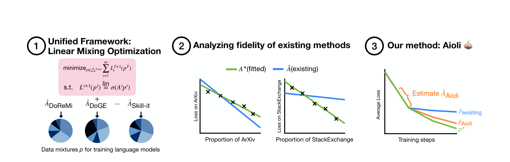
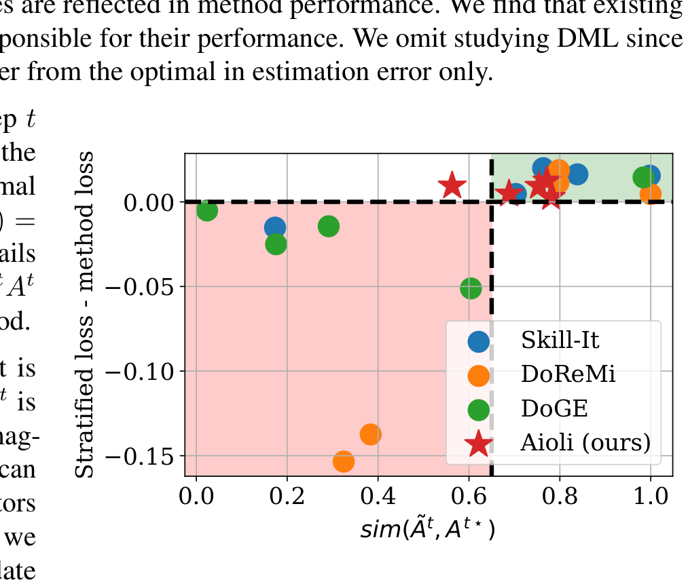
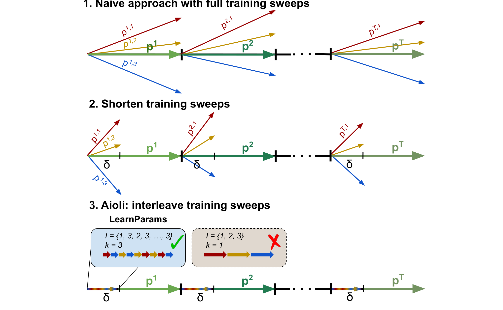

# Aioli: A unified optimization framework for language model data mixing

## 来源

- **PDF**: `raw/2411.05735v2.pdf`
- **标题**: Aioli: A unified optimization framework for language model data mixing
- **作者**: Mayee F. Chen, Michael Y. Hu, Nicholas Lourie, Kyunghyun Cho, Christopher Ré
- **机构**: Stanford University + New York University + Prescient Design, Genentech
- **arXiv**: 2411.05735v2, 2025-04-22
- **代码**: https://github.com/HazyResearch/aioli

## 核心结论

### LMO 统一框架

论文提出 **Linear Mixing Optimization (LMO)** 框架，将现有数据混合方法统一为求解同一个优化问题的特例：

$$\min_{p \in \triangle_{T \times m}} \sum_{i=1}^{m} L^{\text{val},i}_{T+1}(p) \quad \text{s.t.} \quad L^{\text{val},i}_{t+1}(p) = c^t_i + b^t_i \sigma\left(\sum_{j=1}^{m} -A^t_{ij} p^t_j\right)$$

其中 $A^t \in \mathbb{R}^{m \times m}$ 编码跨组交互（训练 group $j$ 对 group $i$ loss 的影响），$\sigma$ 是 identity（线性）或 exp（log-linear），$T$ 是训练轮数（$T=1$ 静态，$T>1$ 动态）。

三种组件决定一个方法：(a) mixing law 参数化 $(T, \sigma)$，(b) 参数 $(A^t, b^t, c^t)$ 的取值，(c) 求解 $p$ 的策略。

> Figure 1 caption: Left: existing methods can be expressed in a unified optimization framework, in which they implicitly assume a linear or log-linear loss-proportion relationship. Center: the (log)-linear parameterizations are well-specified, but existing methods set their parameters incorrectly. Right: AIOLI, an online mixing method that more accurately estimates the parameters that capture the true loss-proportion relationship.

### 现有方法的 LMO 表达

| 方法 | mixing law | 参数 $A^t$ | 求解 |
|---|---|---|---|
| DML (offline) | log-linear 静态 ($T=1$, $\sigma=\exp$) | 从 $\geq m+1$ 次训练 run 拟合 | 直接 |
| Skill-It (online) | linear 动态 ($T>1$, $\sigma=\text{Id}$) | $A^t_{ij} = L^t_i \cdot (L^{T+1}_i(\mathbf{1}_j) - L^1_i(\mathbf{1}_j))/L^1_i(\mathbf{1}_j)$（静态 skills graph × 当前 loss） | EGD |
| DoReMi (online) | linear 动态 | 对角矩阵 $A^t_{ii} = \min\{L^{\text{train},i}_t - L^{\text{train},i}(f_{\text{ref}}), 0\}$ | EGD |
| DoGE (online) | linear 动态 | $A^t_{ij} = \langle \nabla L^{\text{val},i}_t, \nabla L^{\text{train},j}_t \rangle$（梯度内积） | EGD |
| AIOLI (online) | linear 动态 | 从当前训练历史的 $L^{\text{val}}$ 和 $p$ 拟合 | EGD |

Table 1（§3.3.3）原文确证。关键发现：**所有 mixing law 都是 linear 或 log-linear**，区别仅在参数 $A^t$ 的取值。

### 失败诊断：参数不准，不是参数化错

论文实验发现 mixing law 参数化本身是高保真的（log-linear 静态 $R^2 = 0.991$，linear 动态 $R^2 = 0.947$），但现有方法的 $A^t$ 与最优 $A^{t\star}$ 偏差大，且偏差与性能劣化正相关（Figure 3，$R^2 = 0.491$）。

进一步分析（§C.2.1）发现 $A^{t\star}$ 有两个性质导致现有方法系统性失败：

> Figure 3 caption: Improvement over stratified sampling versus optimality of $A_t$. Each dot represents a method applied to a dataset. The red region shows that existing methods are worse than stratified on at least 1 dataset.

1. **$A^{t\star}$ 随时间变方向**：column sum 的排序会翻转（如 Github/C4 从前期优先 Github 变为后期优先 C4），Skill-It 用静态 skills graph 无法适应。
2. **$A^{t\star}$ 需要完整矩阵**：off-diagonal 不可忽略。DoReMi 用对角 $A^t$ 会在 Github/C4 上错选优先 domain（对角建议优先 Github，完整矩阵建议优先 C4）。

## 架构与训练

### AIOLI 方法

AIOLI 的核心设计：直接从当前训练 run 估计 $A^t$，无需额外训练 run。

**LearnParams 算法**（Algorithm 2）：

1. 每轮分配 $\delta$ 比例用于学习 $A^t$，将 $\delta$ 分成 $K = mk$ 个 interval
2. 构造 $m$ 个 smoothed one-hot 比例 $p_{t,i} = (1-\varepsilon)\mathbf{1}_i + \varepsilon\text{Unif}(m)$
3. 将 $k$ 个每个 $p_{t,i}$ 的 instance 随机打乱成交错顺序 $I$，依次训练一个 interval
4. 对每个 $p_{t,j}$ 累计其所有 interval 的 validation loss 变化 $\beta_{ij} = \frac{1}{k}\sum_{\tau \in T_j} [L^{\text{val},i}(f^{t+(\tau-1)\delta/K}) - L^{\text{val},i}(f^{t+\tau\delta/K})]$
5. 解线性方程组 $A^t_i = P^{-1}\beta_i$（$P = [p_{t,1}, \ldots, p_{t,m}]$）

> Figure 7 caption: Derivation of AIOLI. Top: a naive high-cost approach where training sweeps are conducted to fit $A_t$ at each round. Middle: a modification that shortens the training sweeps. Bottom: a final modification that interleaves the sweep mixtures at a high frequency (large $k$) in one single run, enabling AIOLI's LearnParams to require no additional training.

**AIOLI 主循环**（Algorithm 1）：

1. 若 $S_{\text{init}} \neq 0$，先用 $p_{\text{init}}$ 训练 $S_{\text{init}}$ 步（支持从其他方法的比例接续）
2. $p^0 = \text{Unif}(m)$
3. 每轮：LearnParams 估计 $A^t$ 并归一化为 $\bar{A}^t$，EGD 更新 $p^t_j \propto p^{t-1}_j \exp(\eta \sum_i \bar{A}^t_{ij})$，用 $p^t$ 训练剩余 $(1-\delta)$ 比例

关键设计：归一化 $\bar{A}^t$ 防止早期 loss 大导致前几轮 update 过大。交错训练类比信号处理的 time-division multiplexing。

## 评测要点

### 无限制设置（每方法可用 ≤10 次额外 run）

Table 2（§6.1）原文确证。AIOLI 在全部 6 个数据设置上优于 stratified sampling（平均 -0.274 perplexity），且**不需额外训练 run**。其他方法至少在 1 个设置上差于 stratified（最差 +6.9 perplexity）。

| 方法 | A/SE | GH/C4 | B/SE | A/B/SE | CC/GH/W | SlimPajama | 优于 stratified 数 | 额外 run 数 |
|---|---|---|---|---|---|---|---|---|
| Stratified | 16.532 | 35.991 | 47.192 | 35.114 | 41.583 | 26.426 | — | 0 |
| GS | -0.399 | -0.407 | -0.645 | -0.247 | +0.298 | +0.490 | 4/6 | 10 |
| DML | -0.241 | -0.110 | -0.644 | -0.599 | +0.242 | +1.641 | 4/6 | 10 |
| Skill-It | -0.326 | +0.551 | -0.728 | -0.568 | -0.195 | -0.184 | 5/6 | m |
| DoReMi | -0.307 | +5.303 | -0.217 | -0.393 | +6.898 | +0.703 | 3/6 | 2 |
| DoGE | +0.419 | +0.184 | -0.678 | +1.843 | +0.604 | +0.949 | 1/6 | 1 |
| AIOLI | **-0.205** | **-0.340** | **-0.439** | **-0.226** | **-0.196** | **-0.240** | **6/6** | **0** |

### 限制预算设置（现有方法仅用 0.5S 步学习比例）

Table 3（§6.2）原文确证。AIOLI 可从其他方法学到的比例接续调整，30 个设置中 28 个改善（平均 -1.202 perplexity，最大 -12.012）。

### 消融

Table 20（§F.2）原文确证：

- **AIOLI-STATIC**（$T=1$，只学一次 $A$）：6 个设置平均 -0.140 vs AIOLI -0.274，说明 $A^t$ 需动态更新
- **AIOLI-DIAGONAL**（$A^t$ 限制为对角）：平均 -0.230 vs AIOLI -0.274，说明 off-diagonal 重要但不如时间动态

### 1.4B 模型验证

Table 25（§F.4）原文确证：1.4B 上 mixing law 仍高保真（log-linear $R^2 = 0.989$，linear $R^2 = 0.929$），AIOLI 仍稳定优于 stratified（-0.276 / -0.403），DoGE 仍差于 stratified。

### 下游任务的 perplexity 脱节

§F.1 原文确证：lower perplexity 与 worse downstream 性能正相关（$r = 0.529$）。DML 在 8 个下游任务平均最优，但它在 SlimPajama 上完全省略了 3 个 domain。论文承认 AIOLI 优化的是 perplexity 目标，将 downstream 纳入 data mixing 是开放问题。

### Out-of-domain 设置

§F.5 原文确证：LMO 框架可调整目标为 OOD validation loss（$A^t_{\text{OOD}} \in \mathbb{R}^m$ 变向量），AIOLI-OOD 在不需额外 run 的条件下优于 stratified。

## 待追问

- 实验仅到 1.4B + 160M，未在 frontier-scale 验证；与 AutoMixer（frontier-scale MoE）的 per-capability 回归路线无直接对比
- perplexity 与 downstream 负相关（$r = 0.529$），AIOLI 优化 perplexity 是否反而损害 downstream？论文自己承认这是开放问题
- LEARNPARAMS 的 $\delta$ 在 $m=7$ 时仅 0.007（极小），$A^t$ 估计质量是否足够？超参 sensitivity 分析仅到 $m=3$
- linear dynamic mixing law 在 instruction-tuning 上 $R^2$ 仅 0.419（§C.1.2），AIOLI 在 SFT 阶段是否仍有效？
- $A^{t\star}$ 随时间变方向的机制未深入分析--是训练动力学（loss landscape 变化）还是数据组间的 curriculum 效应？

## 相关页面

- [数据混合优化](../concepts/data-mixture-optimization.md) - Aioli 的 LMO 框架是本概念页方法谱系的元层 abstraction
- [DoReMi](../sources/doremi.md) - LMO 框架的对角 $A^t$ 特例
- [TANDEM](../sources/tandem.md) - bi-level optimization 路线，LMO 框架的近亲（DoGE 是其直接前身）
- [DynamixSFT](../sources/dynamix-sft.md) - SFT 阶段在线无 proxy 分支，与 AIOLI 同为在线方法但范式不同
- [Laguna M.1/XS.2](../sources/laguna-m1-xs2.md) - AutoMixer 是 LMO 框架中 DML 的产业变体（per-capability 回归）
