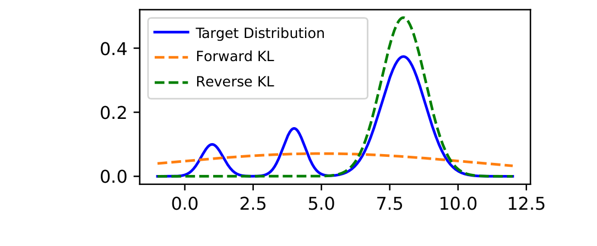
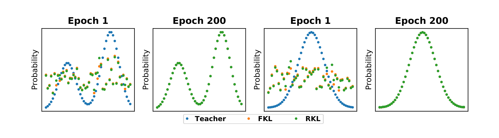
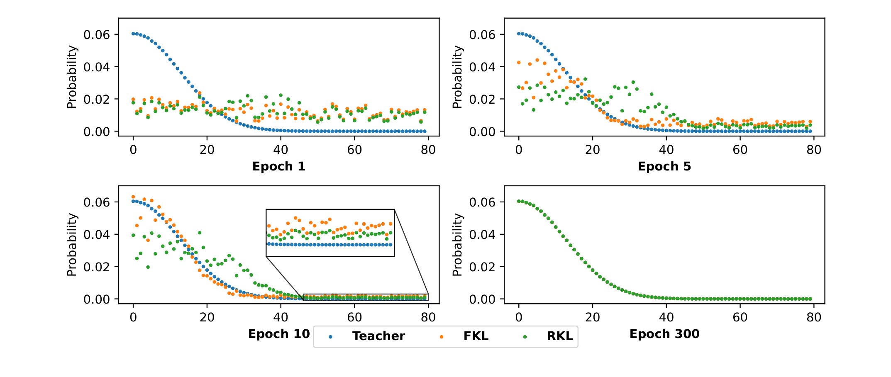
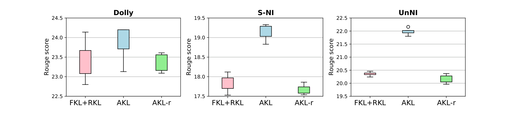

# AKL：Rethinking KL Divergence in LLM Knowledge Distillation

## 来源

- 原始 PDF：[`raw/2404.02657v4.pdf`](../../raw/2404.02657v4.pdf)
- 标题：Rethinking Kullback-Leibler Divergence in Knowledge Distillation for Large Language Models
- 版本 / 日期：arXiv:2404.02657v4，2024-12-08（v1 2024-04-03）
- 会议：COLING 2025（外部佐证；正文未印会议页眉）
- 作者：Taiqiang Wu、Chaofan Tao、Jiahao Wang（HKU）、Runming Yang（Tsinghua）、Zhe Zhao（Tencent AI Lab）、Ngai Wong（HKU）
- 代码：<https://github.com/wutaiqiang/LLM_KD_AKL>
- 模型链接：**未建模型页**——不发布新模型；student 是 GPT-2 120M 与 TinyLLaMA 1.1B

## 为什么这篇在 wiki 里独占一席

[GKD](generalized-knowledge-distillation.md) Figure A.16 和 [MiniLLM](minillm.md) Figure 2 是 wiki 里 forward / reverse KL 行为对照表的一手出处，但两张图都是 **连续、单峰高斯 \(q\) 去拟合双峰 \(p\)**。本篇把这条刻画钉死在它的前提上，并给出离散词表下的替代叙事：FKL 与 RKL **共享同一收敛点 \(q=p\)**，有限 epoch 里差的是优化路径（head vs tail）。[OPD 数学依据](../concepts/multi-teacher-on-policy-distillation.md) 第二层此前只靠裸 arXiv 链接引用这篇；本页把它升成一手。

## 核心结论

1. **mean-seeking / mode-seeking 在 LLM KD 下不成立。** 那两条行为依赖「\(q\) 单峰高斯」和「\(p,q\) 连续」（`§1`、`§3.2`）。词表 softmax 两边都不满足。
2. **token 级 KL 的驻点相同。** 对逐步 softmax 的 FKL / RKL，\(\partial/\partial z^q_j=0\) 对所有词表项成立当且仅当 \(q_\theta(Y_j|y_{<t})=p(Y_j|y_{<t})\)（公式 5–8，证明在附录 A）。作者原话：两者「share the same optimization objective, forcing the student model to generate the same logits as the teacher model」。
3. **有限 epoch 里差在路径。** FKL 权重是 \(p(z)\)，先拟合 head；RKL 在 \(p(z)\) 很小时 \(\log(q/p)\) 易爆，先拟合 tail（`§3.2` Difference）。LLM 实验通常 10–20 epoch（MiniLLM 的设定），远不到 toy 上 200–300 epoch 的收敛。
4. **AKL** 按 head/tail 缺口自适应加权 FKL 与 RKL。在 MiniLLM 同款 Dolly 指令蒸馏设定上全面超过 FKL、RKL、0.5 相加、以及 DistiLLM 的 skew KL。

适用范围要写清：理论针对 **固定前缀上的词表 softmax KL**（公式 1–2 的逐步分解）。它**没有**覆盖 2026 生产 OPD 把 reverse KL 写成 sampled-token advantage、走 RL 训练栈的那条估计器。把「离散 LLM 上 reverse KL 必然 mode-seeking」降级是原文确证；把「所有 OPD 的 reverse KL 都等价于 forward KL」写成原文结论则过了。

## 证据：连续 toy 被拒，离散 toy 两边都贴上 \(p\)

> Figure 1: The toy example in Gu et al. (2023), where they fit a Gaussian mixture (distribution of teacher) with a Gaussian distribution (distribution of student) using FKL and RKL.（`§3.1`）

这就是 MiniLLM Figure 2 / GKD Figure A.16 那一类图。作者把它当**反例的靶子**，不是自己的结论。

> Figure 2: The convergence of FKL and RKL on toy data under epoch 1 and epoch 200. The initial distribution \(q\) is the same for FKL and RKL. After 200 epochs, both FKL and RKL can converge to the target distribution well regardless of the shape of \(p\).（`§3.2`）

设定是直接优化离散 \(q_\theta\)（Adam，lr=0.1，无 weight decay），不是神经网络。结论是「在这个离散单纯形上两边都能贴上 \(p\)」，不是「任意 LLM 训练都会在 200 epoch 对齐」。

> Figure 3: The distributions at various epochs for FKL and RKL on toy data (long-tail) … FKL focuses on the head part and RKL on the tail part at the beginning epochs, and both converge finally.（`§3.2` / `§4.1`）

## 方法：Adaptive KL

Head 集合是最小的 \(M\) 使 \(\sum_j M[j]\,p(Y_j|y_{<t})\ge\mu\)（默认 \(\mu=0.5\)，对 \(p\) 排序即得）。缺口 \(g_{\mathrm{head}}\) / \(g_{\mathrm{tail}}\) 用点wise \(|p-q|\) 求和，然后

\[\mathrm{AKL}(p,q_\theta)=\frac{g_{\mathrm{head}}}{g_{\mathrm{head}}+g_{\mathrm{tail}}}\,\mathrm{FKL}(p,q_\theta)+\frac{g_{\mathrm{tail}}}{g_{\mathrm{head}}+g_{\mathrm{tail}}}\,\mathrm{RKL}(p,q_\theta).\]

head 缺口大就加重 FKL。对照 AKL-r 把权重对调，全面变差（Figure 4），说明方向不是随便加权。

实验走 MiniLLM 的 Dolly-15k 指令蒸馏（14k/500/500），teacher 先 SFT 再蒸 student。**正文没有写 student 自采样**；作者明确不和 MiniLLM 比数字，因为 MiniLLM 还用了 OpenWebText / RoBERTa 语料。不要把 AKL 写成 on-policy OPD 方法。

GPT-2：20 epoch，bs=32，lr \(5\times10^{-4}\)；TinyLLaMA：10 epoch，bs=60，lr \(10^{-5}\)；最大长度 512。\(\mu=0.5\)，\(\epsilon=|p-q|\)。

## 评测要点

Table 1 Rouge-L（5 seed）：

| 方法 | GPT-2 1.5B→120M Dolly | S-NI | UnNI | LLaMA 6.7B→TinyLLaMA Dolly | S-NI | UnNI |
| --- | ---: | ---: | ---: | ---: | ---: | ---: |
| Teacher | 26.98 | 27.25 | 31.61 | 26.73 | 32.75 | 34.61 |
| SFT | 23.01 | 16.48 | 18.43 | 22.05 | 27.79 | 25.96 |
| SeqKD | 23.30 | 16.35 | 18.51 | 22.67 | 26.97 | 27.35 |
| FKL | 23.46 | 16.63 | 19.27 | 22.24 | 28.07 | 26.93 |
| RKL | 22.62 | 17.88 | 19.35 | 23.95 | 28.90 | 27.89 |
| SKL | 23.47 | 16.51 | 18.46 | 23.29 | 29.89 | 29.15 |
| SRKL | 23.25 | 17.54 | 19.31 | 22.09 | 29.60 | 28.81 |
| FKL+RKL | 23.36 | 17.83 | 20.37 | 24.08 | 30.98 | 30.48 |
| **AKL** | **23.88** | **19.15** | **21.97** | **24.40** | **31.37** | **31.05** |

作者自己强调：FKL vs RKL 的差距很小，GPT-2 Dolly 上 FKL 还高于 RKL（23.46 vs 22.62）——这直接打 MiniLLM / GKD「RKL 更适合生成」的默认。UnNI 上 AKL vs FKL+RKL 的 p 值 GPT-2 5e-9、TinyLLaMA 9e-5。正文有一处笔误，写成「AKL outperforms FKL+AKL」。

> Figure 4: The results of FKL+RKL, proposed AKL, and AKL-r on GPT 2 120M. After flipping the loss weight, AKL-r performs worse than AKL on all three datasets.（`§6.1`）

GPT-4 打分（Figure 5，满分 10，TinyLLaMA）：AKL 多样性 5.51、质量约 5.72，均高于 FKL / RKL / FKL+RKL。人工 5 人 win/tie/loss（Table 3）对所有基线 win+tie > 75%。Dolly 子任务上 FKL 擅 Closed QA / Summary，RKL 擅 Brainstorming，AKL 在 Information Extraction 与 Creative Writing 上超过 teacher（`§6.5`）。

开销（Table 2，LLaMA→TinyLLaMA，40G A100）：AKL 40.3G / 80 min，相对 FKL+RKL 多 2.8G、4 分钟。

## 与现有 wiki 页的关系

- **[GKD](generalized-knowledge-distillation.md) / [MiniLLM](minillm.md)**：本页 Figure 1 就是它们那张连续 toy 的翻版。GKD 实测「指令微调上 reverse KL 大胜」与「两者收敛到同一目标」的共存，按本篇应读成**没训到收敛**时的路径差，不是离散词表上的不同驻点。GKD 的 GSM8K 上 forward KL 并不差，和本篇 GPT-2 Dolly 上 FKL≥RKL 同方向。
- **[OPSD](opsd.md)**：100 step 内 forward KL 明显强于 reverse KL，落在本篇「有限步数、FKL 先 head」的区间。不要倒过来说 AKL 预测了 OPSD——OPSD 是 on-policy full-vocab，本篇实验未声明 on-policy。
- **2026 生产 OPD**（MiMo / GLM-5 / Nemotron）默认 sampled-token reverse KL。本篇**不能**用来证明那条估计器与 full-vocab FKL 等价；它只打掉「离散 LLM 上 reverse KL = mode-seeking」这条从连续 toy 外推的话。
- DistiLLM 的 SKL/SRKL 是 Table 1 基线，不是本页主线。

## 证据边界与阅读提示

- **实验不是 on-policy。** 若 AKL 只在 teacher-forced 前缀上算 KL，它和 OPD 的数据轴是正交的。
- 最大 student 1.1B，作者 Limitation 自己写没做 70B。
- 「50+ epoch 才收敛」来自直接优化离散 \(q\) 的 toy，不能换算成 LLM 的 optimizer step。

## 待追问

- **需实验或作者披露**：**理论覆盖不到 sampled-token PG。** 公式 5–8 的驻点论证停在 token-wise softmax。Thinking Machines / MiniLLM 的 reverse-KL advantage 是否仍与 FKL 同驻点，原文没做。
- **需实验或作者披露**：\(\mu=0.5\)、\(\epsilon=|p-q|\) 几乎没扫；附录 Table 6 有若干 \(\mu\)，正文当默认。

## 相关页面

- [Multi-Teacher On-Policy Distillation](../concepts/multi-teacher-on-policy-distillation.md)
- [GKD](generalized-knowledge-distillation.md)
- [MiniLLM](minillm.md)
- [OPSD](opsd.md)
- [On-Policy Distillation 跨报告对比](../comparisons/on-policy-distillation.md)
- [Thinking Machines Lab On-Policy Distillation 博客](thinking-machines-on-policy-distillation.md)
