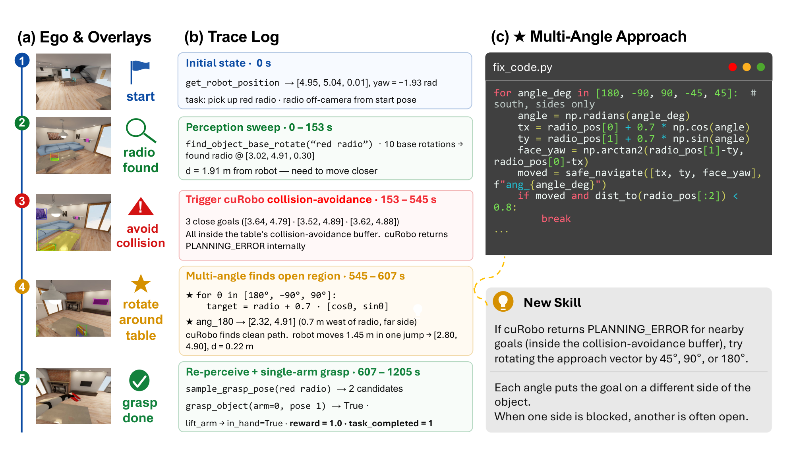
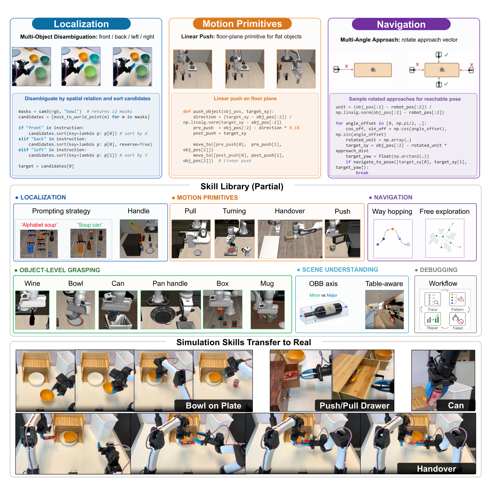
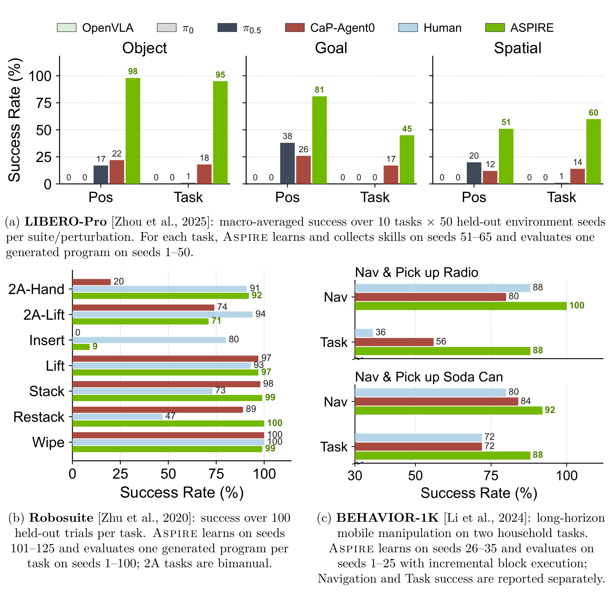
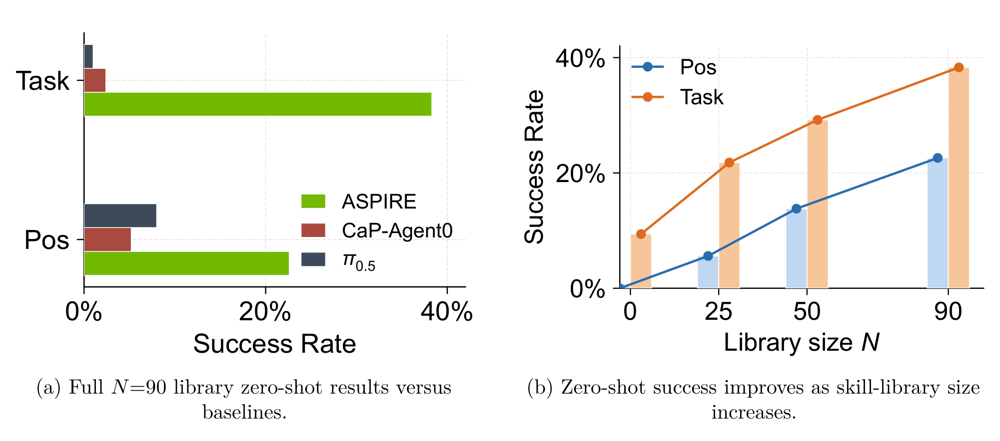

# ASPIRE: Agentic /Skills Discovery for Robotics

## 来源

- **PDF**：`raw/2607.00272v1.pdf`（arXiv:2607.00272v1，2026-06-30；页眉日期 2026-7-2）
- **标题**：ASPIRE: Agentic /Skills Discovery for Robotics
- **展开名**：Agentic Skill Programming through Iterative Robot Exploration（摘要）
- **团队**：NVIDIA GEAR 等。一作并列 Runyu Lu / Yubo Wu / Ethan Kou；项目主导 Yuke Zhu、Linxi "Jim" Fan、Guanzhi Wang。单位：NVIDIA、UMich、UIUC、UC Berkeley、CMU。
- **体量**：43 页，12 图，9 表。
- **项目页**：[research.nvidia.com/labs/gear/aspire](https://research.nvidia.com/labs/gear/aspire/)（外部佐证；不能升级为原文确证）
- **代码**：[github.com/NVlabs/ASPIRE](https://github.com/NVlabs/ASPIRE)（外部）
- **定位**：这是 **code-as-policy 的具身 skill 自进化系统**，不是一组要发布的神经网络权重，也**不是**第四种 VLA 动作头。评测表里的 [OpenVLA](openvla.md) / [π0](pi0.md) / [π0.5](pi0.5.md) 是对照，不是前作。本库不建模型页：系统产出是 skill library。
- **不要混名**：EmbodiSkill（清华 AIR + MSR，arXiv:2605.10332）和 EmbodiedSkills（浙大，arXiv:2609.01281）尚未 ingest，机制不同，见 [待追问](#待追问)。

仿真与真机用的 coder 都是冻结的前沿 LLM，本库没有对应模型页：

| 角色 | 原文身份 | 是否更新权重 |
| --- | --- | --- |
| 仿真 coding agent | Claude Code + Claude Opus 4.6，1M-token 上下文（§3.1、§5） | 冻结；作者未验证更小/更弱 LLM 能否撑同一调试环 |
| 真机 coding agent | OpenAI Codex GPT-5.5，`reasoning-xhigh`（§3.1） | 未写训练 |
| 程序 API | CaP-X（Fu et al., 2026）上的感知 / 几何 / 运动规划原语；仿真建在 MuJoCo Playground | 预定义；越出 API 的行为要人扩原语（§5） |
| 系统产出 | 可检索的 skill library + 每任务一份程序 | 写入程序库，不是 VLA 权重 |

## 核心结论

Aspire 把软件工程 agent 的「看痕迹 → 定位失败 → 改实现 → 再跑」搬到机器人上，但补了现有 robotic coding agent 缺的两件事：细粒度多模态执行痕迹，以及跨任务沉淀的可复用技能（§1）。系统在开放学习环里运行，三件套是（摘要、§2）：

1. **闭环 robot execution engine**：每个感知 / 规划 / 抓取 / 控制调用都留下 API、输入输出、返回状态和附近的 RGB / overlay / 抓取候选 / 运动规划结果，让 agent 自己选看哪一段、定位、补丁、再执行验证。
2. **持续扩张的 skill library**：只收通过 debug 验证、且被 coordinator 判定可复用的修复模式，给后续任务当 in-context 指导。
3. **evolutionary search**：在单轨迹修补之外并行提出多种候选程序，按执行分数和残留失败痕迹进化，避免反复补同一条坏策略。

经验随任务累积：第 N 个任务不再从零开始。摘要里的「up to 77% / 72% / 32%」和「31% vs 4%」在正文写成 **成功率百分点差**（§1：「77 points / 72 points / 32 points」），不是相对涨幅。口径与基线见 [评测要点](#评测要点)。

**已据原文核实的边界**：Aspire 写/改的是可执行 Python 程序；仿真 coder 是冻结的 Claude Opus 4.6，原文没有报告对任何 VLA 或策略网络做梯度更新（§3.1、§5）。技能是失败归因后的修复知识，不是整段任务脚本，也不是音频或新的动作 token 词表。

## 架构与训练

原文没有神经网络训练配方。所谓「架构」是 coordinator–actor 运行时加上执行引擎；agent、环境和 API 集合在全部仿真实验中固定（§3.1）。

> Figure 1（原文截图，§1）："Aspire system overview. A coordinator spawns an actor agent (coding agent) per task, enabling parallel learning across tasks. Each actor refines and validates robot programs through iterative debugging with the robot execution engine, which exposes per-primitive multimodal traces for failure attribution and repair. Evolutionary search samples diverse candidate programs (π₀, …, πₖ), sends each through the engine, and conditions the next generation (π′₀, …, π′ₖ) on surviving programs and residual failure traces. The coordinator writes validated repairs into a shared skill library, which future actors retrieve as in-context guidance; skills discovered in sim can also be adapted as cross-embodiment guidance for real-robot programming."

Coordinator 管共享技能库并按任务派 actor。Actor 之间**不交换**完整聊天记录或原始 rollout，只把可迁移经验蒸馏进库，好让上下文窗口盯住当前任务规格、当前程序和当前失败相关的结构化痕迹（§2 开篇）。这和 [Agent harness](../concepts/agent-harness.md) 里 Prime Agent / Macaron「L0 不动、改可复用程序」同构，对象换成了机器人感知–运动与接触动力学，见 [具身 skill 自进化](../concepts/embodied-skill-self-evolution.md)。

### 执行引擎：把粗粒度成败换成按 primitive 的多模态痕迹

先前 robotic coding agent 往往只给任务级成败或人工摘要，失败时分不清是感知错、抓取不稳、规划失败还是恢复失败（§1、§2.1）。Aspire 把反馈通道做成开放调试环境：每个 primitive 调用记 API、输入输出、返回状态，以及调用前后的关键帧、overlay、抓取候选、物体位姿、运动规划结果。Agent **收不到完整视频**；引擎只保留失败相关调用附近的帧和返回值（§2.1）。

> Figure 2（原文截图，§2.1）："Robot execution engine. Trace-guided debugging on a BEHAVIOR-1K navigate-and-pick-up-radio task. (a) Ego-view keyframes and overlays show the robot locating the radio but failing to approach it. (b) The primitive trace localizes the failure to repeated PLANNING_ERRORs: candidate navigation goals fall inside the table's collision-avoidance buffer. (c) The agent patches the program with a multi-angle approach routine, re-perceives the radio from a reachable side, and completes the grasp. The validated repair is admitted as a reusable Multi-Angle Approach skill."

这个例子里感知已经给出收音机位姿，失败不在检测或抓取，而在目标位姿相对桌沿大约 20 cm 触发碰撞约束（§2.1）。修复因此是改接近几何，不是改 SAM3 prompt。

## 技能库如何写入 / 进化

原文没有 SFT→RL 后训练。持续学习发生在 **skill library** 上：验证过的修复被写成可检索、可版本化的 in-context 程序知识。

### 技能是什么

可复用知识很少是整份任务程序。库里装的是异质修复：定位启发式、感知 prompt、抓取约束、导航恢复、运动原语、场景理解例程、调试工作流。分类**不是事先规定的**，而是从验证过的修复里归纳出来（§2.2）。每条技能是紧凑的 in-context 指导，通常含失败签名、when-to-apply 条件、修复策略，必要时再附代码草图。收音机任务写入库的是「规划器在障碍边界因目标落入 collision buffer 反复 PLANNING_ERROR 时，先绕物体采样接近方向」，而不是一份完整的 pickup-radio 程序（§2.2、Figure 2）。

> Figure 3（原文截图，§2.2）："Skill library. Aspire stores validated, agent-discovered repair knowledge as reusable in-context skills rather than a fixed set of human-written primitives. Top: representative entries show learned skills about localization disambiguation, motion-primitive construction, and navigation recovery. Middle: the library grows across heterogeneous categories, including localization, navigation, motion primitives, object-level grasping, scene understanding, and debugging workflows. Bottom: selected skills discovered in sim are used as in-context guidance for real-robot programming, providing evidence that skills can transfer across embodiments."

写入路径（§2.2、Appendix E.1）：actor 用结构化 findings 报告失败模式、已验证修复、可能可迁移的模式；coordinator 审计、核对允许的 API 策略，**只把通过 debug 验证的可复用修复**晋升进共享库。这是一层 admission gate，不是把每次成功轨迹都记下来。附录 A 把条目展开成 problem / when-to-apply / 修复片段 / 来源任务。

### 进化搜索：避免局部修补死循环

只靠痕迹引导调试会塌进「反复补同一策略」（§2.3）。每轮 agent 根据技能库、当前 Top-3 程序和既有失败痕迹提出 \(K\) 个候选；每个候选在执行引擎上跑，得到分数和新痕迹；下一轮条件化在最优程序及其残留失败上。搜索对象是**机器人程序本身**。搜索结束后，跨环境变化与任务仍成立的修复才入库。达到阈值 \(\theta\) 或预算 \((K,T)\) 耗尽则停（Algorithm 1）。ProposeRepairs 条件化在 `Top3(ℋ)` 与 \(\mathcal{L}\)；`ExtractValidatedPatterns` 在 held-out 验证之后才抽出可入库模式。

## 评测要点

协议不对称必须先读（§3.3、Figure 4 caption）：环境 seed 固定物体位姿、干扰物和初始状态；debug 与评测 seed 不相交。**Aspire 每个 LIBERO-Pro / Robosuite 任务只生成一份程序**，在更大 held-out seed 上评；**CaP-Agent0 每个 seed 重新生成程序，并带 test-time reasoning 和 retries**。BEHAVIOR-1K 上 Aspire 按当前多模态痕迹做增量 block 执行。主 coding-agent 基线是 CaP-Agent0（视觉差分 + 预定义技能库 + 每回合 retries）；VLA 对照是 OpenVLA、π0、π0.5。Human 指人类专家写的程序（§3.4）。

### LIBERO-Pro / Robosuite / BEHAVIOR-1K（Figure 4；精确值 Appendix B）

> Figure 4（原文截图，§3.4）："Aspire improves over prior coding agents and end-to-end VLAs across three benchmark families. (a) Short-horizon manipulation on LIBERO-Pro; (b) contact-rich manipulation on Robosuite; (c) long-horizon mobile manipulation on BEHAVIOR-1K. Aspire evaluates one generated program per task across held-out seeds, while CaP-Agent0 regenerates a separate program per seed with test-time reasoning and retries."

Table 2 原表是 \([0,1]\)；下表改成百分比，与 Figure 4 一致。LIBERO-Pro：每套 10 任务 × 50 held-out seed；Aspire 在 seed 51–65 学并收技能，seed 1–50 评那一份程序。

| Method | object Pos / Task | goal Pos / Task | spatial Pos / Task | Overall Pos / Task / All |
| --- | ---: | ---: | ---: | ---: |
| OpenVLA | 0 / 0 | 0 / 0 | 0 / 0 | 0 / 0 / 0 |
| π0 | 0 / 0 | 0 / 0 | 0 / 0 | 0 / 0 / 0 |
| π0.5 | 17 / 1 | 38 / 0 | 20 / 1 | 25 / 1 / 13 |
| CaP-Agent0 | 22 / 18 | 26 / 17 | 12 / 14 | 20 / 16 / 18 |
| Aspire | **98 / 95** | **81 / 45** | **51 / 60** | **77 / 67 / 72** |

摘要「up to 77%」= §3.4 在 Object 套件上，把 Pos 与 Task **平均之后**相对该套件最强基线（CaP-Agent0 平均 20）的百分点差：Aspire 平均 96.5，差约 76.5，正文写成 77。Goal / Spatial 同样口径是 +41.5 / +42.5。π0.5 在部分 Pos 扰动上强于 OpenVLA / π0，但 Task 改写几乎塌掉（Table 2）。这不是「Aspire 比 π0.5 更强的 VLA」，而是程序+技能库对扰动套件的对照。

Robosuite（Table 3，100 held-out trial；Aspire 学 seed 101–125）：

| Task | CaP-Agent0 | Aspire |
| --- | ---: | ---: |
| cube_lift | 97 | 97 |
| cube_stack | 98 | 99 |
| cube_restack | 89 | **100** |
| spill_wipe | **100** | 99 |
| two_arm_handover | 20 | **92** |
| two_arm_lift | **74** | 71 |
| nut_assembly | 0 | 9 |
| Mean | 68 | **81** |

摘要「72%」= handover 20→92 的 72 个百分点（§1、Table 3）。不是七任务均值。Aspire 并未全面压过 Human：Figure 4(b) 上 nut_assembly 人类约 80、Aspire 9；two_arm_lift 人类 94、Aspire 71。

BEHAVIOR-1K（Table 4，25 held-out seed；Aspire 在 seed 26–35 攒库，评测增量 block）：

| Task | Human Nav / Task | CaP Nav / Task | Aspire Nav / Task |
| --- | ---: | ---: | ---: |
| Soda Can pick-up | 80 / 72 | 84 / 72 | **92 / 88** |
| Radio pick-up | 88 / 36 | 80 / 56 | **100 / 88** |

摘要「up to 32%」= Radio 的 Task 成功相对 CaP-Agent0：56→88（§3.4）。相对 Human 的 Radio Task（36→88）更大，正文没有用那一档当 headline。

### Zero-shot：LIBERO-90 技能库 → LIBERO-Pro Long（Figure 5 / Table 5）

库快照 \(N\in\{0,25,50,90\}\) 来自 LIBERO-90 的修复技能；每个 held-out 长周期任务**只生成一份程序**，不再调试、不再 retries、不再按任务更新库（§3.5）。

> Figure 5（原文截图，§3.5）："Cross-task zero-shot transfer on LIBERO-Pro Long. Skills accumulated on LIBERO-90 improve zero-shot performance on held-out long-horizon tasks. Figure (a) compares the full N=90 library with baselines. Figure (b) shows Pos/Task success as the size of the skill library increases. All success rates are macro-averaged over 10 tasks per axis."

| Method | Pos | Task | Overall |
| --- | ---: | ---: | ---: |
| OpenVLA / π0 | 0 / 0 | 0 / 0 | 0 |
| π0.5 | 8 | 1 | 5 |
| CaP-Agent0 | 5.2 | 2.4 | 3.8 |
| Aspire \(N=0\) | 0 | 9.4 | 4.7 |
| Aspire \(N=25\) | 5.6 | 21.8 | 13.7 |
| Aspire \(N=50\) | 13.8 | 29.2 | 21.5 |
| Aspire \(N=90\) | **22.6** | **38.3** | **30.5** |

摘要「31% vs 4%」≈ Table 5 Overall 30.5% vs CaP-Agent0 3.8%（正文写成 prior methods 饱和在 4%，且对方依赖 test-time reasoning 与 retries）。Figure 5(a) 的 23% / 38% 是 Pos / Task 两轴，不是另一套协议。Table 6 显示部分任务随 \(N\) 非单调（例如 Soup+tomato sauce 的 Pos：\(N=50\) 为 0.20、\(N=90\) 为 0.00），与 §5「库变大后条目可能过时、过特、冗余或误导」一致。

### 真机跨本体：技能是 in-context 指导，不是直接部署策略（Table 1）

仿真技能来自 Franka；真机是双臂 YAM，感知 / 标定 / 控制栈和 API 都不同。对比的是「检索对应仿真技能 vs 不检索」，看第一次成功程序的 token，以及生成程序的 held-out 成功（§3.6）。**不是**把仿真程序直接搬到真机。

| Task | Output tokens (M) w/o → w/ | Total tokens (M) w/o → w/ | Success w/o → w/ |
| --- | ---: | ---: | ---: |
| Put bowl on plate | 0.05 → 0.04 | 8.65 → 5.11 | 20/20 → 20/20 |
| Lift soda can | 0.18 → 0.03 | 61.94 → 6.58 | 13/20 → 19/20 |
| Open/push drawer | 1.33 → 0.36 | 334.917 → 81.67 | 0/20 → 11/20 |

技能降低调试成本是稳定的；最终成功则视任务：碗放置两边都 20/20，易拉罐 13/20→19/20 且总 token 约降一个数量级，抽屉无技能耗尽预算仍 0/20、有技能 11/20。

### 消融（Figure 6、Table 7–8）

在 LIBERO-Pro 上去掉执行引擎和进化搜索 = 零样本 Claude Opus 4.6 + 15 个示例程序。加上引擎（+ 技能库）后再加进化搜索。正文 macro-average：无两者 **14%** → 加引擎 **62%** → 再加进化搜索 **72%**（§3.7）。Table 7/8 分轴：Pos overall 20% / 62% / 77%，Task overall 9% / 61% / 67%；两轴平均即 14.5 / 61.5 / 72。引擎贡献最大；进化搜索主要抬剩余难题，迭代有收益递减（Figure 6(c)、Table 9）。Aspire 最终列是在 seed 66–80 上对「引擎修复程序 vs 进化搜索最佳候选」做 winner 选择，不是无条件采用进化搜索。

## 待追问

- 摘要 77/72/32 是相对 **CaP-Agent0** 的成功率百分点，且 Aspire 一份程序、对方每 seed 重写+retries。把 VLA 的近零分和这份 coding-agent 对照写进同一「up to」时，读者容易误读成公平 VLA 对决。
- 技能库的长期记忆管理原文自己标成未解决（§5）：过时、过特、冗余、误导，以及 Table 6 的非单调。Admission gate 有，但 pruning / ranking / 再验证还没有写成机制。
- 仿真依赖冻结的 Claude Opus 4.6 + 1M 上下文；真机换了 GPT-5.5。更小模型能否撑同一环，原文明确没验证（§5）。
- 表达力被预定义 API 卡住。新 sensing / 控制原语要人扩；作者把「agent 如何安全提出并纳入新原语」留给未来（§5）。
- 真机还不是终身学习者：成功检测、安全复位、安全监控、标定维护都未闭环（§5）。Table 1 只有三条技能、一种 YAM 双臂。
- nut_assembly 9%、部分 Spatial/Goal 任务进化搜索后仍接近 0（Table 7–8）。接触装配和语言改目标的哪些失败模式进不了当前技能表示？
- 未 ingest 近邻不要混名：EmbodiSkill（arXiv:2605.10332，training-free reflection）、EmbodiedSkills（arXiv:2609.01281，VLA 上层 AgentLoop + π0.5）、AtomicVLA（VLA + atomic skill-MoE）。本页没有读过它们的 PDF。
- 调试环的 LLM 调用与 simulator/robot rollout 成本没有主表；§5 只定性说 compute-intensive。

## 相关页面

- 概念：[具身 skill 自进化](../concepts/embodied-skill-self-evolution.md) · [Vision-Language-Action](../concepts/vision-language-action.md) · [Agent harness](../concepts/agent-harness.md) · [Agent 记忆生命周期](../concepts/agent-memory-lifecycle.md)
- 评测表里的 VLA 对照（不是前作）：[OpenVLA](openvla.md) · [π0](pi0.md) · [π0.5](pi0.5.md)
- 软件侧「冻结权重、改可复用程序」：[Prime Agent](prime-agent.md) · [Macaron-V1](macaron-v1.md)
