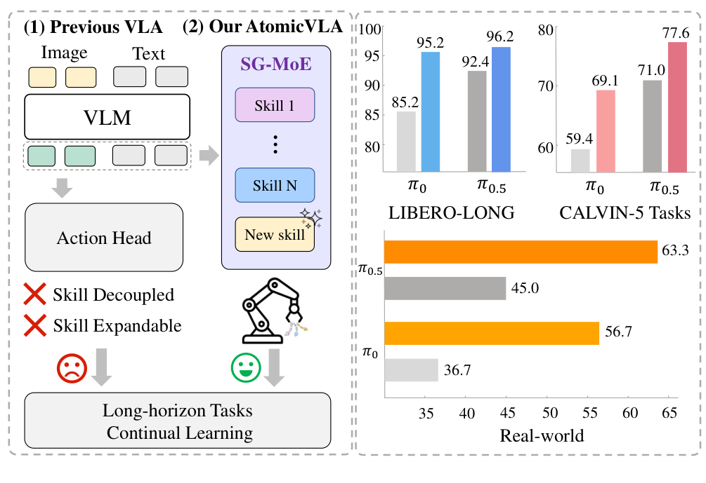
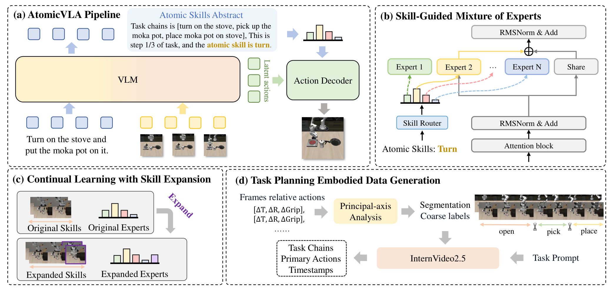
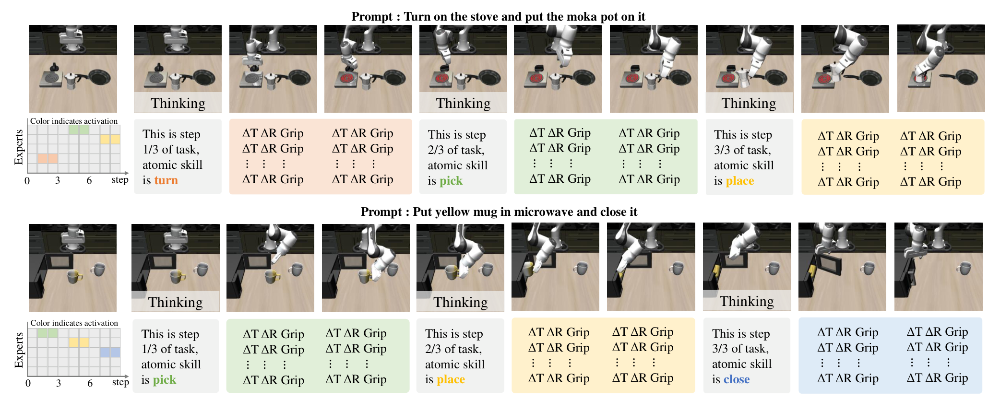

# AtomicVLA: Unlocking the Potential of Atomic Skill Learning in Robots

## 来源

- **PDF**：`raw/2603.07648v2.pdf`（arXiv:2603.07648v2，2026-09-06）
- **标题**：AtomicVLA: Unlocking the Potential of Atomic Skill Learning in Robots
- **团队**：中山大学 + 鹏城实验室 + 引望智能。一作 Likui Zhang；通讯 Liang Lin、Xiaodan Liang。
- **体量**：18 页（含附录），10 图，10 表。
- **项目页**：[zhanglk9.github.io/atomicvla-web](https://zhanglk9.github.io/atomicvla-web/)（外部；视频不能升级为原文确证）
- **模型页**：[AtomicVLA](../models/atomicvla.md)
- **定位**：这是 **VLA**，不是程序库、也不是改技能正文。骨干是预训练 [π0](pi0.md) / [π0.5](pi0.5.md)；技能是 **SG-MoE 专家路由**，低层仍是那套连续 action expert。不要读成第四种动作头。
- **不要混名**：[ASPIRE](aspire.md) 写程序，[EmbodiSkill](embodiskill.md) 改技能正文，[EmbodiedSkills](embodied-skills.md) 是 typed 合同 + AgentLoop。本页的「skill library」是神经网络专家模块。数字不许和那三篇互填，也不要和 EmbodiedSkills 的 LIBERO 97.40% 当成同一协议。

| 变体 | 基座 | 原文用法 |
| --- | --- | --- |
| AtomicVLA | 预训练 [π0](../models/pi0.md) | LIBERO / CALVIN / 真机长周期的主对照 |
| AtomicVLA* | 预训练 [π0.5](../models/pi0.5.md) | 同套表里的更强变体；真机持续学习主结果 |

§4.1：「We build AtomicVLA and AtomicVLA* upon the pretrained π0 and π0.5 foundation model。」

## 核心结论

现有 VLA 用**单一**动作解码器吃混在一起的技能数据，长周期组合和持续加新技能都会互相干扰（摘要、§1）。作者不另发明一套动作参数化，而是：

1. **同一 VLM 自适应 [think] / [act]**：关键步吐任务链 + 原子技能抽象；执行步按最近一次抽象路由专家、吐动作块（Algorithm 1、§3.2）。
2. **SG-MoE（Skill-Guided Mixture-of-Experts）**：共享专家保住 π0 的预训练动作生成；每个原子技能一个专用专家；路由只激活 top-1，再和共享专家加权（§3.3、Eq. 3）。
3. **持续学习只加新专家 + 扩路由**，旧专家不动（§3.4）。

**已据原文核实的边界**：技能不是新的离散 bin，也不是另一种 flow。§3.3 写明架在 π0 上，「shared expert that maintains the pre-trained action generation capabilities of π0」。动作头家族仍是 [VLA 概念页](../concepts/vision-language-action.md) 的连续 flow / π0.5 co-training，本页加的是**按技能路由的专家 FFN**。

Headline 口径：LIBERO 相对 π0 的 +2.4 / LIBERO-LONG +10 是成功率百分点（96.6−94.2、95.2−85.2）。CALVIN 的 +0.22 / +0.25 是平均完成长度（AtomicVLA vs π0、AtomicVLA* vs π0.5）。真机「18.3% / 21%」分别是 AtomicVLA* 相对 π0.5 的长周期平均（63.3−45.0）和持续学习五任务平均（82−61）。

## 架构与训练

> Figure 1（原文截图，§1）："Overview of AtomicVLA. Unlike previous VLA models with a single action head, which suffer from limited scalability and severe interference among mixed skills, AtomicVLA employs a SG-MoE architecture to build a scalable skill expert library. By unifying task planning and action execution within this framework, it achieves strong performance on long-horizon and continual learning tasks in both simulation and real-world settings."

图注里的「single action head」指**一个**解码器吃所有技能，不是「本页发明了第四种动作表示」。右侧柱是 AtomicVLA / AtomicVLA* 相对对应基座，见 [评测要点](#评测要点)。

### Think / Act 仍在同一个 π0 栈里

> Figure 2（原文截图，§3）："(a) AtomicVLA Pipline. AtomicVLA is a framework that unifies task planning and action execution. The VLM adaptively predicts atomic skill abstraction and latent action. Action Decoder in the SG-MoE architecture receives both the latent action and the newly inferred atomic skill abstraction, and generates fine grained motor actions. (b) Skill-Guided Mixture of Experts. SG-MoE includes a skill router, a shared expert, and multiple atomic-skill experts. The router selects the top skill expert based on the atomic skill, and the action token is processed by both the activated skill expert and the shared expert. (c) Continual Learning with Skill Expansion. New skills are added by training only the new expert and extending the router. (d) Task Planning Embodied Data Generation. High-quality embodied reasoning data are generated using principal-axis analysis with InternVideo2.5 model."

推理（Algorithm 1）：每步先预测标识 \(M\in\{[\mathrm{think}],[\mathrm{act}]\}\)。`[think]` 输出任务链 \(C_{0-k}\)、当前进度 \(C_t\)、原子技能抽象 \(\sigma\)，通常只在任务开始或子技能切换时触发。`[act]` 用最近一次 \(\sigma\) 的嵌入做路由，结合本体 \(s_t\) 吐动作块 \(A_t\)。

原子技能先被赋一个标量噪声级 \(\sigma\in[0,100]\)，再 \(Z_\sigma=E(\mathrm{norm}(\log(\sigma)))\)（Eq. 1；作者写这是扩散噪声调度的启发）。路由 \(w_k=\mathrm{Router}(Z_\sigma)\)，只取最高分专家（Eq. 2），动作

\[
F_{\mathrm{out}}=(1-w_k)\,F_{\mathrm{share}}(x_t)+w_k\,F_k(x_t)
\]

（Eq. 3）。\(x_t\) 是多路图像、指令和本体。这是**技能条件化的专家混合**，不是换动作词表。

持续学习：新技能映射到固定 \(Z_\sigma\)，只加对应专家、扩路由；新路由拷旧权重，新分支小随机初始化（§3.4）。

### 数据：主轴切段 + InternVideo2.5 补语义

§3.5：看末端 \(\Delta x,\Delta y,\Delta z\)、\(\Delta\mathrm{roll},\Delta\mathrm{pitch},\Delta\mathrm{yaw}\) 和夹爪跳变，给「pick / turn」这类粗标签；再用 InternVideo2.5 看对应视频段，校正标签并写出任务链。附录阈值：平移 3 cm、旋转 0.05 rad、夹爪 0.1（A.3.5）。这是标注管线，不是运行时 VLA 的一部分。

LIBERO 五类原子技能：Pick / Place / Open / Close / Turn（Table 6：2462 / 761 / 201 / 152 / 175）。CALVIN 八类：Rotate / Push / Move / Open&Close / Lift / Place / Turn / Stack（A.3.2）。真机与 LIBERO 一样用 5 个专家（§4.1）。

### 训练配方（附录 A.3.1）

技能库 = 1 个共享专家 + 多个技能专家。每个技能专家跟 Gemma 架构，FFN 是独立 SwiGLU MLP，**随机初始化**。配置 width=2048 / mlp dim=4096 / depth=18 / 8 heads / head dim=256。CosineDecay，warmup 1,000，峰值 \(2.5\times10^{-5}\)，终值 \(5\times10^{-6}\)，AdamW，grad clip 1.0，EMA 0.999。仿真 100k iter、真机 30k，batch 64，8×H200。数据转成 Lerobot。少样本技能（Open / Close / Turn）提高采样频率（A.3.2）。

Table 10（单卡 H20）：π0 3.24B / 71 ms；K=5 4.17B / Act 92 ms；K=8 4.81B / 126 ms；K=12 5.65B / 160 ms。Think 固定 104 ms。

## 后训练

主实验是模仿学习：仿真 100k、真机 30k。持续学习设定（A.3.4）：先四任务混合 20k，再把「open the top drawer」当新技能、lr \(5\times10^{-6}\) 再 7k。附录 A.2 把接 RL（π\*0.6 / SimpleVLA-RL / VLA-RL）写成未来工作，**本页没有 RL 数字**。**已闭合：不建 π0.6 技术报告页。**

## 评测要点

协议不对称先读：LIBERO 每任务 50 次；CALVIN ABC→D 共 1,000 条、每条五连任务；真机每任务 20 次、物体随机摆（A.3.2–A.3.3）。不要和 [EmbodiedSkills](embodied-skills.md) 的 50 个任务特化 π0.5、或 [ASPIRE](aspire.md) 的一份程序×held-out seed 横比。

### LIBERO（Table 1）

| Method | Spatial | Object | Goal | Long | Avg |
| --- | ---: | ---: | ---: | ---: | ---: |
| OpenVLA | 84.9 | 88.4 | 79.2 | 53.7 | 76.5 |
| π0 | 96.4 | 98.8 | 95.8 | 85.2 | 94.2 |
| π0.5 | 98.8 | 98.2 | 98.0 | 92.4 | 96.9 |
| AtomicVLA | 96.8 | 98.0 | 96.4 | **95.2** | 96.6 |
| AtomicVLA* | 98.8 | 98.8 | 97.2 | **96.2** | **97.8** |

摘要 +2.4 / +10 = AtomicVLA 相对 **π0**，不是相对 π0.5。AtomicVLA 平均 96.6 仍低于 π0.5 的 96.9；优势集中在 Long。π0.5 这一行（98.8 / 98.2 / 98.0 / 92.4）和 [EmbodiedSkills](embodied-skills.md) 引用的 OpenPI 官方数几乎同一套，不要互相当独立复现。

### CALVIN ABC→D（Table 2）

| Method | 1 | 2 | 3 | 4 | 5 | Avg. Len |
| --- | ---: | ---: | ---: | ---: | ---: | ---: |
| π0 | 94.3 | 87.0 | 77.9 | 68.5 | 59.4 | 3.87 |
| π0.5 | 91.9 | 84.6 | 79.4 | 75.5 | 71.0 | 4.02 |
| AtomicVLA | 95.0 | 87.8 | 81.9 | 75.0 | 69.1 | 4.09 |
| AtomicVLA* | 94.1 | 88.7 | 85.2 | 81.7 | 77.6 | **4.27** |

+0.22 / +0.25 是平均长度，不是成功率百分点。作者写 CALVIN 把失败后恢复不算有效完成，可能低估（§4.2）。Table 9：多数任务接近 100%，但 push * block right 只有 22.2–33.8%；归因是训练块在桌心、评测在右侧。

### 真机长周期与持续学习（Table 3–4）

Franka + 腕部/第三人称 D435i；长周期各 100 条、短任务各 50 条，共 550（§4.1）。长周期混合训练：

| Method | InP | IntoD | IntoM | Avg | ΔAvg |
| --- | ---: | ---: | ---: | ---: | ---: |
| π0 | 45 | 55 | 10 | 36.7 | — |
| π0.5 | 65 | 35 | 35 | 45 | — |
| AtomicVLA | 65 | 60 | 45 | 56.7 | +20.0 vs π0 |
| AtomicVLA* | 75 | 60 | 55 | 63.3 | +18.3 vs π0.5 |

Table 3。摘要 18.3% 取的是 AtomicVLA* vs π0.5，不是 AtomicVLA vs π0 的 +20.0。

持续学习（Table 4）：先训 Grasp / Stack / Close / Press，再加 Open。π0.5 四任务平均 77.5→61（−15.0），Stack 65→45。AtomicVLA* 86.3→84.25 的四任务口径写成 \(\Delta\mathrm{Avg}=-1.3\)；五任务平均 82 vs π0.5 CL 的 61，正文「overall improvement of 21%」。

复杂场景（Table 8，不规则蔬菜）：AtomicVLA* 43.3 vs π0.5 33.3。

### 消融：路由信号必须是原子技能，不是 token / 时间步（Table 5）

LIBERO-LONG：π0 85.2；+ token-level MoE 88.6；+ 按 denoising timestep 路由的 MoDE 89.5；+ SG-MoE **95.2**。作者把前两者的增益写成负载均衡，每个专家仍混多种技能；SG-MoE 让同一技能阶段的 token 进同一个专家（§4.4）。

> Figure 3（原文截图，§3.4）："Inference Example of AtomicVLA. We visualize two tasks from LIBERO-LONG. For each task, the top row shows the task progression, and the bottom row shows AtomicVLA’s inferred outputs. Gray blocks denote Thinking, while colored blocks indicate Acting, with colors corresponding to the activated skill experts."

## 待追问

- 共享专家和技能专家分别叠在 π0 的 VLM 层还是 300M action expert 上？附录只写技能专家「follows the Gemma architecture」且 FFN 独立，width=2048 / depth=18 更像骨干而不是 width=1024 的 action expert。原文没有一张层对层对照图。
- 作者没有重写 flow matching 公式。低层「仍是 π0 连续专家」是 §3.3 的基座 + 共享专家表述，不是另给的动作头定义。
- LIBERO 上 AtomicVLA（π0 基座）平均仍低于表内 π0.5。SG-MoE 的增益主要在 Long，还是基座世代差？
- 真机每任务 20 次。18.3 / 21 没有置信区间。
- 新技能仍要演示 IL（附录 A.2）。路由正确依赖 VLM 把 \(\sigma\) 写对。
- 不要和 [EmbodiSkill](embodiskill.md) / [ASPIRE](aspire.md) / [EmbodiedSkills](embodied-skills.md) 混名：这边既不改技能正文、也不写程序、也不做 typed runtime 合同。
- π\*0.6 只出现在附录未来工作，本库不建页。

## 相关页面

- 模型：[AtomicVLA](../models/atomicvla.md)
- 基座，低层动作头：[π0](pi0.md) · [π0.5](pi0.5.md)
- 同系列下一代，不是本页基座：[π0.7](pi0.7.md)（Gemma 3 + MEM + 860M flow；AtomicVLA 仍建在 π0 / π0.5 上）
- 概念：[Vision-Language-Action](../concepts/vision-language-action.md)（本页不是第四种动作头）· [具身 skill 自进化](../concepts/embodied-skill-self-evolution.md)（三条路在那边，本页是 VLA 专家路由）
- 离散 token 对照（表内基线，不是前作）：[OpenVLA](openvla.md)
- 另一套 LIBERO / 真机数字，协议不同：[EmbodiedSkills](embodied-skills.md) · [InternVLA-A1.5](internvla-a1.5.md)
- 不是本页：[ASPIRE](aspire.md) · [EmbodiSkill](embodiskill.md) · [SayCan](saycan.md)
