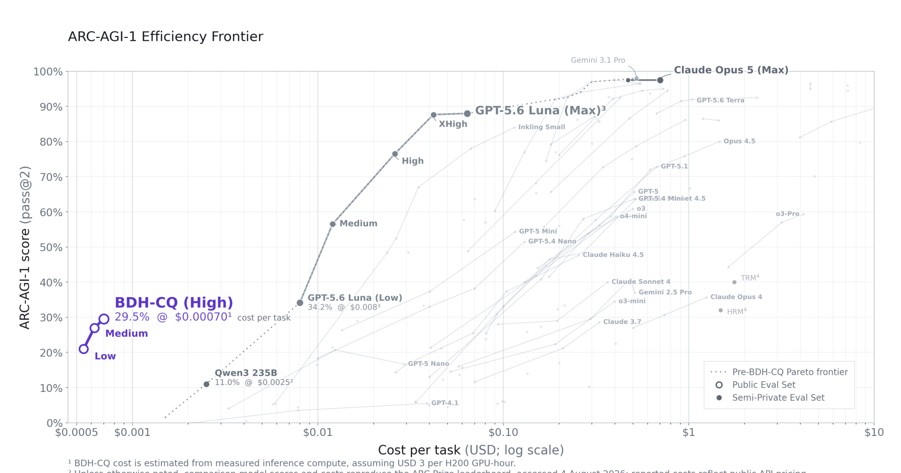
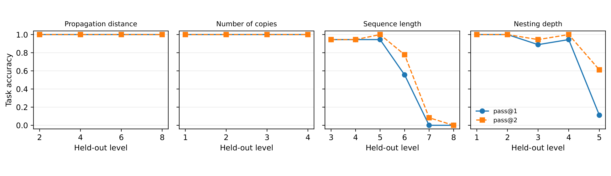

## 来源

- **PDF**：`raw/bdh-cq-2608.09888.pdf`
- **标题**：BDH-CQ: In-Context Learning with Recurrent Latent Reasoning
- **arXiv**：2608.09888v1（2026-08-10）
- **团队**：Pathway；Bielik AI；New York University
- **作者**：Björn Engdahl、Adrian Kosowski、Jan Chorowski、Zuzanna Stamirowska、Przemysław Uznański、Junlin Jiang、Rohan Phadke、Remigiusz Kinas、Richard Zhong
- **模型**：[BDH-CQ](../models/bdh-cq.md)

## 核心结论

BDH-CQ 是一个面向 ARC 彩色网格任务的 150M 参数推理系统。它把演示对按顺序写入**recurrent memory**，随后让查询在连续的 structured latent workspace 中迭代计算，只在最后解码答案；中间状态不被 verbalize 成 CoT token（原文确证，§3.2–§3.3）。这给出了一条与「生成更长 CoT」不同的 test-time compute 路线：计算增加在 latent iteration，而不是在输出 token 上。

论文在 400 个公开 ARC-AGI-1 evaluation tasks 上报告 118/400 的 pass@2（29.5%，95% Wilson 区间 25.24–34.15），并以约 0.85 H200 GPU-seconds/task、按 $3/H200-hour 计为 $0.00070/task（原文确证，§5、Table 1）。作者据 2026-08-04 的 ARC Prize leaderboard 声称该点越过此前报告的成本—准确率 Pareto frontier；这应读作**论文采用的成本口径和快照下的比较**，而非跨服务商的永久或独立复现结论（原文确证，§5、Figure 2）。

> Figure 2. ARC-AGI-1 score versus computed cost per task.（§5 / Figure 2）

## 架构与训练

### 两个随推理变化、职责不同的状态

演示对 $D_t$ 的信息写入 contextual state：

$$S_t=U_\theta(S_{t-1},D_t).$$

在读入 $K$ 个演示后，查询 $x^\star$ 初始化为 workspace，再重复 $R$ 次 latent refinement：

$$H_0=E_\theta(x^\star,S_K),\qquad H_{r+1}=F_\theta(H_r,S_K),\qquad \hat y=G_\theta(H_R).$$

$S_t$ 用来把当前任务从示例中绑定出来，$H_r$ 则承载该查询的求解计算；参数在 inference 时固定、不进行更新（原文确证，§3.2–§3.3）。论文把 $S_t$ 与 attention / fast-weight / linear-attention 的上下文关联作概念类比，但**没有公开**实际维度、具体 update rule 或完整实现，因此不能把它等同于某个已知 linear-attention kernel（原文确证，§3.2–§3.3）。

这与 [Looped Transformers](../concepts/looped-transformers.md) 共享「latent recurrence 增加内部计算」的高层思想，但不应混同：BDH-CQ 不是文中定义的 weight-tied Transformer / PLT，论文也没有公开共享 block、KV-cache、loop 并行性或每次 iteration 的硬件成本。

### 数据、训练和公开边界

150M 配置使用私有 curated ARC-style examples 与 ARC-AGI-1 train、RE-ARC、ConceptARC、ARC-Heavy、ARC-GEN100K 的混合，并做 augmentation（原文确证，§4.2）。评测任务及其 demonstration pairs 未参与训练，也不依靠 inference-time parameter update（原文确证，§1、§3.2）。但完整训练 recipe、模型尺度和 update rule 均为 proprietary；因此它是**可检查系统行为与接口、不可复现内部机制**的报告，不宜从结果反推 BDH layer 的具体设计。

## 评测要点

### 从 aggregate score 到能力侧写

公开 ARC-AGI-1 与 ConceptARC 的 headline results 如下。ConceptARC 的 semantic / opaque 两种请求方式得到几乎相同的 aggregate pass@2，降低了模型仅利用任务标识或按概念批处理上下文的解释，但不能证明所有内部搜索路径完全相同（原文确证，§5、§6.1、§6.5、Table 1）。

| 设置 | 单位 | pass@1 | pass@2 |
| --- | --- | ---: | ---: |
| ARC-AGI-1 public | 400 tasks | 24.25% | 29.50% |
| ConceptARC, semantic IDs | 160 tasks | 45.63% | 59.38% |
| ConceptARC, opaque IDs | 160 tasks | 45.00% | 60.00% |

作者进一步显示，正确的 test pair 并不总能构成一致地完成同一 task：semantic ConceptARC 的 pair pass@2 为 77.92%，strict task pass@2 为 59.38%；例如 Copy 仅 2/10 strict tasks、但有 19/30 pair 正确（原文确证，§6.1、Table 2）。这比单一 ARC 分数更有用：它把「局部输出正确」与「示例规则跨 query 一致执行」分开。

> Figure 5. Controlled generalization curves reporting exact held-out-output accuracy.（§6.2 / Figure 5）

在四组 frozen-model 控制任务中，传播距离 2–8 和 copy 数 1–4 均为 48/48；排序在长度 8 时 pass@2 为 3/24，深度 5 的 nesting 为 22/36。给与测试复杂度相同的 demonstration support 后，长度 8 排序升至 13/24、深度 5 nesting 升至 24/24（原文确证，§6.2、Figure 5、Table 3）。因此论文的积极信号不等于「通用抽象推理已解决」：它也具体定位了 ordering、深层 containment、conditional rule selection 与未在演示中出现的参数值等边界（原文确证，§6.2、Appendix A.3）。

### effort 是可调旋钮，但不是 token CoT

HIGH / MEDIUM / LOW effort 的 pass@2 分别为 29.5% / 27% / 21%，相对 HIGH 的成本降幅为 0% / 11% / 22%（原文确证，§7、Table 5）。这支持 latent iteration 可以提供可调计算预算；但论文只给出三档 aggregate 点，未公开 $R$、每档 exact compute 或模型内部的 halt / adaptive-depth rule，不能据此推出连续的 scaling law。

## 待追问

- **可复现性**：权重、完整训练配方、recurrent update 及推理 implementation 都未公开；独立 black-box audit 复现的是部署服务得分，而非从训练到部署的可复现性（原文确证，§5）。
- **跨领域性**：所有直接结果都是 ARC / ConceptARC 或 ARC-like 网格任务。语言、数学、工具使用和 ARC-AGI-2 只是作者的 future work，不是现有能力证据（原文确证，§9.1）。
- **成本可比性**：$0.00070 是 H200 计时乘固定价格的 computed cost；图中的竞争项混合了 API 价格与硬件 estimates，且 leaderboard 快照和 API 定价都会变化（原文确证，§5、Figure 2 notes）。
- **memory 的作用分离**：$S_t$（示例适配）与 $H_r$（查询求解）的接口是清晰的系统抽象，但没有 hidden-state intervention 或公开 update rule 可直接证实两者的因果分工。

## 相关页面

- [BDH-CQ](../models/bdh-cq.md) — 150M ARC 推理系统的模型事实与披露边界
- [Looped Transformers](../concepts/looped-transformers.md) — 与 recurrent latent computation 的相邻谱系，以及不应与 PLT 混同的边界
