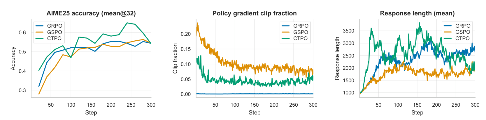

# Cumulative Token Policy Optimization（CTPO）

## 来源

- 文件：`raw/2605.07331v1.pdf`
- 标题：Rethinking Importance Sampling in LLM Policy Optimization: A Cumulative Token Perspective
- 团队 / 日期：Yuheng Zhang、Chenlu Ye、Shuowei Jin、Changlong Yu、Wei Xiong、Saurabh Sahu、Nan Jiang；UIUC + University of Michigan + Amazon；arXiv:2605.07331v1，2026-05-08；Preprint
- arXiv：<https://arxiv.org/abs/2605.07331>
- 代码：<https://github.com/horizon-llm/CTPO>（VERL 分支，含 TIR 多轮 rollout 与本地 Python sandbox）
- 定位：LLM RL policy optimization 方法论文，不发布独立模型。实验在 tool-integrated reasoning（TIR）数学推理上，backbone 是现成的 Qwen3-4B / Qwen3-14B。

## 核心结论

1. **把 IS ratio 的粒度问题写成 bias–variance 三角**：token-level ratio（GRPO）丢掉 prefix 修正、有偏但低方差；full sequence ratio 无偏但方差高；GSPO 的长度归一化 sequence ratio 数值上稳，但作为 IS 修正**仍有偏**（§2.1–§2.2、Table 1）。
2. **累积 token ratio 是中间解**：$\rho^{\mathrm{cum}}_t=\prod_{t'=1}^{t} r_{t'}$。Proposition 1 证明在 token-level policy-gradient 形式下它对每个梯度项给出无偏的 prefix 修正；Proposition 2 证明其方差严格小于 full sequence ratio——suffix 部分 $\epsilon_t$ 在行为策略下条件期望为 1，只加方差不减偏差（§3.1–§3.2）。
3. **固定 clip 与累积 ratio 不匹配**：$\mathrm{Var}(\log\rho^{\mathrm{cum}}_t)=t\sigma^2$ 随位置线性增长，固定区间会让早 token 几乎不被 clip、晚 token 被 clip 到约 20%；因此把 log-space clip 阈值按 $t^p$ 缩放，$p=0.5$ 即 $\sqrt t$（§3.3、Figure 1）。
4. **实验只在 TIR 数学上**：Qwen3-4B / 14B 上 CTPO 平均 51.4 / 58.8，高于 GSPO 的 47.7 / 55.5 与 GRPO 的 43.2 / 54.6；position-adaptive clipping 消融 +3.1（Table 2、Table 3）。
5. **它不换 advantage**：与 GRPO 一样不训 critic，用 outcome-level group-relative reward 广播到整条 response 的所有 token；改的只是 ratio 单元与 clip 形状（§3.3）。

## 方法：prefix 连乘的 IS ratio 加按位置放大的 trust region

在 token-level MDP 下，off-policy 梯度需要 $\rho_t$ 修正 $\pi_b$ 与 $\pi_\theta$ 的分布差。对状态—动作对 $(s_t,a_t)$，正确的 IS 权重是到达 $s_t$ 并采出 $a_t$ 的概率比；转移是确定性的，所以它等于 prefix 轨迹似然比：

$$
\rho^{\mathrm{cum}}_t=\frac{\pi_\theta(a_{1:t}\mid x)}{\pi_b(a_{1:t}\mid x)}=\prod_{t'=1}^{t}\frac{\pi_\theta(a_{t'}\mid s_{t'})}{\pi_b(a_{t'}\mid s_{t'})}=\prod_{t'=1}^{t} r_{t'}.
$$

GRPO 只用 $r_t$，等于丢掉 $\prod_{t'<t} r_{t'}$ 这段 prefix 修正（§2.1）。full sequence ratio 则多乘了 suffix $\epsilon_t=\prod_{t'>t} r_{t'}$；由 likelihood ratio 恒等式 $E_{\pi_b}[\epsilon_t\mid s_t,a_t]=1$，这段不修正任何偏差，只把方差乘进去（§3.2）。GSPO 的 $\left(\prod_t r_t\right)^{1/H}$ 是 per-token ratio 的几何平均，尺度小、数值稳，但不再等于任何精确 IS 修正（§2.2）。

| 方法 | IS ratio | 无偏 | 方差 |
| --- | --- | --- | --- |
| GRPO | $r_t$ | ✗ | 低 |
| Full sequence ratio | $\prod_{t'=1}^{H} r_{t'}$ | ✓ | 高 |
| GSPO（length-normalized） | $\left(\prod_{t'=1}^{H} r_{t'}\right)^{1/H}$ | ✗ | 尺度缩小 |
| CTPO（本文） | $\prod_{t'=1}^{t} r_{t'}$ | ✓ | 低于 full sequence |

（Table 1 改排；原表见 §3.2。）

Proposition 2 的定量部分在 per-token ratio 独立的假设下给出 $\mathrm{Var}(\rho^{\mathrm{cum}}_t)=\prod_{t'\le t}(1+\chi^2_{t'})-1$ 与对应的 full sequence 式；两者之比在所有位置共享 $\chi^2=\delta$ 时为 $(1+\delta)^{H-t}$。近 on-policy（$\delta\to0$）时比值趋于 $H/t$，即早位置获益最大；off-policy 程度加深时比值随剩余长度 $H-t$ 指数增长，因此论文主张累积 ratio 尤其适合长生成（§3.2）。Part (i) 的严格不等式不需要分布假设。

clipping 部分：$\log\rho^{\mathrm{cum}}_t=\sum_{t'\le t}\log r_{t'}$ 是独立项之和，方差随 $t$ 线性增长，故 trust region 定义为

$$
\varepsilon^{\mathrm{high}}(t)=\varepsilon^{\mathrm{high}}\cdot t^{p},\quad \varepsilon^{\mathrm{low}}(t)=\varepsilon^{\mathrm{low}}\cdot t^{p},\quad \rho^{\mathrm{cum}}_t\in\left[e^{-\varepsilon^{\mathrm{low}}(t)},\,e^{\varepsilon^{\mathrm{high}}(t)}\right],
$$

主实验取 $\varepsilon^{\mathrm{low}}=0.025$、$\varepsilon^{\mathrm{high}}=0.05$、$p=0.5$（§3.3、§4.1）。最终目标与 GRPO 同形，只是把 $r_{i,t}$ 换成 $\rho^{\mathrm{cum}}_{i,t}$、把固定 clip 换成位置自适应 clip，advantage 仍是整条 response 的 group-relative 标量 $A_i$：

$$
J_{\mathrm{CTPO}}(\theta)=\mathbb{E}\left[\frac{1}{G}\sum_{i=1}^{G}\frac{1}{|o_i|}\sum_{t=1}^{|o_i|}\min\left(\rho^{\mathrm{cum}}_{i,t}A_i,\ \mathrm{clip}\left(\rho^{\mathrm{cum}}_{i,t},\,e^{-\varepsilon^{\mathrm{low}}(t)},\,e^{\varepsilon^{\mathrm{high}}(t)}\right)A_i\right)\right].
$$

## 实验信号

![CTPO Figure 1：上排为 step 50/100/150 上 log ρ^cum_t 的经验标准差随 token 位置 t 的变化，与拟合曲线 σ̂√t 吻合（σ̂=0.0335/0.0387/0.0393），并画 ±20% 带；下排为同一批 step 上 fixed clip（ratio∈[0.5,5]）与 adaptive clip 的逐位置 clip rate——fixed 从近 0% 单调升到约 20%，adaptive 维持在约 5–10%。](../assets/cumulative-token-policy-optimization/variance-growth-and-clip-rate.png)

> Figure 1: Analysis of $\log\rho^{\mathrm{cum}}_t$ across training steps 50, 100, and 150. Top row: Empirical standard deviation of $\log\rho^{\mathrm{cum}}_t$ vs. token position $t$, fitted with $\hat\sigma\sqrt t$, confirming the log-space variance growth discussed in Section 3.3. Bottom row: Clip rate vs. position under fixed clipping (ratio $\in[0.5,5]$) and adaptive clipping.（§4.3）

设置：TIR 中模型迭代生成 Python 代码并在 sandbox 解释器执行，每条轨迹最多 5 轮交互、最长 8,000 token；训练集 DeepScaleR 约 40K 数学题；评测 AIME 2025 / AIME 2026 / HMMT 2025 / BRUMO 2025，均报 avg@32。prompt batch 512、每 prompt 8 条 response、lr 1e-6，VERL 实现，单节点 8×H100 或 H200；三种方法除 ratio / clip 外配置完全相同（§4.1）。

| Base | 方法 | AIME 25 | AIME 26 | BRUMO 25 | HMMT 25 | Avg |
| --- | --- | ---: | ---: | ---: | ---: | ---: |
| Qwen3-4B | Base | 1.9 | 3.4 | 6.3 | 4.1 | 3.9 |
| | GRPO | 43.0 | 44.1 | 53.1 | 32.6 | 43.2 |
| | GSPO | 49.2 | 47.6 | 56.8 | 37.0 | 47.7 |
| | CTPO | **53.5** | **52.1** | **59.7** | **40.4** | **51.4** |
| Qwen3-14B | Base | 4.3 | 6.9 | 7.0 | 6.0 | 6.1 |
| | GRPO | 55.3 | 49.8 | 61.9 | 51.5 | 54.6 |
| | GSPO | 56.4 | 56.1 | **63.3** | 46.0 | 55.5 |
| | CTPO | **65.0** | **59.1** | 63.0 | 48.0 | **58.8** |

（Table 2 改排，avg@32。）4B 上 CTPO 四项全胜；14B 上平均优势主要来自 AIME 两项（+8.6 / +3.0），BRUMO 25 略低于 GSPO（63.0 vs 63.3）、HMMT 25 介于 GRPO 与 GSPO 之间（48.0 vs 51.5 / 46.0）。因此「两种规模一致增益」是**平均口径**的陈述，不是逐 benchmark 的陈述。

| 方法 | AIME 25 | AIME 26 | BRUMO 25 | HMMT 25 | Avg |
| --- | ---: | ---: | ---: | ---: | ---: |
| CTPO w/ fixed clip | 55.5 | 57.5 | 62.6 | 47.1 | 55.7 |
| CTPO（本文） | 65.0 | 59.1 | 63.0 | 48.0 | 58.8 |

（Table 3 改排，Qwen3-14B。）注意 fixed clip 对照是 **CTPO 内部**把 position-adaptive 换成固定区间的版本，不是 GRPO；Figure 1 下排的 fixed clip 区间是 $[0.5,5]$，主实验 GRPO 自己的 clip 超参论文未给。

> Figure 2: Training dynamics of GRPO, GSPO, and CTPO. Left: AIME 2025 accuracy (avg@32) throughout training. Middle: Policy gradient clip fraction, measured as the fraction of tokens whose method-specific IS ratio exceeds the corresponding clipping threshold. Right: Mean response length throughout training.（§4.5）

论文称三者 response length growth 相似（§4.5）；但 Figure 2 右图里 CTPO 在前约 200 步的长度明显高于 GSPO、末段回落，GSPO 则全程更平。这一句与图的读法有张力，属本页对图的观察，不是原文主张。

## 与现有 wiki 页的关系

- [Group Sequence Policy Optimization](group-sequence-policy-optimization.md)：同一 ratio 单元轴上的直接对手。GSPO 的动机是 reward 单元对齐与 MoE routing volatility，用长度归一化换数值稳定并接受 IS 偏差；CTPO 的动机是 token-level MDP 的时间结构，用 prefix 连乘同时拿无偏与低方差，并在 Table 1 里把 GSPO 标为有偏。两篇都没有对方方法的同预算对照，CTPO 的 GSPO 基线是 dense Qwen3 上的 TIR 复现，不是 Qwen3-30B-A3B 的 MoE 场景。
- [Soft Adaptive Policy Optimization](soft-adaptive-policy-optimization.md)：SAPO 改的是 trust region 的**形状**（hard clip → soft gate），CTPO 改的是 trust region 的**宽度随位置的变化**；两者都批评固定 clip，但机制不同，论文未互相比较。
- [DAPO](dapo.md) / [DeepSeekMath](deepseekmath.md)：CTPO 保留 GRPO 的 group-relative outcome advantage 与无 critic 结构，只替换 ratio 与 clip；DAPO 的 recipe 四件套与 CTPO 正交，论文未组合。
- [训练—rollout 一致性](../concepts/train-rollout-consistency.md) / [Ring-1T](ring-1t.md) 的 IcePop / [Miles v0.1](miles-v0-1.md) 的 TIS：那些修正的是**训练引擎与推理引擎**概率失配（$\pi_{\mathrm{train}}$ vs $\pi_{\mathrm{infer}}$）；CTPO 的 $\rho^{\mathrm{cum}}$ 修正的是**算法内** $\pi_\theta$ vs $\pi_{\theta_{\mathrm{old}}}$ 的多步复用 off-policy。两层 ratio 来源不同，不要合并叙述。
- [LLM RL policy optimization 对比](../comparisons/llm-rl-policy-optimization.md)：本页归入 importance ratio / clipping 单元层，是 GSPO「sequence-level 派」与 GRPO「token-level 派」之外的第三种粒度——prefix-cumulative。

## 待追问

- Proposition 2 (ii) 的 per-token ratio 独立假设与真实序列不符（同一 response 内 log-ratio 强相关）；Figure 1 的 $\hat\sigma\sqrt t$ 拟合是经验支持，但 $\hat\sigma$ 从 step 50 的 0.0335 漂到 step 150 的 0.0393，$\sqrt t$ 律在长训练里是否仍成立没有更长程的曲线。
- 无 MoE 实验。GSPO 的核心动机是 expert routing volatility 让 token ratio 失真；累积连乘对 routing 抖动是更敏感还是更钝，本文没有回答，而 Table 1 的「GSPO 有偏」论断与 GSPO 的 MoE 稳定性论断并不在同一评测面上。
- TIR 轨迹含环境返回的代码执行输出。这些非策略生成 token 是否计入 $\rho^{\mathrm{cum}}$ 的连乘、clip 是否作用其上，正文与附录都未说明；5 轮交互下 prefix 跨 turn 累积的语义需要看代码实现确认。
- advantage 仍是 outcome-level 标量广播到全 token；Proposition 1 的无偏是「给定任意 token-level advantage 函数时 ratio 无偏」，不是 credit assignment 无偏。与 [GiGPO](gigpo.md) / [HGPO](hierarchy-of-groups-policy-optimization.md) 的 step-level advantage 是否可组合，没有实验。
- 只有 Qwen3-4B / 14B 两个 dense 规模、单一 TIR 任务、未报训练 seed 数与方差；avg@32 是评测采样口径。14B 的 BRUMO / HMMT 单项不占优说明平均增益的稳健性边界仍窄。
- position-adaptive clipping 的 $p$ 与 $\varepsilon$ 基值只在 TIR 上标定为 $p=0.5$、$(0.025,0.05)$；$p\ne0.5$ 的敏感性没有消融。

## 相关页面

- 比较：[LLM RL policy optimization 对比](../comparisons/llm-rl-policy-optimization.md)
- 相邻算法：[Group Sequence Policy Optimization](group-sequence-policy-optimization.md)、[Soft Adaptive Policy Optimization](soft-adaptive-policy-optimization.md)、[DAPO](dapo.md)、[DeepSeekMath](deepseekmath.md)（GRPO 一手出处）
- 概念：[Agentic 模型的后训练](../concepts/post-training-for-agentic-models.md)、[训练—rollout 一致性](../concepts/train-rollout-consistency.md)
