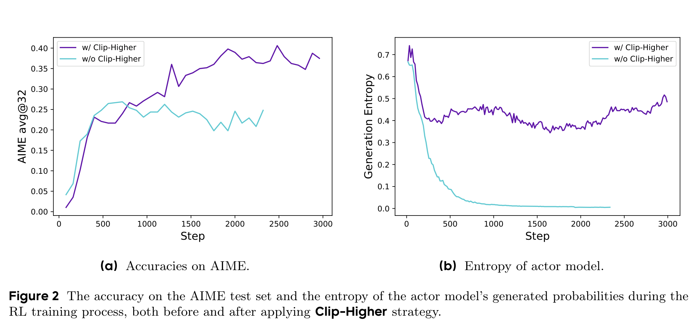
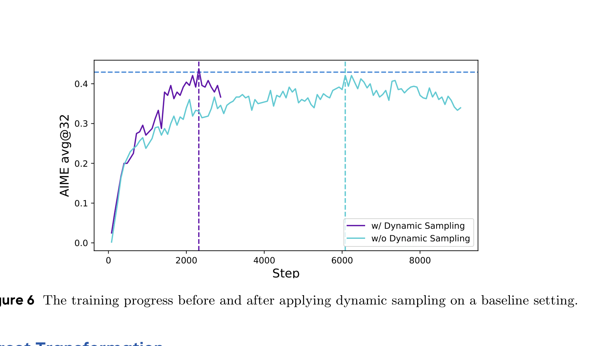
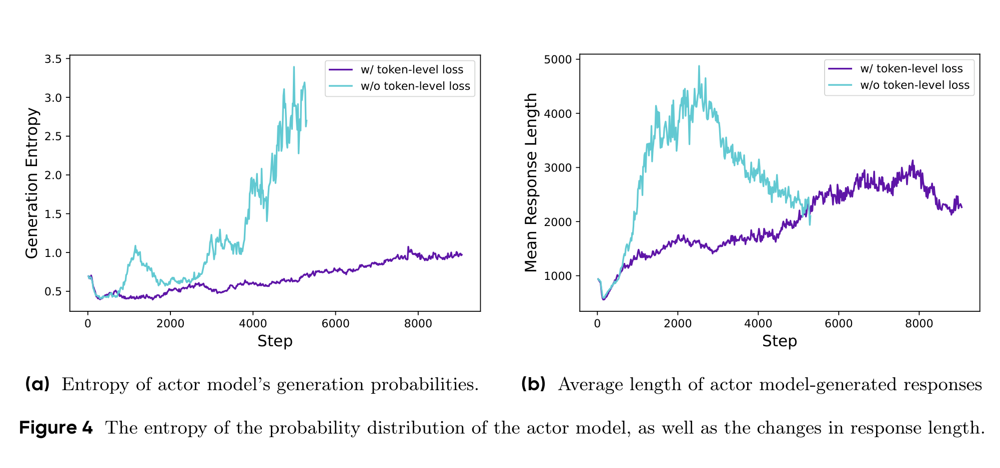
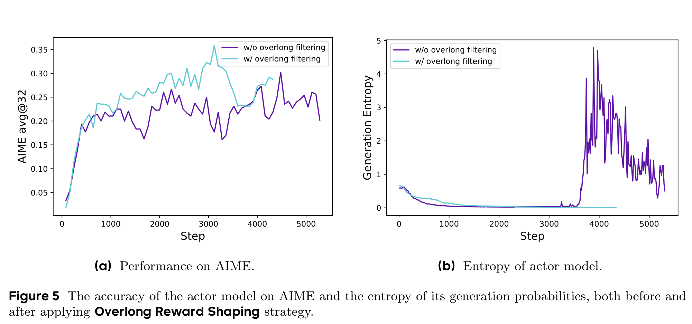
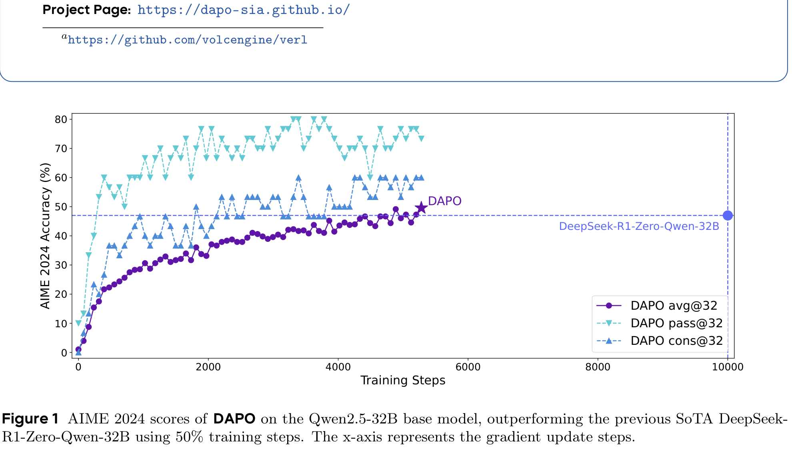

# DAPO：An Open-Source LLM Reinforcement Learning System at Scale

## 来源

- 文件：`raw/Yu 等 - 2025 - DAPO An open-source LLM reinforcement learning system at scale.pdf`
- 标题：DAPO: An Open-Source LLM Reinforcement Learning System at Scale
- 团队 / 日期：ByteDance Seed、清华 AIR、香港大学等；Date: 2025-03-17；arXiv:2503.14476v2，2025-05-20
- 项目页：<https://dapo-sia.github.io/>
- 代码 / 系统：基于 [verl](https://github.com/volcengine/verl) 开源 RL 训练系统
- 定位：这是 LLM reasoning RL 的算法 + 系统 + 数据 recipe 论文，不是新模型技术报告；主要实验模型是 Qwen2.5-32B base。

## 核心结论

1. **DAPO 是从 naive GRPO 补齐大规模 long-CoT RL recipe**：论文说初始 GRPO 在 Qwen2.5-32B 上只能到 AIME 30 分，DAPO 加四类关键技术后到 50 分，超过 DeepSeek-R1-Zero-Qwen-32B 的 47 分，且只用 50% training steps（Figure 1、Table 1）。
2. **四个关键技术**：Clip-Higher 防 entropy collapse；Dynamic Sampling 过滤全对/全错 prompt 保证有效梯度；Token-Level Policy Gradient Loss 避免长序列 token 被 sample-level 平均稀释；Overlong Reward Shaping 减少截断样本的 reward noise（§3.1–§3.4）。
3. **DAPO 仍是 GRPO 家族**：它仍用 group reward normalization 与 clipped objective，只是把 clip 上下界解耦、动态构造有效 batch、把 loss reduction 从 sample-level 改成 token-level，并改 reward shaping。
4. **数据工程是算法的一部分**：DAPO-Math-17K 把数学题答案转成易解析的整数，降低 rule-based reward 的 parser 错误；这不是纯 loss 改动，而是「数据可验证性 + 训练 recipe」的系统工程（§3.5）。
5. **边界**：DAPO 主实验是数学 reasoning，非多轮工具 agent；它可作为 [ARPO](agentic-reinforced-policy-optimization.md) 的 trajectory-level RL baseline，也可作为 [LLM RL policy optimization 对比](../comparisons/llm-rl-policy-optimization.md) 里的「可复现 GRPO recipe」一环。

## DAPO 的四个改动

### 1. Clip-Higher：只放宽上界，保护探索 token

naive PPO / GRPO 里 clip 通常对称，例如 $\epsilon=0.2$。DAPO 认为上界会过度限制低概率「探索 token」被提高概率：如果旧概率是 0.01，上界 1.2 只能推到 0.012；高概率 token 则几乎不受影响。于是 DAPO 把下界和上界解耦为 $\epsilon_{low}$、$\epsilon_{high}$，并提高 $\epsilon_{high}$，让正 advantage 的低概率 token 有更多上升空间。

> 论文 Figure 2 原文标题："The accuracy on the AIME test set and the entropy of the actor model’s generated probabilities during the RL training process, both before and after applying Clip-Higher strategy."（§3.1）

### 2. Dynamic Sampling：只训练有相对 advantage 的 prompt

GRPO 对同一个 prompt 采 $G$ 个 responses。如果全对或全错，组内 reward 方差为 0，advantage 也为 0，这个 prompt 对 policy gradient 没有效贡献。DAPO 因此过采样并过滤掉 `accuracy = 1` 和 `accuracy = 0` 的 prompt，直到 batch 里装满「既有对也有错」的样本，保持有效梯度数量稳定。

这不是简单地「挑难题」：它是训练时动态过滤当下 policy 已经全会或完全不会的 prompt，避免 batch 里有效样本越来越少。Figure 6 显示，虽然采样实例更多，收敛所需训练 step 更少，总体训练时间没有显著变差。

> 论文 Figure 6 原文标题："The training progress before and after applying dynamic sampling on a baseline setting."（§3.2 / §4.2）

### 3. Token-Level Policy Gradient Loss：长 CoT 不能按样本平均

原 GRPO 先对每条 response 内 token loss 求平均，再对样本求平均，因此每条 response 权重相同。DAPO 指出 long-CoT RL 中这会让长 response 的单个 token 贡献被稀释：高质量长推理学不到，低质量超长输出也不容易被压制。DAPO 改成 token-level loss，所有 token 在总 token 池里平均，长序列自然有更多梯度权重。

论文 Figure 4 显示，启用 token-level loss 后 generation entropy 与 response length 更健康；不开启时 entropy 和长度会非理性升高。

> 论文 Figure 4 原文标题："The entropy of the probability distribution of the actor model, as well as the changes in response length."（§3.3）

### 4. Overlong Reward Shaping：截断不等于推理错

默认把被截断的 overlong sample 直接给惩罚，会把「推理本身可能正确但太长」和「答案错误」混在一起，形成 reward noise。DAPO 先实验 Overlong Filtering（mask 掉截断样本 loss），发现训练明显稳定；随后提出 Soft Overlong Punishment：在 $L_{max}-L_{cache}$ 到 $L_{max}$ 之间按长度线性惩罚，超过 $L_{max}$ 给 −1。

> 论文 Figure 5 原文标题："The accuracy of the actor model on AIME and the entropy of its generation probabilities, both before and after applying Overlong Reward Shaping strategy."（§3.4）

## 结果与训练设置

> 论文 Figure 1 原文标题："AIME 2024 scores of DAPO on the Qwen2.5-32B base model, outperforming the previous SoTA DeepSeek-R1-Zero-Qwen-32B using 50% training steps."（摘要图）

训练设置（§4.1）：Qwen2.5-32B base；AdamW，LR 1e-6，20 rollout steps warmup；prompt batch 512，每 prompt 采 16 responses；mini-batch 512，每 rollout step 16 次 gradient updates；最大生成 20,480 tokens，其中 expected maximum length 16,384，soft punish cache 4,096；Clip-Higher 设 $\epsilon_{low}=0.2$、$\epsilon_{high}=0.28$；AIME 评测重复 32 次，temperature 1.0、top-p 0.7。

Table 1 的 progressive ablation：

| 配方 | AIME24 avg@32 |
| --- | ---: |
| DeepSeek-R1-Zero-Qwen-32B | 47 |
| Naive GRPO | 30 |
| + Overlong Filtering | 36 |
| + Clip-Higher | 38 |
| + Soft Overlong Punishment | 41 |
| + Token-level Loss | 42 |
| + Dynamic Sampling（DAPO） | **50** |

## 与其他页面的关系

- [LLM RL policy optimization 对比](../comparisons/llm-rl-policy-optimization.md)：DAPO 是「工程 recipe 派」——仍在 GRPO/token-level clipped objective 上做可靠性补丁。
- [Agentic Reinforced Policy Optimization](agentic-reinforced-policy-optimization.md)：ARPO 的 Table 1 把 DAPO 当 trajectory-level RL baseline；DAPO 解决 long-CoT 数学 RL，ARPO 解决多轮工具 agent 的 step-level exploration。
- [Qwen3 技术报告](qwen3.md)：Qwen3 报告后训练 Stage 2 仍写 GRPO；DAPO 是 Qwen2.5-32B 上的外部开源 RL recipe，不能回写成 Qwen3 官方方法。

## 待追问

- DAPO 的四个技巧里，哪些是 long-CoT 数学任务特有，哪些能直接迁移到 coding / search / multimodal agent RL？
- Dynamic Sampling 过滤全错 prompt 会不会拖慢「从完全不会到会一点」的 early learning？论文强调有效梯度，但没有系统讨论 curriculum 边界。
- Token-level loss 让长 response 权重大，配合 overlong shaping 才稳定；如果 reward 不可靠，会不会反过来放大长垃圾序列的梯度？
- DAPO-Math-17K 的整数化改题是否改变了原题分布，尤其对可解释答案/证明型题目的泛化如何？

## 相关页面

- 比较：[LLM RL policy optimization 对比](../comparisons/llm-rl-policy-optimization.md)
- 相邻算法：[Agentic Reinforced Policy Optimization](agentic-reinforced-policy-optimization.md)、[Group Sequence Policy Optimization](group-sequence-policy-optimization.md)、[Soft Adaptive Policy Optimization](soft-adaptive-policy-optimization.md)
- 概念：[Agentic 模型的后训练](../concepts/post-training-for-agentic-models.md)
