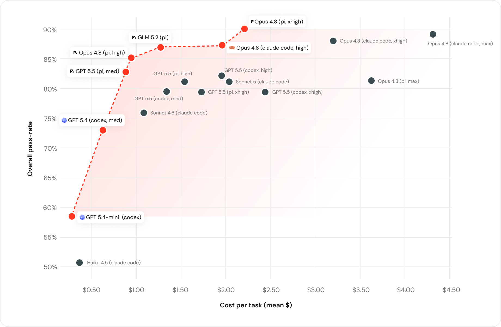
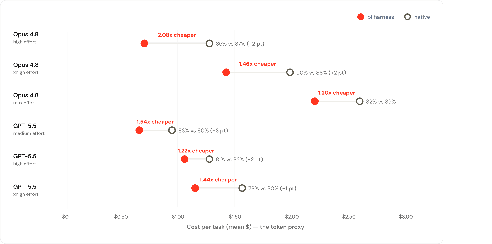

# Databricks coding agent 内部评测博客

## 来源

- 本地快照：[`raw/databricks-benchmarking-coding-agents-2026-07-08.md`](../../raw/databricks-benchmarking-coding-agents-2026-07-08.md)（`raw/` 已 git-ignored）
- 原文：[Benchmarking Coding Agents on Databricks’ Multi-Million Line Codebase](https://www.databricks.com/blog/benchmarking-coding-agents-databricks-multi-million-line-codebase)
- 团队：Databricks；同日 CTO Matei Zaharia 发 [X 线程](https://x.com/matei_zaharia/status/2074943612631273730)
- 发表：2026-07-08
- 这是**内部、不可复现**的公司基准，按本 wiki 证据规则属于**外部佐证**（相对 [Pi 设计博客](pi-coding-agent.md)），不能升级成 Pi 原文确证。

## 核心结论

1. **Pareto 前沿上同时有 OpenAI、Anthropic 和开源。** 作者明确写：今天只有工具组合才能覆盖前沿（原文确证，结论 1 / Figure 1）。
2. **GLM 5.2 进了最高能力档。** 质量与 Opus 4.8「统计上打平」，$1.28/task vs Opus $1.94（原文确证，§ Open models）。
3. **看 token 单价会误判任务成本。** Sonnet 5 每 token 比 Opus 4.8 便宜约 1.7×，但任务成本 $2.09 vs $1.94，通过率 81% vs 87%；因为 Sonnet 干得更久、读得更多，token 用量 1.9×（原文确证，§ Price-per-task）。
4. **同一模型换 harness，成本可以差到 2× 以上，质量接近。** 对照是 Claude Code / Codex vs [Pi](pi-coding-agent.md)。作者把主因写成每轮喂给模型的 context 量：Pi 大约少送 **3×**，工作集更紧、完成轮次更少（原文确证，§ Harnesses）。Matei 线程复述：Opus 和 GPT-5.5 上 Pi 成功率与厂商 harness 相当、成本约一半。

这正好补 [Pi 页](pi-coding-agent.md) 的待追问：Mario 自己的 Terminal-Bench 2.0 是 mixed-model 榜；这里是 **同模型、同 thinking effort、换膜**。

> Figure 1: Cost vs. Performance on our benchmark（来源：[Databricks 博客](https://www.databricks.com/blog/benchmarking-coding-agents-databricks-multi-million-line-codebase)）。

## 评测要点

任务来自 Databricks 工程师真实合并 PR，改的是百万行级、多语言（Scala / Go / Rust / Java / Python / TS、Bazel、Protobuf）仓库。作者说 SWE-Bench / Terminal-Bench 对这个代码库不代表性，且公开题会进训练数据。

构造过滤器：新近、人类写的（去掉 bot / 全 AI / 自动生成）、带高质量测试、改动限制在少数模块、覆盖全栈。Prompt 从 PR 意图改写，**去掉解法描述**。Agent 自称完成后才 checkpoint，再补上 held-out 测试跑；**不用 LLM judge**。早期发现 agent 能从 git history 把已合并实现走出来，于是运行期间切断工作副本与仓库历史。

Harness 用「工程师会碰到的标准开箱配置」。任务复杂度日志：约 1/4 低、约 60% 中。

同模型成对（图中可见标签；native = Claude Code 对 Opus、Codex 对 GPT-5.5）：

> 博客配图：「Harness impact on efficiency」；横轴是 mean $/task 的 token proxy（来源：同上）。

读法：

- **xhigh Opus 是 Pi 最好的一点：** 90% vs Claude Code 88%（+2），成本 1.46× 更低。
- **max Opus 质量掉下来：** 82% vs 89%（−7），只便宜 1.20×。不能写成「Pi 在所有 effort 档都质量不掉」。
- GPT-5.5 三档成本都更低，通过率 ±3 分以内。
- 图注写明成本是 **token proxy**，不是订阅账单。

作者自己的限定：这不是全面基准，只是他们代码库上的样本；「不是某一个 harness 永远更便宜」。后续产品叙述（Omnigent、Unity Gateway 路由）是动机，不是本评测结果。

## 待追问

- 任务数、每格重复次数、置信区间正文没给；「统计打平」只有 GLM vs Opus 那一句。
- 「每轮 3× 更少 context」和「更少 runs」没有拆开的因果消融。
- 开箱配置是否包含 Databricks 内部工具/MCP，Pi 的四工具核心还剩多少，未披露。
- git history 封印之后，还有没有别的 shortcut（issue 链接、内部文档）？

## 相关页面

- [Pi coding agent 设计博客](pi-coding-agent.md)
- [SoL-Pi 官方博客](sol-pi.md)
- [EdgeBench 技术报告](edgebench.md)
- [Agent harness](../concepts/agent-harness.md)
- [Agentic 评测体系](../concepts/agentic-evaluation-benchmarks.md)
- [GLM-5](../models/glm-5.md)（文中 GLM 5.2 日常 coding 档；本 wiki 有 GLM-5 报告，没有单独的 5.2 技术报告）
