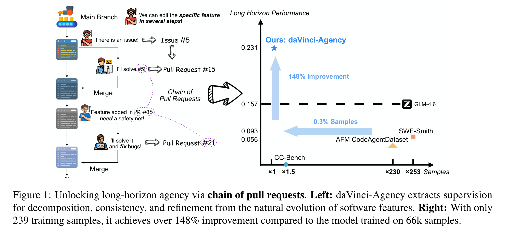
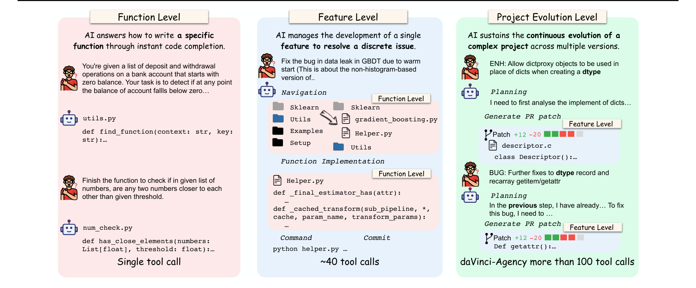
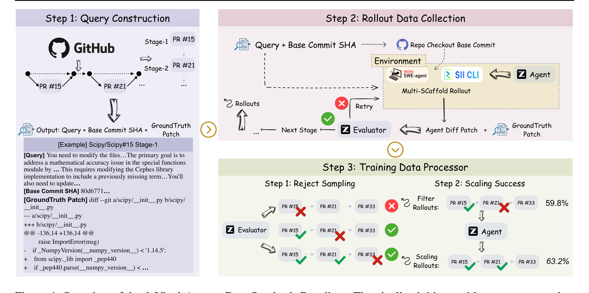
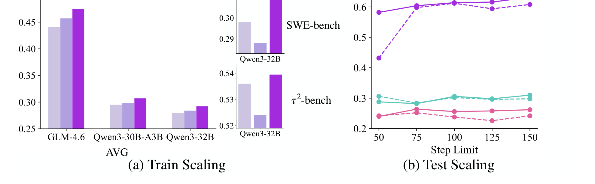

# daVinci-Agency: Unlocking Long-Horizon Agency Data-Efficiently

## 来源

- **PDF**：`raw/2602.02619v2.pdf`
- **标题**：daVinci-Agency: Unlocking Long-Horizon Agency Data-Efficiently
- **版本/日期**：arXiv:2602.02619v2, 2026-02-04
- **团队**：Mohan Jiang, Dayuan Fu, Junhao Shi, Ji Zeng, Weiye Si, Keyu Li, Xuefeng Li, Yang Xiao, Wenjie Li, Dequan Wang, Pengfei Liu（†）（SII / SJTU / PolyU / GAIR）
- **开源**：Code, Models, Datasets
- **arXiv**：[2602.02619](https://arxiv.org/abs/2602.02619)

## 核心结论

daVinci-Agency 的核心洞察是：**真实软件仓库中的 Pull Request 序列天然编码了长周期 agent 学习所需的监督信号**——它把复杂目标分解为可验证的提交单元（progressive task decomposition），跨迭代保持功能一致（long-term consistency），并通过 bug-fix 历史记录真实的修正模式（verifiable refinement）。现有合成方法要么受限于模型分布的单特征场景，要么人工标注成本过高，无法提供可扩展的高质量监督。

基于此，daVinci-Agency 从 chain-of-PRs 中系统性提取结构化监督，产出的轨迹平均 85k tokens、116 次工具调用。**仅用 239 个样本 SFT GLM-4.6**，即在多个 benchmark 上全面超过用大一到两个数量级数据训练的基线，其中 Toolathlon 相对提升 47%（0.157 → 0.231）。

> Figure 1: Unlocking long-horizon agency via chain of pull requests. Left: daVinci-Agency extracts supervision for decomposition, consistency, and refinement from the natural evolution of software features. Right: With only 239 training samples, it achieves over 148% improvement compared to the model trained on 66k samples.（§ 1 Introduction）

## 架构与训练

### 三层软件工程视野

daVinci-Agency 将软件工程 agent 的任务范围分为三层，每层的交互复杂度和工具调用数递增：

| 层级 | 任务范围 | 工具调用数 | 典型示例 |
| --- | --- | --- | --- |
| Function Level | 单个函数实现（代码补全） | 单次工具调用 | 「写一个检测银行余额是否跌破零的函数」 |
| Feature Level | 单个 feature / bug fix 的端到端开发 | ~40 | 「修复 GBDT warm start 导致的数据泄露 bug」 |
| Project Evolution Level | 跨多个版本的持续项目演化 | >100 | daVinci-Agency 的 chain-of-PRs 场景 |

> Figure 2: Comparison of scope across software engineering horizons. While function level and feature level focus on isolated algorithms or single-feature resolutions, project evolution level demands that agents handle the continuous evolutionary lifecycle of a project.（§ 3.2）

现有 SWE-bench / SWE-Smith 等数据集停留在 Feature Level；daVinci-Agency 是首个系统性建模 Project Evolution Level 的数据合成范式。

### PR 链形式化

单个 PR 定义为 $\text{pr} = (x, \hat{p})$，其中 $x$ 是 PR 的元数据（标题、描述、评论），$\hat{p}$ 是 ground-truth patch。PR 链 $C = \text{pr}_1, \text{pr}_2, \ldots, \text{pr}_k$ 满足依赖拓扑：$\text{pr}_i \xrightarrow{\text{ref}} \text{pr}_{i-1}$，即后一个 PR 在前一个的基础上迭代、修复或扩展。这与时间顺序排列不同——时间相邻的 PR 不一定有语义依赖，而 daVinci-Agency 只保留有显式 `ref` 关系的链。

轨迹形式化为 $\tau = (o_0, m_0, t_0), (o_1, m_1, t_1), \ldots, (o_N, m_N, t_N)$，其中 $o$ 是 observation、$m$ 是 model thought、$t$ 是 tool call。训练目标（式 3）是负对数似然：

$$\mathcal{L}(\theta) = -\mathbb{E}_{(C, q, \tau) \sim \mathcal{D}_{\text{train}}} \sum_{t=0}^{T} \log \pi_\theta(a_t \mid C, q, o_{\le t}, a_{<t})$$

注意 $C$（整条 PR 链）作为条件出现在策略中——这是与单 PR SFT 的关键区别，模型从一开始就看到全局目标与结构分解。

### 数据来源

人工挑选 9 个 GitHub 仓库（§ 4.1，Table 4），三条标准：(1) 规模与成熟度（>7000 effective PRs）；(2) 社区交互频率（高频 code review 提供自然语言推理信号）；(3) 语言多样性（Python / Java / C / Rust 等）。最终从 61810 个 PR 中构造 1762 个 task query。

| 仓库 | PR 数 | Query 数 |
| --- | --- | --- |
| cloudquery/cloudquery | 9705 | 490 |
| apache/pulsar | 9803 | 228 |
| scipy/scipy | 9511 | 238 |
| astral-sh/ruff | 8115 | 180 |
| PrefectHQ/prefect | 8433 | 215 |
| numpy/numpy | 9355 | 354 |
| microsoft/autogen | 1467 | 18 |
| ivy-llc/ivy | 4160 | 9 |
| tursodatabase/libsql | 1261 | 30 |

### 数据构造 pipeline

Pipeline 分三步（§ 4.2–4.3）：

**Step 1: Query Construction。** 用 GitHub API 元数据构建 PR 链后，用 LLM 为每个 PR 合成一个 sub-query。设计约束：sub-query 必须阐释当前步骤要解决的核心问题和推理链，但**故意隐去具体实现细节**（不出现字面函数名/类名/变量名），迫使 agent 在 rollout 中自行做代码导航和定位。同时，初始 query 携带整条 PR 链的全局概览，确保 agent 从一开始就理解长周期任务的全局目标与结构分解。

**Step 2: Rollout Data Collection。** 构建可复现的增量开发环境：checkout base commit SHA，agent（GLM-4.6）用两套 scaffold（SII-CLI + mini SWE-agent）做 rollout，产出 diff patch。关键机制是**跨 stage 状态传递**——stage $t$ 的初始状态是 base commit 叠加前序轨迹的 patch：$S^{(t)}_{\text{init}} = B_t \oplus \Delta\tau_{t-1}$（式 4）。这模拟了真实增量开发：前一个 PR 的修改影响后一个 PR 的起点。Evaluator 用 LLM judge 对比 agent patch 与 ground-truth patch，判定 pass/fail，fail 则 retry，pass 则进入下一 stage。

> Figure 4: Overview of the daVinci-Agency Data Synthesis Paradigm. The pipeline initiates with query construction, mining PRs with dependency structures from GitHub to form topological task chains, providing reliable state evolution signals as supervision.（§ 4.3）

**Step 3: Training Data Processor。** 两步过滤：(1) Rejection Sampling——只保留 agent patch 通过 Evaluator 的轨迹；(2) Scaling Success——对于已通过的轨迹，尝试继续完成更多 PR（延长成功轨迹），将完整成功率从 59.8% 提升到 63.2%。

### 训练配置

全参数 SFT，用 slime 框架（§ 5.1, Appendix E）。关键超参：2 epoch，rollout batch size 64，cosine schedule（lr=2e-6, min-lr=1e-7, warmup 10%），weight decay 0.1，max-tokens-per-gpu 65536，TP=8 / PP=4 / CP=2 / EP=16。per-token loss，optimizer CPU offload + precision-aware optimizer。

## 评测要点

### 主结果：数据效率

Table 1（§ 5.3）在 GLM-4.6 上比较四种训练数据：

| 数据集 | 样本数 | SWE-bench | Toolathlon | DS-1000 | τ²-retail | τ²-airline | SciCode-MP | AVG |
| --- | --- | --- | --- | --- | --- | --- | --- | --- |
| SWE-Smith | 66000 | 0.404 | 0.093 | 0.470 | 0.586 | 0.565 | 0.123 | 0.373 |
| CC-Bench | 260 | 0.618 | 0.000 | 0.526 | 0.697 | 0.605 | 0.169 | 0.436 |
| CodeAgent | 59939 | 0.184 | 0.056 | 0.308 | 0.564 | 0.560 | 0.015 | 0.281 |
| daVinci-Agency (SinglePR) | 2786 | 0.166 | 0.120 | 0.396 | 0.590 | 0.465 | 0.154 | 0.315 |
| daVinci-Agency (TemporalChain) | 600 | 0.616 | 0.213 | 0.541 | 0.472 | 0.525 | 0.185 | 0.425 |
| **daVinci-Agency** | **239** | **0.632** | **0.231** | **0.526** | **0.707** | **0.597** | **0.154** | **0.475** |

239 样本的 daVinci-Agency 在 AVG 上超过 66k 样本的 SWE-Smith（0.475 vs 0.373），在 Toolathlon 上提升尤为显著（0.231 vs 0.093，+148%）。两个消融变体验证了 chain-of-PRs 的必要性：SinglePR（无跨 stage 演化）退步明显；TemporalChain（仅时间排序，无显式语义依赖）收益有限。

### 跨模型泛化

Table 2（§ 5.3）在 GLM-4.6、Qwen3-30B-A3B、Qwen3-32B、Qwen3-4B 上做 SFT，daVinci-Agency 一致提升 AVG（GLM-4.6: 0.441→0.475, Qwen3-32B: 0.280→0.292, Qwen3-30B-A3B: 0.295→0.307）。Qwen3-4B 因模型容量限制收益微弱（0.164→0.168）。

### 效率收益

Figure 6（§ 6.2）：fine-tuned 模型不仅分数更高，token 和工具调用也更少。GLM-4.6 在 SWE-bench 上平均 token 消耗降 113.6K，Qwen3-32B 降 288.8K；工具调用减少最高 25.8%（SWE-bench）/ 13.3%（Toolathlon）。论文将此归因于 daVinci-Agency 内化的长周期技能让 agent 能剪枝冗余动作、精确规划。

### Scaling Laws

> Figure 7: Performance scaling analysis across training horizons and inference budgets. Left: Training Horizon Scaling. Extending training trajectory horizon by scaling PR chains from daVinci-Agency-Short's 59.39K to daVinci-Agency-Long's 84.82K tokens significantly enhances model performance. Right: Inference-time Budget Scaling on SWE-bench.（§ 6.3）

两条 scaling law：(1) **Train Scaling**——延长训练轨迹 horizon（daVinci-Agency-Short 59.39K → Long 84.82K tokens/sample）提升长周期 benchmark；(2) **Test Scaling**——增加推理步数上限，daVinci-Agency 稳步提升而基线几乎不动。

### Rejection Sampling 消融

Table 5（Appendix B）：不用 rejection sampling，AVG 从 0.405 暴跌到 0.205（低于 base model）；用 rejection sampling 后 0.421。证明数据质量过滤是必需的——原始 rollout 噪声太大，直接 SFT 会导致灾难性退化。

## 待追问

- 当前受成功率限制，PR 链最多连 5 个。更长的链是否持续带来 train scaling 收益，还是存在收益递减点？
- Query Constructor 故意隐去实现细节（不出现函数名/变量名），这一设计对 agent 的代码导航能力学习有多关键？如果放松约束（给部分实现提示），数据效率与能力习得如何变化？
- 跨模型泛化中 Qwen3-4B 几乎无收益——daVinci-Agency 的长周期监督信号是否有最低模型容量门槛？门槛大概在什么参数量级？
- 9 个仓库的人工挑选是否引入了选择偏差？覆盖的语言/领域是否足够支撑泛化到未收录的技术栈？
- Scaling Success 策略只延长成功轨迹，但失败轨迹中是否也包含有价值的修正信号（类似 bug-fix pattern）？当前的 rejection sampling 是否丢弃了这些？

## 相关页面

- [Agentic engineering](../concepts/agentic-engineering.md) - 长周期软件工程的趋势定位
- [Agentic 模型的后训练](../concepts/post-training-for-agentic-models.md) - daVinci-Agency 属于 SFT 路线，与 RL / distillation 互补
- [Agentic 评测体系](../concepts/agentic-evaluation-benchmarks.md) - SWE-bench / Toolathlon / τ²-bench / DS-1000 / SciCode 等基准
- [KAT-Coder](../models/kat-coder.md) - 同样关注 agentic coding 训练数据质量，但走 RL + 基础设施路线
- [HunyuanOCR-1.5](../models/hunyuan-ocr-1.5.md) - Agentic Data Flow 思路在数据构造上的另一实践
