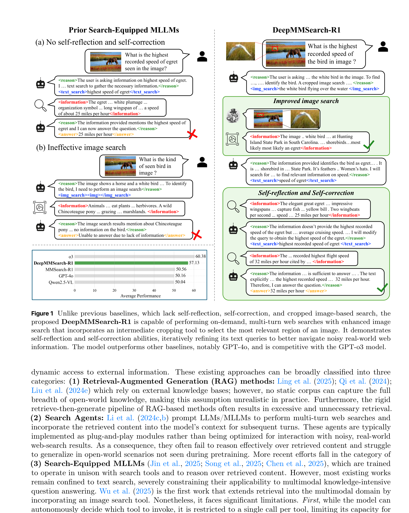
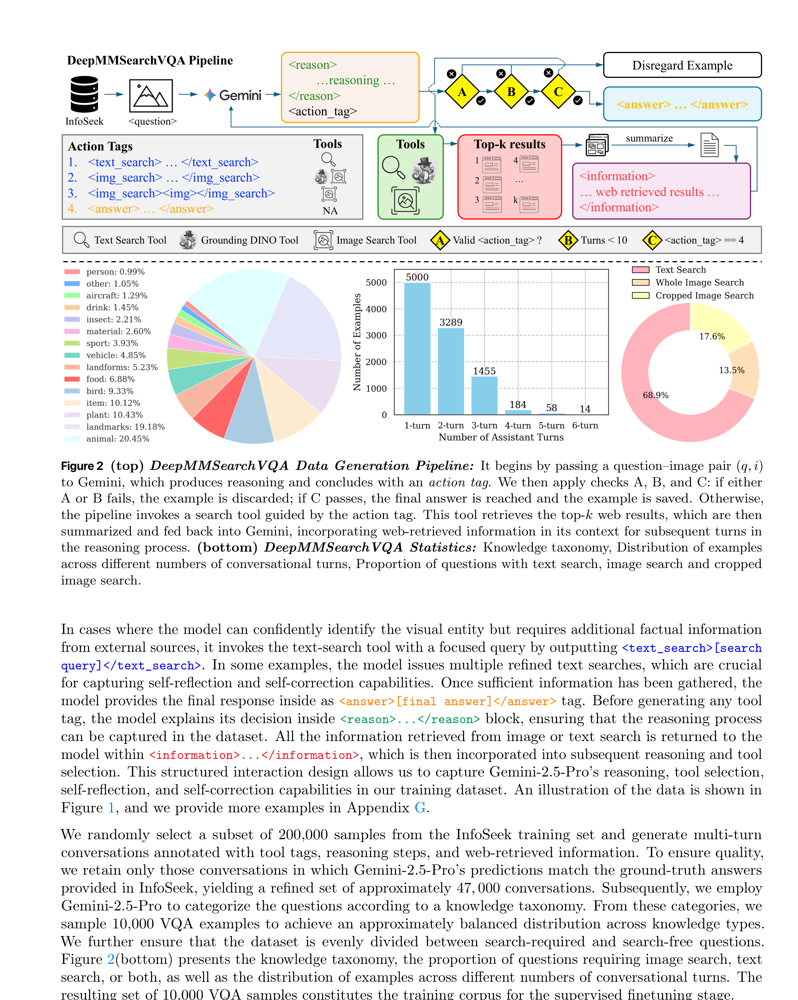

# DeepMMSearch-R1 技术报告

## 来源

- PDF：[arXiv:2510.12801](https://arxiv.org/abs/2510.12801)
- 日期：2025-10-15
- 团队：Apple（实习主导）+ Johns Hopkins University
- 作者：Kartik Narayan、Yang Xu、Tian Cao、Kavya Nerella、Vishal M. Patel、Navid Shiee、Peter Grasch、Chao Jia、Yinfei Yang、Zhe Gan
- 关联模型：[DeepMMSearch-R1](../models/deepmmsearch-r1.md)（基于 Qwen2.5-VL-7B-Instruct）

## 核心结论

首个能做**多轮按需 web search** 的多模态 LLM，同时支持文本搜索和裁剪图像搜索，并具备 self-reflection / self-correction 能力。核心主张：

1. **裁剪图像搜索**：用 Grounding DINO 根据模型生成的 referring expression 裁剪图像中的相关区域，再用裁剪图做 image search，消除背景噪声。此前工作只用整图搜索。
2. **多轮文本搜索 + self-reflection**：模型可多次发起文本搜索，根据检索结果迭代修正 query，而非单次调用。
3. **两阶段训练**：SFT cold-start（DeepMMSearchVQA 数据集）→ Online GRPO RL（用 FVQA 训练集）。
4. **6 个 benchmark 平均分 57.13**，超过 RAG workflow 基线 +21pp，超过 prompt-based search agent +9pp，与 GPT-o3 竞争。

> 论文定位为 search-equipped MLLM 方向，直接对标 [MMSearch-R1](mmsearch-r1.md)（单次调用、整图搜索），并对比 RAG workflow 和 prompt-based agent 两类基线。

## 架构与训练

### 工具链（三个搜索工具）

| 工具 | 输入 | 输出 | 实现 |
| --- | --- | --- | --- |
| Text Search | 模型生成的文本 query | Top-5 网页摘要 | in-house web search API + LLM 摘要 |
| Image Search | 整图或裁剪图 | Top-5 视觉相似结果摘要 | in-house image search API + LLM 摘要 |
| Grounding Tool | referring expression + 原图 | 裁剪后的图像区域 | Grounding DINO |

LLM 摘要用 `gpt-5-chat-latest`。

### Action Tags（结构化工具调用协议）

- `<reason>...</reason>`：推理过程
- `<text_search>query</text_search>`：文本搜索
- `<img_search></img_search>`：整图搜索
- `<img_search>referring expression</img_search>`：裁剪图像搜索（先 grounding 再搜索）
- `<answer>...</answer>`：最终回答
- `<information>...</information>`：检索结果（训练时 mask loss）

### SFT 阶段

- **基座**：Qwen2.5-VL-7B-Instruct
- **训练策略**：冻结视觉编码器和 projection 层，只在 LLM 上加 LoRA（rank=8）
- **数据**：DeepMMSearchVQA，10K 多轮对话样本
  - 来源：InfoSeek 训练集 200K 样本 → Gemini-2.5-Pro 生成多轮对话 → 答案正确性过滤 → 47K → 按知识类别均匀采样 10K
  - 50% search-required / 50% search-free
  - 按知识分类学（10+ 类别）均匀分布
- **损失**：Causal LM，`<information>` 内容被 mask
- **配置**：3 epochs，lr=1e-4，cosine scheduler，8×H100，batch=8

### RL 阶段（GRPO）

- **算法**：GRPO（Group-Relative Policy Optimization）
- **数据**：FVQA 训练集（图像搜索比例更高）
- **奖励**：R_total = (1-λ_fmt)·s + λ_fmt·s_fmt
  - s：gpt-5-chat-latest 判断语义正确性（binary）
  - s_fmt：格式合规性
  - λ_fmt = 0.1
- **配置**：4×8 H100，batch=512，rollout=8，lr=2e-6，KL penalty=0.001，clip=0.2，max response=8192 tokens
- **约束**：图像搜索最多 1 次，文本搜索可多次，总工具调用 ≤10

### 训练后行为变化（SFT → RL）

1. 图像搜索和混合搜索调用增加（更多多模态问题用图像搜索）
2. 多轮文本搜索更频繁（self-reflection +2.64%）
3. 裁剪图像搜索大幅减少（-36.81%）——模型更精准，只在必要时裁剪

## 评测要点

### 主结果（Table 1）

| 方法 | 平均 | InfoSeek | Enc-VQA | SimpleVQA | DynVQA | OKVQA | A-OKVQA |
| --- | --- | --- | --- | --- | --- | --- | --- |
| Direct: Qwen2.5-VL-7B | 43.11 | 26.38 | 18.75 | 47.48 | 20.14 | 63.10 | 82.79 |
| Direct: GPT-4o | 50.16 | 35.96 | 27.15 | 48.27 | 31.19 | 71.96 | 86.46 |
| Direct: o3 | 60.38 | 48.22 | 49.15 | 53.11 | 41.68 | 80.36 | 89.78 |
| RAG: GPT-4o | 41.50 | 45.86 | 44.50 | 35.93 | 43.22 | 38.76 | 40.70 |
| Prompt Agent: Qwen2.5-VL-32B | 50.94 | 28.61 | 32.80 | 48.67 | 40.00 | 72.87 | 82.71 |
| MMSearch-R1-7B | 50.56 | 41.33 | 36.85 | 53.90 | 40.14 | 59.89 | 71.27 |
| **DeepMMSearch-R1 (SFT)** | **56.23** | 47.45 | 50.35 | 52.02 | 43.08 | 67.52 | 76.94 |
| **DeepMMSearch-R1 (RL)** | **57.13** | 47.51 | 52.25 | 55.87 | 45.87 | 67.80 | 73.45 |

- RAG workflow 在 OK-VQA/A-OKVQA 上反而下降（>50% 问题不需要搜索，检索引入噪声）
- Prompt-based agent 稳定但不如训练过的模型
- DeepMMSearch-R1 在 DynVQA 和 SimpleVQA 上提升最大（需要搜索的新数据集）

### 通用 VQA 无退化（Table 2）

SFT+RL 训练后，OCRBench / MMVet / AI2D / MathVista / MMBench / DocVQA / InfoVQA 基本无退化，归功于 LoRA（只更新少量参数）+ KL penalty（防止策略漂移）。

### 消融实验

- **Self-reflection / self-correction**（多轮文本搜索）：平均 +1.75pp
- **裁剪图像搜索**：在需要识别单个视觉实体的场景提升显著
- **搜索数据比例**：50:50 search-required:search-free 最优
- **知识类别均匀采样**优于随机采样

## 图表

> 论文 Figure 1 原文标题："Unlike previous baselines, which lack self-reflection, self-correction, and cropped image-based search, the proposed DeepMMSearch-R1 is capable of performing on-demand, multi-turn web searches with enhanced image search that incorporates an intermediate cropping tool to select the most relevant region of an image."（§1）

> 论文 Figure 2 原文标题："(top) DeepMMSearchVQA Data Generation Pipeline... (bottom) DeepMMSearchVQA Statistics: Knowledge taxonomy, Distribution of examples across different numbers of conversational turns, Proportion of questions with text search, image search and cropped image search."（§2）

## 待追问

- 论文用 in-house web/image search API，未公开具体实现；复现时需替换为公开搜索 API。
- Grounding DINO 作为 grounding 工具是固定组件还是可替换的？其他 grounding 模型（如 OWLv2）效果如何？
- 奖励模型用 `gpt-5-chat-latest`，这是 black-box judge；改用 rule-based reward 是否可行？
- 训练数据只有 10K SFT + FVQA，规模较小；扩展数据量是否能进一步提升？
- 通用 VQA 的"无退化"结论是否在更大模型（32B）上也成立？
- 与 Search-R1 / R1-Searcher 等纯文本 search RL 方法的直接对比缺失（论文称它们不是 true baselines 因为只支持文本搜索）。

## 相关页面

- [MMSearch-R1](mmsearch-r1.md)（前序工作）
- [DeepMMSearch-R1](../models/deepmmsearch-r1.md)
- [Agentic 模型的后训练](../concepts/post-training-for-agentic-models.md)
- [Agentic engineering](../concepts/agentic-engineering.md)
