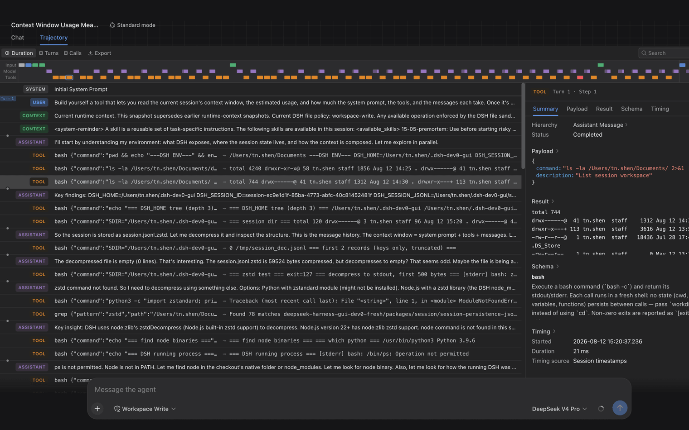

# DeepSeek Harness 官方文档

## 来源

- 仓库 README：[`raw/deepseek-harness-readme.md`](../../raw/deepseek-harness-readme.md)
- 官方落地页快照：[`raw/deepseek-harness-official-2026.md`](../../raw/deepseek-harness-official-2026.md)
- 架构文档快照：[`raw/deepseek-harness-architecture.md`](../../raw/deepseek-harness-architecture.md)
- 落地页：[deepseek.com/harness](https://www.deepseek.com/harness/en/)
- 仓库：[deepseek-ai/deepseek-harness](https://github.com/deepseek-ai/deepseek-harness)
- 开发者文档：[deepseek-harness.github.io](https://deepseek-harness.github.io/deepseek-harness/en/reference/)
- 团队：DeepSeek-AI；citation 是 GitHub `@misc`，**没有**独立技术报告
- 内核论文（本页不当一手）：[A Programming Paradigm for Spatiotemporal Composability](https://arxiv.org/abs/2608.25512)（Cordis，北大 + DeepSeek，cs.PL）
- 未建模型页：这是 harness，不是模型。评测数字来自 [DeepSeek-V4.1-Flash](deepseek-v41-flash.md)，不是本页实验。

## 这页在本 wiki 的定位（重要）

这是 **2026 的插件核产品文档**，developer preview，官方写明会破兼容。机制主张以落地页和架构文档为**原文确证**。Cordis 论文解释「卸载如何精确撤销副作用」，是 **PL 内核**，不能把演算定理升级成 coding-agent 实验结果。

它补的是 [Agent harness](../concepts/agent-harness.md) 里缺的一条轴：Pi 把核心留小、能力赶到 extension；DeepSeek Harness 宣称 **没有特权核心可打补丁**，连 agent loop 都是插件。

## 核心结论

1. **Agent = Model + Harness。** 模型是「soul」；harness 让 agent 理解环境、用工具、在真实设定里持续干活（原文确证，落地页）。
2. **Everything is a plugin。** 可替换的不只是工具，还包括 models、skills、sessions、sandboxes、storage、**loops**、scheduling 和 UI。扩展方式是在旁边再挂一个插件，而不是 fork 核心（原文确证，落地页 / 架构文档 § Cordis）。
3. **「没有特权核心」是配置层主张。** 架构文档写：registrations 是 effects，插件卸载时 unwind。这和 [Pi](pi-coding-agent.md) 相反：Pi 的四工具循环是故意不可替换的核心，extension 只能挂在公开 API 上。
4. **跑一次必须可追溯。** 模型看见的东西进 append-only session log：系统提示、reasoning、tool call/result、subagent 调度、每一次 context injection。Resume / fork / search / replay 都作用在同一条事件流上（原文确证，落地页）。
5. **评测用的不是 Standard。** [V4.1-Flash Table 4](deepseek-v41-flash.md) 同一 checkpoint 下，DeepSeek Harness **Minimal** 的 Terminal-Bench 2.1 是 90.6，Standard 掉到 85.8。Headline 分来自两工具模式，不是满配产品膜。

> 落地页图：「DeepSeek Harness settings showing installed plugins and their status」（来源：[官方落地页](https://www.deepseek.com/harness/en/)）。

## 架构与训练

### Cordis 核 + profile 组装

运行中的 `dsh` 是启动时按层叠起来的插件树（原文确证，架构文档 § Profiles）：

- **profile**：Harness home 里的具名组装（随发行：`web` / `headless` / `sdk` / `sdk-minimal` / `acp`）
- **bundle**：一组可被上层 patch 的 Cordis 配置行 + 代码
- 层序：profile 列出的 bundle → profile 的 `cordis.patch.yml` → home 级 patch → `--patch`
- `dsh-base` 是 web/headless/sdk/acp 的共享第一层；**`sdk-minimal` 故意不套 `dsh-base`**

核心包仍在，但都挂在 `ctx` 上当服务：`ctx.sessions`（append-only `SessionEvent`）、`ctx.systemPrompt`、`ctx.tools`、`ctx.agents`、`ctx.agentLoop`（「唯一的具体循环插件」）、`ctx.llm`。架构文档把 `agent-loop` 写成 default driver，**同时仍是插件**（原文确证，§ Core packages）。

### 四种 runtime mode

落地页的产品分档（原文确证，§ Multiple runtime modes）：

| Mode | 模型看见什么 |
| --- | --- |
| **Standard** | 满配：文件编辑、shell、文件/网页搜索、skills、planning、goals、subagents、workflows |
| **Code / PTC** | Standard 的能力，但工具经 Code Mode SDK 暴露；模型写一段程序编排多步。文档里 `tools` 的 `mode: 'ptc'` 只下发 `run_code` + 生成的 SDK，模型直接点原生工具名会被拒 |
| **Minimal** | 持久 `bash` + `str_replace_editor` 两工具，给模型评测用 |
| **Creator** | Standard + 运行时检查、内存里试插件、组新 preset |

这和 Pi 的「核心永远四工具、其余走 extension」不是同一句话：DSH 的 Minimal 是 **preset**，Standard 随时可以把 plan / subagent / web 加回来。

### Turn 流（只记结构）

一步 = 一次模型请求 + 它调用的工具；一 turn = 零或多 step。架构文档给出 `turn/start` → `agent/pre-step` → `step/start` → stream → `tools/pre-execute|execute|post-execute` → `turn/end`。`agent/pre-step` 可以改写或拒绝输入；空的第一次 claim 会关掉一个没有 step 的 turn（原文确证，§ Turn flow）。本页不把这段写成已验证的性能机制。

> 落地页图：「Reconstruct a complete run from a single session log」（来源：同上）。

## 评测要点

本页**没有**自己的 benchmark。数字全部来自 [V4.1-Flash §5.3 / Table 4](deepseek-v41-flash.md)（外部佐证）：同一 checkpoint、Linux、1M context，只换 harness。

| Harness | DeepSWE v1.1 | Terminal-Bench 2.1 |
| --- | ---: | ---: |
| mini-SWE | 74.2 | 90.3 |
| DeepSeek Harness Minimal | 72.6 | 90.6 |
| DeepSeek Harness Standard | 70.5 | 85.8 |
| DeepSeek Harness PTC | 67.6 | 85.8 |
| Pi | 66.2 | 86.1 |
| Claude Code | 69.8 | 88.0 |

读法：Minimal ≈ mini-SWE，且高于 Pi / Claude Code；加上 Standard 的 plan/subagent/web 之后 **DeepSWE 和 Terminal-Bench 都下降**。这支持「工具面越大，同一模型在这些短台上不一定更强」，但不能写成 DSH 全面优于 Pi——任务分布、开箱工具和 DeepSeek 是否过拟合自家 Minimal 都没隔离。

## 待追问

- 「没有特权核心」在实践里还剩什么不可卸载？`agent-loop` 仍是「唯一的具体循环插件」，换 loop 有没有官方第二实现？
- Minimal 的高分有多少来自和 V4.1 后训练同一分布，而不是膜本身？Table 4 没有训练–评测 harness 交叉。
- PTC 把多步收到 `run_code` 里，和 SoL-Pi 的 Action Fusion（一次 edit 带 then_run）是不是同一类「少一轮模型往返」？两边都没有交叉实验。
- Cordis 的 revertible effects 是否真的覆盖 bash / 文件系统副作用，还是只覆盖进程内注册表？论文是 PL 演算，本页不能代答。

## 相关页面

- [DeepSeek-V4.1-Flash 技术报告](deepseek-v41-flash.md)
- [Pi coding agent 设计博客](pi-coding-agent.md)
- [SoL-Pi 官方博客](sol-pi.md)
- [Agent harness](../concepts/agent-harness.md)
- [Agentic 评测体系](../concepts/agentic-evaluation-benchmarks.md)
- [Databricks coding agent 内部评测博客](databricks-coding-agents.md)
