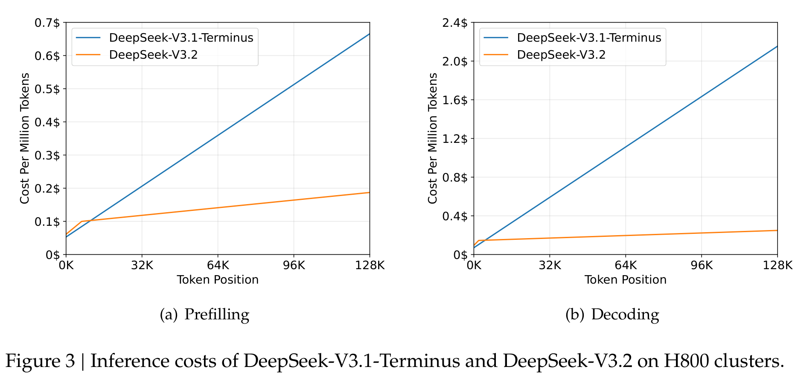

# DeepSeek-V3.2 技术报告

## 来源

- 原始 PDF：[raw/DeepSeek-V3.2.pdf](../../raw/DeepSeek-V3.2.pdf)
- 标题：DeepSeek-V3.2: Pushing the Frontier of Open Large Language Models
- 版本/日期：arXiv:2412.19437，2024-12-02
- 团队：DeepSeek-AI
- 模型页：[DeepSeek-V4](../models/deepseek-v4.md)（V3.2 在 V3.1-Terminus 基础上引入 DSA，V4 为后续演进）

## 核心结论

DeepSeek-V3.2 在 DeepSeek-V3.1-Terminus 基础上引入 **DeepSeek Sparse Attention（DSA）**，在保持模型质量的同时大幅降低长上下文计算成本。核心结论：

> **关于训练起点 DeepSeek-V3.1-Terminus**：它是 DeepSeek-V3.1 的一次 update（官方公告 2025-09-22），主打**语言一致性**（减少中英混杂与乱码）与 **agent / coding / 搜索能力**增强，**不是新基座、架构未变**，沿用 V3.1 的 hybrid reasoning。本论文原文明确：「the **only architectural modification** of DeepSeek-V3.2 is the introduction of DSA through continued training」——即 V3.1-Terminus 的注意力就是**不带 DSA 的标准 [MLA](../concepts/multi-head-latent-attention.md)**，V3.2 = 在它的 128K checkpoint 上继续训练、唯一加了 DSA。附录 A Figure 7 那句「MHA mode 训练/prefill、MQA mode decode」虽写成「For V3.1-Terminus」，但实为 MLA 自 V2 起的**通用 compute-form 惯例**，非 V3.1 独有（详见 MLA 概念页轴一）。（来源：[DeepSeek-V3.1-Terminus 官方公告](https://api-docs.deepseek.com/news/news250922)）

- DSA 将核心注意力复杂度从 O(L²) 降至 O(L·k)（k ≪ L），lightning indexer 复杂度仍为 O(L²)，但计算量远小于原 MLA。
- 128K 上下文下约 **90% attention entries 为冗余**；DSA 将 attention computation 降低约 **1.5–2 倍**。
- V3.2-Exp 在多项 benchmark 上与 V3.1-Terminus 性能持平，在 long-context 任务上反超（AA-LCR +4 分）。
- 高算力变体 V3.2-Speciale 在 IMO 2025、IOI 2025、ICPC WF 2025 中均获金牌。

## 架构与训练

### DSA 架构

DSA 由两个核心组件构成：

1. **Lightning Indexer**：对每个 query token h_q 与历史 token h_s，通过少量 attention head 计算 index score $A_{q,s} = \sum_j w_{q,j}^{idx} \cdot \text{ReLU}(q_{q,j}^{idx} \cdot k_{s,j}^{idx})$，使用 ReLU 激活以适配 FP8 部署。
2. **Fine-grained Token Selection**：对每个 query 位置取 index score 的 **top-k**（k=2048）个历史 KV entry 做精确 softmax 注意力。

DSA 实例化在 **[MLA](../concepts/multi-head-latent-attention.md) 的 MQA 模式**下——latent vector（KV entry）被同一 query token 的所有 query head 共享，理由是 kernel 效率：原文「each key-value entry **must be shared across multiple queries**」。注意这里的「MQA mode」是 **selection 结构**（KV 跨头共享、top-k 所有 head 选同一组），**不等于训练前向用 MQA 算术**——附录 A（Figure 7）的「训练/prefill 用 MHA mode、decode 用 MQA mode」是 **compute form** 那条轴、且 caption 限定在 V3.1-Terminus（dense 基座）；DSA 下短上下文 prefill 仍「specially implement a masked MHA mode to simulate DSA」，正说明 compute form（MHA）与 selection（DSA/MQA 共享）是两条正交的轴。推理代码已开源（Hugging Face `deepseek-ai/DeepSeek-V3.2-Exp`）。

### 训练方案

从 DeepSeek-V3.1-Terminus 的 128K checkpoint 出发，采用两阶段 continued pre-training：

1. **Dense Warmup**：
   - **1000 步**，每步 **16 条 128K token** 序列，共计 **2.1B tokens**。
   - 学习率 **1e-3**；冻结除 lightning indexer 外的所有模型参数。
   - 损失函数：对完整 attention score 求和 → L1 归一化为目标分布 p_v → KL(p_v ‖ Softmax(α_v))。

2. **Sparse Training**：
   - **15000 步**，每步 **480 条 128K token** 序列，共计 **943.7B tokens**。
   - 学习率 **7.3×10⁻⁶**；top-k = 2048。
   - Indexer 输入做 **stop-gradient** 解耦：indexer 只受 KL loss 驱动，backbone 只受 LM loss 驱动。
   - KL loss 改为仅在 **选中的 top-k 集合**上计算（而非完整分布）。

### 短上下文优化

对短序列 prefill 场景，专门实现 **masked MHA 模式**来模拟 DSA 行为，在短上下文下获得更高效率。

> **为什么短 prefill 走稠密 MHA 而非 DSA/吸收**：几百 token 以内，DSA 的 top-k 稀疏选择拿不到收益（要选的本来就没几个），而 MLA 吸收形态（MQA mode）又因「latent 上投影成 per-head K/V」的每-token 固定开销在短序列上不划算——此时**稠密 MHA 展开形态算力最省**。这有定量支撑：按 V2 配置推导，展开 vs 吸收的算力 crossover ≈ **341 token**，短于它吸收/展开的天平偏向稠密展开（推导见 [MLA 概念页「crossover ≈ 341 token」](../concepts/multi-head-latent-attention.md)）。序列更长才轮到 DSA 稀疏路径接管。

## 后训练

后训练阶段**继续使用 sparse attention**（配置与 sparse continued pre-training 相同），不冻结 indexer。流程包括：

1. **Specialist Distillation**：为六个任务域（数学、编程、通用推理、通用 agent、agent 编码、agent 搜索）分别训练 specialist，再蒸馏至统一基座。
2. **Mixed RL Training**：采用 GRPO 算法合并 reasoning / agent / human alignment 训练。引入 Off-Policy Sequence Masking、Keep Routing（MoE expert replay）、Keep Sampling Mask 等稳定性机制。

## 评测要点

- **Parity Evaluation**：V3.2-Exp 与 V3.1-Terminus 在短/长上下文 benchmark 上性能持平，人类偏好 Elo 分数接近。
- **Long Context**：AA-LCR +4 分；Fiction.liveBench 全面优于 V3.1-Terminus。
- **推理成本**：在 H800 GPU 上实测，DSA 相比 V3.1-Terminus 在长序列上 token 成本显著下降（$2/GPU-hour 估算）。

  

  > Figure 3（原文截图，§ 推理成本）：H800 集群上 DeepSeek-V3.1-Terminus 与 V3.2 的推理成本，按 token 位置（0K–128K）绘制。成本按 $2/GPU-hour 估算。短序列 prefill 走 masked MHA mode 模拟 DSA 以提高效率。
- **竞赛表现**（V3.2-Speciale）：IMO 2025 Gold（35/42）、CMO 2025 Gold（102/126）、IOI 2025 Gold（492/600）、ICPC WF 2025 Gold（10/12）。
- **Agentic 评测**：SWE-bench Verified 73.1、Terminal Bench 2.0 46.4（Claude Code 框架）、BrowseComp 67.6（带 context management）。

## 待追问

- Lightning indexer 的具体 head 数论文未明确给出（GLM-5 附录报告 32 头 / head dim 128，是否一致待确认）。
- 943.7B sparse training tokens vs GLM-5 的 20B——差异来自起点模型、数据分布还是设计哲学？需要消融实验。
- Post-training 中 indexer 是否真正更新——论文说"same way as sparse continued pre-training"，但未给出冻结 vs 更新的消融。
- masked MHA 模式的具体实现和效率收益未在正文展开。
- V3.2 仅在 128K 上下文训练，对 >128K 的泛化能力未见讨论（V4 报告提到 context management 部分弥补了这一限制）。