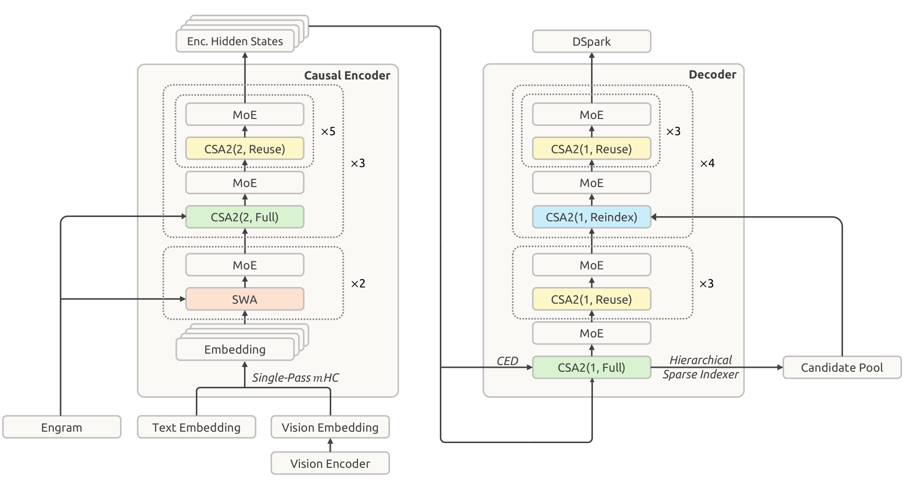
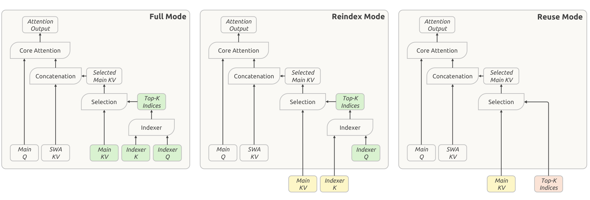
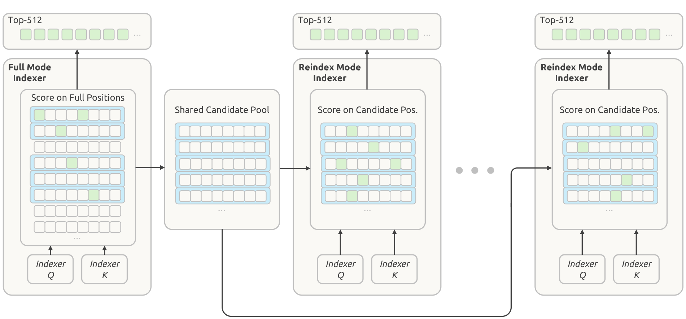
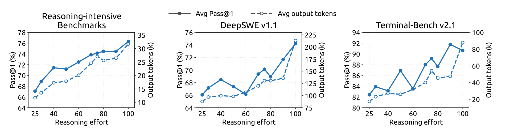

# DeepSeek-V4.1-Flash 技术报告

## 来源

- 原始 PDF：[DeepSeek_V41_Tech_Report.pdf](../../raw/DeepSeek_V41_Tech_Report.pdf)，共 51 页。
- 标题：DeepSeek-V4.1-Flash: Pushing the Limits of KV Cache Compression。
- 团队：DeepSeek-AI。
- 版本：本地 PDF 未标注 arXiv 编号或版本号；文件元数据创建日期为 2026-09-10，§5.1.4 描述 2026 年 9 月部署。元数据日期不等同于正式发布日期。
- 模型页：[DeepSeek-V4.1-Flash](../models/deepseek-v41-flash.md)。本文以本地报告为证据，发布和评测描述均为作者报告口径。

## 核心结论

原文确证（摘要、§2.1、§3.2、§6）：这是一款图像与文本输入、文本输出的原生多模态 MoE，552B backbone 参数之外另有 196B Engram 参数，支持 1M token 上下文。模型将长周期 agent 的输入处理、运行缓存和持久缓存分开优化。

| 优化对象 | 机制 | 报告结果及边界 |
| --- | --- | --- |
| 长输入 prefill | Causal Encoder-Decoder（CED） | encoder/decoder 各 20 层；大部分输入只经过 encoder，prefill 每 token 激活 8B、decode 16B；长输入计算近似减半，不等同于端到端延迟减半 |
| 全局 KV 常驻 HBM | CSA2 跨层共享 main KV / indexer K，加 FP4 | 890 bytes/token，约为 V4-Flash 的 1/4；不含 SWA、权重、工作区等总显存开销 |
| 长期 prefix 缓存 | 全局 KV 压缩 + SWA Bounded Replay | 相同工作负载下持久缓存约为 V4-Flash 的 1/8；该比例依赖旧部署中 SWA 占比，不是任意请求上的固定比例 |
| 能力扩展 | 45T 多模态预训练 + SFT / RL / OPD | agent 指标显著改善；最终使用超过 40 个 teacher 做全词表 OPD，作者明确不主张新的后训练算法 |

**本页综合**：关键变化是把“历史信息由哪些层生成、由哪些层共用、哪些状态值得长期保存”联合设计，而不只是在每层少选几个 token。它连接了[高效长上下文注意力](../concepts/efficient-long-context-attention.md)与[百万 token 上下文服务](../concepts/million-token-context-serving.md)。

## 架构与训练

### CED：全局 KV 在 encoder 末端生成，局部 KV 保留逐层深度

**直接前作是 [YOCO（You Only Cache Once）](yoco.md)**：本报告 §2.2 明确写 CED 受 YoCo（Sun et al., 2024）启发。YOCO 用前半 self-decoder 生成一份全局 K/V，后半 cross-decoder 共用；其后半不保留本层历史 SWA，所以 prefill early exit 不改变数学输出。V4.1 保留后半逐层 SWA，必须额外准备局部状态；128-token bounded replay 是近似补齐，不能沿用 YOCO 的精确等价结论。对照见 [YOCO 来源页](yoco.md#与-deepseek-v41-ced-的关系)。

> Figure 3，PDF p.7，原图注节译：40 层网络分为各 20 层的 causal encoder 和 decoder；CSA2(ratio, mode) 指定压缩率与运行模式，所有 FFN 使用标准 DeepSeekMoE。

原文确证（§2.2，Eq.1）：decoder 的全局 KV 及压缩权重由最后一层 encoder hidden state 投影得到，而非依次运行各 decoder 层后从本层 hidden state 生成。SWA KV 仍来自各层自己的 hidden state。因而 CED 可以跳过大多数 prompt token 的 decoder 计算，但必须为即将开始的 decode 准备局部 SWA 状态。

Decoder SWA Bounded Replay 只让最后 128 个 prompt token 的 encoder 输出经过 decoder。对长度 $N\gg W$ 的输入，报告将计算由 $O(NL)$ 写为 $O(NL/2+WL/2)$，其中 $L=40$、$W=128$。这个近似依赖有界重放，不能理解成 decoder 对所有输入完全不做计算。

### CSA2：缓存共享和索引复用分开控制

> Figure 4，PDF p.10，原图注节译：绿色为当前层计算量，黄色为最近 Full 层共享的 main KV 与 indexer K，红色为最近 Full 或 Reindex 层产生的 top-k；所有模式都在当前层计算 main Q 与 SWA KV。

原文确证（§2.3–2.3.1）：层的模式静态指定，不是每个 token 动态选择模式。

| 模式 | main KV / indexer K | top-k | 保留的本层计算 |
| --- | --- | --- | --- |
| Full | 新建；decoder Full 的源是 encoder 末端状态 | 新算 | main Q、indexer Q、SWA KV、attention |
| Reindex | 共享最近 Full 的缓存 | 本层 indexer Q 重新打分 | main Q、indexer Q、SWA KV、attention |
| Reuse | 共享缓存 | 复用针对该缓存的最近选择 | main Q、SWA KV、attention |

与报告介绍的 V4 CSA 相比，CSA2 去掉压缩块的重叠和压缩内绝对位置 embedding，indexer K 直接从 main KV 投影，取消独立压缩支路；架构只用 CSA2，不再混合 HCA。复用 KV 节省存储，复用 top-k 节省索引计算，二者不是同一收益。

具体层配置（§4.2.1）：encoder 前 2 层仅 SWA，余下 18 层为 3 组 `Full + 5 Reuse`，压缩率 2；decoder 为 5 组四层，首组 `Full + 3 Reuse`，后四组 `Reindex + 3 Reuse`，压缩率 1。decoder 全局 KV 因此保留 token 粒度，并通过跨层共享降低存储。

### 分层索引：先选候选池，再允许深层重新选择

> Figure 5，PDF p.11，原图注节译：绿色方格表示已选索引，蓝色矩形表示根据最大索引分数选出的块；decoder 首个 Full 层建立共享候选池，后续 Reindex 层在其中选取 top-512。

原文确证（§2.3.2、§4.2.1）：候选池最多 2,048 块 × 8 个位置 = 16,384 个位置，最终每层仍只读 top-512。该限制只用于 decoder，在后训练引入，并在训练和推理保持一致。后续索引器的打分数量不再随上下文增长，**第一个 Full 索引器仍扫描全部因果可见位置**，所以不能称整个 decode 严格为常数复杂度。

Figure 2 报告 4K→1M 时单 token decode FLOPs 仅增加约 1/4；它按 BF16/FP8/FP4 分别以 1/0.5/0.25 加权，是精度加权计算量，不能直接转成实测吞吐。

### FP4 与 SWA 重放：两种不同的近似

原文确证（§2.4.4）：main KV 在后训练引入 QAT，RoPE 后量化，使用 E2M1 数据和每 16 通道一个 E4M3 scale，省略 NVFP4 的第二级全局 scale；attention 前反量化。这是存储压缩，不要求用相同格式进行原生矩阵乘法。indexer Q/K 使用 MXFP4；SWA KV 因量化敏感保留 FP8。

原文确证（§3.2.1–3.2.2）：全局 KV 长期保留至少 72 小时；encoder SWA KV 放在每机 10% host DRAM 组成的短期分布式内存池，TTL 仅数分钟。decoder SWA KV 不用于 prefix caching。

- **Encoder replay**：命中全局 KV、未命中 encoder SWA 时，重放 prefix 最后 128 tokens；这部分只重建 SWA，复用且不覆盖缓存中的全局 KV。随后新 suffix 生成自己的全局 KV 和 SWA KV。
- **Decoder replay**：每次 prefill 都让 prompt 最后 128 tokens 经过 decoder，准备当前 decode 所需的 SWA 状态；后训练模拟同样的重放过程。

两者都截断重放段之前的 SWA 依赖，**不等价于完整前向**。encoder 的近似状态还会影响新 suffix，因此不同 prefix 命中位置可能产生不同状态。作者称已测条件下质量影响很小，但 §6 明确将缓存恢复边界和稀疏检索错误列为尚未充分刻画的风险。

### 其他组件与预训练配置

原文确证（§2.1.1、§2.4–2.5、§3.1、§4）：

| 组件 | 配置与作用 |
| --- | --- |
| DeepSeek-ViT | 32 层、hidden 1024、16 heads、patch 14；2D-RoPE、RMSNorm、SwiGLU；3×3 pixel-unshuffle 将视觉 token 数降为 1/9，再经 MLP 接入 LLM；图像最高约 1344×1344 |
| 视觉训练 | 先用约 47B 图文对做 SigLIP 对比训练，再接临时 4B MoE 做 236B tokens 自回归训练；丢弃临时 LLM，保留视觉编码器；主预训练的学习率衰减阶段解冻视觉编码器 |
| MoE | hidden 5120；每层 1 shared + 384 routed experts，每 token 选 6 routed；图像/文本独立维护负载均衡 bias，另有权重 1e-4 的 sequence balance loss |
| Single-Pass mHC | 将 input mixing 系数改为前一个 block 产生，使部署 Mega-mHC 可单遍融合；相对原始实现 activation memory traffic 减半，不是全模型 FLOPs 减半 |
| Engram | 额外 196B 参数，均分两模块，置于零索引层 1 和 14；2/3/4-gram，每阶 8 hash heads；省略原方法的短卷积；推理可从主机 RDMA 预取，RL rollout 则将表放 GPU |
| 优化器 | 线性矩阵用 Muon，Q/K 用 head-wise Muon；Engram 表、token embedding、prediction head 用 momentum + Sinkhorn balancing；非矩阵参数用 AdamW |
| DSpark | backbone 预训练不带 MTP；之后冻结 backbone 单独训练 3-block、窗口 128、一次 5 个 draft 位置的 drafter；后训练持续跟随 backbone 更新，但 drafter loss 不反传到 backbone |
| 数据 | 45T tokens；文本与多模态 token 比 7:1；重叠数据用多模态版本替换纯文本版；从 64K 稀疏注意力开始，无 dense warmup，在 34T tokens 扩展到 1M |
| 系统 | 视觉 encoder / prefill / decode 独立部署；CSA2 训练使用 shadow indexer、跨 pipeline 状态传递和 micro-batch 生命周期管理；Reuse 层部署为 prefill 15 / decode 11 个 kernels |

相关主题：[条件记忆](../concepts/conditional-memory.md)、[多 token 预测](../concepts/multi-token-prediction.md)、[DSpark](dspark.md)。

## 后训练

### 数据与环境优先，最终以 OPD 融合

原文确证（§5.1–5.1.3）：沿用 SFT→RL→OPD，把主要投入放在任务和环境生产。任务表示为 `(problem, environment, verification system)`，以难度与正确性训练任务构造能力，并在每次 RL 使用后根据新轨迹重新审计质量。

通用 agent 从自愿反馈的真实交互、工具接口和失败案例构建 mocked tools 与环境；coding 从复杂/失败会话及 GitHub 仓库构造任务。专门的 agent 分别负责可构建性筛选、环境装配、多次求解、独立质检和修复；检查 fail-to-pass、pass-to-pass、解答泄漏和可攻击的验证器。多 scaffold RL 覆盖同一 scaffold 的不同版本及异构工具接口；多轮 RL 之间用 checkpoint merging 重新初始化，Figure 7/8 的断开曲线不能当成一次连续训练。

DSec 支撑百万级并发 sandbox，分片与最终一致的 placement 配合节点本地硬准入；作者报告相近工作负载下每物理节点容器密度由约 1,000 提升到超过 2,500。隔离、优先级调度、环境破坏作为失败轨迹等措施用于控制训练和评测干扰。

原文确证（§5.2）：rollout 与训练同设备分时执行；sample-level dispatch 维持并发，训练可在 token 边界抢占。跨 checkpoint 保留 KV 与路由并按生成片段拼接 routing replay；对早返回短样本偏置和过时 token 分别做调度控制与 loss masking。这是容纳 off-policy 轨迹的训练工程，不表示旧 KV 与新权重重算等价。

原文确证（§5.2.4）：最终全领域 **full-vocabulary OPD 使用超过 40 个 teacher**，teacher 可来自不同阶段、具有不同架构，并在训练中调整数据混合、并发与 active teachers。论文没有给“40+ 对更少 teacher”的隔离消融；不能把最终涨分全归因于 teacher 数量。详见 [OPD 跨报告对比](../comparisons/on-policy-distillation.md)。

### Reasoning effort 是训练出来的代价控制

原文确证（§5.1.4，Eq.8–10）：模型以标量 effort $b\in\{1,\ldots,100\}$ 为条件；同一 `(prompt, effort)` 内计算相对 advantage，不直接跨 effort 比较 reward。长度惩罚为

$$
r_{\mathrm{len}}=-\min\{C_{\max},k(b)\ell/L_{\mathrm{norm}}\},\qquad
k(b)=k_0\exp(-(b-b_{\min})/\tau).
$$

较低 effort 对每个 reasoning token 惩罚更强；这不是硬 token 上限。Appendix C 的近似线性长度推导依赖边际收益指数衰减、内部最优及惩罚未封顶等假设，不保证逐题单调。报告 Table 2 给出的部署映射为 `low=50`、`high=75`、`max=100`，这里只记录该报告版本。

> Figure 9，PDF p.35，原图注节译：实线是 Pass@1、虚线是平均输出 token；effort 从 25 到 100，推理列取八项基准平均；两个 coding 基准分别使用 mini-SWE 和 DeepSeek Harness Minimal。

§5.3.2 报 effort 25→100 时推理均分 67.1→76.3、DeepSWE 66.0→74.2、Terminal-Bench 82.4→90.6，输出约增加到 2.5 倍。**原文内部不一致**：§5.3.3 称准确率单调提高，但 Figure 9 本身已有回落，例如 DeepSWE 在 effort 40→60 下降，Terminal-Bench 在 90→100 下降；图中平均输出长度也并非逐点严格单调。因此只保留“端点与总体趋势提高”，不采用单调性结论。Appendix B.2 / Figure 11 另明确说明跨 scaffold 的准确率存在平台和回落，其长度单调描述也仅适用于该附录的具体面板。

## 评测要点

### Base：多项接近 V4-Pro，但并非全面追平

Table 1，作者内部同设置评测，以下为选摘；不超过 0.3 的差距在原表视为同一水平。

| 指标 | V4-Flash-Base | V4-Pro-Base | V4.1-Flash-Base |
| --- | --- | --- | --- |
| MMLU-Pro，5-shot EM | 68.3 | 73.5 | 74.1 |
| SimpleQA-Verified，25-shot EM | 30.1 | 55.2 | 42.3 |
| HumanEval，0-shot Pass@1 | 69.5 | 76.8 | 79.4 |
| MATH，4-shot EM | 57.4 | 64.5 | 61.1 |
| MGSM，8-shot EM | 85.7 | 84.4 | 80.2 |
| LongBench-V2，1-shot EM | 44.7 | 51.5 | 45.2 |

Figure 6 的内部 held-out 研发语料 BPB 优势与公开 benchmark 是不同指标，不能把其 5%–10% 改善写成普遍任务准确率提升。摘要的“1/4 激活参数”也需保留 prefill 口径：8B/16B 相对 V4-Pro 的 49B，decode 不是 1/4。

### 最终模型：强项在 agent，知识和高难任务仍有差距

Table 3，均为报告中的 Max effort，成绩为作者报告，未独立复现。除特别注明外为 Pass@1 百分比。

| 基准 | V4-Flash | V4-Pro | V4.1-Flash |
| --- | --- | --- | --- |
| GPQA Diamond | 89.9 | 92.4 | 90.9 |
| HLE 纯文本子集 | 37.8 | 42.7 | 39.1 |
| MathArena Apex | 58.6 | 65.3 | 65.6 |
| Terminal-Bench 2.1 | 82.7 | 87.9 | 90.6 |
| Terminal-Bench 3.0 | 7.6 | 11.8 | 30.0 |
| Terminal-Bench 4.0 | 7.0 | 12.4 | 31.2 |
| DeepSWE v1.1，Resolved | 54.4 | 62.7 | 74.2 |
| Automation-Bench | 37.7 | 43.2 | 54.8 |
| Agents’ Last Exam | 25.2 | 25.7 | 31.8 |

V4.1 的 HLE 全集另为 36.8，不能与 V4 的纯文本列直接比较。视觉工具任务使用 Claude Code、512K context：Chartography 78.9、BabyVision 89.6；ZeroBench-main 为 **Pass@5 49.0**，不是 Pass@1。这些是视觉 agent 结果，不是裸模型单次视觉问答分数（§5.3.1、Table 3）。

### Harness 和多 agent 结果需保留实验单位

Table 4 控制同一 checkpoint、任务与解码配置，只替换 harness：Linux、1M context、temperature 1.0、top-p 0.95、每 agent 最多 500 次生成；DeepSWE 每题 8 samples，Terminal-Bench 每题 3 samples，后者禁网。这些多次采样用于报告对应单次指标，不等于 Pass@8 / Pass@3。

| Harness | DeepSWE v1.1 Resolved | Terminal-Bench 2.1 Pass@1 |
| --- | --- | --- |
| Claude Code v2.1.251 | 69.8 | 88.0 |
| Codex | 65.6 | 84.1 |
| OpenCode | 65.5 | 85.0 |
| Pi | 66.2 | 86.1 |
| mini-SWE | 74.2 | 90.3 |
| DeepSeek Harness Minimal | 72.6 | 90.6 |
| DeepSeek Harness Standard | 70.5 | 85.8 |
| DeepSeek Harness PTC | 67.6 | 85.8 |

**本页计算与综合**：DeepSWE 的范围相差 8.7 个百分点，不能只记录“模型分数 74.2”而省略 mini-SWE；多 scaffold 训练与迁移结果相容，但表中没有隔离训练多样性的因果贡献。

§5.3.5 / Figure 10 的 Agent Team 属初步结果，奖励包含任务表现、协作 bonus 和由事件依赖 DAG 关键路径计算的延迟惩罚。ProgramBench 使用参考解通过率至少 95% 的 **172 题筛选子集**，多 agent 的 Almost@1 在 8 小时达 30.04，单 agent 同期限 20.39；FrontierSWE v2 使用 no-GPU 子集，20 小时 Mean@5 为 32.90 vs 28.20。作者比较各自最强观察配置，未控制相同总 token 或 GPU 成本，不能视为纯并行的等算力因果增益，也不能直接与 Table 3 的 ProgramBench 20.3 混算。

## 待追问

- CSA2 的 KV 共享、索引共享、候选池缩小各自损失多少质量？本报告缺少统一逐项消融，尤其需检查首层选错后深层无法恢复的长程检索。
- 128-token replay 在缓存命中位置、长链局部依赖、重复恢复和多模态边界上如何退化？§6 承认这些鲁棒性边界未完全刻画。
- 890 bytes/token 的实际部署收益如何随 batch、命中率、SWA 短期池、Engram 驻留及互连变化？报告的压缩比和精度加权 FLOPs 不能替代同硬件 TTFT / 吞吐 / 总成本曲线。
- 196B Engram、原生视觉、更优数据、CED 和更大 backbone 的贡献如何拆开？当前端到端结果不能证明某一组件单独带来全部增益。
- 40+ teacher 的架构、领域分配、动态切换及 OPD 前后分数没有完整公开，如何复现这一规模下的稳定融合？
- 引言“能完成超过 95% 现实任务”没有对应的可审计总体采样协议；不作为本页已量化结论。§6 的能力边界判断也不能替代 Table 3 的具体对照。

## 相关页面

- 前作：[DeepSeek-V4 技术报告](deepseek-v4.md)。
- 架构与系统：[高效长上下文注意力](../concepts/efficient-long-context-attention.md)、[百万 token 上下文服务](../concepts/million-token-context-serving.md)、[KV cache 层](../concepts/kv-cache-layer.md)。
- 扩展组件：[条件记忆](../concepts/conditional-memory.md)、[Engram](engram.md)、[多 token 预测](../concepts/multi-token-prediction.md)、[DSpark](dspark.md)。
- 训练比较：[OPD 跨报告对比](../comparisons/on-policy-distillation.md)。
