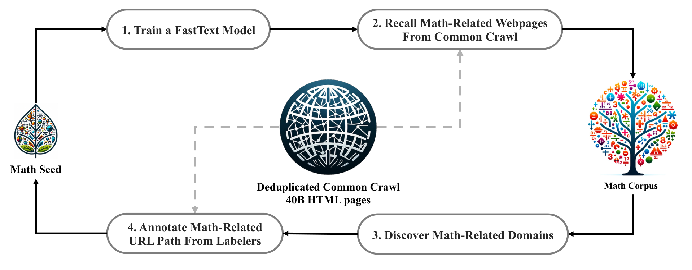
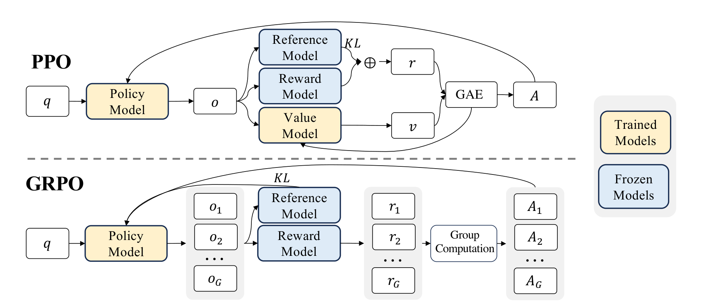
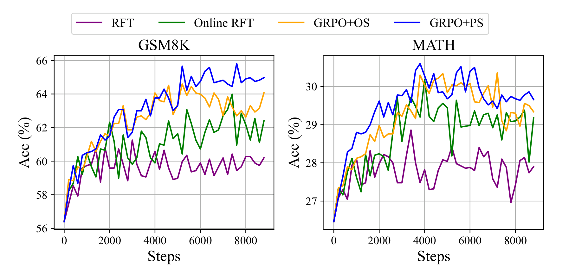
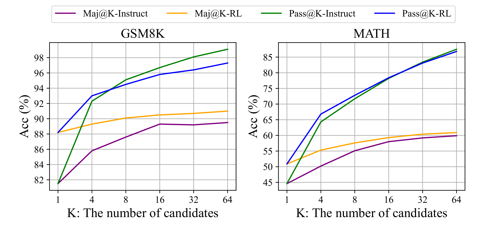
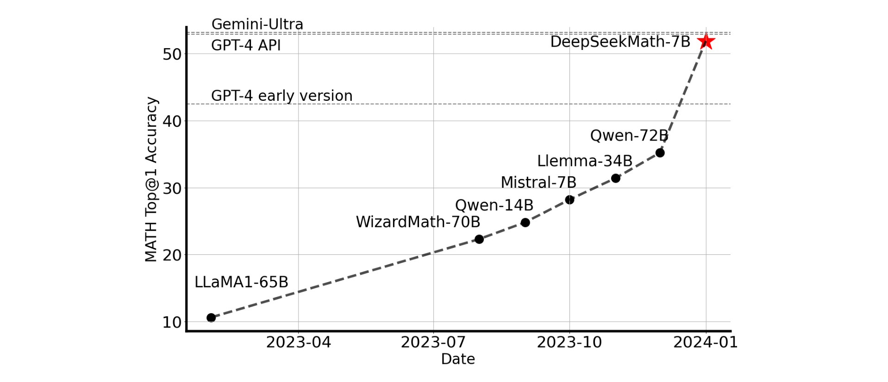

# DeepSeekMath

## 来源

- **PDF**：`raw/2402.03300v3.pdf`（30 页）
- **标题**：DeepSeekMath: Pushing the Limits of Mathematical Reasoning in Open Language Models
- **arXiv**：2402.03300v3，2024-04-27
- **团队**：DeepSeek-AI；核心作者实习自清华 / 北大（Shao / Wang / Zhu / Guo）
- **开源**：[GitHub DeepSeek-Math](https://github.com/deepseek-ai/DeepSeek-Math)
- **模型页**：[DeepSeekMath](../models/deepseekmath.md)

本页是 **GRPO 的一手出处**。后续 DAPO / GSPO / SAPO / IcePop / CISPO 都在它定义的 group-relative clipped objective 上改一层；不要另建「GRPO 概念页」。统一谱系见 [LLM RL policy optimization 对比](../comparisons/llm-rl-policy-optimization.md)。

## 核心结论

1. **7B 开源模型把竞赛 MATH 推到 51.7%**：DeepSeekMath-RL 7B 在不用外部工具、不用投票时 MATH 51.7%、GSM8K 88.2%；64 样本 self-consistency 把 MATH 拉到 60.9%。作者写成当时开源社区首次过 50%（摘要、Table 5）。
2. **公开网页里有足够的数学信号**：用迭代 fastText 从 Common Crawl 挖出 120B math token（DeepSeekMath Corpus），约是 Minerva 所用 math 网页的 7 倍、OpenWebMath 的 9 倍（§1.1、§2.1）。1.3B 对照实验里它明显优于 MathPile / OpenWebMath / Proof-Pile-2（Table 1）。
3. **从 code 基座继续训数学更划算**：DeepSeekMath-Base 从 DeepSeek-Coder-Base-v1.5 7B 初始化。作者主张 code 预训练同时提高「带工具」和「不带工具」的数学推理；纯 arXiv 语料在本报告的 benchmark 上几乎无效（§1.1、§5.1）。
4. **GRPO 是 PPO 变体，不是新的 ratio 单元**：丢掉与 policy 同规模的 value model，对同一题采 $G$ 条输出，用组内相对奖励当 baseline；token-level clip 仍在。KL 不写进 reward，而是直接加进 loss（Eq. 3–4、Figure 4）。
5. **作者自己解释「RL 为什么涨分」**：Figure 7 显示 RL 抬 Maj@K，**不抬** Pass@K。读成把正确答案从 TopK 里抬到更稳，而不是增强基本能力（§5.2.2）。这是后来「GRPO 不创造能力、只校准分布」讨论的原文锚点。

## 架构与训练

模型是 7B dense，从 DeepSeek-Coder-Base-v1.5 初始化，再继续训 500B tokens（§2.3）。本报告不给层数 / 头数；身份是数学领域继续预训练 + 后训练，不是新架构。

数据混合：DeepSeekMath Corpus 56% + AlgebraicStack 4% + arXiv 10% + GitHub code 20% + 中英 Common Crawl 自然语言 10%。学习率峰值 $4.2\times 10^{-4}$，batch 10M tokens。

> Figure 2（原文截图，§2.1）："An iterative pipeline that collects mathematical web pages from Common Crawl."

四轮迭代后得到 35.5M 数学网页、120B tokens；第四轮约 98% 已在第三轮收集到，于是停（§2.1）。去污染：与评测集 10-gram 精确匹配的片段删除；短于 10-gram 但至少 3-gram 的用精确匹配（§2.1）。

1.3B 语料对照（Table 1，few-shot CoT）：DeepSeekMath Corpus 上 GSM8K 23.8% / MATH 13.6% / CMATH 41.5%，高于 Proof-Pile-2 的 14.3% / 11.2% / 19.9%。作者强调三点：质量更高、含中文、规模更大因而学习曲线不那么早平台。

Code → math 的 1.3B 消融（Table 6，§5.1.1）：先 400B code 再 150B math，无工具 GSM8K 21.9%，高于只训 math 的 20.5%、先 general 再 math 的 19.1%；带 Python 工具的差距更大。code+math 混训能减轻两阶段对代码的遗忘，但无工具数学略差——作者猜想 1.3B 容量不够同时吃下两摊。

ArXiv-only（MathPile 或 ArXiv-RedPajama）在 GSM8K / MATH / MMLU-STEM / miniF2F 上「没有明显提升甚至下降」（Table 8–9）。作者自己划边界：没测定理 informalization、没测与其他数据混合、没测更大模型（§5.1.2）。

## 后训练

### SFT（§3）

776K 中英数学指令：CoT / PoT / tool-integrated 三种解答格式。英文含 GSM8K、MATH（补工具解）、MathInstruct 子集、Lila-OOD；中文是 K-12、76 个子题。拼到 4K，500 step，batch 256，恒定学习率 $5\times 10^{-5}$。

DeepSeekMath-Instruct 7B：无工具 MATH 46.8%、GSM8K 82.9%；工具集成 MATH 57.4%（Table 5）。

### GRPO：丢掉 critic，用组内相对奖励

PPO（Eq. 1）用 GAE + 可学习 $V_\psi$ 算 advantage，并常把 KL 罚写进每 token reward（Eq. 2）。作者认为 value model 几乎与 policy 一样大，而且 LLM 往往只在最后 token 给奖励，token 级 value 难训（§4.1.1）。

> Figure 4（原文截图，§4.1.1）："Demonstration of PPO and our GRPO. GRPO foregoes the value model, instead estimating the baseline from group scores, significantly reducing training resources."

目标（Eq. 3）仍是 token-level importance ratio + clip，再减 $\beta D_{\mathrm{KL}}[\pi_\theta\|\pi_{\mathrm{ref}}]$。和 PPO 的差别在 **advantage 从哪来**，以及 **KL 放哪**：

- 同一题从 $\pi_{\theta_{\mathrm{old}}}$ 采 $G$ 条 $\{o_i\}$。
- **Outcome supervision**（§4.1.2）：reward model 给整条输出一个 $r_i$，组内标准化 $\tilde r_i=(r_i-\mathrm{mean}(\mathbf{r}))/\mathrm{std}(\mathbf{r})$，该序列**所有 token** 的 $\hat A_{i,t}=\tilde r_i$。
- **Process supervision**（§4.1.3）：逐步奖励，token advantage 是后续步标准化奖励之和。
- KL 用 Schulman (2020) 无偏估计（Eq. 4）直接进 loss，不写进 $r_t$，以免搅乱 $\hat A$。

Iterative GRPO（Algorithm 1）：每隔一段把 $\pi_{\mathrm{ref}}$ 设成当前 policy，用新采样刷新 reward model（replay 10% 历史），再继续训 policy。

DeepSeekMath-RL 配方（§4.2）：从 Instruct 出发；只用 SFT 里 GSM8K+MATH 的 CoT 题，约 144K，故意不含其他域以便看 OOD。Reward model 从 Base 训，LR $2\times 10^{-5}$。Policy LR $1\times 10^{-6}$，KL 系数 $0.04$，每题采 **64** 条，最大长度 1024，batch 1024；每次 exploration 后 policy **只更新一次**。

结果（Table 5）：无工具 GSM8K 82.9→88.2、MATH 46.8→51.7、CMATH 84.6→88.8；工具集成 MATH 57.4→58.8。作者强调：RL 数据只有 GSM8K+MATH 的 CoT，但所有评测都涨，包括没在 RL 里见过的题。

### 统一范式与「为什么 RL 涨」

§5.2.1 把 SFT / RFT / DPO / PPO / GRPO 收成同一梯度形式（Eq. 5）：数据源 × 奖励函数 × 梯度系数。Table 10：RFT/DPO 离线、Online RFT/GRPO 在线；RFT 用规则、PPO/GRPO 用模型。

> Figure 5（原文截图，§5.2.1）："Performance of the DeepSeekMath-Instruct 1.3B model, which was further trained using various methods, on two benchmarks."

作者读法：Online RFT 前期接近 RFT、后期拉开（online 优势随 policy 漂移出现）；GRPO 能按奖励幅度区别强化 / 惩罚，Online RFT 对错题不惩罚、对对题一视同仁；GRPO+PS 的 step-aware 系数更细。Figure 6 的 iterative RL 在第一轮增益最大。

> Figure 7（原文截图，§5.2.2）："The Maj@K and Pass@K of SFT and RL DeepSeekMath 7B on GSM8K and MATH (temperature 0.7). It was noted that RL enhances Maj@K but not Pass@K."

§5.2.3 把后续方向写成三条：OOD 题 + 更好采样、对噪声奖励稳健的算法、更能泛化 / 能表达不确定度的 process reward。这是展望，不是本页已完成的实验。

## 评测要点

> Figure 1（原文截图，摘要）："Top1 accuracy of open-source models on the competition-level MATH benchmark without the use of external toolkits and voting techniques."

Base 7B vs 开源基座（Table 2，few-shot CoT）：

| 模型 | GSM8K | MATH | CMATH |
| --- | ---: | ---: | ---: |
| Minerva 540B | 58.8% | 33.6% | — |
| Llemma 34B | 54.0% | 25.3% | 56.1% |
| **DeepSeekMath-Base 7B** | **64.2%** | **36.2%** | **71.7%** |

工具 / 形式化（Table 3）：GSM8K+Python 66.9%、MATH+Python 31.4%，高于 Llemma 34B；miniF2F-test 24.6%。

Instruct / RL（Table 5，无工具 Top1）：

| 模型 | GSM8K | MATH | CMATH |
| --- | ---: | ---: | ---: |
| DeepSeekMath-Instruct 7B | 82.9% | 46.8% | 84.6% |
| DeepSeekMath-RL 7B | **88.2%** | **51.7%** | **88.8%** |
| Gemini Ultra | 94.4% | 53.2% | — |
| GPT-4 | 92.0% | 52.9% | 86.0% |

Limitations（§6）：几何与定理证明弱于闭源；7B few-shot 几乎不比 zero-shot 涨——和 GPT-4 能吃 few-shot 不同。作者归因为数据选择偏差与模型规模。

## 证据边界与阅读提示

- Reward model 仍是神经网络 RM，不是后来通行的 rule-based verifier。GRPO 算法与「可验证奖励」不是同一件事。

## 待追问

- **需实验或作者披露**：原文 GRPO 的 loss 是 **sample-level 再 token 平均**（$1/G\sum_i 1/|o_i|\sum_t$）。[DAPO](dapo.md) 后来把这改成全局 token 池平均。DeepSeekMath 自己没有这条消融。
- **需实验或作者披露**：Outcome 把同一 $\tilde r_i$ 广播到整条序列：这正是后来 GSPO「reward 是 sequence 级、ratio 却 token 级」批评的起点。本页没有 sequence-level ratio 实验。
- **需实验或作者披露**：RL 主结果用的是 outcome 还是 process、是否走完 iterative？§4.2 没写死；过程监督优势只在 1.3B 的 Figure 5。

## 相关追问

主记录：[RL 的 Maj@K 与 Pass@K 外推](../comparisons/llm-rl-policy-optimization.md#待追问)。

## 相关页面

- 模型：[DeepSeekMath](../models/deepseekmath.md)
- 比较：[LLM RL policy optimization 对比](../comparisons/llm-rl-policy-optimization.md)（GRPO 基线行）
- 概念：[Agentic 模型的后训练](../concepts/post-training-for-agentic-models.md)
- 后作 recipe / 变体：[DAPO](dapo.md)、[Group Sequence Policy Optimization](group-sequence-policy-optimization.md)、[Soft Adaptive Policy Optimization](soft-adaptive-policy-optimization.md)、[Ring-1T / IcePop](ring-1t.md)、[MiniMax-M1 / CISPO](minimax-m1.md)、[DPO](dpo.md)（本页统一范式里的离线偏好对照，不是 GRPO 变体）
