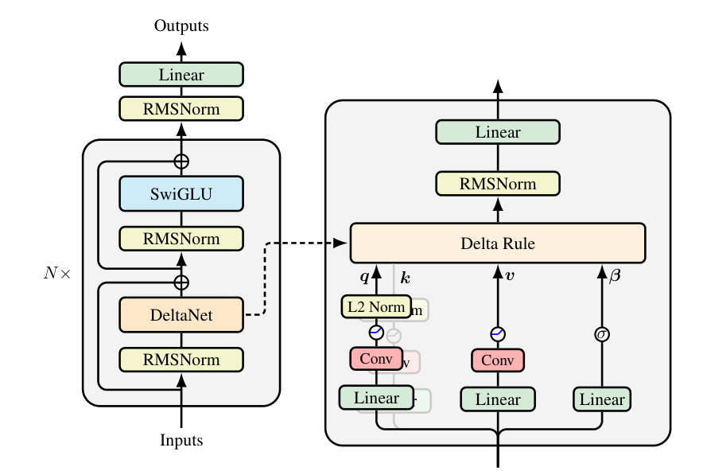
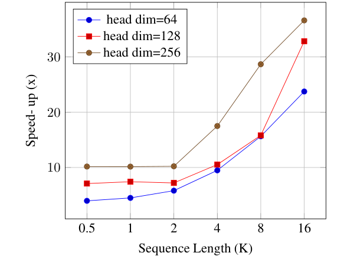
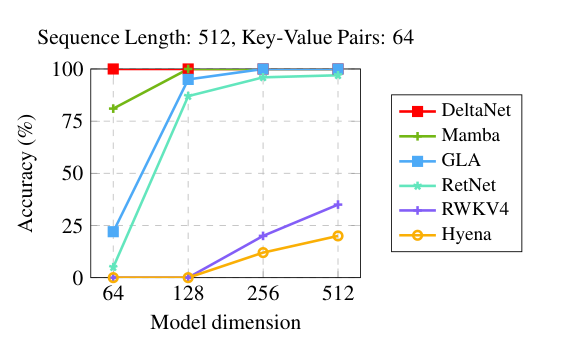

# DeltaNet

## 来源

- 文件：`raw/2406.06484v6.pdf`
- 标题：Parallelizing Linear Transformers with the Delta Rule over Sequence Length
- 团队 / 日期：Songlin Yang、Bailin Wang（MIT，共同一作）；Yu Zhang（Soochow University）；Yikang Shen（MIT-IBM Watson AI Lab）；Yoon Kim（MIT）；arXiv:2406.06484v6，2025-01-15；NeurIPS 2024
- 代码：并行 DeltaNet 层放进 [fla-org/flash-linear-attention](https://github.com/fla-org/flash-linear-attention)（摘要）
- 定位：**方法论文**。名字「DeltaNet」和 delta 更新来自 Schlag 等 2021（原文 [101]，尚未 ingest）；本篇贡献是 **WY 表示下的 chunkwise 并行训练**，把这条规则训到 1.3B / 100B。机制归属 [线性注意力与 delta rule](../concepts/linear-attention-and-delta-rule.md)：它是 **$(I-\beta kk^\top)$ 定向擦写**，**没有**数据相关遗忘门 $\alpha_t$。

**不建模型页。** 实验载体是 SlimPajama 上 340M / 1.3B 研究检查点，另有 3B / 1T 对照。生产上的 gated delta 是 [Gated DeltaNet](gated-delta-net.md)，再往上是 [Kimi Linear](kimi-linear.md) 的 KDA。

## 核心结论

1. **朴素线性注意力只会加、不会改。** $S_t=S_{t-1}+v_tk_t^\top$ 把新关联叠进去，序列长过维度就 key collision（§2.2 引 Schlag）。DeltaNet 改成对当前 key 的重建误差做一步 SGD（Widrow–Hoff / LMS）：先读 $v^{\mathrm{old}}=S_{t-1}k_t$，再按 $\beta_t$ 插值后擦旧写新。
2. **本篇解决的是训练，不是发明这条规则。** Schlag 的实现沿序列逐步走，吃不满 tensor core。这里把递推收成广义 Householder 连乘，用 WY 表示在 $O(d)$ 内存里构造伪 value $u_t$，再套线性注意力的 chunkwise 形式（§3）。
3. **中等规模可超过当时的线性基线。** 1.3B / 100B token 上 Wiki ppl 16.87、零样本平均 51.6，高于 Transformer++ 50.9、GLA 51.0、Mamba 50.0（Table 1）。召回任务上 340M 赢 GLA，1.3B 反而落后——作者归因于状态扩张比 GLA 差（128× vs 256×，§4.2、§5.3）。
4. **作者自己写出缺门。** 长度外推弱于 GLA / RetNet，推测是没有显式 decay；v6 §5.3 把后作 [Gated DeltaNet](gated-delta-net.md) 写成补这一项。

> Figure 2（原文截图，§3.3）："An illustration of DeltaNet neural architecture."

## 机制（已据原文核实）

线性注意力（去归一化、恒等特征，§2.1）是外积累加：

$$
S_t = S_{t-1} + v_t k_t^\top,\qquad o_t = S_t q_t.
$$

DeltaNet 把加法换成 delta 更新（§2.2）：

$$
S_t = S_{t-1}(I-\beta_t k_t k_t^\top) + \beta_t v_t k_t^\top,\qquad \beta_t=\sigma(W_\beta x_t)\in(0,1).
$$

检索视角：新值 $v^{\mathrm{new}}_t=\beta_t v_t+(1-\beta_t)v^{\mathrm{old}}_t$，从记忆里减掉 $v^{\mathrm{old}}_t k_t^\top$、写上 $v^{\mathrm{new}}_t k_t^\top$。$\beta_t=1$ 整条替换，$\beta_t=0$ 不动。二次损失 $L=\tfrac12\|Sk_t-v_t\|^2$ 上一步 SGD 就是这条；朴素线性注意力对应的是线性损失 $- \langle Sk_t,v_t\rangle$，梯度不随误差变大。

本页 $S$ 存 $\sum v k^\top$、$o=Sq$，Householder 作用在右边。概念页演进表沿 GDN / Kimi 写成 $(I-\beta kk^\top)S+\beta kv^\top$，是同一规则的转置布局，不要当成两条更新。

**WY + chunkwise（§3.1–3.2）。** $S_t=\sum_{i=1}^t u_i k_i^\top$，$u_t=\beta_t(v_t-v^{\mathrm{old}}_t)$，不必物化逐步的 $S$。块内用 UT 变换把下三角逆写成 matmul（Eq. 10–11），再按线性注意力的 chunk 公式滚状态（Eq. 8–9）。完全并行形式要做长度立方的矩阵逆，训练不用。

> Figure 1（原文截图，§3.2）："Speed-up of the chunkwise parallel form vs. the recurrent form." 脚注：本页 recurrent kernel 已比 Schlag 原 CUDA 快约 2×。

**层设计（§3.3）。** 宏观跟 Transformer++：DeltaNet 层约 $4d^2$，SwiGLU 约 $8d^2$，$\beta$ 的参数可忽略。q/k 用 SiLU + **L2Norm**（不是 Schlag 的 ELU+1 + L1）；$\beta_t=1$ 时 $I-kk^\top$ 是投影，擦一个子空间、留 $d-1$ 个。输出投影前加 RMSNorm。短卷积是 hybrid 实验里加的，不是这条递推的一部分。

**两种 softmax 混合（§3.4）。** 线性层缺位置、也不擅长局部移位。Sliding Attn：隔层插 SWA。Global Attn：只把第 2 层和第 $N/2+1$ 层换成全局注意力。

## 评测要点

Table 1（SlimPajama + Mistral tokenizer；末列平均 acc 与召回。State exp. 是相对「层数 × 模型维」的状态扩张）：

| 规模 | 模型 | Wiki ppl ↓ | 平均 acc ↑ | SWDE / SQuAD / FDA | State |
| --- | --- | ---: | ---: | --- | --- |
| 340M / 15B | Transformer++ | 28.39 | 41.2 | 42.2 / 22.1 / 21.4 | N/A |
| | Mamba（有 conv） | 28.39 | 41.8 | 12.4 / 23.0 / 2.1 | 64× |
| | GLA（无 conv） | 28.65 | 41.5 | 18.6 / 27.2 / 8.1 | 128× |
| | **DeltaNet（有 conv）** | **28.24** | **42.1** | 26.4 / 28.9 / 12.8 | 128× |
| | + Sliding Attn | 27.06 | 42.1 | 39.3 / 32.5 / 18.8 | N/A |
| | + Global Attn（2 层） | 27.51 | 42.1 | 42.9 / 32.1 / 23.1 | N/A |
| 1.3B / 100B | Transformer++ | 16.85 | 50.9 | 66.6 / 31.5 / 27.4 | N/A |
| | Mamba（有 conv） | 17.06 | 50.0 | 41.4 / 35.2 / 6.2 | 64× |
| | GLA（无 conv） | 17.22 | 51.0 | 50.6 / 42.6 / 19.9 | 256× |
| | **DeltaNet（有 conv）** | **16.87** | **51.6** | 49.5 / 37.4 / 17.2 | 128× |
| | + Sliding Attn | 16.56 | 52.1 | 53.3 / 43.3 / 22.3 | N/A |
| | + Global Attn（2 层） | 16.55 | 51.8 | **71.0** / 43.0 / 29.8 | N/A |

340M 消融：L1 + 1+ELU 平均 40.1；改 L2 仍用 1+ELU 到 42.1；L2 + ReLU 40.9。正文选用 L2 + SiLU。

> Figure 4（原文截图，§4.1）："Accuracy (%) on MQAR."

MAD 上 Fuzzy Recall 35.7，高于 Transformer 29.8，但 Memorize 只有 52.8（Table 3，其它行借 Poli 等）。3B / 1T 平均 59.8，低于同设定 PowerLM-3B 的 62.3，也低于 Llama-3.2-3B 的 62.8；高于 RecurrentGemma-2B / RWKV-6-3B / Mamba-2.7B，作者标明 token 数不同、不能硬比（Figure 5）。

吞吐：1.3B 单卡 H100 上接近 GLA、明显快于 Mamba；长序列训练仍快于 Transformer++（Figure 6）。§5.3 仍写训练速度**落后 GLA**——块内要对 head 维做状态依赖，不能像 GLA 那样任意铺大 head。

## 与已有沉淀的关系

- **本页是 delta rule 可规模训练的一手，不是遗忘门的一手。** 概念页那条 $(I-\beta kk^\top)$ 以前只在 [GDN](gated-delta-net.md) 里转述。Schlag 2021 仍未 ingest；本页把「规则 + 并行算法 + 1.3B 数字」钉死。
- **[GLA](gated-linear-attention.md) 是对照，不是前作。** GLA 有 $\mathrm{Diag}(\alpha_t)$、写入仍是外积。同第一作者、同一 FLA 仓库；Table 1 的 GLA 行来自 GLA 原文同数据。
- **[Gated DeltaNet](gated-delta-net.md) 是后作。** 本页 v6 已把「缺显式 decay → 加 gating」写成 [125]。GDN 的门来自 [Mamba-2](mamba-2.md) 式标量衰减，delta 来自这里。
- **KDA 把两边叠起来。** [Kimi Linear](kimi-linear.md) 的细门承 GLA、delta 承本页 / GDN。
- **混合「隔层 SWA / 只换两层全局」是本页的实验，不是后来的 3:1。** GDN-H1/H2、Kimi 3:1、Qwen3-Next 3:1 是后作把混合做成默认栈。
- **FlashLinearAttention 仍是 [GLA](gated-linear-attention.md) 的算法名。** 本页说「adapt FLASHLINEARATTENTION 实现 Eq. 8–9」，不是另起一个名字。

## 待追问

- **需补外部来源**：Schlag 等 2021（arXiv:2102.11174）的小规模数字与「ELU+1 + L1」原配方，不能用本页 340M 消融反推。
- **需实验或作者披露**：块对角 Householder、把 head 做大同时塞进 SRAM，§5.3 只作为可行方向，没有实验。
- **需实验或作者披露**：3B / 1T 相对 PowerLM 的差距有多少来自缺门、多少来自状态尺寸，本页没有拆。

## 相关页面

- 概念：[线性注意力与 delta rule](../concepts/linear-attention-and-delta-rule.md)、[高效长上下文注意力](../concepts/efficient-long-context-attention.md)
- 同设定对照：[Gated Linear Attention](gated-linear-attention.md)（channel-wise 门，无 delta）、[Mamba-2](mamba-2.md)（SSD，不是 delta）、[Lightning Attention-2](lightning-attention-2.md)（标量衰减 tiling）、[RWKV](rwkv.md)（本页 MQAR 弱基线）
- 后作：[Gated DeltaNet](gated-delta-net.md)（标量门 + 本页的 delta）、[Kimi Linear](kimi-linear.md)（细门 + delta）、[Linear Attention Architectures](linear-attention-architectures.md)（把 DeltaNet/GDN/KDA 放进同一套记号）
