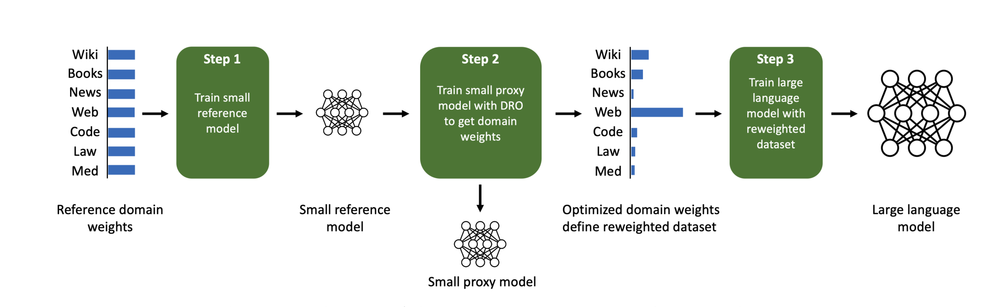
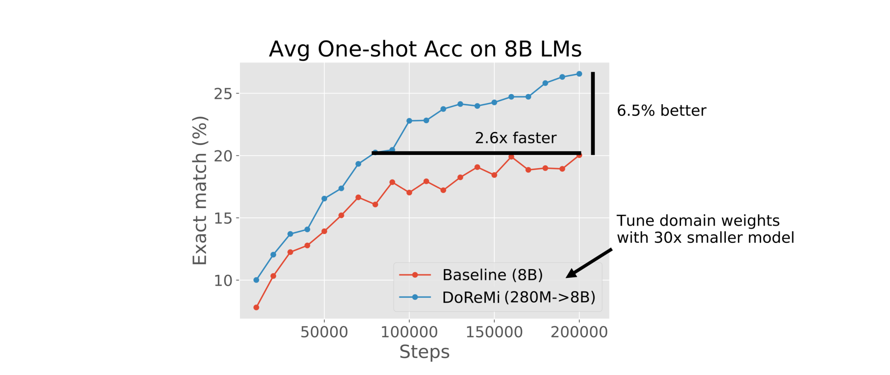
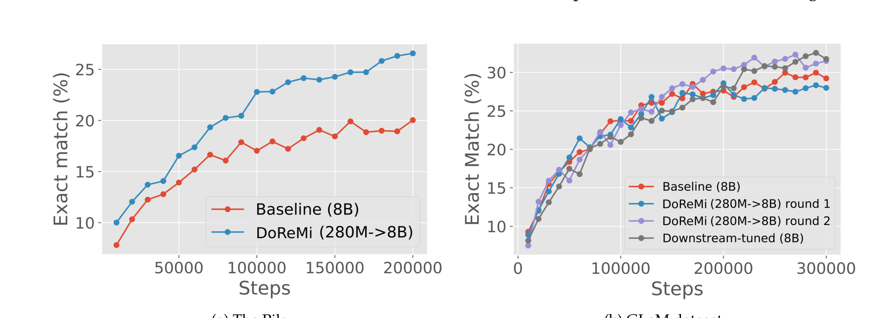
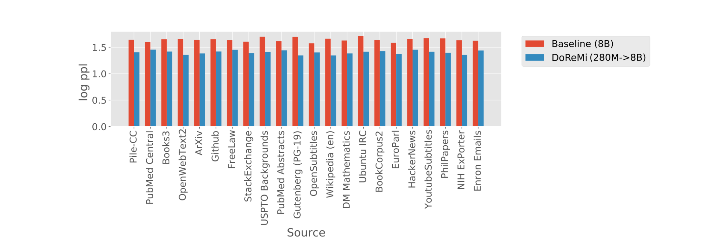
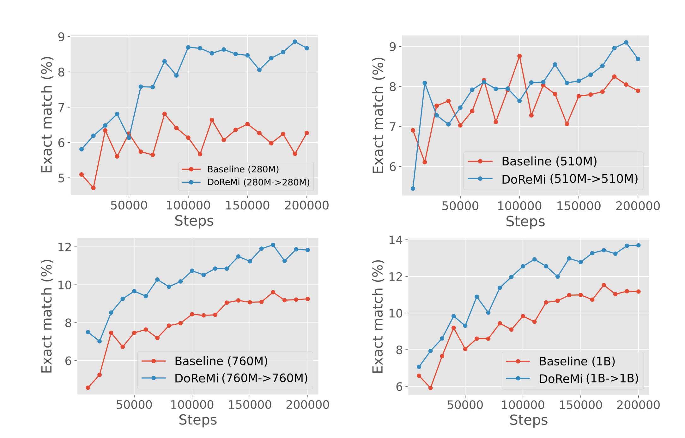
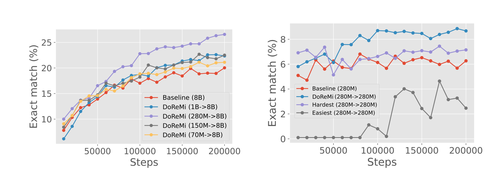
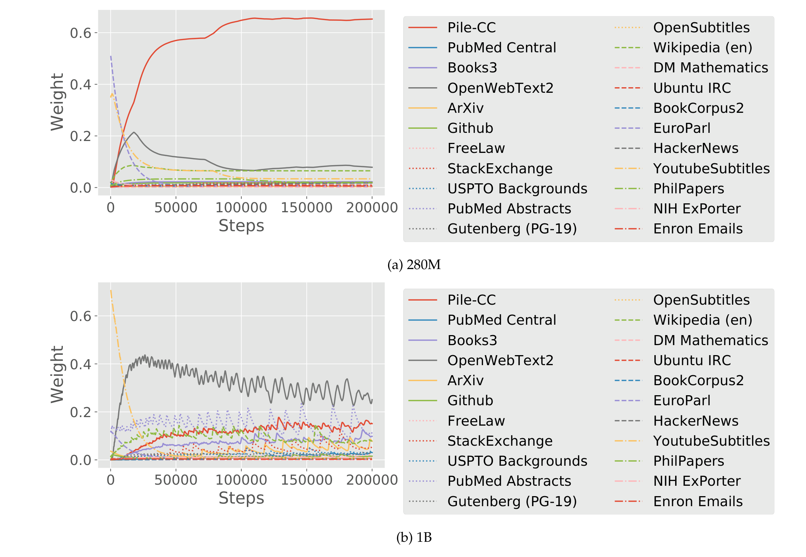

# DoReMi：Optimizing Data Mixtures Speeds Up Language Model Pretraining

## 来源

- 文件：`raw/Xie 等 - 2023 - DoReMi Optimizing data mixtures speeds up language model pretraining.pdf`
- 标题：DoReMi: Optimizing Data Mixtures Speeds Up Language Model Pretraining
- 团队 / 日期：Sang Michael Xie, Hieu Pham, Xuanyi Dong, Nan Du, Hanxiao Liu, Yifeng Lu, Percy Liang, Quoc V. Le, Tengyu Ma, Adams Wei Yu（Google DeepMind + Stanford）；arXiv:2305.10429v4，NeurIPS 2023
- 代码：<https://github.com/sangmichaelxie/doremi>
- 定位：数据混合优化方法论文，不是模型报告；核心是用 distributionally robust optimization 自动确定预训练数据的 domain 权重。

## 核心结论

1. **DoReMi 把数据混合优化建模为 minimax 问题**：给定 $k$ 个 domain 的预训练数据，DoReMi 先用小 reference model 建立 baseline，再用 Group DRO 训练 proxy model，使最坏情况 excess loss 最小化，由此产出 domain weights。整个过程不需下游任务知识（§2）。
2. **280M proxy 决定 8B 主模型的 domain weights**：在 The Pile 上，DoReMi 用 280M 参数的 reference/proxy 模型优化 domain weights（仅花主模型 8% 的 FLOPs），即可让 30 倍大的 8B 模型所有 domain 的 perplexity 下降，平均下游 one-shot 准确率提升 6.5 个百分点，达到 baseline 精度快 2.6x（Figure 2、Figure 3）。
3. **即使 downweight 某些 domain，该 domain 的 perplexity 也改善**：DoReMi 把大量权重集中到 Pile-CC（web text），同时大幅 downweight ArXiv / PubMed Central 等，但这些被 downweight 的 domain perplexity 仍然下降。论文用「最高/最低 entropy domain 可少训」+ 正迁移解释（Figure 4、§3.2）。
4. **在 GLaM 数据集上，DoReMi 不用下游任务就匹配了下游调优的 domain weights**：iterated DoReMi（3 轮收敛）的 domain weights 与 GLaM 论文用下游任务调出来的权重模式相似，下游准确率可比（Table 2、Figure 3b）。

## 算法

### 三步流程

> 论文 Figure 1 原文标题："Given a dataset with a set of domains, Domain Reweighting with Minimax Optimization (DoReMi) optimizes the domain weights to improve language models trained on the dataset."（§1 引言图）

**Step 1 — 训练 reference model**：用初始 domain weights $\alpha_{\text{ref}}$（如按 token 数比例）训练一个小 reference model $p_{\text{ref}}$（280M）。它捕获每个 domain 的 baseline 难度。

**Step 2 — 用 Group DRO 训练 proxy model，产出 domain weights**：在 proxy model $p_\theta$ 上跑 Group DRO，最小化最坏情况 excess loss。Excess loss 定义为 proxy model 与 reference model 的 loss 差 $\ell_\theta(x) - \ell_{\text{ref}}(x)$，衡量 proxy model 相对 reference model 还有多少提升空间。Group DRO optimizer 交替更新 domain weights $\alpha_t$（exponentiated gradient ascent，upweight 高 excess loss 的 domain）和 proxy model weights $\theta_t$（标准梯度下降）。最终取训练过程中 domain weights 的平均值 $\bar{\alpha} = \frac{1}{T}\sum_{t=1}^T \alpha_t$。

**Step 3 — 用新 domain weights 训练大模型**：用 $\bar{\alpha}$ 重采样数据，以标准方式训练大模型（8B）。

### Minimax 目标

DoReMi 的核心目标（§2 公式 1）：

$$\min_\theta \max_{\alpha \in \Delta^k} L(\theta, \alpha) := \sum_{i=1}^k \alpha_i \left[ \frac{1}{\sum_{x \in D_i} |x|} \sum_{x \in D_i} \ell_\theta(x) - \ell_{\text{ref}}(x) \right]$$

内层 maximization 把所有权重压到 excess loss 最高的 domain，外层 minimization 则让 proxy model 在最难的 domain 上尽量缩小与 reference model 的差距。

### Algorithm 1（Step 2 的 pseudocode）

每个 training step $t$：(1) 从 uniform domain weights 采样 minibatch；(2) 计算每个 domain 的 per-token excess loss $\lambda_t[i]$（clip 到 0 保证非负）；(3) 用 exponentiated gradient 更新 domain weights $\alpha'_t = \alpha_{t-1} \exp(\eta \lambda_t)$；(4) renormalize + smoothing $\alpha_t = (1-c) \frac{\alpha'_t}{\sum \alpha'_t} + c \cdot u$（$c = 10^{-3}$）；(5) 用 $\alpha_t$ 加权 loss 更新 proxy model。超参数 $\eta = 1$，$c = 10^{-3}$，全部实验未调。

### Iterated DoReMi

多轮运行：把上一轮的 $\bar{\alpha}$ 作为下一轮的 $\alpha_{\text{ref}}$，重新训练 reference model 和 proxy model。收敛判据：$\|\bar{\alpha} - \alpha_{\text{ref}}\|_\infty < 10^{-3}$。GLaM 数据集上 3 轮收敛。

## 实验

### 数据集

- **The Pile**：800GB，22 个 domain，default weights 是启发式设定的。DoReMi 用 default weights 作为 $\alpha_{\text{ref}}$。
- **GLaM dataset**：8 个 domain（Wikipedia / filtered webpages / conversations / forums / books / news 等），有下游调优的 domain weights 可对比。

### 模型与训练

- Reference / proxy model：280M 参数（decoder-only Transformer，12 层，12 head，768 dim，256k vocab）。
- 主模型：8B 参数（32 层，32 head，4096 dim）。
- 训练：batch size 512，max length 1024，Adafactor，lr=1e-3 exponential decay to 1e-4，200k steps (The Pile) / 300k steps (GLaM)。
- Domain weight 优化成本 = 训练两个 280M 模型 = 主 8B 模型 FLOPs 的 8%。

### 关键结果

> 论文 Figure 2 原文标题："DoReMi optimizes domain weights with a small model (280M params) and uses these domain weights to train a much larger model (8B params, 30x larger)."（§1）

> 论文 Figure 3 原文标题："Average one-shot downstream accuracy (exact match) on 5 tasks, with 8B parameter models trained on The Pile (left) and the GLaM dataset (right)."（§3.2）

**The Pile 结果**：

| 指标 | Baseline (8B) | DoReMi (280M→8B) |
|---|---|---|
| Avg one-shot accuracy | 20.03% | 26.56% (+6.5pp) |
| 达 baseline 精度所需 steps | 200k | 75k (2.6x faster) |
| Per-domain ppl 改善 | — | 22/22 domains |
| 优化额外 FLOPs | — | 8% of main model |

**The Pile domain weights 变化**（Table 1 摘要）：DoReMi 大幅 upweight Pile-CC（0.11→0.61），大幅 downweight ArXiv（0.11→0.004）、PubMed Central（0.11→0.005）、StackExchange（0.09→0.02）。尽管如此，所有 domain 的 perplexity 都改善。

> 论文 Figure 4 原文标题："Per-domain log-perplexity of 8B models on The Pile. Despite downweighting some domains, DoReMi improves log-perplexity on all domains."（§3.2）

**GLaM 结果**：iterated DoReMi 第 2 轮 domain weights 与下游调优的 oracle weights 模式相似（conversations 0.22 vs 0.27，books 0.17 vs 0.20），下游准确率可比。

### Scale 消融

> 论文 Figure 5 原文标题："Average one-shot downstream accuracy across 4 model scales (280M, 510M, 760M, 1B) where the reference/proxy models for DoReMi are the same size as the main model."（§4）

> 论文 Figure 6 原文标题："Average downstream accuracy for models trained on The Pile. (Left) Increasing the size of the reference/proxy models... (Right) Optimizing for the hardest or easiest domains rather than excess loss..."（§4）

关键发现：(1) proxy model 从 70M 到 280M 提升 8B 主模型性能，但 1B proxy 反而退化（Group DRO optimizer 在大 proxy 上效果变差）；(2) proxy model 训练质量不好（1B proxy 甚至低于 1B baseline），但产出的 domain weights 仍能让主模型加速 2x；(3) 只用 hardest 或 easiest domain 都不如完整 excess loss。

### Domain weight 轨迹

> 论文 Figure 8 原文标题："Exponential moving average of domain weights throughout a DoReMi run for 280M and 1B reference/proxy models."（附录）

## 局限与开放问题

- **Compute budget 依赖**：domain weights 在训练前 50k 步变化剧烈后稳定，暗示不同 compute budget 可能需要不同 domain weights（§6）。
- **Domain 定义太粗**：以数据来源定义 domain 只能做粗粒度控制。The Pile (22 domain) 比 GLaM (8 domain) 效果更明显，说明更细粒度的 domain 可能带来更大增益（§6）。
- **跨尺度迁移机制不明**：280M 产出的 domain weights 为何能迁移到 8B 仍不清楚（§6）。
- **Group DRO 在大 proxy 上退化**：1B proxy 效果不如 280M proxy，可能因 loss reweighting vs resampling 不一致。论文建议改用 resampling-based Group DRO（§4）。
- **可外推省算力**：domain weights 在 50k 步后稳定，理论上可以提前停 + 外推，但论文未实现（§6）。

## 相关页面

- [Qwen3 技术报告](../sources/qwen3.md) — Qwen3 的 instance-level data mixture（用轻量标注器按 instance 而非 domain 优化数据混合）是 DoReMi domain-level reweighting 的更细粒度演进路线。
- [TANDEM 技术报告](tandem.md) — Bi-level optimization + twin network 路线，DoReMi 的直接改进：动态 reference model 替代静态 reference，$O(T^{-1/4})$ 收敛保证，在 data-restricted 和 SFT 场景显著优于 DoReMi。
- [数据混合优化](../concepts/data-mixture-optimization.md) — 方法论谱系：从启发式 → Group DRO → 回归预测 → bi-level optimization。
