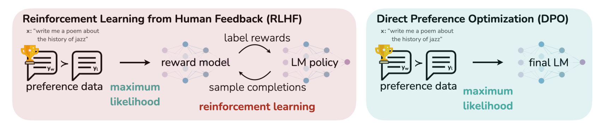
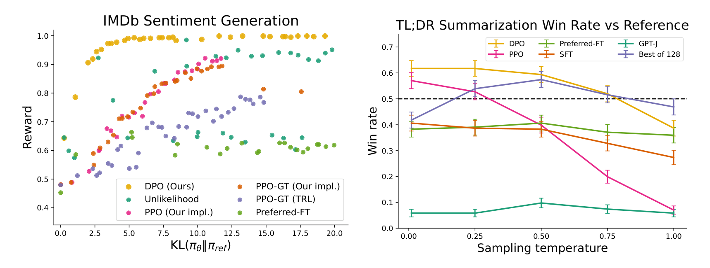
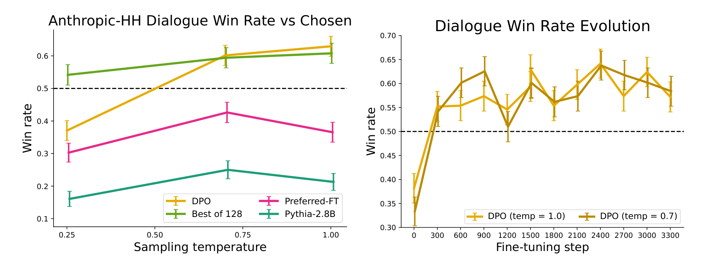

# DPO：Direct Preference Optimization

## 来源

- 文件：`raw/Rafailov 等 - 2023 - Direct Preference Optimization Your Language Model is Secretly a Reward Model.pdf`
- 标题：Direct Preference Optimization: Your Language Model is Secretly a Reward Model
- 团队 / 日期：Rafael Rafailov、Archit Sharma、Eric Mitchell、Stefano Ermon、Christopher D. Manning、Chelsea Finn；Stanford University + CZ Biohub；NeurIPS 2023；arXiv:2305.18290v3，2024-07-29
- arXiv：<https://arxiv.org/abs/2305.18290>
- 定位：这是 **offline 偏好对上的闭式对齐算法** 论文，不发布独立模型。主实验是 GPT-2-large / GPT-J / Pythia-2.8B，最大约 6B。
- 易混：本页是 **DPO**。仓库里已有的 [DAPO](dapo.md) 是 2025 年 ByteDance Seed 的 GRPO recipe，名字相邻、算法族完全不同。检索时先看这一行。

## 核心结论

1. **同一条 KL-constrained RLHF 目标可以不跑 RL**：标准目标是 $\max_\pi \mathbb{E}[r]-\beta D_{\mathrm{KL}}[\pi\|\pi_{\mathrm{ref}}]$。其最优策略有闭式 $\pi_r(y|x)=\frac{1}{Z(x)}\pi_{\mathrm{ref}}(y|x)\exp(r(x,y)/\beta)$。把 $r$ 反写成策略后，Bradley-Terry 只依赖奖励差，$Z(x)$ 消去，RLHF 变成一条对 $\pi_\theta$ 的 logistic 损失（§4、Eq. 3–7、Appendix A.1–A.2）。
2. **语言模型本身就是隐式奖励模型**：$\hat{r}_\theta(x,y)=\beta\log(\pi_\theta(y|x)/\pi_{\mathrm{ref}}(y|x))$。Theorem 1 称，在温和假设下，所有与 Plackett-Luce / Bradley-Terry 相容的奖励等价类都可以写成这个形式，不缩小可表示奖励类（§5.1）。
3. **梯度不是 naive unlikelihood**：DPO 提高 $y_w$、降低 $y_l$ 的似然，但按 $\sigma(\hat{r}_\theta(x,y_l)-\hat{r}_\theta(x,y_w))$ 加权——隐式奖励排反时权重大。去掉这个权重的 Unlikelihood 会退化（§4、Appendix Table 3）。
4. **小模型、离线偏好上对 PPO 不差**：IMDb 情感生成上 DPO 的 reward–KL 前沿严格优于 PPO，包括能看到 ground-truth reward 的 PPO-GT（Figure 2 left）。TL;DR 上 GPT-4 对参考摘要 win rate 约 61%（T=0），PPO 最优约 57%；Anthropic-HH 上 DPO 是唯一超过 test-set chosen 的可训练方法（Figure 2 right、Figure 3、§6.2）。
5. **边界不能省略**：数据是静态偏好对，训练时不从当前策略采样；最大模型 6B；主任务是情感 / 摘要 / 单轮对话，不是可验证 reasoning，也不是多轮 agent。论文自己把 OOD 泛化、reward over-optimization、更大规模列为未来工作（§7）。

## 架构与训练

### RLHF 三阶段，以及 DPO 砍掉的那两段

论文沿用 Ziegler 等的 RLHF 流水线（§3）：SFT → 用 $\pi_{\mathrm{SFT}}$ 采样成对回复并拟合奖励模型 → 用 PPO 最大化 $r_\phi-\beta\,\mathrm{KL}$。DPO 保留「有偏好对」这一前提，但不再单独训 RM，也不在训练环里采样。

> 论文 Figure 1 原文标题："DPO optimizes for human preferences while avoiding reinforcement learning. Existing methods for fine-tuning language models with human feedback first fit a reward model to a dataset of prompts and human preferences over pairs of responses, and then use RL to find a policy that maximizes the learned reward. In contrast, DPO directly optimizes for the policy best satisfying the preferences with a simple classification objective, fitting an implicit reward model whose corresponding optimal policy can be extracted in closed form."（第 2 页）

### 从最优策略反解奖励

KL-constrained 目标（Eq. 3）的最优解是（Eq. 4）：

$$
\pi_r(y\mid x)=\frac{1}{Z(x)}\,\pi_{\mathrm{ref}}(y\mid x)\,\exp\Bigl(\frac{1}{\beta}r(x,y)\Bigr),\qquad
Z(x)=\sum_y\pi_{\mathrm{ref}}(y\mid x)\exp\bigl(r(x,y)/\beta\bigr).
$$

反解得到（Eq. 5）$r(x,y)=\beta\log(\pi_r(y|x)/\pi_{\mathrm{ref}}(y|x))+\beta\log Z(x)$。Bradley-Terry 偏好（Eq. 1）只看 $r(x,y_1)-r(x,y_2)$，配分函数相消，偏好概率可以直接写成最优策略与参考策略的 log-ratio 差（Eq. 6）。于是对参数化策略 $\pi_\theta$ 做最大似然，得到 DPO 损失（Eq. 7）：

$$
L_{\mathrm{DPO}}(\pi_\theta;\pi_{\mathrm{ref}})=-\mathbb{E}_{(x,y_w,y_l)\sim\mathcal{D}}\Biggl[\log\sigma\Biggl(\beta\log\frac{\pi_\theta(y_w\mid x)}{\pi_{\mathrm{ref}}(y_w\mid x)}-\beta\log\frac{\pi_\theta(y_l\mid x)}{\pi_{\mathrm{ref}}(y_l\mid x)}\Biggr)\Biggr].
$$

Appendix B 的参考实现把同一式写成 `-logsigmoid(β · ((π_yw − π_yl) − (ref_yw − ref_yl)))`。默认超参：$\beta=0.1$（TL;DR 用 $0.5$）、batch 64、RMSprop、学习率 $1\times10^{-6}$、150 step 线性 warmup。

### 理论：选哪一个奖励，以及为什么 PPO 需要 baseline

奖励函数按「相差一个只依赖 $x$ 的 $f(x)$」分成等价类：同一类诱导相同偏好分布、相同最优策略（Lemma 1–2）。Theorem 1 的投影 $f(r;\pi_{\mathrm{ref}},\beta)$ 从每个等价类里挑出满足 $\sum_y\pi_{\mathrm{ref}}(y|x)\exp(r/\beta)=1$ 的那一个，也就是让 $\pi$ 本身是合法分布的那个成员。因此「用策略参数化奖励」不是额外限制，而是给欠定的 Plackett-Luce 族加上使最优策略可解析的约束（§5.1、Appendix A.5–A.6）。

§5.2 把 PPO 的不稳定读成：若不用这个投影，目标里仍有 $Z(x)$，它相当于 $\pi_{\mathrm{ref}}$ 的 soft value，需要 learned critic 或单样本 baseline 来降方差。DPO 的重参数化把这项消掉，所以不需要 actor-critic。

## 后训练

DPO 本身就是后训练算法，不是模型报告里的一段 recipe。论文给出的操作顺序（§4 DPO outline）：

1. 对每个 prompt 从 $\pi_{\mathrm{ref}}$ 采 $y_1,y_2$，收集人类偏好，得到离线数据集 $\mathcal{D}=\{(x,y_w,y_l)\}$。
2. 固定 $\pi_{\mathrm{ref}}$ 与 $\beta$，最小化 $L_{\mathrm{DPO}}$。

实践上常复用公开偏好集。若原 $\pi_{\mathrm{SFT}}$ 不可得，就先在 preferred completions 上做最大似然得到 $\pi_{\mathrm{ref}}$，减轻参考分布偏移。训练过程**不再采样**，这是它相对 PPO 的计算主张，也是它相对后来 [OPD](../concepts/multi-teacher-on-policy-distillation.md) / GRPO 的根本差别：DPO 的 $(y_w,y_l)$ 来自静态数据，不是当前策略的 on-policy rollout。

## 评测要点

三个任务都从同一形式的偏好集 $\mathcal{D}$ 学策略（§6）。

| 任务 | 数据 | 模型 | 对照 | 论文主张 |
| --- | --- | --- | --- | --- |
| 受控情感生成 | IMDb 前缀；偏好由预训练情感分类器生成 | GPT-2-large SFT | PPO、PPO-GT、Unlikelihood、Preferred-FT | DPO 的 true-reward vs KL 前沿最高，且优于能看见 ground-truth reward 的 PPO-GT（Figure 2 left；22 次 run 扫 target KL / $\beta$ / $\alpha$） |
| 摘要 | Reddit TL;DR + Stiennon 等人偏好 | GPT-J SFT（CarperAI） | PPO、Preferred-FT、SFT、GPT-J、Best of 128 | GPT-4 vs 参考摘要：DPO 约 61%（T=0），PPO 最优约 57%；DPO 对采样温度更稳（Figure 2 right） |
| 单轮对话 | Anthropic HH，170k | Pythia-2.8B 上 Preferred-FT 当 $\pi_{\mathrm{ref}}$ | Best of 128、Preferred-FT、2-shot Pythia | DPO 是唯一超过 test chosen 的可训练方法；作者把 Best of 128 当作 PPO 级代理，因公开 PPO HH checkpoint 未能超过 base（Figure 3） |

> 论文 Figure 2 原文标题："Left. The frontier of expected reward vs KL to the reference policy. DPO provides the highest expected reward for all KL values, demonstrating the quality of the optimization. Right. TL;DR summarization win rates vs. human-written summaries, using GPT-4 as evaluator. DPO exceeds PPO's best-case performance on summarization, while being more robust to changes in the sampling temperature."（§6 / 第 7 页）

> 论文 Figure 3 原文标题："Left. Win rates computed by GPT-4 for Anthropic-HH one-step dialogue; DPO is the only method that improves over chosen summaries in the Anthropic-HH test set. Right. Win rates for different sampling temperatures over the course of training. DPO's improvement over the dataset labels is fairly stable over the course of training for different sampling temperatures."（§6.2 / 第 8 页）

OOD：把 TL;DR 上训好的 DPO / PPO 直接评 CNN/DailyMail 新闻摘要（Table 1）。GPT-4 vs 数据集 ground-truth：DPO 在 T=0 / 0.25 为 0.36 / 0.31，PPO 为 0.26 / 0.23。论文称这是「初步证据」，并指出 PPO 还用了额外未标注 Reddit prompt，DPO 没有。

人类校准（Table 2，均对 greedy PPO）：DPO（T=0.25）人类 win 58%，GPT-4 (C) 54%；人类与 GPT-4 (C) 一致率 67%，人类之间 65%。论文据此用 concise 版 GPT-4 prompt 做主结果。样本量：DPO 272 人、SFT 122 人、PPO-1 199 人。

## 与其他页面的关系

- [LLM RL policy optimization 对比](../comparisons/llm-rl-policy-optimization.md)：DPO **不在** GRPO/PPO 那张表里。那一页的 DAPO/GSPO/SAPO/VAPO 改的是 on-policy RL 的 ratio、clip、critic 或采样；DPO 改的是「要不要 RL」。检索「DPO」若落到 DAPO，先回到本页。
- [On-Policy Distillation 跨报告对比](../comparisons/on-policy-distillation.md)：OPD 也常被说成「不用 RL」，但 OPD 是 **on-policy 轨迹 + teacher 分布上的 reverse-KL**；DPO 是 **off-policy 偏好对 + Bradley-Terry 分类**。两者都绕开 PPO 回路，监督来源不同。
- [Agentic 模型的后训练](../concepts/post-training-for-agentic-models.md)：2026 年已收录报告的后训练主轴是 RLVR / GRPO 家族和 MOPD，不是 DPO。DPO 是这条轴之前的离线偏好闭式解。
- [Ling-2.6](ling-2.6.md) 的 Bidirectional Preference Alignment 把正负向信号放进**显式 reward model**，不是本页的无 RM 闭式路线。
- [Iterative RPO](iterative-rpo.md)：在本页 Eq. 7 上给 winner 再加一条长度归一化 NLL（TRL `rpo_alpha`）。动机是纯 DPO 会压低 chosen logprob；GSM8K 上同数据 73.1 vs 61.8。

## 待追问

- 论文只做到 6B、单轮文本。DPO 在 2025–2026 的 agentic / RLVR 栈里几乎不出现，是因为静态偏好对覆盖不了可验证环境，还是后续文献里的 length bias、likelihood displacement 已经把它挤出生产？本仓库目前没有一手来源回答这个问题。
- 无 $\pi_{\mathrm{SFT}}$ 时用 preferred completions 拟合 $\pi_{\mathrm{ref}}$，对公开偏好集（HH、TL;DR）的分布偏移有多大？论文没有量化。
- Figure 3 右图后期 win rate 轻微回落，论文问这是不是 reward over-optimization 在 DPO 里的对应物，没有下结论。
- IPO / KTO / ORPO / SimPO 等后续偏好方法与 Eq. 7 的关系，原文没有讨论；不能把它们写成本论文的推论。[Iterative RPO](iterative-rpo.md) 是其中已核的一手来源（DPO+NLL），其余仍未 ingest。

## 相关页面

- 比较：[LLM RL policy optimization 对比](../comparisons/llm-rl-policy-optimization.md)、[On-Policy Distillation 跨报告对比](../comparisons/on-policy-distillation.md)
- 相邻算法：[DAPO](dapo.md)（名字易混）、[Iterative RPO](iterative-rpo.md)（DPO+NLL / TRL `rpo_alpha`）、[VAPO](vapo.md)、[Thinking Machines Lab On-Policy Distillation 博客](thinking-machines-on-policy-distillation.md)
- 概念：[Agentic 模型的后训练](../concepts/post-training-for-agentic-models.md)、[Multi-Teacher On-Policy Distillation](../concepts/multi-teacher-on-policy-distillation.md)
