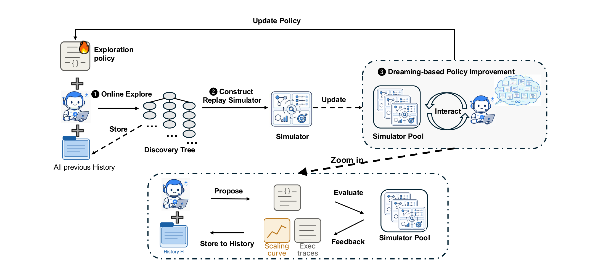
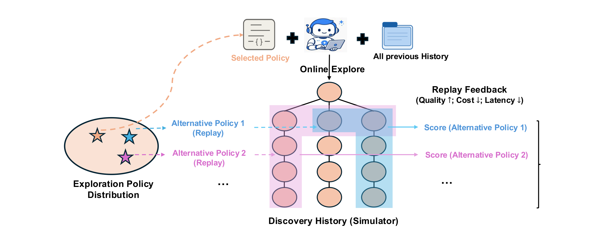
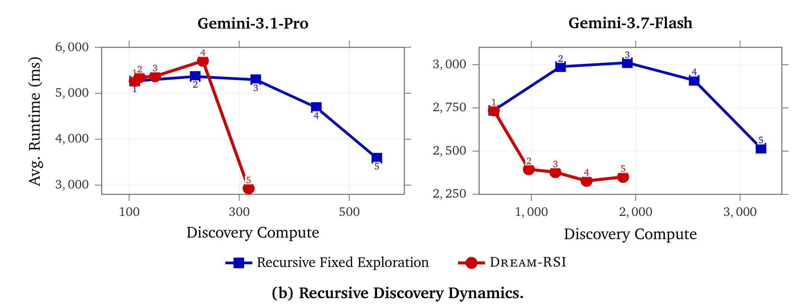
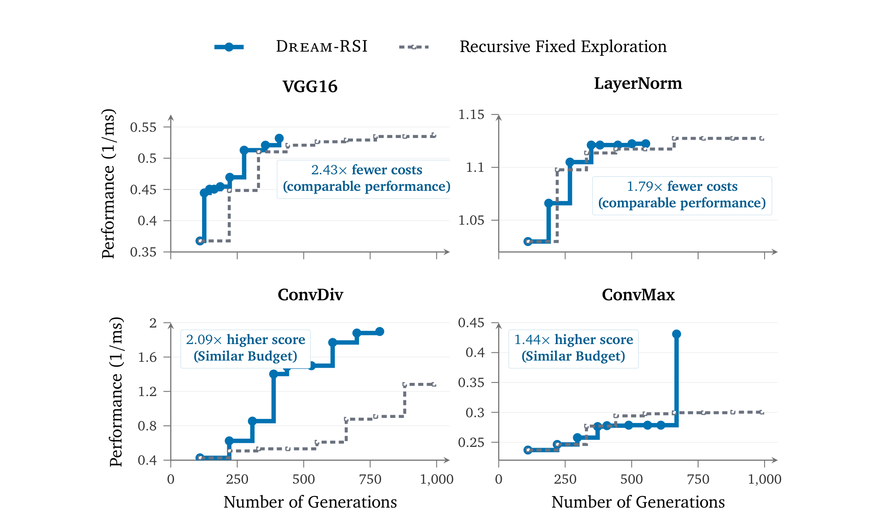
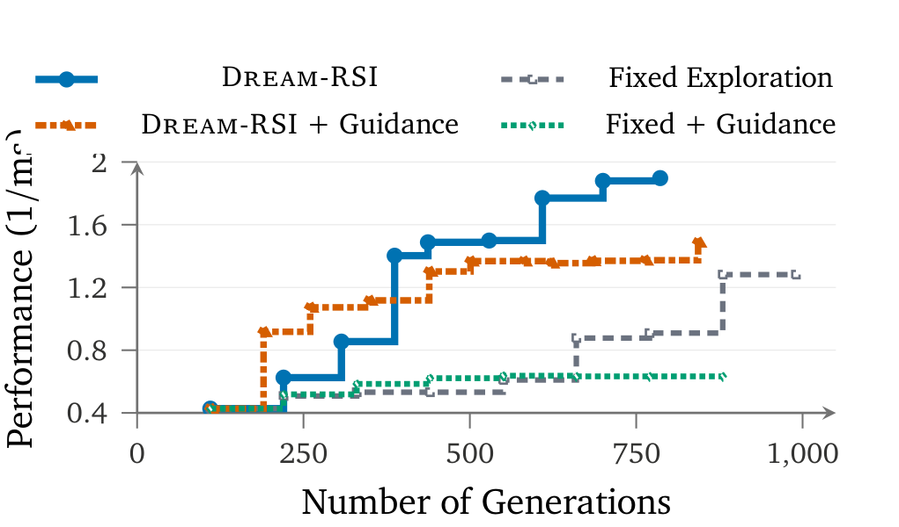
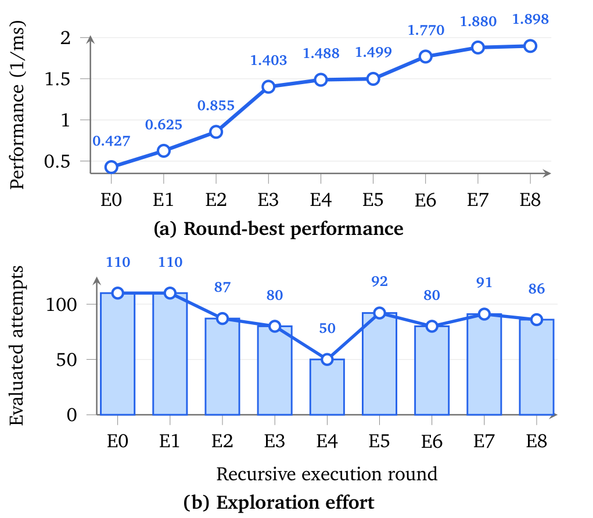

# Dream-RSI

## 来源

- 本地 PDF：[`raw/2609.14858v1.pdf`](../../raw/2609.14858v1.pdf)
- 原文：[arXiv:2609.14858v1](https://arxiv.org/abs/2609.14858)（2026-09-14，cs.CL）
- 作者：Tong Zheng 等。单位脚注为 Google、University of Maryland、Google DeepMind、University of Virginia。通讯作者 xidongwu@google.com、zzhangx@google.com（原文确证，首页）
- 篇幅：36 页。正文到第 12 页，其后是参考文献与附录（任务定义、提示词、发现的 Lasso 程序）
- 项目链接（印在首页）：[github.com/zhengkid/Dream-RSI](https://github.com/zhengkid/Dream-RSI)、[dream-rsi.com](https://dream-rsi.com)
- 未建模型页：发现 agent 与评测器保持不动，被改的是探索策略的可执行代码

## 核心结论

1. **自改进发生在探索策略，不发生在模型权重。** 一层轻量编排把分支、并行和停止写成可执行策略；底层 coding agent、评测器和执行接口不变。固定的 LLM 策略开发 agent 根据回放反馈改策略代码，再把选中的版本部署到下一轮在线发现（原文确证，§3 首段）。
2. **「世界」是已记录发现树的回放，不是学出来的动力学模型。** 脚注把 replay simulator 与 worlds 当作同义词。§2 用 Dreamer / world model 作类比；实现上，替代策略只揭开树上已经存好的子节点，不重跑 agent，也不生成树外结果（原文确证，§2、§3 Offline evaluation）。
3. **选择准则只保证历史树上的平均回放分不下降。** 候选集包含当前策略，所以选中版本的平均回放分不低于当前策略。这是固定历史 $\mathcal{H}_t$ 上的比较，正文没有把它写成下一轮在线质量的保证（原文确证，§3 Policy improvement and selection）。
4. **同协议对照是 Recursive Fixed Exploration。** 两者共享发现 agent、评测器、初始化和第一轮的手工并行精炼策略；之后固定探索保持策略不变，Dream-RSI 用累积历史改策略。成本按发现 agent 的累计调用次数计（原文确证，§4 开头）。
5. **质量–成本的增益依任务而异，而且有的平均被单套数据拉动。** Lasso 上两种 Gemini 的平均 held-out 延时更低、调用更少；Pro 的六套里只有 RCV1 快于固定探索。数学三题里和差集更好、圆填充打平、自相关略差。KernelBench 四题的论文标注是少 1.79×–2.43× 调用，或同分预算下最高 2.09× 性能（原文确证，§4、Figure 3–4、Table 1）。

## 架构与训练

本文没有新的网络结构，也没有预训练。「架构」是发现循环外面的编排接口。

### 三阶段环

> 原文 Figure 1：Online Explore、Construct Replay Simulator、Dreaming-based Policy Improvement。放大框里是提出策略、在模拟器池上评测、把轨迹存回历史。

在线阶段，当前策略 $\pi_t$ 带着已完成历史 $\mathcal{H}_{t-1}$ 去长一棵新树 $\mathcal{T}_t$，历史与这棵新树分开。树追加进历史后进入离线阶段。离线阶段历史冻结，策略开发 agent 在同一批树上改出多个策略版本并打回放分，选中的版本成为 $\pi_{t+1}$（原文确证，§3）。

### 决策接口

发现树根在 $r$，表示初始工作区。每个非根节点只有一个主父节点：发现 agent 从父节点保存的工作区继续，节点记下文件系统快照、产物、诊断和分数 $s_v$，分数越大越好。

在线与回放共用动作接口。当前可见树的可行动作点是根加上叶子。$W \ge 1$ 个并行 worker 各执行一次生成–评测。策略的动作是一批节点 $C$，且 $|C| \le W$。空批或打满轮数上限即停止（原文确证，§3 Discovery trees and the shared decision interface）。

在线转移是随机的：同一工作区可以生成不同结果。回放转移是确定的：选出非空批之后，只揭开记录里还没见过的子节点。非根节点若有记录子节点，就揭开那一个；根每次揭开最早创建、且尚未揭开的那个子节点。没有记录延续时子节点集为空。单条分支内部的父子顺序不能重排，树外结果不会被生成（原文确证，§3 Offline evaluation）。

Figure 2 的图注写「换分支、换顺序、换并发、换停止」。形式化规则比这窄：根上的新分支按创建时间依次揭开，分支内部沿记录顺序走。读机制时以 §3 的 `Child` 规则为准。

> 原文 Figure 2：部署策略先在线探索；替代策略在同一棵发现历史上回放，反馈同时看质量、成本与延迟。

### 回放目标

对固定系数 $\beta_1, \beta_2 \ge 0$，一条策略在一棵树上的回放分是

$$
V = \max s_v - \beta_1 N + \beta_2 \frac{N}{\max\{1, k^\star\}}
$$

第一项是揭开子树里的最好分数，第二项惩罚揭开的非根节点数 $N$（对应本来要花的生成–评测次数），第三项奖励每个决策轮上的平均并行度。$k^\star$ 是结束时已完成的决策轮数。策略版本的分数是它在全部历史树上的平均。正文没有给出 $\beta_1, \beta_2$ 的数值（原文确证，式 (1) 与 §3 Replay objective）。

附录 B 的策略改进提示词里另有一个名为 beta 的旋钮：单次回放或在线回合内固定，离线评测扫一条 beta 网格；高 beta 表示更宽、更有耐心、剪枝更弱，低 beta 相反。跨轮默认值按最近 2–3 次 live 曲线和 sweep 调整，步长约 0.1–0.2，夹在 $[0, 1]$。论文没有把这个旋钮写成式 (1) 的 $\beta_1, \beta_2$（原文确证，Appendix B.2；「未等同」是本页对两处文本的核对）。

### 和邻近 RSI 差在改哪一层

| 系统 | 冻结的东西 | 被改的对象 | 离线信号 |
| --- | --- | --- | --- |
| Dream-RSI | coding agent、评测器、执行接口 | 探索策略代码（分支、并行、停止） | 已记录发现树上的回放分 |
| [Macaron MindForge](macaron-v1.md) | base 权重 | HCP / skill / hook，通过后再用轨迹训 LoRA | 真实 harness 上的任务评测 |
| [SoL-Pi](sol-pi.md) | Pi 0.84.2 核心 | 交互环里的 token 开销 | 预声明能力地板内的 auto-research |
| [Prime Agent](prime-agent.md) | L0 权重 | 轨迹内的 notes、memories、skills、subagent specs | 任务执行中的 refine，不建回放树 |

## 后训练

本文没有权重后训练。策略开发 agent 是固定 LLM，它读回放轨迹和先前修订的反馈，改的是探索策略的源代码。离线阶段做 $M \ge 1$ 个版本，从当前策略 $\pi_t$ 起；每个版本都在当时已有的每一棵历史上评测。$M$ 次修订后，按平均回放分取最好的一版部署。因为当前策略仍在候选集里，选中版的平均回放分不低于当前版（原文确证，§3 Policy improvement and selection）。

论文没有写出 $M$、在线轮数上限 $K_1$、回放轮数上限 $K_2$ 的实验取值，也没有点名策略开发 agent 用的是哪一个模型。实验里写出的是发现 agent 与每轮预算上限，见下节。

## 评测要点

发现 agent 经 Gemini CLI 调用。Gemini-3.1 Pro 的初始策略是 10 个并行工作区、每区最多 11 步精炼，每轮上限 $10 \times 11 = 110$ 次调用。Gemini-3.7-Flash 是 32 个工作区、每区最多 20 步，每轮上限 640 次。Dream-RSI 保持同一上限；固定探索把上限用满，Dream-RSI 的累计调用更少，与策略可以提前交空批一致（原文确证，§4）。正文和附录都没有报告重复次数、标准差或多种子。

八个任务：Lasso 正则化路径、三道数学发现、KernelBench 上的四个 GPU kernel。

### Lasso：平均更好，Pro 的平均主要来自 RCV1

设定跟随 SimpleTES。搜索用 17 个合成实例。正确性要求每个 $\lambda$ 上的目标值不超过 sklearn 解加 $10^{-6}$，否则搜索分为 0；搜索分本身是各实例耗时的几何平均的倒数。表里的数字是另一件事：六套 held-out 数据上整条正则化路径的 wall-clock 毫秒，越低越好（原文确证，§4.1 与 Appendix A）。

两行 SimpleTES 都标 gpt-oss-120b、51,200 次生成。带 $\dagger$ 的第二行全文没有定义。

| 方法 | 模型 | 调用 | Gisette | RCV1 | DNA | Leukemia | Colon | Duke Breast | 平均 |
| --- | --- | ---: | ---: | ---: | ---: | ---: | ---: | ---: | ---: |
| sklearn | – | – | 11275.2 | 252881.7 | 93.8 | 227.2 | 229.8 | 374.0 | 44180.3 |
| glmnet | – | – | 9063.6 | 73072.8 | 351.9 | 45.0 | 24.2 | 47.7 | 13767.5 |
| SimpleTES | gpt-oss-120b | 51200 | 3141.9 | 19625.6 | 15.9 | 15.5 | 11.6 | 18.1 | 3804.8 |
| SimpleTES † | gpt-oss-120b | 51200 | 8651.0 | 41143.1 | 37.6 | 28.2 | 19.5 | 31.1 | 8318.4 |
| 固定探索 | Gemini-3.1 Pro | 550 | 1861.8 | 19550.1 | 41.5 | 26.1 | 14.5 | 28.4 | 3587.1 |
| 固定探索 | Gemini-3.7-Flash | 3200 | 1133.1 | 13873.0 | 29.8 | 24.1 | 15.7 | 24.4 | 2516.7 |
| Dream-RSI | Gemini-3.1 Pro | 317 | 2841.0 | 14616.0 | 49.9 | 30.2 | 16.4 | 32.5 | 2931.0 |
| Dream-RSI | Gemini-3.7-Flash | 1879 | 1091.9 | 12923.4 | 31.4 | 21.0 | 12.2 | 23.6 | 2350.6 |

五轮。相对同模型的固定探索，Pro 的调用比是 $550/317 \approx 1.7$，Flash 是 $3200/1879 \approx 1.7$，与摘要里的 1.7× 一致。摘要的「相对 SimpleTES 最多 162×」对应 $51200/317$；两端模型不同，不能当成同模型消融。

Dream-RSI 两行的六套延时都低于 sklearn 与 glmnet。相对固定探索要分开看：Pro 只有 RCV1 更快（14616.0 对 19550.1），其余五套更慢，平均仍从 3587.1 降到 2931.0，因为 RCV1 的毫秒数比其余五套大一个数量级。Flash 只有 DNA 略慢（31.4 对 29.8），平均从 2516.7 降到 2350.6。论文自己也写：Pro 发现的程序特别适合 RCV1 这种大规模矩阵，Flash 发现的程序在不同规模上更稳（原文确证，§4.1；「五套更慢」是对本表逐格比较）。

> 原文 Figure 3(b)：标记旁的数字是递归轮次。纵轴是六套 held-out 的平均运行时间，越低越好。Figure 3(a) 的表已改排为上表。

图上 Pro 的红线在前四轮没有落到蓝线下面，第 5 轮才落到约 3000 ms、横轴停在 317 附近。Flash 的红线在第 2 轮就落到 2400 ms 一带并保持，蓝线先升到约 3000 ms 再在 3200 次调用处结束。正文写两条轨迹「明显分开、Dream-RSI 持续更好」；Pro 的「更好」指的是这条平均曲线的终点，不是每一轮、每一套都更好。

附录 C 给出发现的求解器。论文对它的描述是：强规则筛选加上 Cauchy–Schwarz 的 KKT 剪枝，界不能证明时才重算精确梯度，剪枝失效则整列刷新；并配有 active-set 记账、惰性 Gram 矩阵和面向硬件的实现。SimpleTES 则按问题维度在 LARS 与坐标下降之间切换（原文确证，§4.1 Discovered Solver Analysis）。本页不把附录源码当成独立的正确性证明。

### 数学发现：三题只有和差集拉开同模型对照

Gemini-3.1 Pro，10 轮。论文写本方法用了不到 1,000 次生成，并据此说相对 SimpleTES 的 51,200 次有超过 50× 的预算节省。Table 1 没有逐题列出调用次数，所以 50× 是这段散文相对 1,000 这个上界的说法，而且两边模型不同（原文确证，§1 与 §4.2）。

| 方法 | LLM | Sum Diff ↑ | Auto Correlation ↓ | Circle Packing ↑ |
| --- | --- | ---: | ---: | ---: |
| AlphaEvolve | Gemini-2.0 Pro + Flash | – | 1.455700 | 2.635862 |
| AlphaEvolveV2 | Gemini-2.0 Pro + Flash | 1.121936 | – | **2.635983** |
| OpenEvolve | – | – | 1.460000 | – |
| CodeEvolve | – | – | – | 2.635980 |
| ShinkaEvolve | Mixed | – | 1.457800 | 2.635982 |
| TTS-Discovery | Qwen3-8B | – | – | **2.635983** |
| ThetaEvolve | Distilled-Qwen3-8B | – | 1.493000 | **2.635983** |
| EvoX | Gemini-3.0-Pro | – | 1.458900 | 2.635900 |
| SimpleTES | GPT-OSS-120B | 1.143975 | **1.453675** | **2.635983** |
| 固定探索 | Gemini-3.1 Pro | 1.144047 | 1.456001 | **2.635983** |
| Dream-RSI | Gemini-3.1 Pro | **1.145427** | 1.456375 | **2.635983** |

和差集 Dream-RSI 高于同模型固定探索和 SimpleTES。圆填充与固定探索、SimpleTES、AlphaEvolveV2、TTS-Discovery、ThetaEvolve 同为 2.635983。自相关越低越好：SimpleTES 最好，Dream-RSI 的 1.456375 还略高于固定探索的 1.456001。论文对自相关的措辞是「仍有竞争力」，并指出 SimpleTES 的 51,200 次远多于本方法的不到 1,000 次。

附录定义了三道自相关不等式：$\Phi_1$、$\Phi_3$ 最小化，$\Phi_2$ 最大化。表头规定这一列越低越好，因此不是 $\Phi_2$；正文没有写它是 $\Phi_1$ 还是 $\Phi_3$。圆填充附录写 $n \in \{26, 32\}$，主表只有一个标量，没有写对应哪一个 $n$（原文确证，Appendix A 与 Table 1）。

### GPU kernel：论文给的是图上倍率

四个 KernelBench 任务：VGG16、LayerNorm、ConvDiv、ConvMax。指标是正确性约束下的 $1/\mathrm{ms}$，发现 agent 为 Gemini-3.1 Pro。§4.3 没有单独列出每题轮数。

> 原文 Figure 4：纵轴为性能 $1/\mathrm{ms}$，越高越好。标注为 VGG16 少 2.43× 调用、LayerNorm 少 1.79×、ConvDiv 高 2.09×、ConvMax 高 1.44×。

这些倍率是图中标注和正文给出的数字，本页没有从像素再量一遍横轴。摘要里的「少 1.79×–2.43× 次生成，或同分预算下最高 2.09×」与这四条标注对应；ConvMax 的 1.44× 小于摘要用的「最高 2.09×」。

### 历史当提示词，差于历史当回放

§5.1 把历史轨迹摘要成方向性文字、注入后续轮的提示，同时加到固定探索和 Dream-RSI 上。ConvDiv 上，带 guidance 的两条曲线都低于各自不带 guidance 的对照。论文的解释是：多条并行探索已经在跑时，强语义归纳偏置会收窄搜索（原文确证，§5.1、Figure 5）。

> 原文 Figure 5：把历史用作可交互的回放模拟器，优于只把它写成提示里的方向指导。

### 探索量会先减后增

ConvDiv 的逐轮最好性能与当轮评测次数（图上 E0–E8）：

| 轮 | E0 | E1 | E2 | E3 | E4 | E5 | E6 | E7 | E8 |
| --- | ---: | ---: | ---: | ---: | ---: | ---: | ---: | ---: | ---: |
| 最好性能 $1/\mathrm{ms}$ | 0.427 | 0.625 | 0.855 | 1.403 | 1.488 | 1.499 | 1.770 | 1.880 | 1.898 |
| 评测次数 | 110 | 110 | 87 | 80 | 50 | 92 | 80 | 91 | 86 |

E0–E1 用满 Pro 的 110 次上限。次数先降到 E4 的 50，E5 回到 92 时分数几乎不动（1.488 → 1.499），明显的再提升出现在 E6（1.770）。论文的概括是：变好时先省计算，平台期再加大探索并伴随进一步收益（原文确证，§5.2、Figure 6）。「伴随」与 E5 的滞后同时成立：加量的下一轮才看到大的分数跳变。

> 原文 Figure 6：(a) 各轮最好性能；(b) 各轮评测次数。

## 待追问

- **需实验或作者披露**：固定历史上的回放分不下降，下一轮在线发现质量是否同向？正文的选择定理只覆盖 $\mathcal{H}_t$ 上的平均 $V$。
- **需实验或作者披露**：想走未记录分支的策略在回放里得到空延续。这种只覆盖已实现搜索空间的偏置，对在线迁移有多大？
- **需实验或作者披露**：全文没有重复次数或方差。Lasso、数学和 kernel 的曲线是单次运行还是多次中的某一次？
- **需作者披露**：SimpleTES † 与不带 † 的一行差在哪？Table 1 的自相关列是 $\Phi_1$ 还是 $\Phi_3$？圆填充的 2.635983 对应 $n=26$ 还是 $n=32$？策略开发 agent 是哪一个模型？式 (1) 的 $\beta_1, \beta_2$ 取多少，附录的 beta 旋钮是否就是它们？
- **需实验或作者披露**：Lasso 的 Pro 平均优势几乎来自 RCV1。若按数据集等权或看中位数，结论是否还在？论文没有做这组汇总。
- **需实验或作者披露**：自相关上 Dream-RSI 略差于固定探索。回放目标里的调用惩罚，会不会在目标已经接近平台时主动少搜？

## 相关页面

- [Agent harness](../concepts/agent-harness.md) - 探索策略代码是膜的一种；与 HCP、Pi 效率层、Continual Harness 改的对象不同
- [Agentic engineering](../concepts/agentic-engineering.md) - 长周期发现的编排层
- [Macaron-V1 技术报告](macaron-v1.md) - MindForge 搜的是 HCP，证据停在单次 harness search
- [SoL-Pi 官方博客](sol-pi.md) - 同一类「先改外层再谈扩大 RSI」，搜的是 token 开销
- [Prime Agent 技术报告](prime-agent.md) - 冻结权重，自改进写在轨迹内的 harness 状态
- [Qwen-AgentWorld 技术报告](qwen-agent-world.md) - 学出来的语言世界模型；Dream-RSI 的 worlds 是回放
- [Looped World Models](looped-world-models.md) - Dreamer 式隐状态世界模型；本篇只借用 Dreamer 的动机
