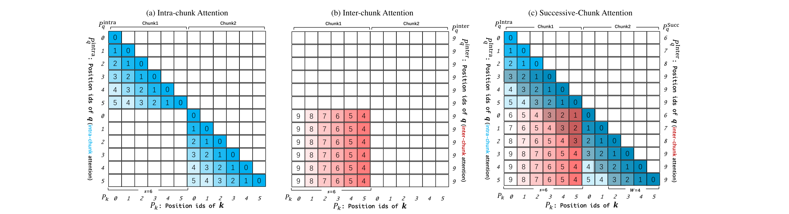
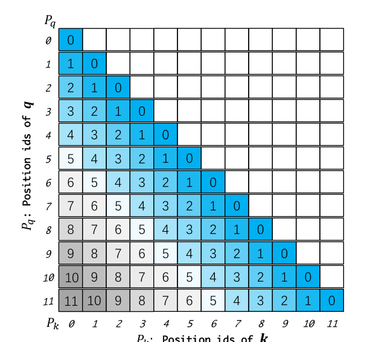
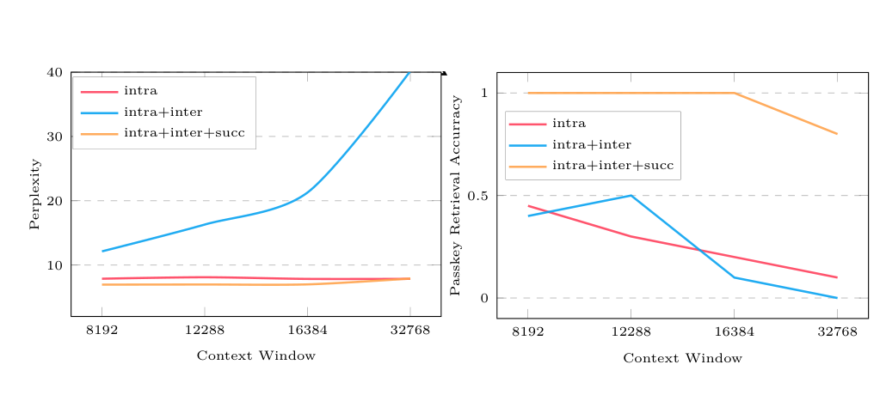

# Dual Chunk Attention：无训练长上下文扩展

## 来源

- 文件：`raw/2402.17463v2.pdf`
- 标题：Training-Free Long-Context Scaling of Large Language Models
- 团队 / 日期：Chenxin An（港大，实习于阿里）、Fei Huang（阿里）、Jun Zhang、Shansan Gong（港大）、Xipeng Qiu（复旦）、Chang Zhou（阿里）、Lingpeng Kong（港大）；通讯 `cxan23@connect.hku.hk`；arXiv:2402.17463v2，2024-05-29（v1 2024-02-27）；ICML 2024 / PMLR 235
- 代码：[HKUNLP/ChunkLlama](https://github.com/HKUNLP/ChunkLlama)
- 定位：**方法论文，非模型报告**。不发布新基座；用 monkey patch 替换 `LlamaAttention` 推理代码。机制归属 [零样本 RoPE 上下文扩展](../concepts/zero-shot-rope-context-extension.md) 的分组 / 分块位置族。ChunkLlama 是实现名，不是新模型。

## 核心结论

1. **DCA 改的是注意力里的相对位置矩阵，不是权重、也不是稀疏核**。它不把位置索引做 PI 式线性压缩，也不改 RoPE base（§1）。长序列切成小于预训练窗的 chunk，用三套 query 位置索引分别算 Intra-Chunk / Inter-Chunk / Successive-Chunk，key 侧循环复用原版位置以便 KV cache（§3、Eq. 2–8）。全部 query–key 对仍参与 softmax，只是不同区块用不同相对角。
2. **Training-free**。实现是替换推理期 `LlamaAttention`；可选的 7B/13B 对话微调不是主结果（§4.1）。与 Flash Attention 2 兼容：三次 FA 调用后按支路质量合并，显存和速度接近原版 FA（§3.4、Figure 3、Algorithm 1）。
3. **Llama2 4k 权重可外推过 32k，70B 过 100k**。PG19 上 ChunkLlama2 7B 从 4k 的 7.87 到 32k 的 7.89（+0.02）；70B 从 5.24 到 96k 的 5.80（+0.56），128k 为 6.12（Table 1–2）。摘要写「more than 100k」；正文把「只涨 0.56 PPL」钉在 96k（§4.2）。
4. **与 PI / NTK 正交可叠加**。Together-32k（PI）和 CodeLlama（NTK）只需改 chunk size（实验取 24k）就能再外推到 192k，PPL 不爆；叠上 DCA 的 Together 在 192k passkey 仍约 90%（§1 正交性、Table 2、Figure 7）。这与后来 [Qwen3](qwen3.md) 的 YaRN + DCA 配方是同一类叠加，不是把 DCA 写成 YaRN。

> Figure 2（原文截图，§3）："Visualization of the Relative Position Matrix $M$ employing Dual Chunk Attention (DCA), with chunk size $s=6$, pretraining window size $c=10$, and local window size $w=4$ noted by the shadow in (c)."

## 机制（已据原文核实）

RoPE 的失败被写成：相对位置 $M[i][j]=P_q[i]-P_k[j]$ 一旦越出预训练窗，就是未见过的角（§2.2、Figure 1）。PI / NTK 用缩小 $|M|$ 把角压回去，代价是分辨率。DCA 改 $M$ 的构造，让每个条目仍落在 $[0,c)$。

> Figure 1（原文截图，§2.1）："Visualization of the Relative Position Matrix $M$ utilizing standard RoPE. The pretraining context window is 6 and the input sequence length is 12."

设序列长 $l$、chunk size $s$（须 $<$ 预训练窗 $c$）、局部窗 $w$。Llama2 实验取 $s=\tfrac{3}{4}c=3072$，$w$ 可直接取 $c-s$（§3.3、§4.1）。Key 位置对所有支路共用

$$
P_k = P_q^{\mathrm{Intra}} = [0,1,\ldots,l-1]\bmod s. \tag{Eq. 2}
$$

Query 按块差换三套索引：

| 支路 | 何时用 | Query 位置 | 相对角 |
| --- | --- | --- | --- |
| Intra-Chunk | $\lfloor i/s\rfloor=\lfloor j/s\rfloor$ | 与 key 同样循环 | 块内标准 RoPE（Eq. 3–4） |
| Inter-Chunk | $\lfloor i/s\rfloor-\lfloor j/s\rfloor>1$ | 全部 $c-1$ | $c-1-P_k[j]\ge c-s$（Eq. 5–6） |
| Successive-Chunk | 相邻块，差恰好 1 | 每块 $[s,\ldots,s+w-1,c-1,\ldots]$ | 交界 $w$ 个邻域保持近距离（Eq. 7） |

合并后的分段公式（§3.3 末、Eq. 8）：

$$
\mathbf{q}_i^\top\mathbf{k}_j=
\begin{cases}
f(\mathbf{q},P_q^{\mathrm{Intra}}[i])^\top f(\mathbf{k},P_k[j]) & \lfloor i/s\rfloor-\lfloor j/s\rfloor=0\\
f(\mathbf{q},P_q^{\mathrm{Succ}}[i])^\top f(\mathbf{k},P_k[j]) & \lfloor i/s\rfloor-\lfloor j/s\rfloor=1\\
f(\mathbf{q},P_q^{\mathrm{Inter}}[i])^\top f(\mathbf{k},P_k[j]) & \lfloor i/s\rfloor-\lfloor j/s\rfloor>1
\end{cases}
$$

然后对**全部**历史 key 做一次 softmax（Eq. 9）。名字叫 Dual，是因为 Successive 被写成 Inter 的特例，用来补「相邻块交界相对距离被拉大、局部性丢失」这一条（§3.3：绝对距离 1 的 $q_6,k_5$ 在纯 Inter 下相对距离变成 4）。

Eq. 6 排版把 $P_q^{\mathrm{Intra}}[i]$ 写成了 $c-1-P_k[j]$ 的左端；同段刚定义的是 $P_q^{\mathrm{Inter}}=[c-1,\ldots]$，分段公式也用 Inter。本页按 Inter 读。

### 与 Flash Attention

Appendix A.3 / Algorithm 1：对当前 query 调三次 Flash Attention——Intra（当前块、causal）、Successive（上一块、非 causal）、Inter（更早块、非 causal）——再按各支路 attention map 的质量加权合并输出。复杂度仍是对全部历史 key 做注意力，不是 top-k / 滑窗稀疏。没有 FA 时 Llama2 7B/13B 大约只能到 16k、70B 到 5k（脚注 1）；接上 FA 后速度和显存接近原版 Llama 自注意力（Figure 3）。

### 和 Self-Extend / YaRN 的边界

Self-Extend（Jin et al., 2024，本篇参考文献、§2.2 同引）是双窗近亲：局部窗走原版 RoPE，远处把位置分组共享。Self-Extend 不单独建来源页。DCA 把「远处」再拆成相邻块（Successive，保留局部）和更远块（Inter，query 钉在 $c-1$）。[Jet-Long](jet-long.md) 继承的是 Self-Extend 那条双窗，把 DCA 当固定 chunk 的三路基线。

[YaRN](yarn.md) 改的是 RoPE **频率表**和 softmax 温度；DCA 改的是注意力里的 **位置索引**。二者正交，可以叠在已经 PI / NTK / 长窗续训过的权重上（§1、§4.2）。不要把 DCA 写成 YaRN，也不要写成稀疏注意力——Sparse Transformer 只是 chunk 切分的启发（§3 开篇引 Child et al. 2019）。

## 评测要点

Table 1（PG19 validation，红字 = 相对 4k 预训练窗 PPL 涨超过 1.0；PI / NTK 的 scaling factor 动态变）：

| 模型 | 4k | 8k | 16k | 32k | 64k |
| --- | --- | --- | --- | --- | --- |
| Llama2 7B | 7.87 | $>10^2$ | $>10^2$ | $>10^2$ | $>10^2$ |
| Llama2-NTK-Yarn 7B | 7.87 | 8.06 | 9.82 | 11.74 | 41.57 |
| ChunkLlama2 7B | 7.87 | 7.67 | 7.64 | 7.89 | 15.87 |
| ChunkLlama2 13B | 7.15 | 6.95 | 6.99 | 7.90 | 15.14 |
| ChunkLlama2 70B | 5.24 | 5.18 | 5.21 | 5.30 | **5.59** |
| ChunkLlama3 8B | 9.04 | 8.71 | 8.61 | 8.62 | 8.95 |
| ChunkLlama3 70B | 5.36 | 5.16 | 5.14 | 5.14 | 5.21 |

7B/13B 在 64k 已经爆；70B / Llama3 才把「training-free 过 32k、PPL 几乎不涨」撑住。ReRoPE 16k OOM，当时不兼容 FA。

Table 2（更长窗；ChunkLlama2 70B 相对 4k 的 ΔPPL）：

| 模型 | 位置 | 训练窗 | 32k | 64k | 96k | 128k | 160k | 192k |
| --- | --- | --- | --- | --- | --- | --- | --- | --- |
| ChunkLlama2 7B | RoPE | 4k | 7.89 | 15.87 | 43.57 | 96.21 | $>10^2$ | $>10^2$ |
| ChunkLlama2 70B | RoPE | 4k | 5.30 | 5.59 | **5.80**（+0.56） | 6.12 | 6.52 | 7.05 |
| ChunkLlama3 70B | RoPE | 8k | 5.14 | 5.14 | 5.21 | 5.32 | 5.40 | 5.45 |
| ChunkCodeLlama 7B | NTK | 16k | 8.36 | 8.13 | 8.33 | 8.66 | 9.30 | 9.83 |
| ChunkTogether 7B | PI | 32k | 7.64 | 7.59 | 7.64 | 7.67 | 7.74 | **7.83** |

100k 主张的证据边界：70B 在 96k 仍只 +0.56；128k 的 6.12 尚未标红（红线是 +1.0），160k 起标红。7B 单独用 DCA 过不了 64k；要到 192k 得叠已经 16k/32k 训过的 PI/NTK 模型。

Table 3（few-shot，prompt 上限 16,384，超长从左边截断）。ChunkLlama2 70B 平均 **37.8** vs 原版 Llama2 70B 29.5（+8.3）vs LongLoRA 70B 37.2 vs Llama2 Long 70B 40.7（续训 400B token / 100k step）。下游数字停在 16k 截断，不能当成 100k 理解任务。

Table 4（L-Eval 四项闭卷，输入 3k–27k）。ChunkLlama2-Chat 70B 平均 **63.20**，gpt-3.5-16k-0613 为 67.03，即摘要的 **94%**。弱项是 Coursera（48.54 vs 63.51）。这是 16k 量级对话任务，不是 100k。

Passkey（Appendix A.1）：Llama2 13B + DCA 在 18k 内各深度 100%（Figure 5）；4k 权重高准确率维持到约 32k；Together-32k + DCA 到 192k 仍约 90%（Figure 7）。作者观察到失败先出现在序列**开头**，与 NTK「中间崩」不同。

> Figure 4（原文截图，§4.4）："Ablation study of DCA on language modeling (left) and passkey retrieval (right). We test the three attention mechanisms with input sequences from 8k to 32k."

可选微调不是主结果：7B/13B 用 ShareGPT+AlpacaGPT4 的 5,405 条长对话、16k 步、batch 1，约 40 / 60 GPU hour（§4.1）。微调后 13B chat 平均 57.94，超过 Vicuna-v1.5-13B-16k 的 56.19（Table 4）。

## 与已有沉淀的关系

- **[YaRN](yarn.md)**：频率切分 + attention temperature。DCA 不碰频率表。Qwen3 的公开推理是 YaRN + DCA 一起把 32K 窗再 4× 到约 128K——两件套叠在 32K ABF 训练窗上，不是「DCA 等于 YaRN」。
- **[Jet-Long](jet-long.md)**：把 DCA 当固定分组基线（`chunk_size=20480, local_window=4096`）。Jet-Long 的动态 $G$ 和 cache 不变量是后作；本页数字不要回写进 Jet-Long 表。
- **[Qwen3](qwen3.md)**：S3 训到 32K（RoPE base $10^4\to10^6$，按 YaRN 原文是 NTK-aware / ABF），推理再叠 YaRN + Dual Chunk Attention 4×。4B/8B 模型卡 128K 来自这套部署，不是再训到 128K。
- **[高效长上下文注意力](../concepts/efficient-long-context-attention.md)**：正交轴。DCA 仍做 dense softmax，只改位置角是否还在训练网格上。

## 证据边界与阅读提示

- 70B 的「>100k」是摘要口径；严格 +0.56 PPL 只写到 96k。实用 QA / 摘要评测截在 16k。

## 待追问

- **需实验或作者披露**：Eq. 6 左端写成 $P_q^{\mathrm{Intra}}$ 却等于 $c-1-P_k[j]$。分段公式与 $P_q^{\mathrm{Inter}}$ 定义一致，但没有勘误。
- **需补外部来源**：Qwen3 没有写 DCA 的 $s$、$w$、是否仍按 $\tfrac{3}{4}$ 训练窗切块，也没有写 YaRN 的频率表和 DCA 的位置索引谁先谁后。
- **需实验或作者披露**：Algorithm 1 用各支路 `map.sum` 做归一化；全局 softmax 的严格合并应走 LSE。[Jet-Long](jet-long.md) 后来用 inclusion–exclusion + LSE，并批评过对数域减法。DCA 这套 FA 合并的数值误差没有报。
- **需实验或作者披露**：没有 MLA / GQA 以外架构、没有 256K / 1M、没有与 DSA 叠加的实验。

## 相关页面

- 概念：[零样本 RoPE 上下文扩展](../concepts/zero-shot-rope-context-extension.md)、[高效长上下文注意力](../concepts/efficient-long-context-attention.md)
- 频率缩放前作：[YaRN](yarn.md)（正交；Qwen3 与 DCA 叠用）
- 后作动态分组：[Jet-Long](jet-long.md)（把本页当固定 chunk 基线）
- 生产配方：[Qwen3 技术报告](qwen3.md)
