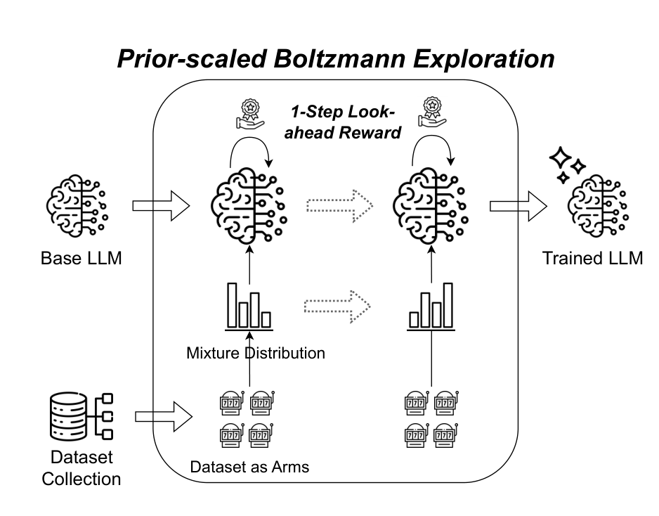
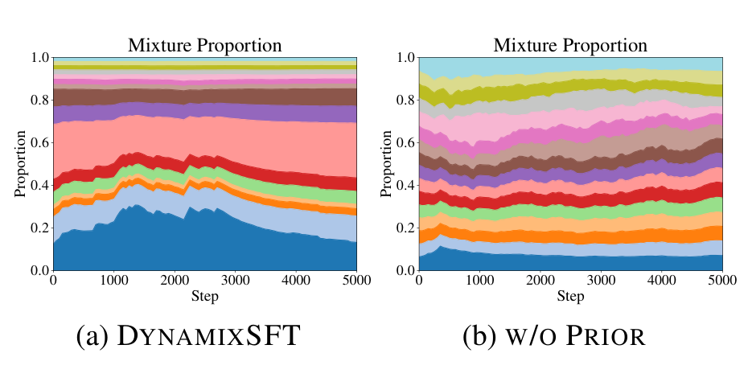

# DynamixSFT 技术报告

## 来源

- **标题**：DynamixSFT: Dynamic Mixture Optimization of Instruction Tuning Collections
- **arXiv**：2508.12116v2（v2 标注 3 Jul 2026；首版 2508 对应 2025-08）
- **团队**：Haebin Shin（UMich / KAIST AI，在 MSRA 实习）、Lei Ji、Xiao Liu、Zhiwei Yu、Qi Chen、Yeyun Gong（Microsoft Research Asia）；Hyunwoo Yoo（Drexel University）。资助方含韩国 MSIT/IITP 与 Microsoft Research Asia。
- **PDF**：`raw/2508.12116v2.pdf`（14 页）
- **定位**：SFT（指令微调）阶段的数据集混合优化方法论文，不是模型发布。基座模型用现成 LLaMA3.2 1B / LLaMA3.1 8B，故不配模型页。
- **与现有概念页的关系**：是 [数据混合优化](../concepts/data-mixture-optimization.md) 概念页中「预训练 domain reweighting（DoReMi/DoGE/RegMix/TANDEM/AutoMixer）」谱系之外的另一分支——**SFT 阶段、在线、无需 proxy model / validation set** 的动态混合。

## 核心结论

1. **把「从 K 个候选数据集中采样一个 batch」建模为 Multi-Armed Bandit（MAB），每个数据集 = 一个 arm**。采样策略用 Boltzmann exploration（softmax(β·Q)）以适应微调过程中非平稳的 reward 分布（§4.1，原文确证）。
2. **Prior-scaled Boltzmann Exploration**：在标准 Boltzmann 概率上乘以原始数据集比例 $p^{(0)}$ 作先验，把更新后的采样分布**软锚定**到原始比例，保留数据集固有的多样性与覆盖（如 LIMA 小而精、FLAN 大而广，原始比例隐含了这种定位）。再加 minimum floor probability $\gamma/K$ 防止 never-sampling（§4.1，公式 2/3，原文确证）。
3. **1-Step Look-ahead Reward**：每 $T_{\text{update}}$ 步，对每个数据集做一次虚拟单步更新，用 loss 下降率 $r = (L_{\text{pre}}-L_{\text{post}})/(L_{\text{pre}}+\epsilon)$ 作 reward，min-max 归一化 + EMA 平滑（§4.2，公式 4/5，原文确证）。
4. **效果**：TÜLU-2-mixture / TÜLU-3-mixture 上相对 Full Coverage（按比例采样）10 benchmark 平均 +5.1% / +5.3%，一致优于 HBO / MultiDDS / MultiUAT（§6.1，Table 2，原文确证）。
5. **效率**：相对 naive sampling 仅 +12.7%（1.13×），远低于 HBO（+139%）、MultiUAT（+380%）、MultiDDS（+760%）（§8，Table 4，原文确证）。

> Figure 1: Overview of DYNAMIXSFT. Given a large collection of instruction-tuning datasets, DYNAMIXSFT treats each dataset as an arm in a Multi-Armed Bandit setup. The sampling policy dynamically evolves through Prior-scaled Boltzmann Exploration, periodically updated by a lightweight 1-Step Look-ahead Reward that reflects the model's current training dynamics.（§1，p1）

## 方法

### Preliminary：数据混合确实重要（状态依赖）

作者先用一个 pilot study 证明「不存在单一静态最优混合」。用 [Qwen3](qwen3.md)-30B-A3R 对 TÜLU-2-mixture 算 token-averaged NLL，按 loss 高/中/低分成 G1/G2/G3 三组（每个子数据集独立三分再合并），再用 LLaMA3.2 1B 训练（§3，Table 1，原文确证）：

| 混合 / 课程 | Know+Rea AVG | Code+Math AVG | 总 AVG |
|---|---|---|---|
| G1（高 loss） | 29.58 | 19.97 | 22.73 |
| G3（低 loss） | 28.47 | 22.26 | 25.59 |
| G2+G3 | 29.50 | 22.99 | 26.75 |
| G1→G2→G3（课程顺序） | 29.50 | 22.16 | 26.42 |
| G3→G2→G1（反序） | 29.69 | 21.10 | 25.85 |

> Table 1 摘要：G1 偏知识推理、G3 偏代码数学；同样三组数据，仅改变课程顺序也会改变整体趋势。结论——异构 collection 内存在**状态依赖的最优混合**而非单一静态配方，这是动态采样的动机。

### Mixture as a Multi-Armed Bandit

标准 Boltzmann exploration（公式 1）把所有 reward 当作跨数据集等价可比，会偏向特定数据集，忽视 SFT 阶段对多样性与覆盖的要求。Prior-scaled 版（公式 2）显式引入原始分布 $p^{(0)}$ 作先验：

$$P_k \propto \exp(\beta \cdot Q_k) \cdot p^{(0)}_k$$

最终采样概率（公式 3）：

$$p_k = (1-\gamma)\cdot\frac{\exp(\beta \cdot Q_k)\cdot p^{(0)}_k}{\sum_j \exp(\beta \cdot Q_j)\cdot p^{(0)}_j} + \frac{\gamma}{K}$$

其中 $\beta$ 控制 exploitation sharpness，$\gamma$ 提供 exploration uniformity 保证（$\gamma/K$ 是 minimum floor probability，确保每个数据集非零被采，应对 reward 非平稳导致的 never-sampling）。两参数在 exploit/explore 间取得平衡（§4.1，原文确证）。

### 1-Step Look-ahead Reward

每 $T_{\text{update}}$ 步，对每个数据集 $D_i$ 采一个 mini-batch $B_{D_i}$，做一次虚拟单步梯度更新，reward 为（公式 4）：

$$r_{D_i} = \frac{1}{|B_{D_i}|}\sum_{x\in B_{D_i}}\frac{L_{\text{pre}}(x)-L_{\text{post}}(x)}{L_{\text{pre}}(x)+\epsilon}$$

跨数据集 min-max 归一化以缓解尺度差异与偶发负 reward，再 EMA 平滑（公式 5）$Q_{D_i}\leftarrow\alpha\cdot Q_{D_i}+(1-\alpha)\cdot r_{D_i}$，防止单 batch spike 引起的过激反应（§4.2，原文确证）。

**理论支撑（§D，原文确证）**：一阶 Taylor 展开下 $r_{t,k}=L(\theta_t)-L(\theta_{t+1})\approx\eta\|\nabla L(\theta_t)\|^2$，所以最大化 1-step reward 等价于最大化梯度下降幅度——reward 衡量的是 **learning progress 而非 raw loss**。又由 telescoping，累积 reward $\sum_{t=0}^{T}r_t = L(\theta_0)-L(\theta_{T+1})$，故 MAB 优化累积 reward 即优化长期收敛——不是启发式 trick，是有原则的策略。

### 算法

Algorithm 1 的主循环：每步按公式 3 的 $p$ 采样数据集 → 从该数据集均匀采一个样本 → 凑满 batch B → 训练 → 每 $T_{\text{update}}$ 步对所有数据集算 1-step reward 并 EMA 更新 $Q$（§4，原文确证）。

## 实验设置

- **基座模型**：LLaMA3.2 1B、LLaMA3.1 8B。
- **数据**：TÜLU-2-mixture（16 数据集，~320K）、TÜLU-3-mixture（19 数据集，~930K）。
- **超参**：$\gamma=0.3$，$\alpha=0.95$，$\beta=4$（1B）/ $\beta=5$（8B），$T_{\text{update}}=50$，lr=1e-5，linear decay + warmup 0.03，2 epochs，batch 128，8×A100 40GB，3 次平均，$\sigma<0.25$，对主基线 t-test $p<0.05$（§A，原文确证）。
- **baselines**：启发式组（Full Coverage 按比例采样、Uniform Sampling）；动态组（MultiDDS 梯度余弦相似度、MultiUAT 不确定性、HBO 额外 actor network）。
- **评测**：10 benchmark——Knowledge（MMLU / TruthfulQA / PopQA）、Reasoning（BBH / DROP）、Coding（HumanEval / HumanEval+）、Mathematical（GSM8K / MATH）、Instruction Following（IFEval），遵循 TÜLU-3 评测设置（§B，原文确证）。

## 评测要点

### 主结果（Table 2，原文确证）

| 设置（TÜLU-2, LLaMA3.2 1B） | MMLU | TQA | PopQA | BBH | DROP | CHE | CHE+ | GSM8K | MATH | IFEval | **AVG** |
|---|---|---|---|---|---|---|---|---|---|---|---|
| Uniform Sampling | 30.28 | 40.78 | 15.68 | 31.53 | 27.88 | 34.81 | 29.42 | 11.69 | 2.74 | 23.55 | 24.84 |
| Full Coverage | 32.13 | 41.12 | 16.22 | 32.93 | 28.18 | 37.23 | 35.47 | 15.77 | 2.91 | 24.78 | 26.67 |
| MultiDDS | 31.85 | 41.63 | 16.25 | 32.79 | 28.36 | 38.13 | 35.74 | 15.55 | 2.87 | 25.32 | 26.85 |
| MultiUAT | 32.11 | 41.59 | 16.12 | 33.52 | 28.37 | 37.28 | 34.33 | 14.51 | 2.81 | 26.18 | 26.68 |
| HBO | 31.75 | 41.77 | 16.21 | 32.81 | 28.68 | 38.21 | 35.81 | 15.49 | 2.81 | 26.38 | 26.99 |
| **DynamixSFT** | 31.91 | 42.02 | 16.18 | 33.73 | 28.75 | **41.69** | **36.43** | 15.89 | 3.12 | 27.23 | **27.70** |

| 设置（TÜLU-3, LLaMA3.2 1B） | MMLU | TQA | PopQA | BBH | DROP | CHE | CHE+ | GSM8K | MATH | IFEval | **AVG** |
|---|---|---|---|---|---|---|---|---|---|---|---|
| Full Coverage | 31.09 | 37.80 | 18.26 | 32.01 | 28.02 | 43.66 | 42.71 | 28.27 | 8.21 | 44.17 | 31.42 |
| HBO | 30.79 | 37.63 | 18.02 | 32.34 | 27.94 | 43.97 | 42.82 | 28.82 | 8.57 | 45.87 | 31.68 |
| **DynamixSFT** | 32.31 | 38.53 | 18.23 | 33.21 | 27.92 | **46.21** | **45.81** | **31.44** | **9.64** | **47.41** | **33.07** |

| 设置（TÜLU-3, LLaMA3.1 8B） | MMLU | TQA | PopQA | BBH | DROP | CHE | CHE+ | GSM8K | MATH | IFEval | **AVG** |
|---|---|---|---|---|---|---|---|---|---|---|---|
| Full Coverage | 62.10 | 46.80 | 29.30 | 67.90 | 61.30 | 86.20 | 81.40 | 76.20 | 31.50 | 72.80 | 61.55 |
| HBO | 61.91 | 46.53 | 28.58 | 68.32 | 62.52 | 88.11 | 83.08 | 77.18 | 32.53 | 73.14 | 62.19 |
| **DynamixSFT** | 61.87 | 47.12 | 29.51 | 69.39 | 62.47 | **89.14** | **84.12** | **79.46** | **33.21** | **74.81** | **63.11** |

> 8B TÜLU-2 与全部 1B/8B 完整对比见原表 Table 2。DynamixSFT 在四个 setting 的 AVG 全部最优；相对 Full Coverage 在 TÜLU-2 +5.1%、TÜLU-3 +5.3%（10 benchmark 平均，相对提升）。

### 三策略可视化（Figure 2，原文确证）

> Figure 2: Full Coverage 比例按数据集大小倾斜但保证每个 instance 都被用到；Uniform Sampling 等比采样导致按数据集大小严重过/欠采；DynamixSFT 自适应调整比例，最终在所有数据集上达到均衡覆盖。结果基于 TÜLU-2-mixture。（§6.3，p7）

关键观察：DynamixSFT 的采样比例在训练中段（学习率较高时）响应最灵敏，最终覆盖比 Full Coverage 更均衡——动态性源自 1-Step Look-ahead Reward 跟随当前梯度信号与学习率调度（§6.3，原文确证）。

### 效率（Table 4，原文确证）

| 方法 | 相对 naive 采样开销 |
|---|---|
| MultiDDS | +760%（8.6×） |
| MultiUAT | +380%（4.8×） |
| HBO | +139%（2.39×） |
| **DynamixSFT** | **+12.7%（1.13×）** |

> 论文给出的理论开销推导（TÜLU-3，K=19，$T_{\text{update}}=50$）：$19/50 \times 1/3 \approx 12.7\%$，假设 reward 计算只用前向传播（约占一步训练的 1/3）。对比方法因需跨数据集算梯度（MultiDDS/HBO）或 Monte Carlo 重复前向（MultiUAT）而开销大得多。（§8，原文确证）

### 消融与分析

- **Prior 必要性（Table 3，原文确证）**：去掉 $p^{(0)}$（w/o prior）AVG 从 27.7 跌到 25.9；即便把初始分布手动设成按比例（w/o prior + prop. init）仍只有 26.3——说明 prior 不仅自然初始化在数据固有分布附近，还在训练全程持续锚定、防止漂移。
- **prior vs 无 prior 的 dynamics（Figure 7，原文确证）**：无 prior 时采样分布全程贴近初始均匀分布，模型没能找到好混合；有 prior 则正常演化。

> Figure 7: 去掉 prior 后采样分布全程接近初始均匀分布，模型无法发现好混合；有 prior 时分布正常演化。（§7.5，p9）

- **β vs γ trade-off（Figure 5，原文确证）**：强探索（$\gamma=0.3, 0.25$）配低 $\beta=4$ 最优；弱探索（$\gamma=0.2, 0.15$）配高 $\beta=7,8$ 最优。极端 $\gamma$ 值方差大。
- **EMA 平滑 α（Figure 6，原文确证）**：强平滑（$\alpha=0.95$）稳定且容忍高 $\beta$；弱平滑（$\alpha=0.2$）混合比例剧烈震荡、性能随 $\beta$ 升高快速退化。中等平滑（0.8/0.5）在 $\beta=4$ 处最优。
- **更新间隔 $T_{\text{update}}$（Figure 3，原文确证）**：50 步最优；太短（10）不稳，太长（500）适应慢。
- **reward 形式（Figure 4，原文确证）**：$\Delta$-Entropy（熵减）reward 在 8B 上与 $\Delta$-Loss 相当，说明框架对 reward 定义灵活，不确定度下降也是有效信号。

## 待追问

- **reward 计算是否真做了梯度更新？——论文内部矛盾**：§4.2 与 Algorithm 1 第 14 行明确写 reward 来自「virtual one-step update」后的 $L_{\text{pre}}-L_{\text{post}}$，即要对每个数据集做一次临时梯度更新（必然含反向传播 + 参数更新）；但 §8 Efficiency 又称 reward「relies solely on forward passes and requires no additional backward computation」，且开销推导 $19/50\times 1/3\approx 12.7\%$ 也假设只用前向（前向约占一步训练 1/3）。若真做梯度更新，开销应接近一个完整训练步而非 1/3。这是 tier-3 推断的矛盾，需作者澄清实现究竟用了 forward-only 近似还是真做了 virtual gradient step（若是后者，12.7% 开销推导就站不住）。
- **跨阶段泛化**：方法在 SFT 阶段验证，能否迁移到预训练 domain reweighting（DoReMi/DoGE/RegMix/TANDEM 场景）？SFT 数据集异构性强（LIMA vs FLAN 尺度差 50×），预训练 domain 尺度差更温和，prior-scaling 的锚定收益可能不同。
- **与 proxy-model 谱系的关系**：DoReMi/RegMix 用小 proxy model 预测大模型最优权重，DynamixSFT 直接在目标模型上在线优化、无需 proxy。这是「轻量自演化」对「proxy 放大」的范式分叉——但缺少在 frontier-scale 模型（如 AutoMixer 的 33B MoE）上的对比，无法判断哪种范式在极大尺度下更优。
- **instance-level 扩展**：作者在 Limitations 自陈 mixture policy 是 dataset-level，instance-level 是 open direction。这与 [Qwen3](qwen3.md) 已落地的 instance-level 标注混合形成对照，但二者无公开直接对比。

## 相关页面

- [数据混合优化](../concepts/data-mixture-optimization.md) — 本论文所属的方法谱系（SFT / 在线 / 无 proxy 分支），概念页内有跨方法对比
- [DoReMi](doremi.md) — 预训练 domain reweighting 的 Group DRO 开山作，proxy-model 范式对照
- [TANDEM](tandem.md) — bi-level + twin network，可处理 SFT 场景的对照
- [AutoMixer / Laguna](laguna-m1-xs2.md) — frontier-scale MoE 上的 per-capability 回归混合优化
- [Qwen3 技术报告](qwen3.md) — instance-level data mixture 的产业实践，与 dataset-level 形成对照
