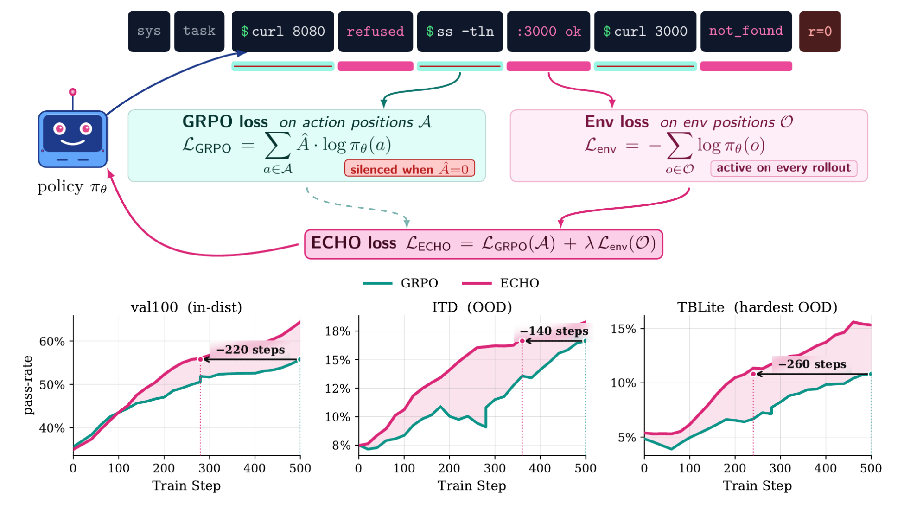
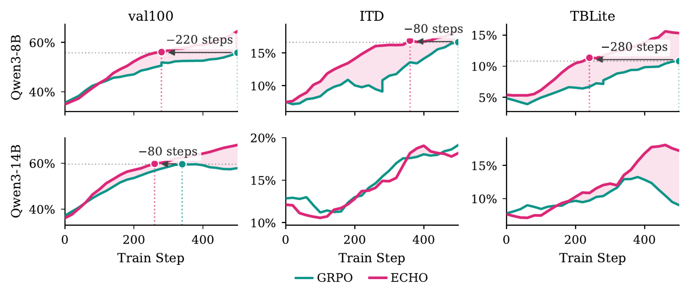
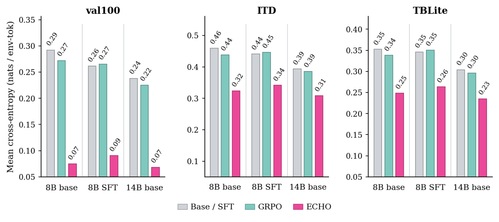

# ECHO: Terminal Agents Learn World Models for Free

## 来源

- PDF：`raw/2605.24517v1.pdf`（14 页）
- arXiv：[2605.24517](https://arxiv.org/abs/2605.24517)（v1，2026-05-23）
- 团队：Microsoft Research（Vaishnavi Shrivastava、Piero Kauffmann、Ahmed Awadallah、Dimitris Papailiopoulos）
- 不建模型页：实验对象是 [Qwen3](../models/qwen3.md)-8B / 14B 与 OpenThinker-Agent-v1-SFT，没有独立发布名为 ECHO 的权重。

**不要和 MoE 通信栈里的 ECHO/UltraEP 混名。** [Kimi K3](kimi-k3.md) / [Stable LatentMoE](../concepts/stable-latentmoe.md) 里的 ECHO 是 expert-parallel 冗余与 per-rank cap，与本页无关。

## 核心结论

终端 agent 的 rollout 已经交错了 action 与环境观测（stdout、stderr、文件、日志），但标准 GRPO 只在 action token 上做稀疏终局奖励。失败轨迹几乎没有 policy-gradient，却带着「环境如何响应这条命令」的证据。

ECHO（Environment Cross-entropy Hybrid Objective）在同一 actor 前向上把观测 token 的交叉熵加进 GRPO：

$$\mathcal{L}_{\mathrm{ECHO}}(\theta)=\mathcal{L}_{\mathrm{GRPO}}(\theta;\mathcal{A})+\lambda\,\mathcal{L}_{\mathrm{Env}}(\theta;\mathcal{O}')$$

不需要 teacher、额外 rollout 或第二次前向。观测来自当前策略自己的轨迹，因此是 on-policy：策略变了，要预测的终端输出也变。

> Figure 1: ECHO turns terminal feedback into supervision during agent RL.（首页）

Headline（原文确证，Abstract / Table 1）：TerminalBench-2.0 pass@1，Qwen3-8B 2.70%→5.17%，Qwen3-14B 5.17%→10.79%。从 base Qwen3-8B 出发，ECHO 在内部集追上 expert-SFT-then-GRPO，TB2 上收回大约一半 expert-SFT 红利，且不用那约 15k 条 GLM-4.6 示范。

## 架构与训练

本页没有新骨架。改的是 **loss mask**：GRPO 已经为算 action log-prob 跑完整段注意力，ECHO 只是把同一 logits 在终端输出位再加一项 CE。

### 目标与 mask（§3）

- \(\mathcal{A}\)：assistant action 位，走 clipped GRPO（无 critic，组归一化优势广播到整条 action）。
- \(\mathcal{O}'\)：**只要 env 块**（`<command_output>…</command_output>`），丢掉 harness 的 `WARNINGS:` 前缀。警告低熵，约 60 step 就背下来，warn-only 很快没梯度；终端输出一直带文件名、测试失败、字节数。
- \(\mathcal{L}_{\mathrm{Env}}\) 用整段观测长度 \(|\mathcal{O}|\) 归一，方便不同 \(\mathcal{O}'\) 子集横比。
- \(\lambda=0.05\)（扫描 {0.001…0.2} 后取 0.01–0.05 可用带；0.1 平台化，0.2 可塌成「好预测、没用」的退化 rollout）。\(\lambda\) 常数会自退火：\(\mathcal{L}_{\mathrm{Env}}\) 下降后辅助项自然变轻。

与 [Qwen-AgentWorld](qwen-agent-world.md) 的差别（推断 / 本页综合，不是 ECHO 原文句子）：AgentWorld 训的是**独立** language world model，再 Decouple（当模拟器）或 Unify（当 agent warm-up）。ECHO 不另训模拟器，把 next-observation 预测做成**同一策略**上的辅助 CE。Qwen-AgentWorld 把 ECHO 放进 “learned neural simulator” 列举是过宽——ECHO 原文 Related Work 自己写成 auxiliary-prediction，并强调「无独立 corpus、无 world-modeling 阶段、无推理时模拟」。

### 实验设置（§4）

- 任务：Endless Terminals + OpenThoughts-Agent-v1-RL 过滤后再合成，GPT-5 16 次至少解一次才留，8770 训 / 100 内部 val。
- Harness：思考块 + Qwen XML bash；Harbor + Docker，最多 16 轮，上下文 16k，每轮 ≤2048 生成 token。
- GRPO：n=16、batch 16、LR \(1\times10^{-6}\)、无 KL（除非另行注明）、温度 0.8；评测温度 0.6。8 张 B200，500 step。
- 起点：Qwen3-8B、OT-SFT（Qwen3-8B + 约 15k GLM-4.6 示范）、Qwen3-14B。
- TB2 用 Terminus 2 harness，5 次，32k 上下文。

附录 B：AdamW、clip 0.2、\(\epsilon_{lo}=0.2\) / \(\epsilon_{hi}=0.28\)（clip-higher）、prompt-level advantage、sequence-level loss aggregation。

## 评测要点

Table 1（原文确证）。val100 / ITD / TBLite 为 8 次 pass@1；TB2 为 5 次 pass@k。

| 起点 | 设置 | val100 | ITD | TBLite | TB2 p@1 | TB2 p@5 |
| --- | --- | ---: | ---: | ---: | ---: | ---: |
| Qwen3-8B | Base | 34.2 | 7.0 | 4.9 | 1.57 | 4.49 |
| | GRPO | 54.9 | 16.2 | 9.5 | 2.70 | 8.99 |
| | **ECHO** | **63.7** | **18.9** | **11.4** | **5.17** | **13.48** |
| OT-SFT | SFT | 38.5 | 10.7 | 6.0 | 5.62 | 12.36 |
| | GRPO | 63.5 | 18.8 | 11.6 | 7.64 | 17.98 |
| | **ECHO** | **73.1** | **22.7** | **12.9** | 7.87 | 17.98 |
| Qwen3-14B | Base | 35.3 | 12.1 | 5.7 | 4.27 | 12.36 |
| | GRPO | 60.3 | 17.9 | 9.8 | 5.17 | 13.48 |
| | **ECHO** | **65.0** | **19.8** | **15.1** | **10.79** | **19.10** |

8B/14B 的 TB2 pass@1 相对匹配 GRPO 约 ×1.9 / ×2.1。OT-SFT 上 TB2 几乎走平（7.64→7.87），内部集仍涨。

> Figure 2: Pass-rate training curves over 500 GRPO steps.（§ 5.1）

### 是不是真的在学终端动力学（§5.2）

在 **Qwen3-32B 的 off-policy 轨迹**上测环境 token 交叉熵（每任务 8 条，共 2168 条）。GRPO 几乎不改 CE，ECHO 明显下降。14B：val100 0.24→0.07，ITD 0.39→0.31，TBLite 0.30→0.23；8B：0.29→0.07 / 0.46→0.32 / 0.35→0.25。

> Figure 3: Per-token cross-entropy on terminal-output tokens for trajectories from a stronger model, Qwen3-32B.（§ 5.2）

### 替代多少 expert SFT（§5.3 / 附录 Table 4）

相对 Qwen3-8B+GRPO，ECHO 收回 OT-SFT+GRPO 红利的 101.6%（val100）、103.9%（ITD）、88.9%（TBLite），TB2 pass@1/3/5 约 50%。作者把 expert SFT 拆成 **interaction prior**（ECHO 能从自己的终端后果里学）和 **strategy prior**（先试哪条命令、何时停，示范仍有用）。

### 训练/推理效率（Table 2–3）

8B 用 1.54–1.92× 更少 step 摸到匹配 GRPO 的内部峰值；TBLite 上 2.27×。14B 同 step 达峰，但平台更高。TB2 上 8B 超时 19.8%→9.0%、完成 token −30%；OT-SFT 超时 45.2%→24.7%、轮数 −43%。14B 超时/轮数略增，token 仍 −13%。

### Verifier-free（§5.5）

从最强 8B ECHO checkpoint 关掉 GRPO，只跑 100 step \(\mathcal{L}_{\mathrm{Env}}\)。无过滤时 val100 +3.8 pp；过滤到「每次工具调用都可解析」后，PyTerm +10.0、ITD +5.2，val100 仍在 ±1 pp。**TBLite 同配方 −3.9**。作者怀疑 PyTerm 的 traceback/打印值更贴动作，TBLite 更多不可见文件系统与进程状态。失败模式下 env loss 会变成「失败动力学」模型，所以要 clean-rollout 过滤。

## 待追问

- **需实验或作者披露**：OT-SFT 在 TB2 上 ECHO≈GRPO：是 strategy prior 真的补不回来，还是 TB2 + Terminus 2 方差（附录 SE ~1.5 pp）吃掉了 0.23 分？
- **需实验或作者披露**：\(\lambda\) 与 clip-higher / void-trajectory filter 的交互只写「正交可组合」，没有 2×2 消融。
- **需实验或作者披露**：Verifier-free 在 TBLite 失败，是否说明辅助 CE 依赖「观测与下一动作强对齐」的环境，迁不到 GUI / 搜索？

## 相关追问

主记录：[ECHO 与 LWM warm-up 能否叠加](qwen-agent-world.md#待追问)。

## 相关页面

- 回写目标：[Qwen-AgentWorld](../models/qwen-agent-world.md) · [来源](qwen-agent-world.md)
- 基座：[Qwen3](../models/qwen3.md)
- GRPO 定义：[DeepSeekMath](deepseekmath.md)
- 算法对照：[LLM RL policy optimization 对比](../comparisons/llm-rl-policy-optimization.md)
- 后训练概念：[Agentic 模型的后训练](../concepts/post-training-for-agentic-models.md)
- 另一条 world-model：[Looped World Models](looped-world-models.md)（latent dynamics，不是辅助 CE）
- 环境合成对照：[Agent-World](agent-world.md)
