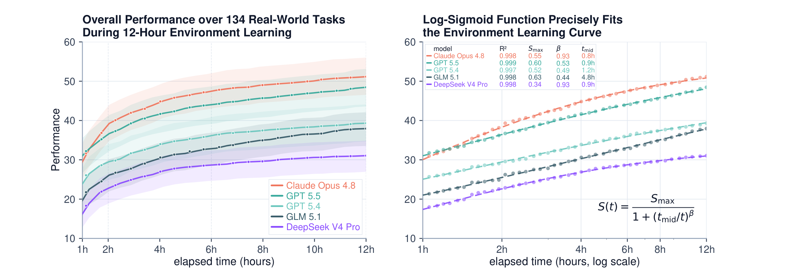
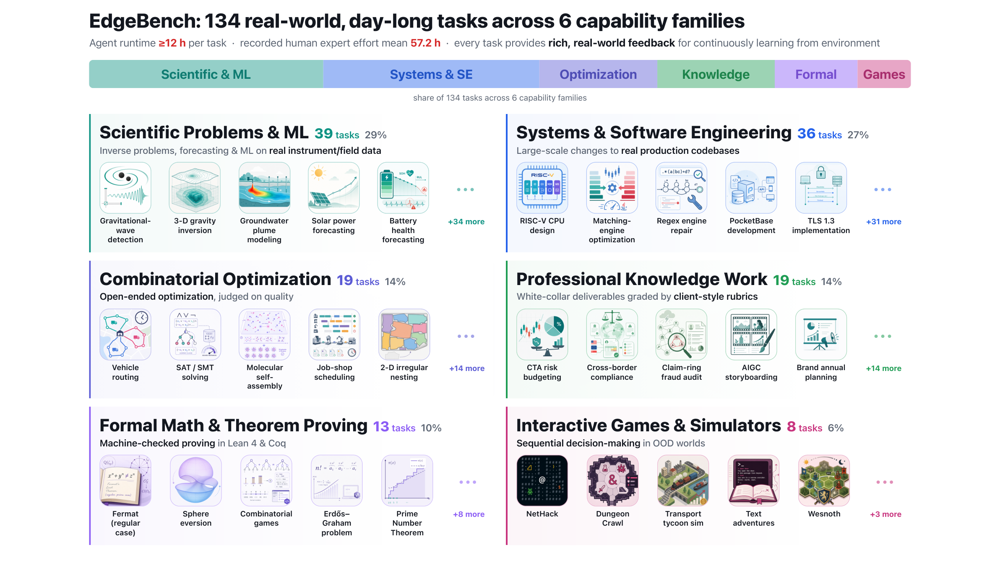
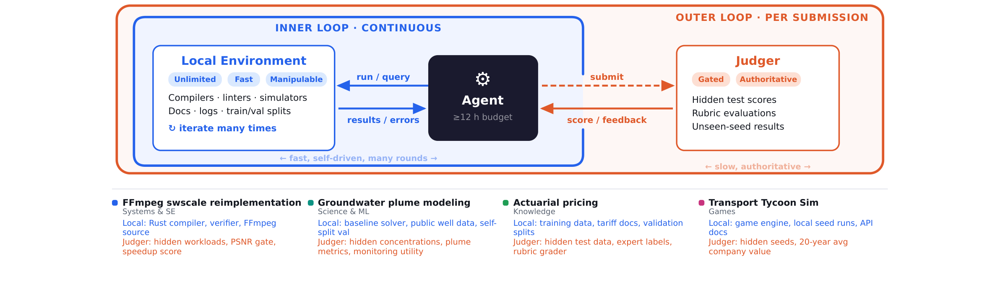

# EdgeBench 技术报告

## 来源

- **PDF**：`raw/2607.05155v1.pdf`
- **标题**：EdgeBench: Unveiling Scaling Laws of Learning from Real-World Environments
- **日期**：submitted 2026-07-06；文内 Date: July 7, 2026（arXiv:2607.05155v1）
- **团队**：ByteDance Seed；通讯 Shu Zhong
- **arXiv**：[2607.05155](https://arxiv.org/abs/2607.05155)
- **项目**：[edge-bench.org](https://edge-bench.org)；代码：[ByteDance-Seed/EdgeBench](https://github.com/ByteDance-Seed/EdgeBench)
- 未建模型页：这是评测基准，不是新模型。

## 核心结论

EdgeBench 要测的不是一次性做对，而是 **agent 在真实可执行环境里、用足够长时间从反馈里学习**。作者认为现有基准要么缺丰富反馈，要么只给几分钟到一两小时，不够看探索、改策略和经验累积（原文确证，§1、§2.1）。

Headline：约 **38,000 小时**环境交互、**134** 个真实任务上，五家前沿模型的 **best-so-far 平均分**对交互时间服从

$$S(t)=\frac{S_{\max}}{1+(t_{\mathrm{mid}}/t)^{\beta}}$$

134 题平均拟合 \(R^2\ge 0.997\)（原文确证，Abstract / Figure 1 / 公式 1）。作者把它写成「据他们所知，环境学习第一次出现干净的 scaling law」。单题曲线很吵，这条律是跨任务平均后才锐利的群体规律（原文确证，§3.2 / Figure 8）。

公开释放 **51** 题和完整评测框架；全量 134 需申请。GUI / 纯视觉任务被排除，以免把感知天花板和迭代学习搅在一起（原文确证，§2.2、Abstract）。

[SoL-Pi](sol-pi.md) 把这 51 个公开题当 held-out，并声明不用 EdgeBench 数据或 verifier 当训练环境模板。官方榜用的是 Codex / Claude Code 原生 harness；SoL-Pi 数字在 Pi 扩展上，**不能和这篇的模型榜直接横比**。

> Figure 1: Overall performance follows a precise log-sigmoid relationship with environment interaction time when averaged over all 134 tasks (mean \(R^2=0.998\)).（原文确证，Figure 1 caption）

## 架构与训练

### 任务家族

> Figure 2: EdgeBench task taxonomy. 134 real world tasks across six capability families… Recorded human expert effort estimates: mean 57.2 h.（原文确证，Figure 2）

| 家族 | 题数 | 典型形态 |
| --- | ---: | --- |
| Scientific Problems & ML | 39 | 真实仪器/场数据上的反问题、预报、ML |
| Systems & Software Engineering | 36 | 生产级仓库，单任务可改数千到 10 万+ 行 |
| Combinatorial Optimization | 19 | 以启发式迭代为主的 NP-hard 开题 |
| Professional Knowledge Work | 19 | 白领交付物 + client-style rubric |
| Formal Math & Theorem Proving | 13 | Lean 4 / Coq 机器检查证明 |
| Interactive Games & Simulators | 8 | NetHack、Transport Tycoon 等 OOD 序贯决策 |

专家完成时间均值 **57.2 h**、最高 **320 h**。选择标准：当前 agent 饱和不了的天花板 + 支持连续学习而不是一次交卷（原文确证，§2.2）。

### 双环反馈与 work–judge 隔离

> Figure 3: The informative feedback loop in EdgeBench. The inner loop (blue) lets agents iterate freely with local feedback; the outer loop (orange) gates authoritative judge feedback behind submissions.（原文确证，Figure 3）

实现是隔离的 **work 容器 / judge 容器**：agent 看不到 hidden 评测资产；提交经 host-side judge server（队列、冷却、异步评分）。host 还会按固定间隔做 **不对 agent 展示** 的 auto-evaluation，用来画轨迹（原文确证，§2.3）。GitHub 把这套 harness 叫 **SForge**（外部佐证，仓库 README）。

### 官方评测设置（读 SoL-Pi 时必须带着）

五模型 × 134 题 × **3 条独立 12 小时 trial**。Harness **不是统一的**（原文确证，§3.1）：

- GPT-5.5 / GPT-5.4：Codex，256k compact window
- GLM-5.1 / DeepSeek-V4-Pro：Claude Code，200k compact
- Claude Opus 4.8：主要 Claude Code **1M** compact；另有 200k vs 1M 消融（§5.3）

所以这篇的模型排序混进了原生 harness 差异。SoL-Pi 在 Pi 上跑 EdgeBench，测的是另一张膜。

## 评测要点

- **群体拟合很紧，单题不是。** Figure 4 的 18 条代表曲线有平滑爬升、平台、突变和回退。作者强调 log-sigmoid 是跨任务平均后的结构（原文确证，§3.1–3.2）。
- **六族各自仍能拟合同一形式**（Figure 5），尽管 \(t_{\mathrm{mid}}\) 差一个数量级（Games / Formal 上部分模型 \(t_{\mathrm{mid}}\) 到十几小时甚至上百小时的外推）。
- **更长窗仍稳：** 28h（80 题、四模型）和 72h（18 题、两模型）\(R^2\ge 0.993\)（Figure 6）。前 6.5h 拟合能预报 6.5–12h，held-out RMSE < 1 分（Figure 7）。
- **相对其他 S 曲线：** 作者比较 log-probit / log-Gompertz / Weibull / log-linear，log-sigmoid RMSE 最低；他们仍按机制理由偏好它，而不是「只有这一种 S 形」（原文确证，§3.2）。
- **学习速度：** 自 2025-09 以来的前沿模型，环境学习速度大约每三个月翻倍（原文确证，§1 第四条观察）。这是跨代拟合，不是单次对照实验。
- **连续经验 vs 独立重启：** 长周期表现依赖怎么用累积经验，不只是尝试次数；连续经验优于独立重启，更长 context 改善保留（原文确证，§1）。

## 待追问

- 官方榜的 Codex / Claude Code 混用，有多少「模型代际翻倍」其实是 harness × context window？
- SoL-Pi 用的 51 公开题子集，和这篇 134 题平均曲线是否同分布？博客没给 51 vs 134 的对照表。
- \(S_{\max}\) 是拟合天花板，12h 实分仍低于它（Opus \(S_{\max}=0.55\)，曲线 12h 约 51）。外推到 72h 的 \(S_{\max}\) 是否稳定，作者只在子集上试过。
- work–judge 隔离能挡住 git-history 作弊一类攻击，但 SoL-Pi 的 reducer 把日志交给另一个模型，评测语义是否仍等价于这篇的 outer loop？

## 相关页面

- [SoL-Pi 官方博客](sol-pi.md)
- [Pi coding agent 设计博客](pi-coding-agent.md)
- [Agentic 评测体系](../concepts/agentic-evaluation-benchmarks.md)
- [Agent harness](../concepts/agent-harness.md)
- [Agentic engineering](../concepts/agentic-engineering.md)
- [Prime Agent 技术报告](prime-agent.md)（另一条长周期评测膜，主台是 ARC-AGI-3 不是 12h 真实环境）
