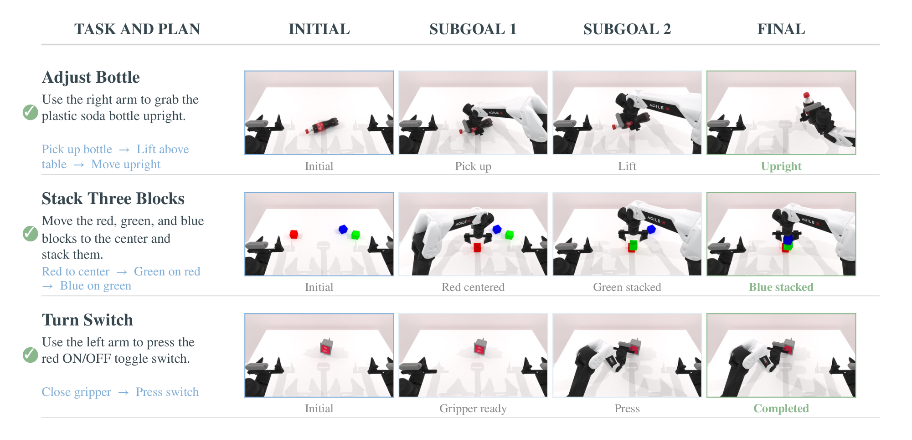

# EmbodiedSkills：把 VLA 技能决策当 execution proposal

## 来源

- **PDF**：`raw/2609.01281v1.pdf`（arXiv:2609.01281v1，2026-09-01）
- **标题**：EmbodiedSkills: A Unified Framework for Orchestrating, Training, and Deploying VLA Agents
- **团队**：浙江大学（通讯 Wenqiao Zhang）+ 南京航空航天大学 + Cornell + Universal Ubiquitous AI + NUS + 杭州云深处科技
- **体量**：20 页，4 图，5 表
- **定位**：**框架论文，不是新权重。** 高层 agent 组件基于 [Qwen3-VL](../models/qwen3-vl.md)，低层执行器是 OpenPI / [π0.5](../models/pi0.5.md)。本库不建模型页：系统产出是共享 executable-skill 接口和 AgentLoop，不是一组要发布的神经网络。
- **不要混名**：[ASPIRE](aspire.md) 写/改 code-as-policy 程序并写入 skill library；EmbodiSkill（清华 AIR + MSR，arXiv:2605.10332）是 training-free reflection，尚未 ingest。本页是 VLA 上层的 guarded runtime。

## 核心结论

1. **长周期操作需要 agentic layer，不只是下一动作预测。** 端到端 VLA 把中间决策藏在网络里，失败时分不清是 grounding、subgoal、执行、验证还是恢复；LLM 机器人 agent 能把中间步骤写出来，但「写出来」不等于当前物理状态可执行（§1）。
2. **技能决策是 execution proposal，不是直接动作。** 每个 skill 有 typed 输入输出、显式前提、执行痕迹和事后验证。policy 提出 `RunSkill(k, q)` / `AdvanceStage` / `FinishRun`；runtime 检查 phase 兼容、输入齐全、artifact 新鲜、动作合法、状态转移合法之后才执行（§3.2–3.4、Eq. 5–10）。
3. **接口固定，低层 VLA 可替换。** AgentLoop 的六相（Observe / Plan / Preflight / Execute / Verify / Recover）不是一次过的流水线：可根据新观察、执行结果或验证证据回访更早的相（§3.3、Eq. 6）。
4. **Headline 数字是任务特化低层策略的执行成绩，不是 AgentLoop 相对 Direct VLA 的增益。** 作者自己写：RoboTwin 2.0 的 86.20% 和 LIBERO 的 97.40%「establish the execution performance of the task-adapted low-level VLA policies」（摘要、§1）。AgentLoop 本身的证据在 Table 5：同一套 planner + 低层策略上，去掉中间验证 −38.0 pp、去掉语义 subtask −51.8 pp、每 subtask 只给一个 32-step chunk 降到 19.5%。

> Figure 1（原文截图，§1）："Overview of EmbodiedSkills. EmbodiedSkills transforms a low-level VLA policy into a closed-loop embodied agent by coordinating observation, planning, validation, execution, verification, and recovery through executable skills. A high-level policy proposes structured operations, while a guarded runtime validates and executes them and records post-execution feedback as structured trajectories."

图右侧 +3.46 / +0.55 画在「Modular Adaption」下面，容易被读成 AgentLoop 的贡献。正文把这两处增益归到 **task-adapted 低层 π0.5** 相对 LingBot-VA π0.5 参考和官方 OpenPI 的差（§1、Table 2–3）；AgentLoop 的受控消融是另一张表（Table 5）。

## 机制（已据原文核实）

### Policy–runtime 分离

方法层状态是 \(s_t=(z_t,M_t,H_t)\)：当前相、任务 artifact 集合、有序 loop trace（Eq. 1）。policy 只看到压缩上下文 \(C_t=\Psi(x,z_t,M_t,H_t)\)：完整计划、active subgoal、artifact 摘要、最近错误、有界历史；**不**把 simulator 内部状态或无界日志塞进模型（Eq. 2、§3.1）。

每个 skill 的合同（Eq. 5）

\[
k=(X_k,Y_k,\mathrm{pre}_k,\mathrm{exec}_k,\mathrm{post}_k,\mathrm{fail}_k)
\]

模型输出在 schema 和前提通过之前只是 proposal。观察、active subgoal 或执行结果变了，只刷新依赖它们的 artifact，避免过期预测授权新的物理动作（§3.2）。

> Figure 2（原文截图，§3 开篇）："The high-level VLM decomposes the instruction, selects executable subgoals, and verifies progress from post-action observations. The low-level VLA policy executes each active subgoal as a bounded action chunk."

### 六相不是固定流水线

| 相 | 角色 | 退出证据 |
| --- | --- | --- |
| Observe | 采集当前视觉与任务相关证据 | 当前任务证据 |
| Plan | 把任务和证据变成可验证 subgoal | 一份计划 + active subgoal |
| Preflight | 判断 active subgoal 是否可执行 | 通过的 readiness report |
| Execute | 生成并执行一个 bounded action chunk | execution report |
| Verify | 用动作后的新证据判断进度 | progress judgement |
| Recover | 在不可继续的失败后改写尝试 | 修订后的执行上下文 |

Table 1（§3.3；原文截图表）。Figure 1 标了每相的代表 skill 数：Observe 9、Plan 6、Preflight 3、Execute 7、Verify 6、Recover 8。Grounding 按任务和策略条件化，不是全局 source–target 绑定：有的任务不需要显式物体绑定，几何控制器才额外要 object / region（§3.3）。

### Bounded action chunk 与验证路由

Execute 把 active subgoal \(g_t\)、当前观察 \(O_t\)、preflight 证据 \(F_t\) 映射成动作块 \(a_t\) 和执行报告 \(e_t\)（Eq. 11）。chunk 是有界命令序列 \(a_t=(\tau_t,U_t,H_t,\eta_t)\)，runtime 只在 \(0<H_t\le H_{\max}\)、符合策略动作 schema、数值合法、且与当前 subgoal/观察新鲜一致时才接受（Eq. 12–13）。一个语义 subgoal 可以对应多个 chunk，不必塞进单一 horizon（§3.5）。

Verify 只评 active subgoal，路由集合是（Eq. 14）

\[
V=\{\mathrm{Advance},\mathrm{Continue},\mathrm{Reobserve},\mathrm{Replan},\mathrm{Recover},\mathrm{Finish}\}
\]

**终端成败仍由环境 evaluator 定义**，不是本地 subgoal 判断（§3.6）。Algorithm 1 把三类控制（RunSkill / AdvanceStage / FinishRun）分开放行；被挡住的决策记入 trace，不静默变成物理动作（§3.4、§3.7）。

## 后训练

主范式是 **component-level supervised adaptation**，不是端到端联合优化（§4 开篇）。

- **Planner**：指令 + 当前视觉 → 有序、可执行的语义 subgoal；subgoal 写「要到达什么物理状态」，不把 simulator 控制细节写进高层计划（§4.1）。
- **低层 VLA**：用 subtask-level demonstration 单独适配。每条样本是（观察、本体、active subgoal、对应动作序列）。部署时走同一 Execute 接口，吐 bounded chunk（§4.1、§5.1）。
- **高层 scheduler**：对 [Qwen3-VL](../models/qwen3-vl.md) 做 SFT，**冻结低层 VLA**。样本边界与部署一致：任务、可见图像、压缩 runtime 状态、当前相可接受的 skills、近期有序历史；loss 只打在组件自己生成的 token 上（§4.1–4.2、Eq. 15）。原文没有写 Qwen3-VL 的具体尺寸。

可选闭环适应走同一轨迹接口。作者写了 group-relative policy optimization（组内标准化优势 + masked clipped objective，Eq. 17–18），但明确：**episode-level attribution 粗糙，online 优化不是 Table 2–3 那些 headline 数字的来源**（§4.3）。有可靠环境 evaluator 时才启用；基础设施失败和 agent-policy 失败分开记账。

## 评测要点

RoboTwin 2.0 上 **每个任务单独 fine-tune 一份 π0.5**，100 episode / 任务，终端成败跟官方 evaluator（§5.1）。这是 50 个 specialist，不是一份 generalist。

> Figure 3（原文截图，§5.3）："Cross-benchmark execution results. (a) Average success of representative policy baselines, generalist VLA baselines, and our task-adapted policies on the 50-task RoboTwin 2.0 benchmark. Vertical dashed lines separate method families. (b) OpenPI and our success rates on the four LIBERO suites. (c) Controlled AgentLoop ablations on the same RoboTwin 2.0 task set."

Figure 3(a) 的 X-VLA 写成 72.9，Table 2 平均是 72.8，按表。

### RoboTwin 2.0：任务特化低层

相对 LingBot-VA 报告的 π0.5 参考 82.74%，本文 86.20%（+3.46 pp）。50 任务中 39 升、1 平、10 降；升幅集中在接触敏感和多阶段任务，降幅多是已经 >90% 的任务上 1–2 个点（§5.2、Table 2）。

| 任务 | π0.5 参考 | Ours | Δ |
| --- | --- | --- | --- |
| Hanging Mug | 18 | 38 | +20 |
| Blocks Ranking Size | 49 | 64 | +15 |
| Open Microwave | 34 | 49 | +15 |
| Move Can Pot | 51 | 61 | +10 |
| Move Stapler Pad | 56 | 66 | +10 |
| **50 任务 macro** | **82.74** | **86.20** | **+3.46** |

Hanging Mug 加上 20 点也只有 38%。完整 50 行见原文 Table 2；policy 基线 ACT/DP/RDT/DP3 的 macro 是 29.7 / 28.0 / 34.5 / 55.2，generalist VLA π0 / X-VLA 是 65.9 / 72.8。

不要和 [InternVLA-A1.5](internvla-a1.5.md) 自报的 RoboTwin 2.0 93.2 横比：那边是另一套模型与协议，这边是 50 个任务特化 π0.5。

### LIBERO：相对官方 OpenPI

| Suite | OpenPI | Ours | Δ |
| --- | --- | --- | --- |
| Spatial | 98.8 | 99.0 | +0.2 |
| Object | 98.2 | 98.6 | +0.4 |
| Goal | 98.0 | 98.4 | +0.4 |
| Long | 92.4 | 93.6 | +1.2 |
| Average | 96.85 | 97.40 | +0.55 |

Table 3（§5.3）。Spatial / Object / Goal 已经接近饱和，作者把更清楚的优势放在 Long。OpenPI 数字来自 [Physical-Intelligence/openpi](https://github.com/Physical-Intelligence/openpi) 官方 release，不是 π0.5 原文的家庭家务协议。

### RMBench 记忆任务：同一执行接口仍然弱

四个 memory-dependent M(n) 任务上，任务特化策略 macro 12.5%，对照是 RMBench 论文发表的 DP 5.0 / ACT 4.8 / π0.5 5.5 / X-VLA 7.3，**不是**从本文 RoboTwin run 重估（§5.4、Table 4）。

| 任务 | DP | ACT | π0.5 | X-VLA | Ours |
| --- | --- | --- | --- | --- | --- |
| Battery Try | 10 | 19 | 16 | 26 | 19 |
| Blocks Ranking Try | 10 | 0 | 6 | 1 | 9 |
| Cover Blocks | 0 | 0 | 0 | 2 | 6 |
| Press Button | 0 | 0 | 0 | 0 | 16 |
| Macro | 5.0 | 4.8 | 5.5 | 7.3 | 12.5 |

Press Button 从全 0 到 16 是最大单项，但四任务平均仍远低于操作 benchmark。作者把它写成「subtask-conditioned execution 在依赖先前交互史时」的额外评测，不是记忆问题已解决。

### AgentLoop 消融：这才是环本身的证据

三组受控变体共用 planner、低层策略、初始状态和终端 evaluator，只改语义 subtask、中间验证、以及未完成 subtask 能否再要一个 chunk。每任务 100 episode，合计 5,000（§5.1、§5.5、Table 5）。

| 配置 | 含义 | Macro |
| --- | --- | --- |
| Full | 完整 plan–execute–verify | 86.20 |
| w/o Verify | 保留参考 subtask 序列和总预算，不检查中间结果 | 48.2（−38.0） |
| w/o Subtask | 总预算不变，每个 chunk 只看原始整句指令 | 34.4（−51.8） |
| 1 chunk | 保留 subtask 序列，每 subtask 恰好一个 32-step chunk、不许中间 retry | 19.5 |

固定 open-loop 预算不能按观察到的进度增减 chunk：可能没做完就推进，或已经够了还继续执行。去掉 subtask 等于让低层在每个 chunk 从长指令里同时推断当前阶段和所需动作。只给一个 chunk 说明「语义分解本身不够」，许多合法 subtask 需要不止一个 bounded block（§5.5）。

Stack Blocks Three 是极端例子：Full 92，w/o Verify / w/o Subtask / 1 chunk 全是 0（Table 5）。

> Figure 4（原文截图，§5.6）："Three randomly selected successful execution examples on RoboTwin 2.0."

这是成功案例，不是失败模式分析。

## 待追问

- Headline 的 +3.46 / +0.55 能否从「任务特化 fine-tune」里拆出 AgentLoop 的贡献？Table 2 对照的是 LingBot-VA 的 π0.5 参考，不是同一 checkpoint 开关六相环。
- LIBERO 的「VLA policy instantiation」是每 suite 一份 specialist，还是一份模型打四套？原文只对 RoboTwin 写了「a separate π0.5 policy for each of the 50 tasks」（§5.1）。
- 高层 Qwen3-VL 用了哪个尺寸、Instruct 还是 Thinking、scheduler 与 planner/verifier 是否共享 adapters？原文只写 "Qwen3-VL-based agent components"（§1、§4.1）。
- 可选 GRPO 有没有实际跑出过数字？§4.3 把它标成 optional refinement，§5 没有 online 结果。
- 合同只能挡住 schema 非法，挡不住「语义上像样但物理上错」的 grounding / subgoal；遮挡和视觉歧义时验证同样失效（§6）。校准缺口有多大，没有定量。
- 50 个 specialist 的训练 / 存储 / 部署成本相对 generalist 的账，原文只定性写进 Limitations，没有表。
- 没有真机实验。延迟来自额外 VLM 调用和动作后重观察（§6），也没有 latency 表。
- 与 [ASPIRE](aspire.md) 的程序库、AtomicVLA 的 atomic skill-MoE 能否叠在同一 runtime？本页只把低层 VLA 换成可替换后端，没有程序技能或 skill-MoE。

## 相关页面

- 低层执行器：[π0.5](pi0.5.md) · [模型](../models/pi0.5.md) · [π0](pi0.md)
- 高层 VLM：[Qwen3-VL](qwen3-vl.md) · [模型](../models/qwen3-vl.md)
- 概念：[Vision-Language-Action](../concepts/vision-language-action.md) · [Agent harness](../concepts/agent-harness.md) · [具身 skill 自进化](../concepts/embodied-skill-self-evolution.md)
- 另一套「提案 × 可行性」因式，低层不是 VLA：[SayCan](saycan.md)
- 不要混名的程序库路线：[ASPIRE](aspire.md)
- 另一套 RoboTwin 2.0 数字（协议不同，勿横比）：[InternVLA-A1.5](internvla-a1.5.md)
