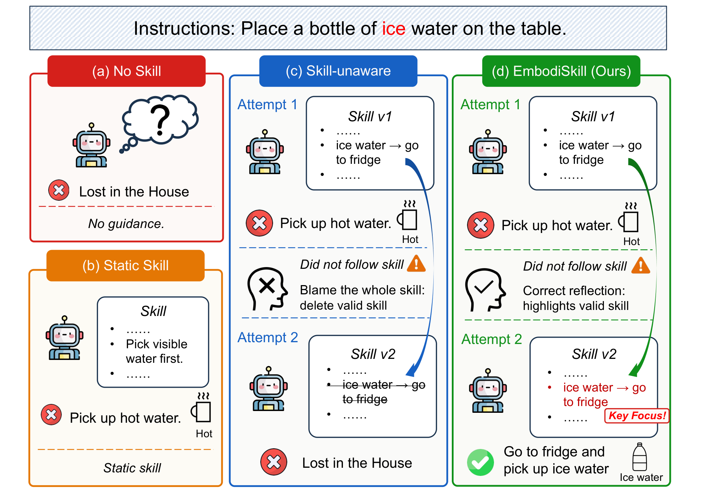
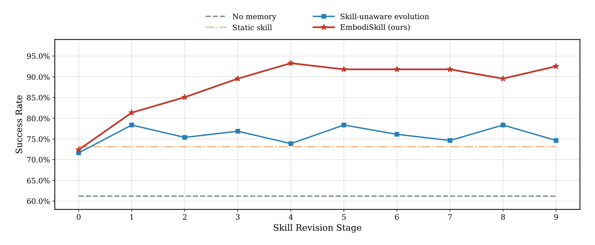

# EmbodiSkill: Skill-Aware Reflection for Self-Evolving Embodied Agents

## 来源

- **PDF**：`raw/2605.10332v2.pdf`（arXiv:2605.10332v2，2026-07-11；页眉日期 2026-7-14）
- **标题**：EmbodiSkill: Skill-Aware Reflection for Self-Evolving Embodied Agents
- **团队**：南京大学 + 华中科技大学 + 中国科学技术大学 + Microsoft Research + 清华 AIR。一作并列 Ruofei Ju / Xinrui Wang（实习在 AIR）；通讯 Xin Ding、Ting Cao。
- **体量**：15 页，3 图，3 表。
- **代码**：[github.com/air-embodied-brain/EmbodiSkill](https://github.com/air-embodied-brain/EmbodiSkill)（外部；不能升级为原文确证）
- **定位**：**training-free 框架，不是新权重。** 执行器 \(\pi_\theta\) 冻结；进化模型 \(F\) 只改技能文档。本库不建模型页：系统产出是可修订的技能正文 + 附录。
- **不要混名**：slug 是 `embodiskill`，绝不能写成 [EmbodiedSkills](embodied-skills.md)。后者是 VLA 上层 typed 合同 + AgentLoop，低层是任务特化 [π0.5](pi0.5.md)。本页也不是 [ASPIRE](aspire.md) 的 code-as-policy 程序库：这里改的是自然语言程序规格，不是可执行 Python。三条路的对照见 [具身 skill 自进化](../concepts/embodied-skill-self-evolution.md)。

仿真与视觉基准用的执行器 / 进化模型都是现成冻结 LLM，本库没有对应新模型页：

| 角色 | 原文身份 | 是否更新权重 |
| --- | --- | --- |
| ALFWorld 执行器 \(\pi_\theta\) | [Qwen2.5-14B-Instruct](https://arxiv.org/abs/2412.15115) 或 [Qwen3.5-27B](../models/qwen3.5.md)（§4.1） | 冻结；增益外化到技能（§3.1 Eq. 3） |
| EmbodiedBench 执行器 | [Qwen3-VL-8B-Instruct](../models/qwen3-vl.md) / Qwen3-VL-32B-Instruct（§4.1） | 冻结 |
| 技能进化模型 \(F\) | GPT-5.2 或 Gemini-3-flash；反思、合并、改正文、改附录共用同一模型、不同 prompt（§3.1、§4.1） | 未写训练 |
| 系统产出 | \(S=(S_{\mathrm{body}}, S_{\mathrm{app}})\)：技能正文 + 只强调已有规则的附录（§3.1 Eq. 2） | 改文档，不是 VLA 权重 |

## 核心结论

EmbodiSkill 主张：具身轨迹里的失败**不一定**说明技能写错了，也可能是执行器没按有效指导去做（摘要、§1）。数字环境里常见的「把整条轨迹收成一段反馈、整份技能重写一遍」搬到具身设定会覆盖有效条款、堆冗余、或留下错误处方。

做法是 **skill-aware reflection + Skill-Aware Evolution Spiral**（摘要、§3.2）：

1. 用当前技能解释轨迹，而不是把轨迹收成笼统反馈。
2. 只把**会改技能内容**的证据写进正文：缺失条款、更好做法、错误/不完整条款。
3. 把**执行偏差**（技能有效但没被遵守）写进附录，强调已有指导，不改规则。
4. 修订后的技能再去导后续任务，形成闭环。

**已据原文核实的边界**：执行器参数全程固定，「all improvement across task executions is externalized into the evolving skill」（§3.1）。原文没有报告对任何 VLA 或策略网络做梯度更新。技能是「persistent and revisable procedural specification」（§1），写前提、子目标顺序、affordances、视觉搜索、动作前置条件和恢复策略；不是动作 token，也不是 typed runtime 合同。

Headline 数字必须先分清**相对涨幅**和**成功率百分点**。摘要「outperforming GPT-5.2 … by 31.58%」= Table 1 上 Qwen3.5-27B + GPT-5.2 的 93.28% 相对 GPT-5.2 直接执行 70.89% 的相对涨幅（\(93.28/70.89-1\)）。同一行相对 G-Memory 74.62% 的 25.01%、相对 skill-unaware 78.36% 的 19.04%（§1、§4.3）也是相对涨幅。Table 3 的 \(\Delta_{\mathrm{aware}}\) 才是百分点：同一对执行器/进化模型上，93.28 − 78.36 = **+14.92 pp**。

不要用 [ASPIRE](aspire.md) 的 LIBERO-Pro / Robosuite 或 [EmbodiedSkills](embodied-skills.md) 的 RoboTwin / LIBERO 数字填本页。

## 架构与训练

原文没有神经网络训练配方。所谓「架构」是冻结执行器 + 技能文档 + 事后进化模型。

> Figure 1（原文截图，§1）："Motivating example of EmbodiSkill. For the same task instruction, (a) no skill leaves the agent without procedural guidance and causes inefficient exploration, (b) a static skill provides incomplete guidance and cannot adapt from trajectories, and (c) skill-unaware evolution may misinterpret an execution lapse as a skill defect and wrongly revise valid skill content. In contrast, (d) EmbodiSkill reflects on the trajectory against the current skill, preserves valid guidance, and updates the skill to improve later task executions."

### 技能是正文 + 附录，不是程序库

第 \(n\) 步的技能写成 \(S^{(n)}=(S^{(n)}_{\mathrm{body}}, S^{(n)}_{\mathrm{app}})\)（Eq. 2）。正文是给未来执行用的处方；附录**不引入新规则**，只强调正文里已经有、但执行器容易忽略的条款（§3.1）。Figure 2 把当前技能画成 Skill 1 … Skill K 加 Appendix，仍是一份文档，不是 [ASPIRE](aspire.md) 那种 coordinator 晋升、跨任务检索的修复程序库。

执行器按 \(a_t\sim\pi_\theta(\cdot\mid I,S^{(n)},h_t)\) 采样，\(\theta\) 固定（Eq. 3）。进化模型 \(F\) 只在轨迹结束后工作。

> Figure 2（原文截图，§3 开篇）："Overview of EmbodiSkill. The executor uses the current skill to perform embodied tasks and generate trajectories. Skill-aware reflection uses each trajectory to produce targeted reflection records. Accumulated reflections are consolidated into body-level revisions and skill-appendix updates, forming the next skill version. The revised skill then guides subsequent task execution, creating a Skill-Aware Evolution Spiral."

### 四种反思：成功只发现/优化，失败才判缺陷或偏差

对轨迹 \(\tau\) 与当前技能，\(F\) 最多产出 \(K\) 条结构化记录；证据不够则 \(m_\tau=0\)，不反思（Eq. 6、§3.2.1）。每条记录带类型、轨迹证据、更新指令；改已有条款时还必须指向正文里的具体 \(b_i\)。

| 轨迹成败 | 允许的类型 | 改哪里 |
| --- | --- | --- |
| 成功 \(r=1\) | **Discovery**：正文没有的有用条款；**Optimization**：已有条款有效，但轨迹给出更好做法 | 只进正文修订信号 |
| 失败 \(r=0\) | **SkillDefect**：已有条款错误、不完整或未写清；**ExecutionLapse**：条款有效，执行器没遵守 | 缺陷改正文；偏差**只**进附录 |

成功轨迹不允许判 SkillDefect / ExecutionLapse，失败轨迹不允许 Discovery / Optimization（Eq. 7a–7b）。这是和「整段轨迹收成一段反馈」的机制差别。

### 修订：先合并，再当受限编辑器

反思攒到修订间隔 \(B\) 之后才改技能（Algorithm 1）。先按类型拆开（Eq. 8）：

- Discovery / Optimization / SkillDefect 先合并：去冗余、按目标条款归组、能调和的冲突调和；放错类型或无法可靠调和就改类型或丢掉，不硬写进正文（Eq. 9、§3.2.2）。
- 合并后的 \(\widetilde{\mathcal{R}}_{\mathrm{rev}}\) 用来改正文。\(F\) 是 **constrained editor**，不是自由重写：未被点名的条款实质保持；只允许有限的一致性编辑（Eq. 10）。
- 正文更新之后，ExecutionLapse 才和**新正文**、旧附录一起生成新附录：合并重复、删掉已不对应新正文的旧条、纳入新的偏差提醒（Eq. 11）。附录更新不增删改正文规则。

实验默认 \(K=1\)、10 个 revision stage；训练任务随机抽，评测时技能冻结（§4.1）。

## 后训练

没有。作者自己写 training-free（摘要）：不 SFT、不 RL、不更新执行器或进化模型。跨任务变强靠技能文档版本 \(S^{(0)}\to S^{(N)}\)，目标是同一冻结执行器上提高 \(\mathbb{E}[r(\tau)]\)（Eq. 4–5）。

这和 [ASPIRE](aspire.md)「冻结 Claude 写程序、验证后入库」同属改外部知识，但对象不同：这边是一份技能正文/附录，那边是可执行程序补丁库。和 [EmbodiedSkills](embodied-skills.md) 更远：那边高层 Qwen3-VL scheduler **有** SFT，低层 π0.5 **按任务 fine-tune**，技能合同固定不进化。

## 评测要点

技能在**训练任务**轨迹上进化，在 **held-out 测试任务**上评冻结后的技能（§4.1）。ALFWorld 3,553 / 134；EmbodiedBench-Habitat 1,000 训练 + 6 个测试子集各 50；EmbodiedBench-Navigation 1,000 训练 + 5 个测试子集各 60。指标一律任务成功率。

对照两组（§4.1）：闭源直接执行（GPT-5.2 / Gemini-3-flash，无进化技能）；同执行器上的轨迹级记忆（Mem0 / G-Memory / LangMem）。同执行器时，差别应记在外部技能/记忆，不记在换模型。

### ALFWorld（Table 1）

| Method | Overall | Put | Clean | Heat | Cool | Examine | Puttwo |
| --- | ---: | ---: | ---: | ---: | ---: | ---: | ---: |
| GPT-5.2 直接执行 | 70.89 | 87.50 | 67.74 | 56.52 | 76.19 | 83.33 | 52.94 |
| Gemini-3-flash 直接执行 | 82.09 | 91.67 | 83.87 | 65.22 | 85.71 | 83.33 | 82.35 |
| Qwen2.5-14B No memory | 46.27 | 33.33 | 51.61 | 26.09 | 85.71 | 72.22 | 5.88 |
| Qwen2.5-14B G-Memory | 67.16 | 50.00 | 83.87 | 69.57 | 85.71 | 83.33 | 17.65 |
| Qwen2.5-14B EmbodiSkill w/ GPT-5.2 | 86.57 | 91.67 | 96.77 | 73.91 | 95.24 | 83.33 | 70.59 |
| Qwen2.5-14B EmbodiSkill w/ Gemini | 85.82 | 79.17 | 93.55 | 73.91 | 90.48 | 100.00 | 76.47 |
| Qwen3.5-27B No memory | 61.19 | 66.67 | 51.61 | 65.22 | 76.19 | 72.22 | 35.29 |
| Qwen3.5-27B G-Memory | 74.62 | 62.50 | 77.42 | 82.61 | 85.71 | 83.33 | 52.94 |
| **Qwen3.5-27B EmbodiSkill w/ GPT-5.2** | **93.28** | 95.83 | 96.77 | 73.91 | 95.24 | 100.00 | 100.00 |
| Qwen3.5-27B EmbodiSkill w/ Gemini | 87.31 | 95.83 | 93.55 | 69.57 | 95.24 | 83.33 | 82.35 |

Table 1（§4.2）。Qwen3.5-27B + GPT-5.2 在六类子任务里五个最好或并列最好；Puttwo 100.00%，同执行器 G-Memory 52.94%。Heat 仍是 73.91%，没有被写成已经解决。Mem0 / LangMem 在 14B 上会低于 No memory（12.69 / 36.57 vs 46.27），说明「加记忆」不是单调增益。

摘要 31.58% / 25.01% 是相对 GPT-5.2 直接执行和同执行器 G-Memory 的相对涨幅，不是另两套协议。

### EmbodiedBench（Table 2）

子类分是整数（caption：rounded to integers）；Avg 保留两位。Habitat 六类 Base / Com. / Comp. / Vis. / Spa. / Long；Navigation 五类，无 Spa。

| Method | Habitat Avg | Nav. Avg |
| --- | ---: | ---: |
| GPT-5.2 直接执行 | 40.00 | 57.33 |
| Gemini-3-flash 直接执行 | 46.00 | 56.00 |
| Qwen3-VL-8B No memory | 24.00 | 45.00 |
| Qwen3-VL-8B G-Memory | 25.66 | 37.33 |
| Qwen3-VL-8B Ours-GPT | 45.33 | 50.33 |
| Qwen3-VL-32B G-Memory | 45.00 | 50.33 |
| Qwen3-VL-32B Mem0 / LangMem | 38.33 | 52.00 |
| Qwen3-VL-32B Ours-GPT | 50.33 | **61.33** |
| **Qwen3-VL-32B Ours-Gemini** | **52.33** | **61.33** |

Table 2（§4.2）。正文「强于最强记忆基线 16.29% / 17.94%、强于最强闭源直接执行 13.76% / 6.98%」仍是相对涨幅：Habitat 52.33 vs G-Memory 45.00、vs Gemini 46.00；Navigation 61.33 vs Mem0/LangMem 52.00、vs GPT-5.2 57.33。8B 的 Navigation Long：Ours-GPT 为 0，记忆基线也是 0；32B 才到 33 / 32。不要把 52.33 / 61.33 读成已经压过闭源直接执行的所有子类。

### 消融：增益来自 skill-aware，不只是「会改技能」（Table 3、Figure 3）

四种设定共用 ALFWorld（§4.3）：无技能；静态初始技能；skill-unaware（从轨迹改技能，但不标条款、不分类、不拆正文/附录）；完整 EmbodiSkill。

| 执行器 | 进化模型 | No skill | Static | Skill-unaware | EmbodiSkill | \(\Delta_{\mathrm{aware}}\) |
| --- | --- | ---: | ---: | ---: | ---: | ---: |
| Qwen2.5-14B | GPT-5.2 | 46.27 | 65.67 | 70.90 | 86.57 | +15.67 |
| Qwen2.5-14B | Gemini-3-flash | — | 58.95 | 67.91 | 85.82 | +17.91 |
| Qwen3.5-27B | GPT-5.2 | 61.19 | 73.13 | 78.36 | 93.28 | +14.92 |
| Qwen3.5-27B | Gemini-3-flash | — | 79.85 | 85.82 | 87.31 | +1.49 |

Table 3。Gemini 行未再写 No skill，该列只依赖执行器。Qwen3.5-27B + GPT-5.2：静态技能相对无记忆 61.19→73.13（正文写成 19.51% 相对）；skill-unaware 到 78.36；完整方法到 93.28，相对静态 27.55%、相对 skill-unaware 19.04%。Qwen3.5-27B + Gemini 的 \(\Delta_{\mathrm{aware}}\) 只有 +1.49 pp：skill-aware 的边际取决于进化模型，不是常数。

> Figure 3（原文截图，§4.3）："ALFWorld test success rate across skill revision stages. EmbodiSkill quickly improves from the static skill and remains at a high success rate, while skill-unaware evolution converges to a lower performance range."

执行器 Qwen3.5-27B、进化模型 GPT-5.2。作者把 skill-unaware 的波动写成「不归因就改技能会更不稳」（§4.3）。

## 证据边界与阅读提示

- 摘要 31.58% / 25.01% / 19.04% 是相对涨幅；Table 3 的 +14.92 才是百分点。和 [ASPIRE](aspire.md) 正文把「77 points」写成百分点的口径相反，横比前先换算。
- 没有真机，也没有 VLA 后端。ALFWorld 是文本交互家务，EmbodiedBench 是视觉仿真。不要把它写成 [π0](pi0.md) / [π0.5](pi0.5.md) 的低层替换。
- 近邻不要混名（**已闭合**）：[ASPIRE](aspire.md) 写/改程序并扩张库；[EmbodiedSkills](embodied-skills.md) 固定 typed 合同 + AgentLoop；本页冻结 LLM 改技能正文。[AtomicVLA](atomicvla.md) 技能是 SG-MoE 路由，低层仍是 π0 连续专家，ALFWorld 93.28% 不能填它的 LIBERO 表。[SayCan](saycan.md) 是固定技能表 × value function。
- **已闭合**：[Inner Monologue](inner-monologue.md) 是 SayCan 的语言反馈闭环，技能库仍固定，只把成功/场景写成文字给 LLM。不能从本页推出，也不要把本页的技能正文改写写成那篇的闭环。

## 待追问

- **现有材料待核**：技能正文的具体格式、初始技能从哪来、\(B\) 的数值，正文只给了 \(K=1\) 和 10 个 stage。附录是否公开完整技能快照，本页未逐条核。
- **需实验或作者披露**：进化模型是 GPT-5.2 / Gemini-3-flash，执行器是开源 Qwen。更小进化模型能不能做同一套受限编辑，原文没验证。
- **需实验或作者披露**：8B Navigation Long 仍是 0。长程视觉导航缺的是技能条款、观察、还是执行器本身，表分不开。
- **需实验或作者披露**：Qwen3.5-27B + Gemini 的 skill-aware 边际只有 +1.49 pp。是 Gemini 已经把粗更新做得够稳，还是反思类型在这个组合上失效？
- **需实验或作者披露**：原文没有独立 Limitations 节。技能文档膨胀、过时条款、附录噪音，都没有机制消融。

## 相关页面

- 概念：[具身 skill 自进化](../concepts/embodied-skill-self-evolution.md) · [Vision-Language-Action](../concepts/vision-language-action.md)（本页不是动作头）
- 另两条路，不要混名：[ASPIRE](aspire.md)（程序库 + 进化搜索）· [EmbodiedSkills](embodied-skills.md)（typed 合同 + AgentLoop）
- 固定技能表，库不进化：[SayCan](saycan.md) · 语言反馈闭环、库仍固定：[Inner Monologue](inner-monologue.md)
- 冻结执行器身份：[Qwen3.5](../models/qwen3.5.md) · [Qwen3-VL](../models/qwen3-vl.md)
- 不是本页低层：[π0](pi0.md) · [π0.5](pi0.5.md) · [OpenVLA](openvla.md) · [AtomicVLA](atomicvla.md)
