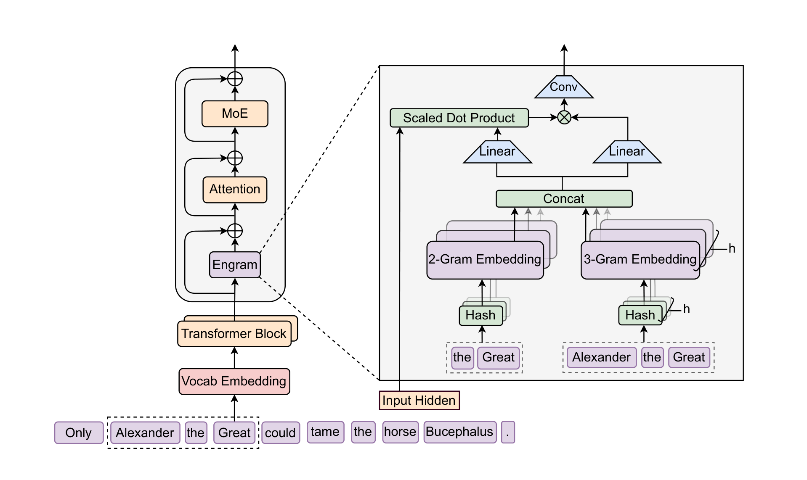
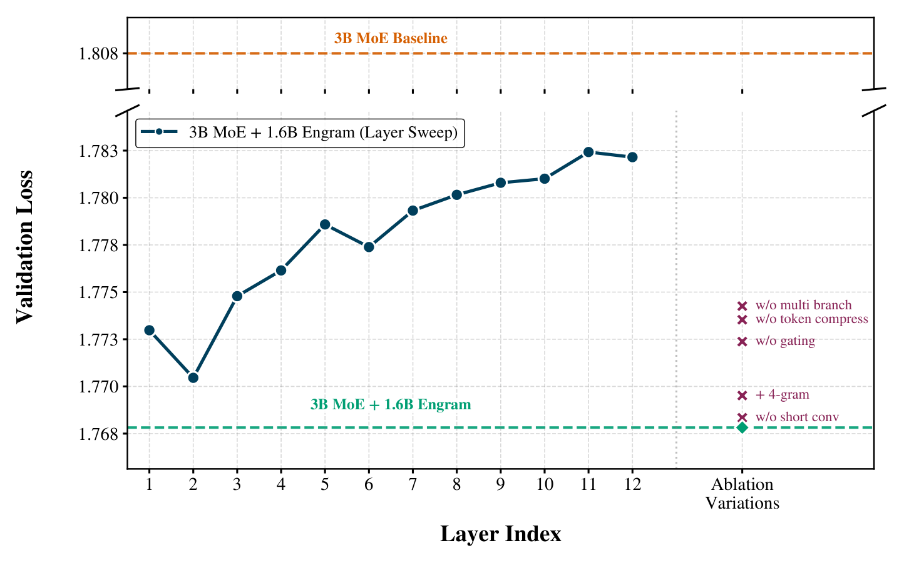
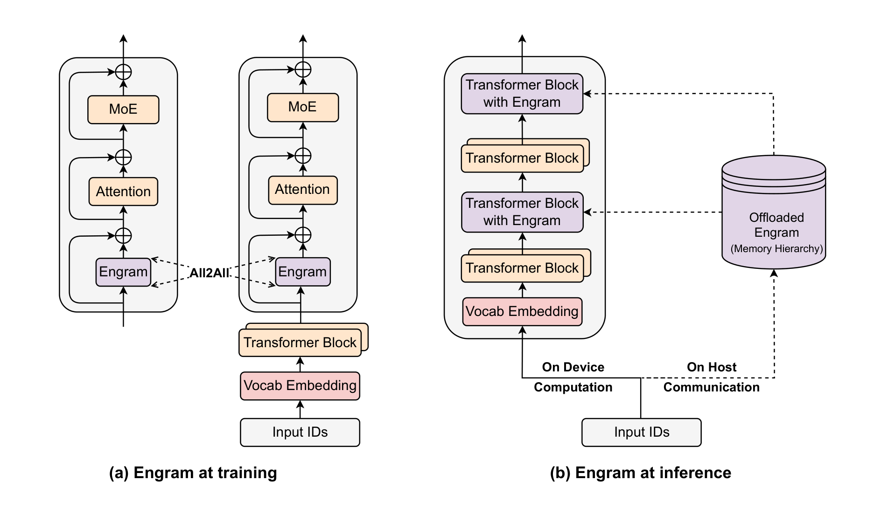
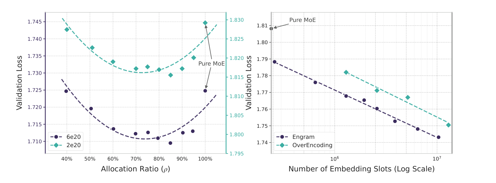
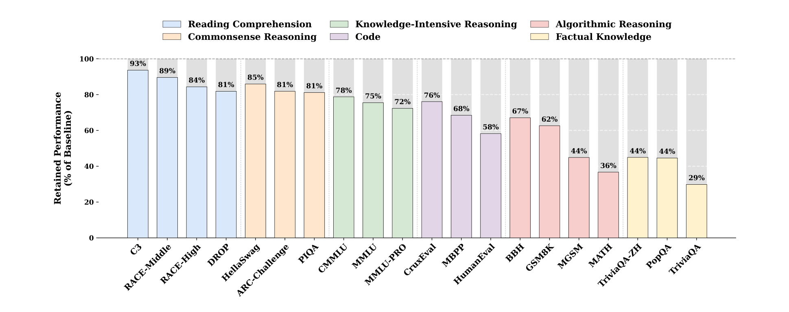
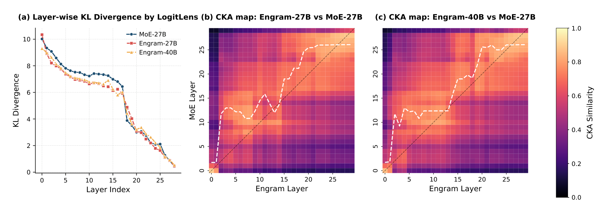

# Engram：Conditional Memory via Scalable Lookup

## 来源

- **PDF**：`raw/2601.07372v2.pdf`（arXiv:2601.07372v2，35 页；v1 2026-01-12，v2 2026-07-12）
- **标题**：Conditional Memory via Scalable Lookup: A New Axis of Sparsity for Large Language Models
- **团队**：Peking University + DeepSeek-AI；并列一作 Xin Cheng、Rui Tian；通讯 Huishuai Zhang、Dongyan Zhao、Wenfeng Liang
- **代码**：[github.com/deepseek-ai/Engram](https://github.com/deepseek-ai/Engram)
- **定位**：**方法论文，非生产模型报告**。提出 conditional memory 这条与 MoE 互补的稀疏轴，并给出研究模型 Engram-27B / Engram-40B。不建模型页。

## 核心结论

1. **Transformer 缺原生 lookup 原语**，只好用前几层 Attention + FFN 运行时重建静态表（命名实体、套话）。作者把这叫 expensive runtime reconstruction，主张另开一条稀疏轴：**conditional computation（MoE）处理动态逻辑，conditional memory（Engram）用 $O(1)$ 查找取静态知识**（原文确证，§1）。
2. **Sparsity Allocation 呈 U 形**：固定 $P_{\text{tot}}$ 与 $P_{\text{act}}$，把 inactive 预算按 $\rho$ 分给 MoE experts、$(1-\rho)$ 分给 Engram。纯 MoE（$\rho=100\%$）不是最优；约 20–25% 稀疏预算改给 Engram（$\rho\approx 75\%$–$80\%$）验证损失最低，且最优点在 $2\times 10^{20}$ 与 $6\times 10^{20}$ FLOPs 两档都稳定。$\rho\approx 40\%$ 仍能追平纯 MoE（原文确证，§3.1 / Figure 3 左）。
3. **iso-param / iso-FLOPs 的 27B 对照赢过纯 MoE**。Engram-27B 把 routed experts 从 72 收到 55（$\rho=74.3\%$），腾出 5.7B Engram 表；同 3.8B 激活、同 262B tokens。知识项有增益（MMLU +3.0、CMMLU +4.0、MMLU-Pro +1.8），推理 / 代码 / 数学的增益更大（BBH +5.0、ARC-Challenge +3.7、DROP +3.3、HumanEval +3.0、MATH +2.4、GSM8K +2.2）（原文确证，Table 1；摘要写 MMLU +3.4，以 Table 1 的 57.4→60.4 为准）。
4. **机制解释是“等效加深”**：LogitLens 显示早期层更早接近最终预测；CKA 上 Engram 第 5 层表征最接近 MoE 基线约第 12 层。关掉 Engram 输出时事实知识崩到 29–44%（TriviaQA 29%），阅读理解仍留 81–93%（C3 93%）——作者据此把 Engram 写成 parametric knowledge 的主仓库，把上下文任务留给 backbone attention（原文确证，§6.1 / §6.3 / Figure 4 / Figure 6）。**“等效加深导致推理变强”是作者的机制解释，不是干预实验。**
5. **确定性寻址可主机预取**。训练时表按 GPU 切、All-to-All 取 active 行；推理时 index 在 forward 前已知，可与前面 Transformer block 重叠 PCIe。100B 表全放 host DRAM、无 HBM 热缓存时，4B/8B dense 吞吐只掉 1.9% / 2.8%（原文确证，Table 4）。

> Figure 1 | The Engram Architecture. The module augments the backbone by retrieving static $N$-gram memory and fusing it with dynamic hidden states via context-aware gating. This module is applied only to specific layers to decouple memory from compute, leaving the standard input embedding and un-embedding module intact.（§2 / Figure 1）

## 架构与训练

### 模块：检索 + 融合（原文确证，§2.2–§2.3）

对每个位置 $t$：

1. **Tokenizer compression**。预计算满射 $P:V\to V'$，按 NFKC + 小写等把语义等价 token 折成 canonical ID。128k tokenizer 有效词表降 23.43%（Appendix C / Table 6）。后缀 $N$-gram 建在压缩 ID 上。
2. **Multi-head hashing**。每个 $N$-gram 阶 $n$ 配 $K$ 个 hash head，乘法-XOR 哈希到素数大小的表 $E_{n,k}$。检索向量是各 head、各阶的拼接。主实验 $n\in\{2,3\}$、$K=8$。
3. **Context-aware gating**。当前 hidden $h_t$ 当 Query，检索向量 $e_t$ 投影成 Key/Value：

$$k_t=W_K e_t,\quad v_t=W_V e_t,\quad \alpha_t=\sigma\Bigl(\frac{\mathrm{RMSNorm}(h_t)^\top\mathrm{RMSNorm}(k_t)}{\sqrt{d}}\Bigr)$$

$\tilde v_t=\alpha_t\cdot v_t$。门接近 0 时丢掉冲突或碰撞噪声。
4. **短卷积**。kernel 4、dilation = 最大 $N$-gram 阶、SiLU：$Y=\mathrm{SiLU}(\mathrm{Conv1D}(\mathrm{RMSNorm}(\tilde V)))+\tilde V$，再残差加回 $H^{(\ell)}$。卷积参数零初始化，训练起点是恒等映射。

Engram **不是每层都插**。27B/40B 插在第 2、15 层（Appendix A）。12 层 3B 消融里，单模块最优在 Layer 2（Val 1.770）；同一 1.6B 预算拆成 Layer 2+6 更好（1.768）。更深插入效果变差：太早则 gating 的 $h_t$ 还没聚合全局上下文，太晚则浪费本可省下的底层局部重建（原文确证，§6.2 / Figure 5）。

> Figure 5 | Architecture ablation results. … (1) Layer Sensitivity: … early injection (Layer 2) is optimal … (2) Component Ablation: … multi-branch integration, tokenizer compression, and context-aware gating.（§6.2 / Figure 5）

### 与 mHC 多分支集成（原文确证，§2.4）

默认 backbone 是 Manifold-Constrained Hyper-Connections，$M=4$。一张稀疏表和 $W_V$ 跨分支共享，$M$ 个 $W_K^{(m)}$ 做分支门。投影可融成一次 dense FP8 GEMM。作者写 Engram 拓扑无关，但消融显示去掉 branch-specific fusion 是最大回归之一。

### 系统：训练切表、推理预取（原文确证，§2.5 / Figure 2）

> Figure 2 | System implementation of Engram. (a) Training Phase: … All-to-All … (b) Inference Phase: Engram tables are offloaded to host memory. … asynchronously prefetches … overlapping communication with the on-device computation of preceding Transformer blocks.（§2.5 / Figure 2）

与 MoE 动态路由不同，hash index 只依赖 input token ID，在对应层执行前就算得出来。作者还提到 Zipf 访问可做 HBM / DRAM / NVMe 分层缓存；Table 4 的 100B offload **没有**开这层缓存，是保守基线。

### Sparsity Allocation（原文确证，§3）

三个量：$P_{\text{tot}}$（不含词表与 LM head）、$P_{\text{act}}$（决定 FLOPs）、$P_{\text{sparse}}=P_{\text{tot}}-P_{\text{act}}$。分配比 $\rho$ 是 inactive 预算里给 MoE 的比例。两档都保持 $P_{\text{tot}}/P_{\text{act}}\approx 10$：

| 计算预算 | $P_{\text{tot}}$ / $P_{\text{act}}$ | $\rho=1$ expert 数 | 观察 |
| --- | --- | --- | --- |
| $2\times 10^{20}$ FLOPs | 5.7B / 568M | 106 | U 形；$\rho\approx 40\%$ 已追平纯 MoE |
| $6\times 10^{20}$ FLOPs | 9.9B / 993M | 99 | 最优点 $\rho\approx 80\%$，Val 1.7248→1.7109（$\Delta=0.0139$） |

无限内存设定：固定 3B MoE backbone（$P_{\text{act}}=568$M）、100B tokens，只扫 Engram 槽数 $2.58\times 10^5$–$1.0\times 10^7$（最多约 +13B 参数）。验证损失对槽数 log-linear；同预算下 Engram 低于把 $N$-gram 平均进词表 embedding 的 OverEncoding（Huang et al., 2025a）。SCONE 因额外 FLOPs 未纳入 iso-compute 对照（原文确证，§3.2 / Figure 3 右）。

> Figure 3 | Sparsity allocation and Engram scaling. Left: Validation loss across allocation ratios $\rho$. … U-shape, with hybrid allocation surpassing Pure MoE. Right: … log-linear trend with respect to the number of embeddings.（§3 / Figure 3）

**读法**：U 形两端的失败模式原文写得很清楚——$\rho\to 100\%$ 没有静态记忆、被迫用深度重建；$\rho\to 0\%$ 丢掉条件计算，记忆替代不了推理。这和 [Qwen3.8-Next](qwen3.8-next.md) Table 8「固定总参、用 expert 换 n-gram，下游没有清楚超过纯 MoE」**同方向但结论不同**：Qwen 因此改成 MoE 预算固定、只加表；Engram 则声称在更完整的模块设计下，重分配 20–25% 就能赢。两边实验不可直接对打（backbone、模块件、评测都不同），见概念页。

### 27B / 40B 预训练配方（原文确证，§4.1 / Appendix A）

四模型共用：DeepSeek-V3 tokenizer（词表 129280）、30 层、hidden 2560、MLA 32 heads、mHC expansion 4、Muon、序列 4096、batch 1280、50k steps、262B tokens。MoE 用 [Loss-Free Balancing](loss-free-balancing.md)。Engram 表用 Adam、学习率 ×5、无 weight decay。

| | Dense-4B | MoE-27B | Engram-27B | Engram-40B |
| --- | ---: | ---: | ---: | ---: |
| 总参 | 4.1B | 26.7B | 26.7B | 39.5B |
| 激活（不含 token embed） | 3.8B | 3.8B | 3.8B | 3.8B |
| routed + shared（top-6） | — | 72+2 | 55+2 | 55+2 |
| Engram 参数 / 槽 | — | — | 5.7B / 2.26M | 18.5B / 7.24M |
| 插入层 / $N$-gram / heads / $d_{\text{mem}}$ | — | — | [2,15] / {2,3} / 8 / 1280 | 同左 |

## 后训练

没有 SFT / RL。长上下文是预训练之后的 YaRN 扩展：32K、5,000 steps、30B tokens，超参 $s=10$、$\alpha=1$、$\beta=32$、$f=0.707$，作者写跟 DeepSeek-V3 同一套（原文确证，§5.1）。本页不当成 agentic 后训练证据。

## 评测要点

主表是同数据顺序、同激活的预训练分数（Table 1）。只列相对 MoE-27B 的关键项；完整表见原文。

| 项 | Dense-4B | MoE-27B | Engram-27B | Engram-40B | Δ（27B vs MoE） |
| --- | ---: | ---: | ---: | ---: | ---: |
| Pile loss | 2.091 | 1.960 | 1.950 | 1.942 | −0.010 |
| Val loss | 1.768 | 1.634 | 1.622 | 1.610 | −0.012 |
| MMLU 5-shot | 48.6 | 57.4 | 60.4 | 60.6 | +3.0 |
| CMMLU 5-shot | 47.9 | 57.9 | 61.9 | 63.4 | +4.0 |
| MMLU-Pro 5-shot | 21.1 | 28.3 | 30.1 | 31.3 | +1.8 |
| BBH 3-shot | 42.8 | 50.9 | 55.9 | 57.5 | +5.0 |
| ARC-Challenge 25-shot | 59.3 | 70.1 | 73.8 | 76.4 | +3.7 |
| DROP 1-shot | 41.6 | 55.7 | 59.0 | 60.7 | +3.3 |
| HumanEval 0-shot | 26.8 | 37.8 | 40.8 | 38.4 | +3.0 |
| MATH 4-shot | 15.2 | 28.3 | 30.7 | 30.6 | +2.4 |
| GSM8K 8-shot | 35.5 | 58.4 | 60.6 | 62.6 | +2.2 |

Engram-40B 并没有项项压过 27B（HumanEval 38.4、MBPP 46.2、C3 61.8 都低于 27B）。作者归因 under-training：训练末期 40B 与基线的 loss 缺口仍在拉大（原文确证，§4.2）。

长上下文（Table 2）用三个 Engram checkpoint 对 MoE-27B（50k, loss 1.63）：

| 设置 | 对照意图 | Multi-Query NIAH | Variable Tracking |
| --- | --- | ---: | ---: |
| MoE-27B 50k | 基线 | 84.2 | 77.0 |
| Engram-27B 46k（iso-loss 1.63） | 对齐基座能力 | 97.0 | 87.2 |
| Engram-27B 50k（iso-FLOPs） | 同预训练步数 | 97.0 | 89.0 |
| Engram-27B 41k（约 82% FLOPs） | 更少预训练 | 89.5 | 83.2 |

作者强调长上下文分数随预训练进度单调涨，所以必须控基座 loss 再比架构；41k 已在 LongPPL 打平并在 RULER 领先。这是 **32K YaRN 扩展上的检索任务**，不是 1M agent 轨迹。

> Figure 6 | Retained performance under Engram ablation. Factual knowledge relies heavily on the Engram module, whereas reading comprehension is largely preserved by the backbone.（§6.3 / Figure 6）

Figure 6 是训练–推理不一致的 post-hoc 消融（推理时压掉稀疏表、backbone 权重不变），作者自己把混能力任务标成高噪声，只强调事实 vs 阅读两端。

> Figure 4 | Analysis of representational alignment and convergence speed. (a) Layer-wise KL Divergence via LogitLens. … (b–c) CKA … upward shift of the high-similarity diagonal … shallow layers are functionally equivalent to deeper layers of the MoE model.（§6.1 / Figure 4）

## 待追问

- **摘要 MMLU +3.4 与 Table 1 的 +3.0 不一致**。MMLU-Redux 恰好是 +3.4（60.6→64.0）；未说明摘要用的是哪一列。
- **U 形分配 vs Qwen Table 8**：同是「拿 MoE 换 n-gram」，Engram 报下游全面领先，Qwen 报下游没有清楚超过纯 MoE。差在 tokenizer compression / 多头哈希 / 门控 / 双层插入 / mHC，还是评测与 backbone，两边都没有交叉复现。
- **「等效加深」没有因果干预**：CKA/LogitLens 是相关；没有把 MoE 加层到 CKA 对齐深度再比下游。推理增益也可能来自更好的局部统计，而不是腾出的深度。
- **Engram-40B 项项不占优 + 262B tokens 相对 27B 稀疏表偏短**。无限内存曲线是 100B tokens 的 3B backbone，不能外推到生产 token 预算。
- **Table 4 用 dense 4B/8B + 单层 100B Engram，不是 MoE-27B**。避开了 Expert Parallel，也没有测 MoE+Engram 同时通信。HBM 热缓存、NVMe 冷层、多机切表都只是设计陈述。
- **没有 instruct / RL / agent 评测**。确定性预取在 tool 交错、变长 rollout 下会不会被打乱，原文没测。
- **与 [Intern-S2-Mobius](intern-s2-mobius.md) 的「知识 Memory」不是同一接口**：Mobius 共享的是 FFN 参数库、Reasoner 用计算去读；Engram 是 hash 到静态 embedding。两边都没做对方的对照。

## 相关页面

- 概念：[条件记忆](../concepts/conditional-memory.md)、[MoE 前沿模型扩展](../concepts/moe-frontier-model-scaling.md)、[MoE 负载均衡谱系](../concepts/moe-load-balancing.md)、[高效长上下文注意力](../concepts/efficient-long-context-attention.md)、[注意力门控](../concepts/attention-gating.md)
- 生产侧 n-gram：[Qwen3.8-Next 架构报告](qwen3.8-next.md)、[Qwen3.8-Flash-Next](../models/qwen3.8-flash-next.md)
- 相邻的知识–计算拆分：[Intern-S2-Mobius 技术报告](intern-s2-mobius.md)
- 负载均衡一手出处：[Loss-Free Balancing](loss-free-balancing.md)
- 骨干组件：[Multi-Head Latent Attention](../concepts/multi-head-latent-attention.md)、[Attention Residuals](../concepts/attention-residuals.md)（mHC / GR 的残差家族）
- 主机侧另一类参数：[端侧 MoE serving](../concepts/edge-native-moe-serving.md)（expert 池 offload，不是 embedding 表）
