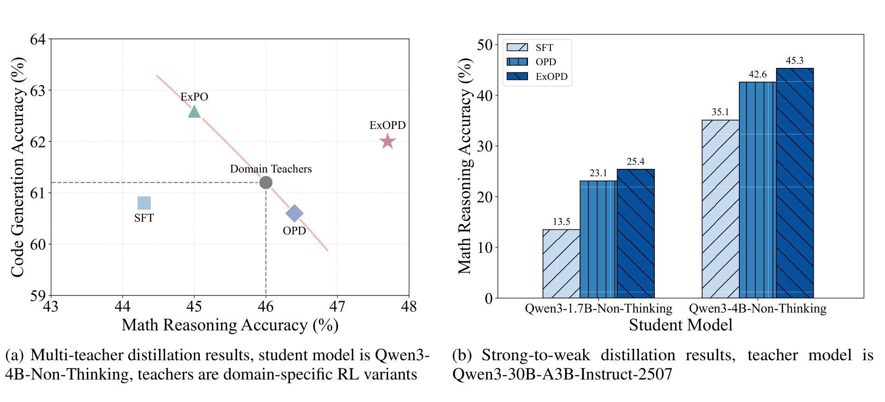
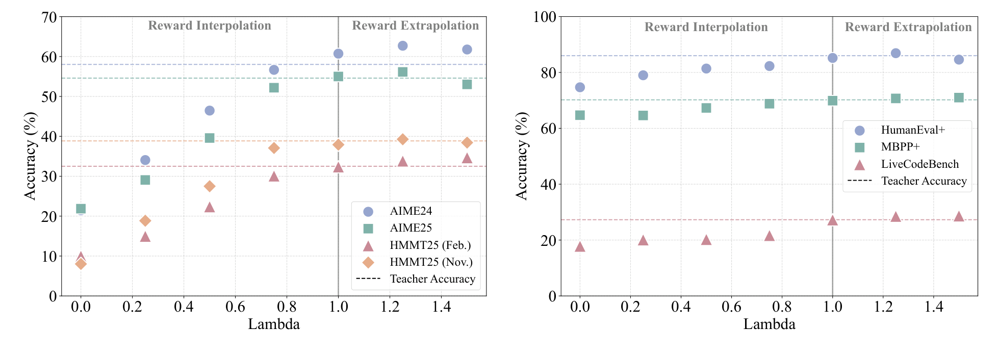
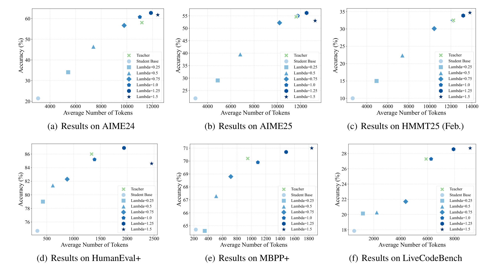
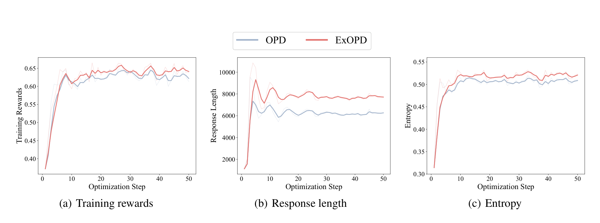

# ExOPD：Generalized On-Policy Distillation with Reward Extrapolation

## 来源

- 原始 PDF：[`raw/2602.12125v2.pdf`](../../raw/2602.12125v2.pdf)
- 标题：Learning beyond Teacher: Generalized On-Policy Distillation with Reward Extrapolation
- 版本 / 日期：arXiv:2602.12125v2，2026-02-26（v1 2026-02-12；页眉日期 2026-02-27）
- 作者：Wenkai Yang、Yankai Lin（人大高瓴）；Weijie Liu、Ruobing Xie、Kai Yang、Saiyong Yang（腾讯 LLM 部）。Yang 实习于腾讯
- 代码：<https://github.com/RUCBM/G-OPD>
- 模型链接：**未建模型页**——不发布新模型。实验是 Qwen3-4B / 1.7B 的 non-thinking 模式，teacher 包括自训的同尺寸 GRPO 专家和 Qwen3-30B-A3B-Instruct-2507

## 为什么这篇在 wiki 里独占一席

它给标准 OPD 加了一个生产报告里没有的旋钮：**reward scale \(\lambda\)**。\(\lambda=1\) 时 reference 被消掉，目标退回 student-first reverse KL；\(\lambda>1\)（作者称为 ExOPD）的闭式最优会沿着 teacher 相对 reference 的 log-ratio 再往外走。这是「同基座 RL 专家融回原模型时，学生可以超过 teacher」的一条显式机制，接在 [OPD 数学依据](../concepts/multi-teacher-on-policy-distillation.md#数学上没闭合的地方多-teacher-混采) 还开着的那一问旁边。

这个 \(\lambda\) **不是** [GKD](generalized-knowledge-distillation.md) 的数据混合比例。GKD 的 \(\lambda\) 决定 student 自生成数据占多少；这里的 \(\lambda\) 决定隐式 reward 相对 KL 的权重。两套符号不要混用。

## 核心结论

1. **标准 OPD 是 dense KL-constrained RL 的等权特例**（`§3.2` Remark）。在 student 轨迹上最小化 \(D_{\mathrm{KL}}(\pi_\theta\|\pi^\star)\) 后，引入任意 reference \(\pi_{\mathrm{ref}}\) 可改写成

\[\max_\theta\;\mathbb{E}_{y\sim\pi_\theta}\Big[\log\frac{\pi^\star(y|x)}{\pi_{\mathrm{ref}}(y|x)}-D_{\mathrm{KL}}(\pi_\theta\|\pi_{\mathrm{ref}})\Big].\]

隐式 reward 是 \(r=\log(\pi^\star/\pi_{\mathrm{ref}})\)，和 KL 项权重相等（原文对应 RL 目标里的 \(\beta=1\)）。\(\lambda=1\) 时 \(\pi_{\mathrm{ref}}\) 会消掉，所以「reference 可以任选」只在标准 OPD 里成立。

2. **G-OPD 把这个权重放开**（公式 11）。最优解满足（公式 12）

\[\log\pi_\theta(y|x)=\lambda\log\pi^\star(y|x)+(1-\lambda)\log\pi_{\mathrm{ref}}(y|x).\]

\(0<\lambda<1\) 是 reward interpolation，行为落在 reference 和 teacher 之间；\(\lambda>1\) 是 reward extrapolation，学生去拟合额外的 \((\lambda-1)(\log\pi^\star-\log\pi_{\mathrm{ref}})\)。实践梯度把未来 token 的折扣设为 0，只留当前 token（公式 6 / 14），和 [Thinking Machines](thinking-machines-on-policy-distillation.md)、MiMo 的 per-token 近似同一档，不是 [MiniLLM](minillm.md) 的累积 \(R_t\)。

3. **同尺寸、teacher 就是这个 student 的域 RL 时，\(\lambda=1.25\) 能超过 teacher；\(\lambda=1.5\) 会不稳。** 主表（Table 2）里 ExOPD 是唯一在 math 与 code 两边都超过对应 domain teacher 的方法。ExPO 的 code 均分更高，但四项数学全部低于 math teacher。

4. **strong-to-weak 只是把 OPD 再抬一截，学生仍远低于大 teacher。** Qwen3-30B-A3B-Instruct-2507 数学均分 59.7；4B ExOPD 45.3，1.7B ExOPD 25.4（Table 3）。把 reference 换成 teacher 的 pre-RL 基座（reward correction）还有小幅增益，但 30B teacher 的 pre-RL 权重作者拿不到，这组实验改用自训的 4B RL teacher。

## 方法

### 目标与 advantage 的符号

公式 14 / 附录公式 22 写出的系数是

\[A_t=(\log\pi_\theta-\log\pi^\star)+(\lambda-1)(\log\pi_{\mathrm{ref}}-\log\pi^\star).\]

它和公式 6 里最小化 reverse KL 的系数同号。原文把这一项标成最大化目标 \(J_{\text{G-OPD}}\) 的梯度；\(\lambda=1\) 时它等于最小化目标的梯度，符号与「最大化」不一致。公开实现在送进 PPO 之前取负号，`advantages = -reverse_kl`（来源：[dp_actor.py](https://github.com/RUCBM/G-OPD/blob/main/verl/verl/workers/actor/dp_actor.py)）。取负之后，\(\lambda=1\) 回到生产 OPD 的 \(\log\pi^\star-\log\pi_\theta\)。代码里 `ref_log_prob` 是 **teacher**，`base_log_prob` 才是论文的 \(\pi_{\mathrm{ref}}\)，和 verl 的惯用命名相反。

\(\lambda\neq 1\) 必须额外算 \(\log\pi_{\mathrm{ref}}\)。作者把默认 reference 设成 student 的初始策略。

### 两个设定里 reference 怎么选

- **同基座专家融回**：teacher 是从同一个 Qwen3-4B-Non-Thinking 做域 GRPO 得到的。\(\pi_{\mathrm{ref}}\) 就是这个初始模型，reward \(\log(\pi^\star/\pi_{\mathrm{ref}})\) 量的是 RL 带来的 log-prob 位移。
- **strong-to-weak**：默认 reference 仍是小 student 的初始权重。作者认为 \(\log(\pi^\star/\pi_{\mathrm{student}})\) 混进了容量差，换成 teacher 的 pre-RL 基座才更接近「RL 诱导的隐式 reward」（公式 10、13）。代价是要有那份权重，并且大 reference 的 log-prob 更贵。

公式 10 的「隐式 reward = KL 约束 RL 的闭式」在他们自己的 teacher 上并不严格成立：GRPO 的 KL coefficient 是 0（Table 4 / 5）。log-ratio 仍然度量 base 到 RL checkpoint 的位移，但不是某个 \(\beta>0\) 的最优策略差。

多 teacher 不是把两个 teacher 的 logits 加在同一条轨迹上。蒸馏数据和 RL 数据相同，数学样本被下采样到与代码的 25K 对齐，每条样本走自己的域 teacher。公开实现用样本字段 `opd_teacher` 做这个路由，并且写明目前只支持两个 teacher（来源：[README](https://github.com/RUCBM/G-OPD)）。

## 评测要点

Student 与同尺寸 teacher 都是 Qwen3-4B-Non-Thinking。数学 RL 数据是 DeepMath 难度 ≥ 6 的 57K；代码是 Eurus-RL-Code 的 25K。GRPO：reward 为 0/1，数学 500 step、代码 300 step、rollout \(n=8\)、KL coefficient 0。G-OPD：batch 1024、rollout \(n=1\)、学习率 \(1\times 10^{-5}\)、同尺寸 50 step、strong-to-weak 100 step，并做 token-level rollout correction。附录 B 写再加 step 会过拟合。评测 temperature 1.0、top-p 1.0、最长 16384；数学每题 32 条、代码每题 4 条，数学用 Math-Verify。后续实验把 \(\lambda\) 固定在 1.25，没有再按设定重扫。

> Figure 1. … (a) When merging multiple domain experts … ExOPD is the only method that yields a unified student that consistently outperforms all domain teachers. (b) ExOPD also yields significant improvements over standard OPD when distilling a smaller student from a larger teacher.（`§1`）

### 同尺寸单 teacher：\(\lambda\) 扫过插值与外推

> Figure 2 / Figure 3. On-policy distillation results … under different choices of reward scaling factor \(\lambda\).（`§4.1.2`）

\(\lambda=0\) 就是初始 student，不是一次训练。标准 OPD（\(\lambda=1\)）把准确率和长度都拉回到 domain teacher 附近。\(0<\lambda<1\) 时准确率和长度随 \(\lambda\) 单调靠近 teacher，作者把它连到 budget-controlled reasoning。\(\lambda=1.25\) 在他们扫过的点上超过 OPD 和 teacher；\(\lambda=1.5\) 会去追 log-ratio 的尖峰，作者归因于 implicit reward hacking，长度也继续变长（长度偏差，引他们自己的 LASER）。

> Figure 4. Trends in the average number of tokens and the average accuracy … under varying reward scaling factors.（`§4.1.2`）

Table 2 的均分（下标是相对 domain teacher 的绝对差）。Teacher 数学 46.0 / 代码 61.2；初始 student 15.4 / 52.4。

| 方法 | 单 teacher 数学 | 单 teacher 代码 | 多 teacher 数学 | 多 teacher 代码 |
| --- | ---: | ---: | ---: | ---: |
| ExPO | 45.8 (−0.2) | 61.0 (−0.2) | 45.0 (−1.0) | **62.6 (+1.4)** |
| OPD | 46.5 (+0.5) | 60.8 (−0.3) | 46.4 (+0.4) | 60.6 (−0.6) |
| ExOPD | **48.0 (+2.0)** | **62.1 (+0.9)** | **47.7 (+1.7)** | 62.0 (+0.8) |
| SFT | — | — | 44.3 (−1.7) | 60.8 (−0.4) |

多 teacher 的 ExOPD 在 7 个分项上都高于对应 domain teacher。ExPO 的代码三项都高于 code teacher，所以均分超过 ExOPD，但数学四项全低于 math teacher。SFT 轨迹数与 OPD 的 student rollout 对齐。ExPO 先把 teacher 权重平均，再相对 student 外推，\(\alpha\in\{0.25,0.5\}\)。

超过 teacher 不是因为 teacher 少训了。数学 teacher 再 GRPO 100 step，均分 46.0 → 46.9；ExOPD 50 step 是 48.0（Table 1）。附录 C 把 teacher 训到 1200 step 之后，优势变薄：数学 teacher 51.9，多 teacher ExOPD 52.5，但 HMMT25（Nov.）42.7 低于 teacher 的 42.9，不再是「每一项都超过」。代码 teacher 63.1，多 teacher ExOPD 64.4。

> Figure 5. Training dynamics of OPD and ExOPD in multi-teacher distillation experiments. EMA smoothing coefficient 0.5.（`§4.1.3`）

作者把更高的熵归因于回复更长，不是 mode collapse。这和 [nrehiew](nrehiew-sft-rl-opd.md) 那张「OPD 比 RL 更早掉熵」不是同一对照。

### strong-to-weak

Teacher 是 Qwen3-30B-A3B-Instruct-2507，数学均分 59.7。下标是相对标准 OPD。

| Student | Base | SFT | OPD | ExOPD |
| --- | ---: | ---: | ---: | ---: |
| Qwen3-1.7B-Non-Thinking | 8.8 | 13.5 | 23.1 | 25.4 (+2.3) |
| Qwen3-4B-Non-Thinking | 15.4 | 35.1 | 42.6 | 45.3 (+2.7) |

Reward correction 改用自训的 4B RL teacher，student 是 1.7B（Figure 6）。数学四项均分：SFT 22.7、OPD 27.5、ExOPD 28.1、加 correction 28.7。代码三项均分：47.0、50.5、51.3、52.3。增益在，幅度小于「ExOPD 相对 OPD」那一跳。

## 与现有 wiki 页的关系

- **[MOPD 概念页](../concepts/multi-teacher-on-policy-distillation.md)**：生产配方是 \(\lambda=1\) 的 reverse KL，闭式最优就是 teacher。ExOPD 说明「稳定超过同基座 RL teacher」可以来自 \(\lambda>1\) 的外推，而且实验只覆盖 prompt 按域分开的两域。它没有回答重叠 prompt 上两个 teacher 互相覆盖的问题，也没有解释 MiMo Table 7 / Nemotron 在 \(\lambda=1\) 下超过 teacher 的现象。
- **[GKD](generalized-knowledge-distillation.md)**：同名 \(\lambda\) 是另一根轴。本文的 on-policy 程度固定为 student 自采样，发散度固定为 sampled-token reverse KL。
- **[Thinking Machines Lab 博客](thinking-machines-on-policy-distillation.md)**：被引为折扣 0 的 per-token 近似来源之一。博客的 advantage 是 \(\log\pi_T-\log\pi_\theta\)，对应本文 \(\lambda=1\)。
- **[MiMo-V2-Flash](mimo-v2-flash.md)**：被引为「把多域 RL 专家用 OPD 融回原模型」的范式（Xiao et al. 2026）。本文是这个范式在 4B、两域上的 \(\lambda\) 改造，不是 MiMo 报告里的 MOPD 复现。
- **[OPSD](opsd.md)**：另一条 on-policy 自蒸馏。主实验是 full-vocab forward KL；本文是外部 teacher 的 sampled-token reverse KL。
- **[Revisiting OPD](revisiting-opd.md)**：相关工作把本文算作更灵活的 reward 配方。它自己改的是支撑集，不是 \(\lambda\)。
- **[DPO](dpo.md)**：公式 10 的隐式 reward 形式来自 Rafailov et al.。差别是本文的 \(\pi^\star\) 不必是从 \(\pi_{\mathrm{ref}}\) 解出来的 RL 最优策略。

## 待追问

- **需实验或作者披露**：\(\lambda=1\) 的生产 OPD 为什么也会超过 teacher？本文的闭式在 \(\lambda=1\) 时就是 teacher。主表里标准 OPD 数学均分只高 0.5、代码还低 0.3，和 MiMo / Nemotron 的「RL 域 student 普超 teacher」不是同一结果。
- **需实验或作者披露**：重叠 prompt、两个以上的域、跨模型族、thinking 模式。作者把这三件列为未来工作；公开实现也写明多 teacher 只支持 math/code 两个。
- **现有材料待核**：1200-step teacher 上「每一项超过 domain teacher」已经不成立。主表的「only method」不能外推到训满的专家。
- **需实验或作者披露**：\(\lambda=1.5\) 的尖峰 hacking 和长度偏差只有现象描述。没有像 OPSD 那样的 pointwise clip，也没有报 \(\lambda\) 在 1.25 附近的误差。
- **需实验或作者披露**：reward correction 没有在 30B-A3B 上做过，因为拿不到它的 pre-RL。Figure 6 的增益是 4B teacher → 1.7B student。

## 相关页面

- [Multi-Teacher On-Policy Distillation](../concepts/multi-teacher-on-policy-distillation.md)
- [On-Policy Distillation 跨报告对比](../comparisons/on-policy-distillation.md)
- [GKD](generalized-knowledge-distillation.md)
- [Thinking Machines Lab On-Policy Distillation 博客](thinking-machines-on-policy-distillation.md)
- [OPSD](opsd.md)
- [Revisiting OPD](revisiting-opd.md)
- [MiniLLM](minillm.md)
- [nrehiew 博客](nrehiew-sft-rl-opd.md)
- [MiMo-V2-Flash 技术报告](mimo-v2-flash.md)
- [DPO](dpo.md)
