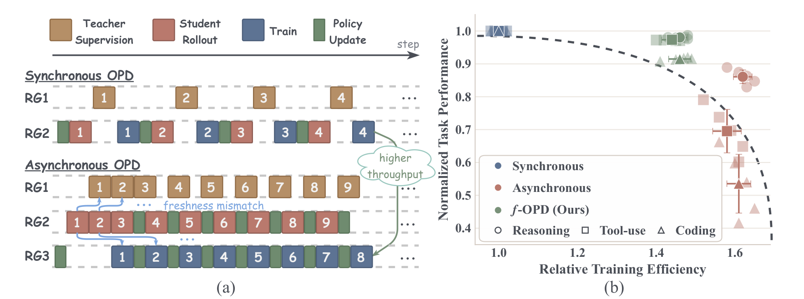
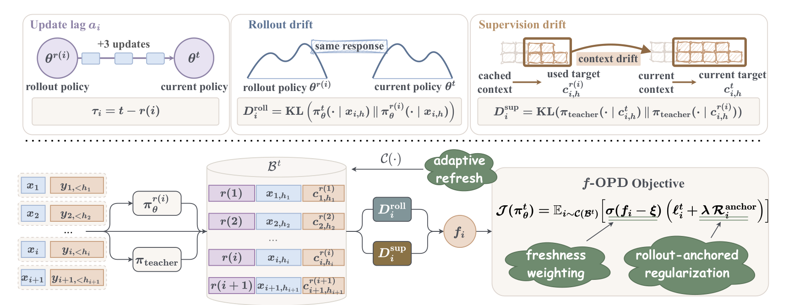
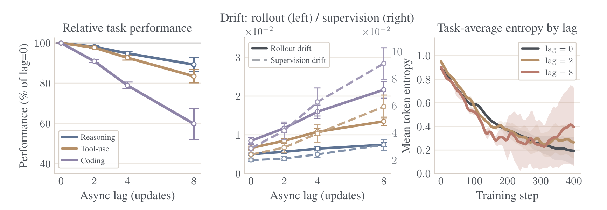
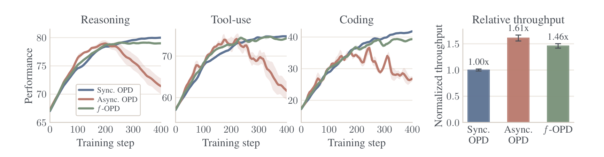

# f-OPD：异步 OPD 的新鲜度控制

## 来源

- 原始 PDF：[`raw/2605.17862v1.pdf`](../../raw/2605.17862v1.pdf)
- 标题：f-OPD: Stabilizing Long-Horizon On-Policy Distillation with Freshness-Aware Control
- 版本 / 日期：arXiv:2605.17862v1，2026-05-18，21 页，预印本。许可 CC BY-NC-SA 4.0
- 作者：Xianwei Chen、Shimin Zhang、Jibin Wu（香港理工大学；通讯 jibin.wu@polyu.edu.hk）
- 代码：正文未给仓库
- 模型链接：**未建模型页**。学生是 Qwen2.5-Math-7B-Instruct 与 Qwen3-8B，teacher 冻结，不发布新权重
- 名字：标题里的 \(f\) 是 freshness。蒸馏损失 \(\ell\) 没有写成 f-divergence。不要和后来的 OPD+（arXiv:2606.01039，用 f-divergence 重审 stop-gradient）当成同一篇

## 为什么这篇在 wiki 里独占一席

已收录的 OPD 大多默认「学生当前策略采样、teacher 当场打分」。这篇把系统层的异步流水线写成目标函数差：缓冲里的轨迹来自更早的学生，teacher 打分时的上下文也可能已经过期。它给出样本级新鲜度，并用三件套把过期样本的梯度压下去。作者引用的异步系统是 HybridFlow、slime、NeMo-RL，没有把它们写成已经解决了这个目标差。

> Figure 1. (a) System implementation of OPD under synchronous (top) and asynchronous (bottom) execution. … (b) Performance–efficiency trade-offs across reasoning, tool-use, and coding-agent tasks. Points denote five-seed means with standard deviations.（`§1`）

## 核心结论

1. **异步目标差有两项**（命题 3.2，假设 3.1）。同步目标在当前学生诱导的前缀分布 \(d_t\) 上，用当前上下文的 teacher 打分。异步目标在缓冲 \(B_t\) 上，学生前缀来自更早的 rollout 步 \(r(i)\)，teacher 用的是打分时的上下文 \(c^{r(i)}\)。差距 \(\Delta_t\) 被总变差拆成 rollout drift（缓冲前缀分布相对 \(d_t\)）和 supervision drift（同一条样本上，当前上下文与缓存上下文的 teacher 分布差）。假设把概率截断到远离 0 的有限支撑，并要求损失对总变差 Lipschitz。附录把这写成控制用的保守界，不是异步 OPD 的收敛定理。
2. **可观测的是两个 KL，不是 \(\Delta_t\) 本身。** 在对齐的 token 上，\(D^{\mathrm{roll}}_i=\mathrm{KL}(\pi^t_\theta(\cdot|x_{i,h})\|\pi^{r(i)}_\theta(\cdot|x_{i,h}))\)，\(D^{\mathrm{sup}}_i=\mathrm{KL}(\pi_{\mathrm{teacher}}(\cdot|c^t_{i,h})\|\pi_{\mathrm{teacher}}(\cdot|c^{r(i)}_{i,h}))\)。方向都是当前对过期。Pinsker 把它们当成总变差的上界代理。teacher 权重是冻结的；supervision drift 量的是上下文变了，不是 teacher 参数变了。上下文不变、teacher 固定时，附录写 \(D^{\mathrm{sup}}_i=0\)。
3. **新鲜度同时用年龄和这两项漂移**（公式 11）：

\[
f_i=\frac{1}{\tau_i+1}\exp(-\widetilde\Delta^t_i),\quad \widetilde\Delta^t_i=\alpha\sqrt{D^{\mathrm{roll}}_i}+\beta\sqrt{D^{\mathrm{sup}}_i},\quad \tau_i=t-r(i).
\]

\(\alpha,\beta\) 是把两项诊断拉到同一尺度的系数。作者写这是排序用的单调代理，不是 \(\Delta_t\) 的无偏估计。数值没有在正文给出，只说在各任务 pilot 上选定后固定。

4. **训练损失用的是当前上下文上的 teacher，再按新鲜度缩放，并加一项 rollout KL。** \(\sigma\) 是 ReLU：\(f_i<\xi\) 的样本权重为 0，高于阈值的样本按超出量加权。锚定项就是 \(D^{\mathrm{roll}}_i\)，同样乘这个权重。缓冲平均新鲜度或对齐覆盖率过低就整缓冲重采、重打分。

5. **长周期 coding 上，f-OPD 靠近同步的 resolve，吞吐留在异步的大部分。** 同一 Qwen3-8B、五种子：同步 OPD resolve 41.8、相对吞吐 \(1.00\times\)、collapse \(0/5\)；裸异步 26.8、\(1.61\times\)、\(3/5\)；f-OPD 39.4、\(1.46\times\)、\(0/5\)。39.4/41.8 就是正文说的保留 94% 同步 resolve。这组 resolve 是 250 道 SWE-bench Verified 子集上的单次单补丁，不是官方 500 题全集。

## 方法

> Figure 2. Systematic overview of f-OPD. Top: three sample-level diagnostics used to characterize staleness. Bottom: the overall f-OPD pipeline…（`§4`）

学生前缀记成 \(x\)，teacher 条件记成 \(c\)。最简单的只看前缀时 \(c=x\)。样本要能在对齐位置 \(U^{\mathrm{roll}}_i,U^{\mathrm{sup}}_i\) 上重放；任一侧对齐集为空，算法 1 把 \(f_i\) 置 0，这条样本不进优化。

三件套（公式 13–16）：

- **新鲜度加权。** \(L_{\mathrm{distill}}=\mathbb{E}_{i\sim B_t}[\sigma(f_i-\xi)\,\ell^t_i]\)。\(\ell^t_i\) 是在**当前**上下文 \(c^t\) 上对 teacher 算的蒸馏损失，不是缓存标签。
- **Rollout 锚定。** 同一权重再乘 \(\lambda D^{\mathrm{roll}}_i\)，把当前学生拉向产生这条样本的旧学生。
- **自适应刷新。** 缓冲均值 \(\bar f_t\le\kappa_f\)，或 rollout / supervision 的对齐覆盖率低于 \(\kappa_{\mathrm{roll}},\kappa_{\mathrm{sup}}\)，就换一批新 rollout 并重打分。附录限制最多每 200 个 optimizer step 触发一次。对照的固定刷新是每 10 step 一次；400 step 的日程里这是 40 次。

蒸馏损失 \(\ell\) 在公式里是抽象的。诊断 KL 的方向写明了，\(\ell\) 没有写成 reverse KL 或 forward KL。协议段只说跟随 [Thinking Machines Lab](thinking-machines-on-policy-distillation.md) 的学生 rollout、teacher 打分设置。

## 评测要点

协议（附录 B.1、Table 3）：一律 400 step、五种子。教师标签全程贪心，所以 supervision drift 被写成状态过期，不是 teacher 采样噪声。学生采样：推理与工具 temperature 0.7、top-p 0.95；coding temperature 0.6。算力大约 16k 张 H100-80GB·时（推理 3k、工具 5k、coding 8k）。推理和工具用 16 卡，coding 用 24 卡。

| 任务 | 学生 | 冻结 teacher | 报告口径 |
| --- | --- | --- | --- |
| 短程推理 | Qwen2.5-Math-7B-Instruct | Qwen2.5-Math-72B-Instruct | MATH500，mean@1 |
| 中程工具 | Qwen3-8B | Qwen3-Coder-30B-A3B-Instruct | 1000 道奥林匹克风格题，ReTool 式解释器，mean@4；每集最多 6 次工具、10 个 assistant turn |
| 长程 coding | Qwen3-8B | 同一个 Coder teacher | mini-SWE-agent 脚手架；SWE-bench Verified 抽 300 题，50 题 pilot，**250 题**报告 resolve |

正文 §5.1 把工具指标写成 Avg@4。附录有两段几乎重复的 Metrics：前一段同样写 mean@4，后一段改成 single-trajectory tool success。Table 2 的列名是 Acc.avg@4。读工具数字时以 Table 2 和 §5.1 为准。

Prompt 分布：推理和工具的训练题都是 DAPO-Math-17K。工具把这些题包进确定性代码解释器。阈值在 200 道推理 pilot 和 50 道 coding pilot 上选定。

### 滞后会伤，长周期更明显

> Figure 3. Failure modes of vanilla OPD under increasing policy update lag. … Particularly for the coding-agent task, performance drops by roughly 40% under a lag of 8.（`§5.2`）

Lag \(k\) 的定义是：优化器可以在「产生 rollout 的快照」和「吃到这条样本的当前参数」之间大约做 \(k\) 步更新。Figure 3 把 lag 固定成 0、2、4、8。Supervision drift 随 lag 升得比 rollout drift 更陡。附录又写：纯推理不记录 supervision-side replay，因为当前重打分上下文不可靠；工具消融和 coding 才记。Figure 3(b) 没有按任务拆开这两条曲线，所以推理那一支有没有放进 supervision drift，正文没有写死。

### 主结果

> Figure 4. (a–c) Training dynamics across tasks for synchronous OPD, asynchronous OPD, and f-OPD. (d) Relative training throughput across tasks.（`§5.3`）

Figure 4(d) 只画了一组跨任务的吞吐柱。Table 1 的 coding 行写出同样的 \(1.00\times/1.61\times/1.46\times\)。正文没有再按任务拆吞吐。推理曲线的终点没有标数字，不从像素读。

Table 1 只比较 coding。自复现的行共用 Qwen3-8B：

| 方法 | 吞吐 | Resolve | Post-patch 回归 | Collapse |
| --- | ---: | ---: | ---: | ---: |
| Vanilla SFT | \(2.18\times\) | 39.1 | — | 0/5 |
| Vanilla GRPO | \(0.92\times\) | 40.2 | — | — |
| Sync. OPD | \(1.00\times\) | 41.8 | 1.6 | 0/5 |
| Async. OPD | \(1.61\times\) | 26.8 | **12.1** | 3/5 |
| Async. + 固定刷新 | \(1.15\times\) | 35.1 | 6.6 | 1/5 |
| Async. + 只按 lag 加权 | \(1.54\times\) | 34.9 | 7.6 | 2/5 |
| f-OPD | \(1.46\times\) | 39.4 | 2.6 | 0/5 |

Collapse 的操作定义：最终分比峰值低 40% 以上，并且训练最后 10% 一直低于峰值的 90%。Post-patch 回归是补丁从峰值到最终的掉分。f-OPD 的 resolve 39.4 低于同步 OPD 的 41.8，也低于同协议 GRPO 的 40.2，略高于 SFT 的 39.1。

带星号的 SWE-Gym 20.6、SA-SWE 39.4、DeepSWE 36.4 是 32B 的公开数，吞吐为空。Qwen3-Coder 30B 的 51.6 标的是 teacher，吞吐和 collapse 也为空。这些数不能和 250 题子集上的 8B 行相减。

固定刷新那一行的 \(1.15\times\) 不是测得的 wall-clock。附录用摊销模型：一次全量刷新大约等于 4 个异步 step 的重采、重打分和灌流水线，40 次刷新得到 \(1.15\times\)。Table 1 把这一行叫 hard refresh，附录叫 fixed refresh，规则是每 10 step 一次。

Table 1 的异步 post-patch 回归是 **12.1**。Table 2 同一行是 **7.4**。两边的 resolve 都是 26.8，同步的 1.6 和 f-OPD 的 2.6 也对得上。只有这一格对不上，正文没有解释。

### 消融

Table 2 在裸异步上逐件加上机制。工具是 Avg@4，coding 是 resolve。

| 方法 | 工具 Avg@4 | 工具 peak–final | Coding resolve | Coding 回归 | Collapse |
| --- | ---: | ---: | ---: | ---: | ---: |
| 同步 OPD | 74.8 | 2.7 | 41.8 | 1.6 | 0/5 |
| 异步 OPD | 61.6 | 10.4 | 26.8 | 7.4 | 3/5 |
| + 新鲜度加权 | 70.8 | 4.3 | 36.5 | 4.4 | 1/5 |
| + rollout 锚定 | 73.2 | 3.4 | 38.1 | 3.2 | 1/5 |
| + 自适应刷新（f-OPD） | 74.4 | 3.1 | 39.4 | 2.6 | 0/5 |

加权相对裸异步是工具 +9.2、resolve +9.7。锚定再 +2.4 / +1.6。刷新把 collapse 从 1/5 收到 0/5。作者把加权读成主要对付 rollout drift；分数本身同时含 \(D^{\mathrm{sup}}\)。

附录写，除非另作说明，**后面的**方法比较用最硬的 lag = 8。这句话出现在附录 B.1，不能直接当成 Table 1 已经声明 lag = 8。Figure 3 的 lag 是人为固定的；Table 1 的裸异步没有在正文写出 lag。

## 与现有 wiki 页的关系

- **[异步 Agent RL](../concepts/asynchronous-agent-rl.md)** 和 **[Miles](miles-v0-1.md)** 处理的是 RL 缓冲变旧：版本差、丢组、TITO。这篇把同类过期放到 OPD 目标里，多了一项冻结 teacher 的上下文漂移，并且用连续新鲜度加权，而不是只按版本丢样本。
- **[Prune-OPD](prune-opd.md)** 也在长轨迹上减不可靠监督，信号是学生和 teacher 的 top-k 重叠，动作是衰减后续 reward 并缩短下一步。这里的信号是策略年龄加两个 KL，动作是样本权重、锚定 KL 和整缓冲刷新。
- **[Thinking Machines Lab 博客](thinking-machines-on-policy-distillation.md)** 被引成学生–teacher 协议的来源。博客正文的 reverse KL 没有写进这篇的 \(\ell\)。
- **[Uni-OPD](uni-opd.md)** 修的是当前 rollout 上轨迹回报和 0/1 结果反序，不处理异步缓冲的新鲜度。
- **[OPD 综述](opd-survey.md)** v4 把它放在训练动态轴，表里写成 Freshness-aware control、轨迹级、Async-OPD lag bounding。综述那一段收成「用 freshness budget 限制 rollout 策略和更新策略的 lag」。原文还有两项 KL、ReLU 权重和 rollout 锚定。数字以这篇 Table 1–2 为准。

## 待追问

- **现有材料待核**：Table 1 与 Table 2 的异步 post-patch 回归是 12.1 和 7.4。resolve、同步和 f-OPD 的回归对得上。
- **现有材料待核**：工具指标在 §5.1 / Table 2 是 Avg@4，附录后一段 Metrics 写成 single-trajectory tool success。
- **现有材料待核**：Table 1 的异步 lag 没有在正文写死。附录「比较用 lag = 8」的 below 指附录之后。
- **需实验或作者披露**：\(\alpha,\beta,\xi,\lambda,\kappa_f,\kappa_{\mathrm{roll}},\kappa_{\mathrm{sup}}\) 只有「pilot 上选定」。复现缺这些数。
- **需实验或作者披露**：\(\ell\) 的发散度方向、是不是 full-vocab。诊断 KL 不能代替它。
- **需实验或作者披露**：Qwen3-Coder-30B-A3B-Instruct 在附录指向 Qwen3 技术报告 [4]，Table 1 指向 Qwen3-Coder-Next 报告 [49]。两处没有对齐到同一份权重，51.6 也没有写是在 250 题子集上重测的。
- **需实验或作者披露**：纯推理不记录 supervision replay，但 Figure 3(b) 仍画了随 lag 上升的 supervision drift。推理曲线是否包含这一项，正文没有分开。

## 相关页面

- [On-Policy Distillation 跨报告对比](../comparisons/on-policy-distillation.md)
- [Multi-Teacher On-Policy Distillation](../concepts/multi-teacher-on-policy-distillation.md)
- [异步 Agent RL](../concepts/asynchronous-agent-rl.md)
- [Miles v0.1](miles-v0-1.md)
- [Prune-OPD](prune-opd.md)
- [Thinking Machines Lab On-Policy Distillation 博客](thinking-machines-on-policy-distillation.md)
- [Uni-OPD](uni-opd.md)
- [OPD 综述](opd-survey.md)
