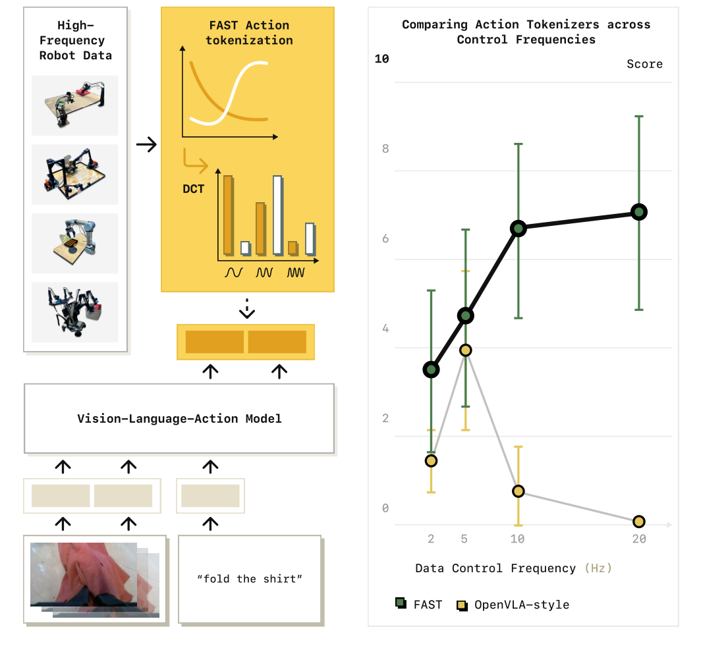
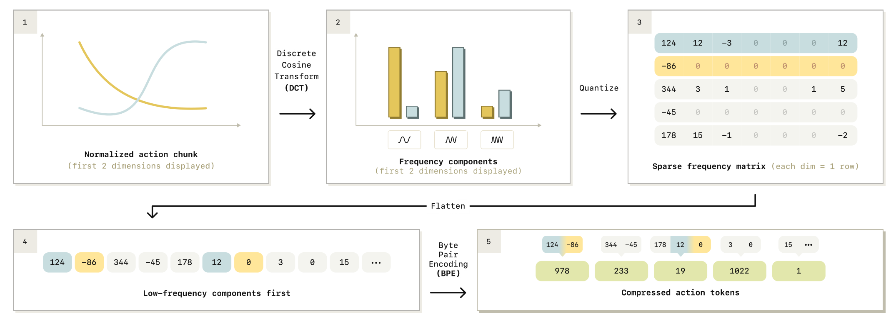
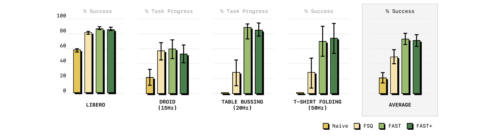
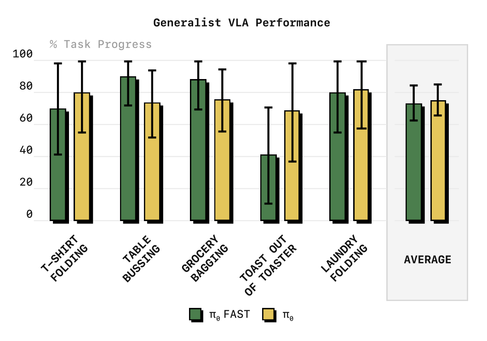

# FAST: Efficient Action Tokenization for Vision-Language-Action Models

## 来源

- **PDF**：`raw/2501.09747v1.pdf`（arXiv:2501.09747v1，2025-01-16；当前最新就是 v1）
- **标题**：FAST: Efficient Action Tokenization for Vision-Language-Action Models
- **团队**：Karl Pertsch、Kyle Stachowicz（共同一作）；Brian Ichter、Danny Driess、Suraj Nair、Quan Vuong、Oier Mees、Chelsea Finn、Sergey Levine。Physical Intelligence / UC Berkeley / Stanford
- **项目页**：[pi.website/research/fast](https://www.pi.website/research/fast)（外部；视频与宣传不能升级为原文确证）
- **权重**：Hugging Face [`physical-intelligence/fast`](https://huggingface.co/physical-intelligence/fast)（原文 §V-C 发布的 FAST+ `AutoProcessor`）
- **定位**：**动作分词器方法论文，不是新 VLA 基座。** 不建模型页。FAST+ 是通用 tokenizer 权重，不是要单独立户的模型实体。π0-FAST 是把本页分词接到 [π0](pi0.md) 骨干上的自回归实验，不是 π 系列的新一代。

## 核心结论

自回归 VLA 必须把连续动作写成离散 token。[RT-2](rt-2.md) / [OpenVLA](openvla.md) 用的逐步、逐维 256-bin，在高频灵巧数据上会训崩。本页改的是**分词层**，不是第四种动作头：先把 **1 秒 action chunk** 压成少量高信息 token，再拿现成 VLM 做 next-token。

1. **FAST = DCT → 量化 → BPE**（§V-B、Fig. 4、Algorithm 1）。时间尺度是 1 秒 chunk，不是逐步。默认 rounding scale \(10\)、BPE 词表 \(1024\)；约每臂 30 个 token（双臂约 60），与控制频率大体无关（Table I）。
2. **Naive binning 失败的原因是边际信息趋零**（§I、§IV、Fig. 3）：高频 chunk 里相邻步几乎一样，next-token 目标可以被「复制上一个 token」满足。OpenVLA 在低频 BridgeV2 / RT-1 上能训、在更高频 DROID 上吃力，原文把这写成同一机制（§IV）。
3. **FAST+ 是 1M 真实 1 秒轨迹上训的 universal tokenizer**（§V-C、Appendix A）。作者写成可对多样本体、动作空间和频率当黑盒用；策略对照里它贴近数据集特化 FAST（Fig. 6）。未见过的人形 / 灵巧手 / 导航只报了压缩比（Fig. 8），没有策略成绩。
4. **接到 π0 骨干上的 π0-FAST**：同一混合物上匹配 diffusion π0，训练最多 **5× 更快**（摘要、Fig. 1、§VI-F）。这是**本页**的数字，不要写进 [π0](pi0.md) 当 π0 原文事实。推理反而更慢（约 750 ms vs diffusion 约 100 ms / 4090，§VI-E）。
5. **不改 VLM 权重结构。** 只覆盖词表里最少用的 token，全量 fine-tune、不冻结（§VI-A）。对比 diffusion / flow 要另加 action expert：本页自回归路径走完整语言模型骨干。

## 机制（已据原文核实）

### 时间尺度：1 秒 chunk，不是逐步

策略输出 action chunk \(a_{1:H}\)（§III）。分词是映射 \(T_a: a_{1:H} \mapsto [T_1,\ldots,T_n]\)，\(n\) 可变。训练与 FAST+ 黑盒用法都按 **1 秒 chunk**（§V-C、§VI-A、Table I）。50 Hz 时 \(H=50\)，与 [π0](pi0.md) / [π0.5](pi0.5.md) 的 chunk 长度同量级；**不是** OpenVLA 那种每个控制周期吐 7 个 bin token。

Naive binning（§III）：每维独立切成 \(N\) 个均匀 bin，最常用 \(N=256\)；再对 chunk 里每一步拼接，得到 \([T_{1,1},\ldots,T_{1,D},\ldots,T_{H,1},\ldots,T_{H,D}]\)。高频时「动辄数百 token」，训练难、推理慢。

### 为什么 256-bin 在高频灵巧上失败

§IV 用三次样条插值四个随机点的教学任务，把目标序列按 OpenVLA 式 256-bin 逐步离散化，采样率从 25 提到 800 步。低频 MSE 还行；采样一密，误差陡升，模型最后只会复制第一个动作（Fig. 3）。数据复杂度没变，变的是目标。自回归学的是 \(T_i \mid T_{1:i-1}\) 的边际信息；平滑信号里步长变短，每步变化按比例变小，边际信息趋零。低 loss 可以被「抄最近一个 token」拿到，模型停在差的局部最优（§I、§IV）。

这与 [OpenVLA](openvla.md) 的 256-bin **不是同一种 token**。OpenVLA 是逐步、逐维分位数 bin；FAST 是整段 chunk 的频域压缩。Fig. 2 右图把对照标成 OpenVLA-style：分数随控制频率升，binning 从约 5 Hz 之后掉下去，FAST 继续升。

> Fig. 2（原文截图，§I / Related Work）："Left: FAST tokenization enables training of autoregressive Transformers for dexterous robot control via simple next token prediction. Right: FAST outperforms popular binning tokenization schemes, e.g., used in OpenVLA [39], particularly for high-frequency robot data."

### DCT / 量化 / BPE 各自做什么

> Fig. 4（原文截图，§V-B）："Overview of the FAST action tokenization pipeline. Given a normalized chunk of actions, we apply discrete cosine transform (DCT) to convert the signal to the frequency domain. We then quantize the DCT coefficients and use byte-pair encoding (BPE) to compress the flattened sequence of per-dimension DCT coefficients into the final action token sequence."

逐步（§V-B、Algorithm 1）：

1. **归一化。** 各维训练集 1%–99% 分位数映到 \([-1,1]\)，抗离群点，也方便跨本体不同尺度。
2. **DCT。** 对每个动作维单独做离散余弦变换。低频刻画整体形状，高频刻画尖跳。作者拿 JPEG 类比：平滑信号的能量集中在少数系数。相对 VQ，DCT 是解析式、快、几乎没有要调的训练。
3. **量化。** 系数乘 scale \(\gamma\) 再四舍五入；丢掉接近 0 的高频。\(\gamma\) 是有损程度旋钮。单数据集实验 \(\gamma=10\)。
4. **展平。** 稀疏的 \(|A|\times H\) 矩阵按**列优先**：先拼各维最低频，再拼次低频。自回归先预测整体形状，rollout 更稳。行优先（先吐完一整维）是明确丢掉的选项。
5. **BPE。** 无损压缩：吞掉连串 0，并合并跨维常见系数组合，得到固定词表、能塞进 VLM 现有词表的稠密 token。默认词表 1024。Huffman / gzip 类算法原文只点名、没做。

解码逐步可逆。唯一要学的是 BPE 词表；换数据集通常几分钟。消融去掉 BPE：DCT 仍把信息集中到少数系数，但会留下大量重复 0，学习信号被稀释，还要自回归吐数百 token，桌面收拾和叠 T 恤的策略变差，不过仍高于 naive binning（§VI-D）。

相对 FSQ / VQ：学出来的量化器对超参和结构敏感，粗重建可以、细控制不行（§II、Appendix B Fig. 12）。FAST 在高保真端缩放更好。

接到 VLA 时：**覆盖 VLM 词表里最少用的 token**，不冻权重（§VI-A，沿用 RT-2 / OpenVLA 的覆盖写法）。本体状态仍用 256-bin 当**输入**字符串（Appendix C）；作者写输入端简单 bin 够用，要压缩的是动作**输出**。不改 Transformer 层、不另加 action expert。π0-FAST 推理走完整约 2B 语言骨干，所以比 π0 的 300M expert 慢。

### FAST vs FAST+

| | FAST | FAST+ |
| --- | --- | --- |
| BPE | 每个数据集单独训 | 约 **1M 条 1 秒** 真实轨迹上训一次 |
| 数据 | 当前任务集 | 主要是 π0 混合物；同一轨迹还带关节 / 末端世界系 / 相机系（Appendix A） |
| 维数 | 原动作维 | **pad 到 32 维** |
| 用法 | 换数据要重 fit BPE | 作者写成对任意机器人 1 秒 chunk 的黑盒 |
| 发布 | 可用 `tokenizer.fit(action_dataset)` 自训 | HF `physical-intelligence/fast` |

推荐：输入按分位数归到 \([-1,1]\)，一次 token 化 1 秒（§V-C）。Fig. 6 上 FAST+ 贴近数据集特化 FAST。注意：作者自己写，universal tokenizer 的训练混合物**含本页真机评测任务的数据**（§VI-A Comparisons），所以 Fig. 6 不是「分词器完全没见过该任务」。真正 held-out 的是 Fig. 8 那组压缩测试（人形、灵巧手、UMI、Waymo 等），只报压缩比，不报策略。

跨本体黑盒：压缩上，未见数据集相对 naive 至少约 2×，有的更高（Fig. 8、§VI-C）。策略成绩只做到本页那几台操作臂。§VII 把移动、灵巧手、人形上的**策略**写成未来工作。

## 评测要点

骨干：多数实验用 [π0](pi0.md) 的 PaliGemma-3B；另用 [OpenVLA](openvla.md) 的 Prismatic 7B 做「分词是否绑死骨干」消融（§VI-A、§VI-D）。对照：naive binning（逐步 256-bin，RT-2 / RT-2-X / OpenVLA）、FSQ、数据集特化 FAST、FAST+。7 个任务：LIBERO 仿真 + 6 个真机（桌面收拾 20 Hz、叠 T 恤 50 Hz、装袋、烤面包、叠衣服、DROID 15 Hz 零样本）。装袋 / 烤面包 / 叠衣服只拿来评最强 generalist（§VI-A，沿用 π0）。

Table I（1 秒 chunk；Naive / FAST 列是平均 token 数，压缩比 = Naive / FAST）：

| Dataset | 动作维 | 频率 | Naive | FAST | 压缩比 |
| --- | ---: | ---: | ---: | ---: | ---: |
| BridgeV2 | 7 | 5 Hz | 35 | 20 | 1.75 |
| DROID | 7 | 15 Hz | 105 | 29 | 3.6 |
| Bussing | 7 | 20 Hz | 140 | 28 | 5.0 |
| Shirt Fold | 14 | 50 Hz | 700 | 53 | 13.2 |

作者写 FAST 大致每臂 30 token，对频率不敏感；压缩不是无损，Table I 与 naive 处在可比重建误差（Appendix B）。

> Fig. 6（原文截图，§VI-B）："Comparison of policy performance using different tokenization approaches. We find that tokenization approaches that compress action targets (FAST, FSQ) lead to substantially more efficient training than the naïve binning tokenization used in prior VLAs. Overall, we find that FAST leads to more effective policy training than FSQ, particularly on dexterous real-robot tasks. Our universal tokenizer, FAST+, matches the performance of dataset-specific tokenizers. We report mean and 95% CI."

数字在柱里，正文几乎不给精确表；不要目测填百分比。能钉死的边界：

- Naive 在桌面收拾（20 Hz）和叠 T 恤（50 Hz）上「无法推进任务」（§VI-B）。
- FAST 首次在 DROID 上训出可**零样本**语言提示的通才策略：新桌子、背景、物体、视角、桌高，不 co-train、不 fine-tune（§VI-B）。原 DROID 论文和 OpenVLA 只做 co-train / fine-tune。定量套件 16 任务 × 共 44 trial，按进度打分（Appendix E Table II）；Berkeley / Stanford / UW 的跨校演示是定性视频，不报成功率。
- OpenVLA 骨干 + FAST+、改成多图和 1 秒 chunk 之后，叠 T 恤从 naive 几乎失败变成能训（§VI-D）。分词不绑死某一套 VLM。
- 相对 diffusion π0（Fig. 9）：LIBERO、叠 T 恤（<50 h）两者接近；大数据桌面收拾上 FAST 用 3× 更少 step 就到高分；DROID 上 FAST 更听语言，diffusion π0 常忽略指令。
- **5× 是 GPU hour，不是 step。** π0-FAST 在 π0 的跨本体混合物上（自有 903M timesteps + 9.1% Bridge v2 / DROID / OXE，摘要口径 10k 小时）匹配 diffusion π0，包括叠衣服（Fig. 11）；达到评测用的 checkpoint 比 Black et al. 的 π0 少 5× GPU hour（§VI-F）。Fig. 1 曲线是桌面收拾 + 叠 T 恤两个代表任务的平均。算力对齐的 π0 checkpoint 明显落后（Appendix Fig. 15）。

> Fig. 11（原文截图，§VI-F）："Comparison of π0-FAST and diffusion π0 [7] generalist policies. π0-FAST matches the performance of diffusion π0 while requiring significantly less compute for training. Reported: mean and 95% CI."

推理（§VI-E）：4090 上 diffusion π0 约 100 ms / 1 秒 chunk（10 步、300M expert）；π0-FAST 约 750 ms（通常 30–60 个自回归动作 token、完整 2B 骨干）。静态操作上作者说没伤成绩，但评测变慢。投机解码 / 量化等加速只点名、没做。双臂任务推理温度 \(\beta=0.7\)，避免数据里「在家位悬停」的静止 chunk 把策略粘住（Appendix C）。

DROID 训练细节（Appendix D）：成功 episode 75k、滤全零空闲步、240k iter @ batch 256、约 3 epoch、8×H100 约 4 天。关节速度 + 夹爪位置，15 步 chunk，推理开环执行 8 或 15 步。

## 与已有沉淀的关系

- **不是第四种 VLA 动作头。** 动作头仍是：[OpenVLA](openvla.md) 式离散 bin / [π0](pi0.md) 连续 flow / [π0.5](pi0.5.md) 开世界 co-training。[π0.7](pi0.7.md) 仍停在 flow 上。FAST 给**自回归离散动作**做压缩分词，挂在离散家族里，替换的是逐步 256-bin，不是 flow expert。
- **[π0](pi0.md) 原文是 flow，不是 FAST。** 本页把 FAST 接到 π0 的 PaliGemma 骨干和混合物上，得到自回归的 π0-FAST，并报匹配 diffusion、最多 5× 更快。这些数留在本页。π0 来源页的对照仍是「把 OpenVLA 重训到 π 混合物」。
- **[π0.5](pi0.5.md) 的用法是 FAST→flow 两阶段。** 预训练 280k 步用 FAST 当标准 VLM next-token，后训练再长 flow expert。这不是本页的 π0-FAST（推理仍吐 FAST token）。π0.5 引用本页说离散预训练更省算力；不要把 Fig. 11 的柱填进 π0.5 的家庭家务。
- **[π0.7](pi0.7.md) 只拿 FAST 当 Knowledge Insulation 的 VLM 训练信号。** 推理不吐 FAST，梯度不从 expert 回灌 VLM。不是两阶段配方，也不是本页的 AR 策略。
- **[InternVLA-A1.5](internvla-a1.5.md) Stage 1 用 FAST 离散 token 做 VLM transferring，Stage 2 起换成 flow chunk。** 和 π0.5 同属「先离散后连续」，骨干是 Qwen-3.5 2B + unified expert，不是 PaliGemma。三篇都只引用本页，没有对照表说明 BPE 词表是不是 HF 上那份 FAST+。
- **[OpenVLA](openvla.md) 的 256-bin 是本页 naive 基线，不是 FAST。** 本页给 OpenVLA 加上 FAST+ 才能在 50 Hz 叠 T 恤上训起来（§VI-D）；不要把那根柱读回 OpenVLA 原文的 Bridge / Google robot 表。

## 待追问

- **需实验或作者披露**：自回归推理 750 ms 能否用投机解码 / 量化拉到 diffusion 的 100 ms 量级，原文没做（§VI-E、§VII）。
- **需实验或作者披露**：FAST+ 在人形、灵巧手、导航上的**策略**成绩，本页只有压缩比（Fig. 8）。
- **需实验或作者披露**：DCT+BPE 接到非自回归（diffusion / flow）解码会怎样，§VII 只列为方向。

## 相关追问

主记录：[FAST 与 FAST+ 的词表同一性](../concepts/vision-language-action.md#待追问)。

## 相关页面

- 概念：[Vision-Language-Action](../concepts/vision-language-action.md)
- 接到本页分词的 π0 骨干：[π0](pi0.md) · [模型](../models/pi0.md)（π0 原文是 flow；π0-FAST 是本页实验）
- FAST→flow 两阶段：[π0.5](pi0.5.md) · [模型](../models/pi0.5.md)
- KI-only，推理不吐 FAST：[π0.7](pi0.7.md) · [模型](../models/pi0.7.md)
- Stage 1 FAST、Stage 2 flow：[InternVLA-A1.5](internvla-a1.5.md) · [模型](../models/internvla-a1.5.md)
- 逐步 256-bin 基线，不是本页 token：[OpenVLA](openvla.md) · [模型](../models/openvla.md) · [RT-2](rt-2.md)
