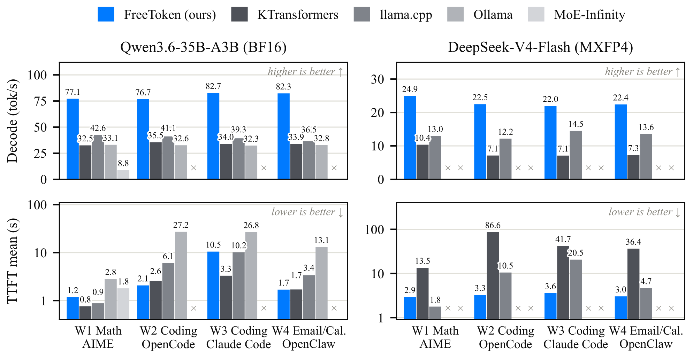

# FreeToken

## 来源

- **PDF**：`raw/2608.16157v1.pdf`
- **标题**：FreeToken: Efficient Edge-Native MoE Serving with Bandwidth-Adaptive Execution
- **日期**：2026-08-17（arXiv v1，cs.DC）
- **作者**：Shuo Yang*, Xiaoze Fan*, Melissa Pan, Haocheng Xi, Zhe Wang, Shanlin Sun, Kurt Keutzer, Song Han, Matei Zaharia, Chenfeng Xu†, Ion Stoica†（* equal contribution，† co-advise）
- **通信**：andy_yang@berkeley.edu；xuchenfeng@utexas.edu
- **arXiv**：[2608.16157](https://arxiv.org/abs/2608.16157)
- **代码**：[github.com/FlashML-org/FreeToken](https://github.com/FlashML-org/FreeToken)
- **下载**：[flashml.ai](https://flashml.ai)

这是系统/serving 论文，不发布模型实体，不建模型页。

## 核心结论

开源权重解决的是「谁能拿到模型」，不是「谁能跑起来」。MoE 的稀疏激活让单 token 计算量落到消费级 GPU（例：DeepSeek-V4-Flash 43 层每层 6/256 routed experts，13B/284B 激活，部署精度下可进 RTX 5090 的 32GB），但**完整 expert 池仍远超 VRAM**，必须常驻 host 并按需进入执行路径。现有端侧引擎（llama.cpp / KTransformers / Ollama）只覆盖问题的碎片，短板有三（§ 1–2）：

1. **Prefill 把工作集变密**：长 prompt 的路由并集几乎覆盖每层全部 experts，PCIe 要搬完整 expert 池；agent 工具调用还反复 re-prefill。
2. **Decode 的 miss 没有原则性分流**：静态放置跟不上 token 级路由；预测/prefetch 降 miss 率，但不决定不可避免的 miss 该走 PCIe 填缓存还是 CPU 原地算。
3. **端侧资源非独占、且机间异构**：VRAM / PCIe / 主机带宽随时被桌面、浏览器、游戏挤占，没有静态策略能同时适应设备、阶段和运行时。

FreeToken 的回答是把个人机器当成统一弹性推理平台，而不是「一块小 GPU」：CPU 常驻完整 expert 池作为 source of truth，GPU 上非 expert 权重常驻，剩余 VRAM 做成跨层共享的弹性 expert cache。两条执行原则 + 一套弹性资源策略（§ 3）：

- **Bandwidth-adaptive execution**：把有限带宽当运行时调度信号。Prefill 用 full-layer double buffering 把下一层 experts 的 PCIe 搬运与当前层 GPU 计算重叠；Decode 用 $q^{\star}$ 策略按实测 $B_P$（PCIe 专家传输带宽）与 $B_H$（主机侧专家处理带宽）把本步 miss 分给「填 GPU 缓存」和「CPU 原地执行」。
- **Semantic-aware caching**：Prefill 在 `<think>` / tool call / 对话轮次等 special-token 边界做 recurrent-state checkpoint，harness 改写历史后只重算新 suffix；Decode 用共享 LRU 跟上相邻 token 的路由局部性。
- **Elastic memory**：在 scheduler safe point 按新的 VRAM 预算重建 GPU expert cache，不重启、不重载 host expert 池。GPU 缓存只影响性能，不影响正确性。

> Figure 1 | FreeToken serves the models on the cost–capability Pareto frontier, at interactive speed on consumer hardware.（§ 1 Introduction, Figure 1）

Headline 结果（§ 1, § 5.2–5.3）：支持 20+ MoE；RTX 5090 上 Qwen3.6-35B-A3B 77–83 tok/s、DeepSeek-V4-Flash 22–25 tok/s，相对最强端侧基线 decode 1.5–2.3×，且跨 agent 工作负载相对单轮 W1 的 decode 波动 ≤12%；最差 TTFT < 44 s，而各基线至少在一个设置里超过 150 s（OpenClaw 默认 120 s idle watchdog）。8GB RTX 4060 笔记本上 35B（NVFP4）39.3 tok/s，超过 Codex 中位 33 tok/s；32GB 游戏桌面交互式服务 284B；单卡 RTX PRO 6000 上 GLM-5.2 753B 为 llama.cpp 的 2.0×（14.9 vs 7.3 tok/s）。

## 架构与执行

> Figure 2 | FreeToken overview. (1) Prefill: expert loading is double-buffered at full-layer granularity… (2) Decode: most routed experts hit the shared LRU expert cache… The m=4 misses are divided by $q^{\star}= m B_P/B_H$…（§ 3 FreeToken Design, Figure 2）

### 两级 expert 层次

CPU-resident expert pool 持有全部 routed-expert 权重；非 expert 权重留在 GPU。剩余 GPU 内存是**所有 MoE 层共享的弹性 expert cache**：每个 slot 装齐评估一对 `(layer, expert)` 所需的全部 tensor，驻留 / 查找 / 执行都按逻辑 `(layer, expert)` 标识，而不是 tensor shard（§ 3）。

### Prefill：full-layer double buffering + semantic-aware state cache

Prefill 几乎激活每层全部 experts（§ 2.1），按需抓取会把整段 PCIe 窗口暴露成 GPU 空闲。以 FP4 的 DeepSeek-V4-Flash 为例，约 140 GB expert 权重：RTX 5090（PCIe 5.0 x16，~60 GB/s）约 2 s，4090/3090 级（~25 GB/s）约 5 s，笔记本常见 x8 则 10 s+。FreeToken 从全局 slot 池分配两个 full-layer buffer：GPU 算 layer $l$ 时，专用 transfer stream 把 layer $l+1$ 的**完整** expert 集载入另一 buffer——传输在该层 routing 尚未知道时就能开始。两 buffer 与 decode cache 共用 slot 池，prefill 幸存条目直接给 decode 热身。槽不够两个 full layer 时退回 on-demand，而不是超订 GPU 内存（§ 3.1）。

第二笔 prefill 成本是 hybrid-attention 的重复计算。Full-attention KV 走 radix prefix tree（沿用 SGLang 一类 serving）；recurrent / SWA 层把过去压成一份状态或最近窗口，checkpoint 很贵，只能留很少。Agent harness 几乎每轮都改历史：OpenClaw 去掉除最新一轮外的 thinking blocks；OpenCode 把超出窗口的 tool output 换成占位；SWE-agent 只留最后 $n$ 次 observation。这些编辑都落在 special-token 块边界。FreeToken 把有限 checkpoint 预算花在这些 **semantic anchors** 上；编辑后从仍存活的最深 checkpoint 恢复，full-attention 复用到编辑点的 KV，recurrent 层从锚点续跑，只 re-prefill 新 suffix。Checkpoint 与 KV pool 独立 LRU（§ 3.1）。

### Decode：$q^{\star}$ 与 LRU

每层先在 GPU 上做 router + cache lookup，命中集合 $H$ 直接 GPU 执行。剩余 $m$ 个 unique miss 记为 $M$。相邻 decode step 有路由局部性，共享 LRU 让 GPU 驻留跟踪当前 working set；冷启动、working-set 突变和容量上限仍会留下 miss（§ 3.2）。

Bandwidth-adaptive execution 把 $M$ 分成 cache-fill 集 $F$（$q=|F|$）和 CPU-execution 集 $C$。两路并发：fill 占满 PCIe；CPU 只用链路饱和后剩下的主机带宽。记单个 expert 大小为 $S$，残余带宽 $B_R=\max(B_H-B_P,0)$，则

$$T_{\mathrm{fill}}(q)\approx qS/B_P,\quad T_{\mathrm{cpu}}(m-q)\approx (m-q)S/(B_H-B_P).$$

令两路时间平衡得 $q^{\star}\approx m\,B_P/B_H$。$B_H\to B_P$ 时 $q^{\star}\to m$，退化为纯 on-demand fill。实现上 $q^{\star}$ 取整，且**至少填 1 个**，避免 CPU 包办时缓存不再升温。$B_H$、$B_P$ 在部署机上实测，不读规格书。CPU/GPU 算各自 partial 再 **exact merge**，不改模型、不做低精度替换（对比 HOBBIT / SiDA / SMoE 那条放松保真度的线，§ 6）。执行顺序：先启动 CPU 分支，再跑 GPU miss 路径（cache update + 拷 $F$ + 对 $G=H\cup F$ 做 grouped evaluation）；层延迟是较慢的那条并发分支，也就是式 (4) 平衡的量（§ 3.2）。

### 弹性内存与实现要点

端侧 VRAM 会在会话中被桌面合成器 / 浏览器 / 游戏抢走，且 KV 随 agent 轮次增长、expert working set 大致固定，第一轮的 KV/expert 分割后面会错。FreeToken 在 scheduler safe point 按新预算重建 GPU expert cache，不重载 CPU 池（§ 3.3）。启动时 expert 权重直接读进最终 host layout，**填完再 pin**（先 pin 空缓冲会 fault-in 并清零数 GB 只为覆盖）；不做 GPU warmup——第一请求走冷缓存上的普通 decode 路径。

实现叠在 vLLM/SGLang 一类 GPU-centric serving 上（paged KV、radix prefix、FlashInfer、Flash Linear Attention）。动态缓存控制全部留在 GPU：一层一个 kernel 做 routed-expert 去重、对照驻留表、算 $q$、选 victim、把逻辑 ID 写成物理 slot 或 CPU 标记；单 pass 找出 $K$ 个 LRU victim，miss 路径只消耗前 $q\le K$ 个，从而可进静态 CUDA Graph。CPU 分支同样进同一 graph（稳定 pinned I/O + persistent C++ worker，架构相关 SIMD + in-kernel dequant）。权重归一成 expert banks，leading dim 为扁平 $lE+e$；FreeToken Weight (FTW) 预先按运行时 bank layout 合并，启动时 parallel direct I/O 读入精确大小的 host banks。若 OS/驱动不允许 pin/register DMA，退化为纯 CPU MoE：expert 留 pageable host，非 expert 仍在 GPU，只传 activation 级输入和聚合输出（§ 4）。

## 评测要点

实验在真实 agent 工作负载上服务 **expert 池超过 VRAM** 的 MoE，对照 llama.cpp、Ollama、KTransformers、MoE-Infinity（它支持的配置）。权重格式对齐：Qwen3.6 一律 BF16（4060 笔记本改用官方 NVFP4）；DeepSeek-V4-Flash 一律官方 MXFP4 expert blocks，bit-exact（§ 5.1）。

评测机（Table 1，带宽为部署 tensor shape 上的实测值，不是规格书）。3090/4090/5090 是租用双路服务器，CPU 远超端侧，因此 serving 与带宽测量都 cap 到 6 CPU 线程并钉在 GPU 的 NUMA node；桌面与笔记本不限流，用来校验这份仿真：

| 系统 | GPU (VRAM) | PCIe | $B_P$ (GB/s) | CPU (threads) | DRAM | $B_H$ (GB/s) |
| --- | --- | --- | ---: | --- | --- | ---: |
| 5090 | RTX 5090 (32 GB) | 5.0 ×16 | 52.7 | 2× Xeon Gold 6459C (32) | DDR5 180 GiB | 77.3 |
| 4090 | RTX 4090 (24 GB) | 4.0 ×16 | 25.1 | 2× Xeon Platinum 8358P (32) | DDR4 240 GiB | 63.2 |
| 3090 | RTX 3090 (24 GB) | 4.0 ×16 | 25.3 | 2× Xeon Gold 6330 (28) | DDR4 180 GiB | 56.7 |
| 5090 desktop | RTX 5090 (32 GB) | 5.0 ×16 | 49.0 | Ryzen 9 9950X3D (32) | DDR5 192 GiB | 53.8 |
| 4060 laptop | RTX 4060 Laptop (8 GB) | 4.0 ×8 | 11.8 | Core i9-13900H (20) | LPDDR5 32 GiB | 47.5 |
| PRO 6000 | RTX PRO 6000 (96 GB) | 5.0 ×16 | 51.5 | Xeon Platinum 8559C (48) | DDR5 512 GiB | 178 |

> Table 1（原文 § 5.1 数据重排为 Markdown）。容器配额列在租用三台的 CPU-thread / DRAM。

工作负载：W1 AIME 长 CoT 无工具（单轮、decode 主导）；W2 OpenCode + SWE-bench，三轮脚本化用户、真实工具；W3 同一 issue 经 Claude Code 的 Anthropic-compatible endpoint，并发 subagent，会话涨到 56–65k tokens；W4 OpenClaw 邮件/日历 13 轮，~24.5k system-context 地板（其 120 s idle watchdog 关掉以便慢引擎可测）。轨迹跨引擎会分叉，因此不比 wall-clock 总时长。

> Figure 3 | End-to-end serving on the RTX 5090 across four workloads … and two models … × marks configurations an engine cannot serve.（§ 5.2 Main Results, Figure 3）

机制归因（§ 5.3）：

- **Pipelined prefill**：打开 overlap 后，每 8192-token chunk 1.19–1.22 s，等于 64.4 GB expert 池按 52.7 GB/s 流一遍——PCIe 5.0 ×16 的实际天花板，expert 计算被完全藏在传输后；16k tokens 时 prefill 6.7k tok/s。关掉第二 buffer，吞吐在 4k/8k/16k 分别掉 19% / 25% / 26%。
- **Expert locality**：同等缓存容量下回放四条工作负载的路由 trace。5090 服务容量（Qwen3.6 expert 池的 37%、DSV4-Flash 的 11%）时，FreeToken 全局 LRU 的 decode-time miss 为 16% 与 39%，对照 KTransformers 的 prefill-updated placement 41%/59%、llama.cpp 的 routing-blind static split 62%/89%。
- **跨硬件**：W2 上相对最强基线 1.3×（3090/4090）到 2.1×（5090 desktop）。两列 5090 同硅不同主机：从多通道服务器换到双通道消费桌面，FreeToken 只掉 4% decode，llama.cpp 只保住 80%（CPU-resident experts 在两条 DDR5 上饿死）。KTransformers 在 PRO 6000 上无法服务 GLM-5.2：其方法需要 753 GB–1.5 TB host-resident experts，而该箱只有 512 GiB，且 CPU kernel 不读 GLM-5.2 的 NVFP4 layout。

## 待追问

- 正文说支持 20+ MoE，实验只报 Qwen3.6-35B-A3B、DeepSeek-V4-Flash、GLM-5.2；其余模型列表、量化格式和是否走过 CUDA-graph 快路径需查 GitHub / flashml.ai。
- GLM-5.2 在本文是 753B / 40B active、NVFP4 433 GB checkpoint。本 wiki 的 [GLM-5](../models/glm-5.md) 技术报告是 744B / 40B，[GLM-5.3](../models/glm-5-3.md) 称沿用 GLM-5.2 base 但未披露参数。753B 与 744B 不要画等号。
- Figure 1 caption：Kimi-K3 开源但超出消费级内存（594 GB）。本 wiki 的 [Kimi K3](../models/kimi-k3.md) 是 2.78T / 104B，未在本文实验。
- Qwen3.6-35B-A3B 是评测骨干，wiki 目前只有 [Qwen3.5](../models/qwen3.5.md) 家族页，没有 Qwen3.6 模型页。
- 3090/4090/5090 的端侧数字来自「双路服务器 + 6 线程 cap」的仿真，桌面/笔记本两台才是真实消费级；跨档读数要带这个口径。
- 最差 TTFT < 44 s 是原文概括；Figure 3 只画 mean TTFT，tail 分布未给表。
- 论文明确不比较跨引擎 wall-clock（轨迹分叉）。「交互式」指 decode tok/s 与 TTFT，不是端到端任务完成时间。

## 相关页面

- 概念：[端侧 MoE serving](../concepts/edge-native-moe-serving.md)、[MoE 前沿模型扩展](../concepts/moe-frontier-model-scaling.md)、[百万 token 上下文服务](../concepts/million-token-context-serving.md)、[Any-to-any 多模态 serving](../concepts/any-to-any-multimodal-serving.md)
- 被服务的模型：[DeepSeek-V4](../models/deepseek-v4.md)（V4-Flash 284B-A13B，MXFP4）、[GLM-5.3](../models/glm-5-3.md)（讨论 GLM-5.2 base；本文服务的是 GLM-5.2 753B-A40B NVFP4，参数口径不要与 [GLM-5](../models/glm-5.md) 的 744B 混用）
