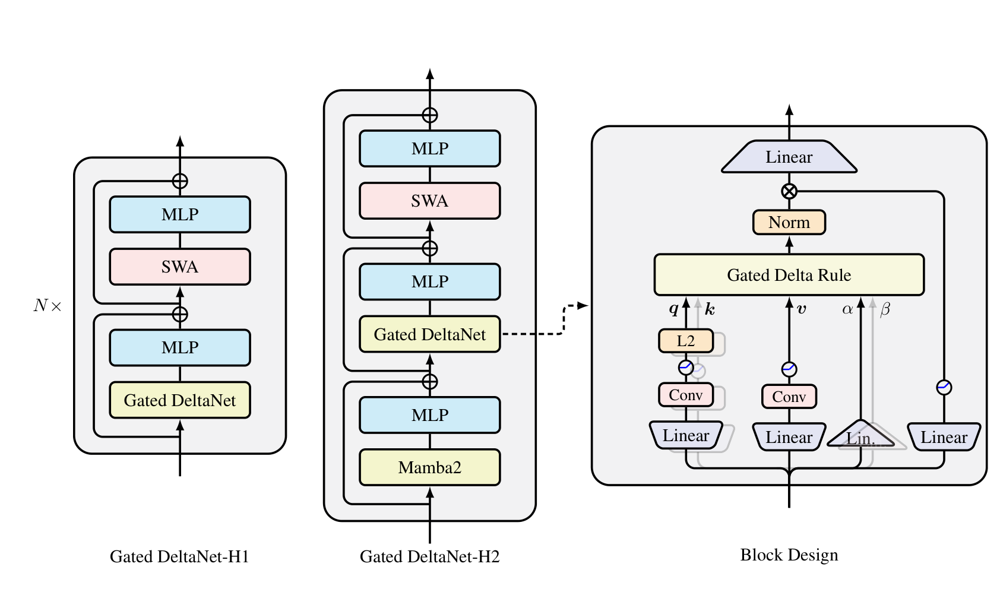

# Gated DeltaNet 技术报告

## 来源

- 原始 PDF：[raw/Yang 等 - 2025 - GATED DELTA NETWORKS IMPROVING MAMBA2 WITH DELTA RULE.pdf](../../raw/Yang%20%E7%AD%89%20-%202025%20-%20GATED%20DELTA%20NETWORKS%20IMPROVING%20MAMBA2%20WITH%20DELTA%20RULE.pdf)
- 标题：Gated Delta Networks: Improving Mamba2 with Delta Rule
- 版本/会议：ICLR 2025
- 团队：Songlin Yang（MIT CSAIL）、Jan Kautz、Ali Hatamizadeh（NVIDIA）
- 配套实现：[NVlabs/GatedDeltaNet](https://github.com/NVlabs/GatedDeltaNet)
- 概念页：[线性注意力与 delta rule](../concepts/linear-attention-and-delta-rule.md)

## 核心结论

GDN 是 [线性注意力](../concepts/linear-attention-and-delta-rule.md) 演进链上的关键一环，也是 [Kimi Linear](kimi-linear.md) 的 KDA 和 Qwen3-Next 系列线性层的**直接前身**。它的中心观察是：线性注意力此前补救质量的两条路——**门控（gating，自适应记忆控制）** 和 **delta rule（精确记忆修改）**——是**互补**的：

- **门控**（如 [Mamba-2](mamba-2.md) 的标量衰减 $\alpha_t$）能**快速清空整块记忆**，但「一视同仁」地衰减所有 key-value 关联，无法定向遗忘某一条。
- **delta rule**（[DeltaNet](delta-net.md)）能**定向替换**单条 key-value 关联（精确更新），但一次只动一条，缺乏在 context 切换时快速清空旧信息的机制。

GDN 把两者合成 **gated delta rule**，一个规则同时拥有「快速清空」和「定向更新」两种能力，并配套 chunkwise 并行训练算法保证硬件效率。结果：在所测设置的语言建模与常识推理均值、检索均值上优于 Mamba2 和 DeltaNet，但不是每个任务都领先；进一步用 GDN 层 + 滑窗注意力或 Mamba2 层的混合架构再提升效率与质量。

## 机制（已据原文核实）

逐级看三条递推（$S_t\in\mathbb{R}^{d_v\times d_k}$ 是矩阵状态，$o_t=S_t q_t$）：

| 机制 | 状态更新 | 遗忘能力 | 局限 |
| --- | --- | --- | --- |
| [Mamba-2](mamba-2.md)（门控/衰减） | $S_t = \alpha_t S_{t-1} + v_t k_t^\top$，$\alpha_t\in(0,1)$ 数据相关标量 | 整块按 $\alpha_t$ 统一衰减 | 无法定向遗忘单条关联 |
| [DeltaNet](delta-net.md)（delta rule） | 软替换：把旧的 $k\to v$ 关联朝新的 $k_t\to v_t$ 纠正 | 定向、精确 | 一次只动一条，context 切换时清不掉旧信息 |
| **Gated DeltaNet（本文）** | gated delta rule：在 delta 更新前先乘一个**数据相关标量门** $\alpha_t$ | 两者兼得 | —— |

直觉（原文 § 1）：gated delta rule 让记忆控制变得灵活——令 $\alpha_t\to 0$ 可瞬间清空记忆；令 $\alpha_t\to 1$ 则退化成纯 delta rule，只定向更新某条内容而不动其他。

**为什么线性注意力需要遗忘**：线性 Transformer 本质是外积形式的 key-value 关联记忆，能存的正交 key-value 对数受限于模型维度；序列长度超过维度时「memory collision」不可避免，精确检索失效（原文引 Schlag 等）。门控 + delta rule 正是为缓解这个有限状态瓶颈。

**硬件效率**：在 DeltaNet 用 WY representation 并行化 delta 计算的基础上，GDN 把门控项也纳入 chunkwise 并行形式，保持线性时间训练。

## 实验规模与主表边界

**已据原文核实（`supported`）**：§4 的主实验使用 **1.3B 参数 / 100B FineWeb-Edu tokens**，训练长度 4K，batch 为 0.5M tokens；AdamW 峰值学习率 4e-4、warm-up 1B tokens。混合模型的 SWA 窗口为 2K。它不是后续 Qwen3-Next / Kimi Linear 的生产规模复现。

| 实验 | 参数量 | 训练量 | 用途 |
| --- | --- | --- | --- |
| §4 主实验 | 1.3B | 100B tokens | 语言建模、常识推理、检索、长度外推 |
| 附录 Table S.1 | 400M | 15B tokens | 短卷积、输出门、归一化与 head dimension 消融 |
| 附录 Table S.2 | 500M | 15B tokens | Mamba2 / GDN / SWA 的排列次序消融 |

主表选取相同指标列重排如下。Table 3 的 Avg 是论文报告的准确率均值，不能与 Table 4 的检索均值混用。

| 模型 | Wiki PPL（Table 3，低为优） | 常识推理 Avg（Table 3） | 真实数据检索 Avg（Table 4） |
| --- | ---: | ---: | ---: |
| Mamba2 | 16.56 | 54.89 | 29.8 |
| DeltaNet | 17.71 | 52.14 | 26.2 |
| Gated DeltaNet | 16.42 | 55.32 | 30.6 |
| Transformer++ | 18.53 | 52.25 | 37.0 |
| Gated DeltaNet-H1 | 16.07 | 56.40 | 39.0 |
| Gated DeltaNet-H2 | 15.91 | 56.18 | 40.1 |

**边界**：Table 4 输入截到 2K，纯 GDN 的检索均值 30.6 仍低于 Transformer++ 的 37.0；H1/H2 的混合结果不能归给纯循环层。Table 3 中 GDN 的 ARC-e 71.21 也低于 Mamba2 的 72.47，因此“每项都超过”不成立（`refuted`）。Figure 2 只测到 20K，原文承认长度外推结果有混合表现，不能直接外推到百万 token。

附录消融不能与主表混用：Table S.1 去掉 output gate 后 Avg-PPL 从 27.35 到 29.12、Avg-Acc 从 47.26 到 45.46，这是 **400M / 15B** 的结果。该输出门也不是递归状态的衰减门，二者在 Figure 1 中分属不同位置。

> Figure 1（原文 §3.4）：混合栈与 token mixer 的结构；输出门含线性投影与 SiLU，不能与状态衰减门混为一谈。

Figure 3 是 **1.3B、单张 H100 的训练吞吐**对照。§4 报 GDN 与 DeltaNet 吞吐接近、均比 Mamba2 慢约 2–3K tokens/s；这不是 decode 延迟或生产服务的吞吐保证。

## 与已有沉淀的关系

- **GDN → KDA 这条线是本 wiki 线性注意力页的主轴**。[Kimi Linear](kimi-linear.md) 的 KDA 明确是「extends Gated DeltaNet with a finer-grained gating mechanism」——把 GDN 的 **head-wise 标量门** $\alpha_t$ 升级成 **channel-wise 细粒度门** $\mathrm{Diag}(\alpha_t)$。本报告把那条演进链的中间一环从二手转述升级为 tier-1 原文确证，详见 [线性注意力与 delta rule](../concepts/linear-attention-and-delta-rule.md)。
- **GDN 是 Qwen3-Next 系列线性层的底座**。[Qwen3-Coder-Next](qwen3-coder-next.md)、[Qwen3.5-Omni](qwen3.5-omni.md)、[Qwen3.8-Flash-Next](qwen3.8-next.md) 的 hybrid 栈里那一支「线性层」就是 GDN 模块。3.8 把输出门改成 sigmoid，并给出 25B-A3B 上 GDN hybrid vs SWA hybrid vs full attention 的表。
- **Mamba-2 是标量门的一手出处，不是 delta 的。** [Mamba-2](mamba-2.md) 把选择性 SSM 收成标量恒等 $A$，对偶于 1-semiseparable SMA；本报告是在那条门上再加 delta rule。不要把 SSD 层写成 gated delta rule。
- **delta 的可训练算法一手是 [DeltaNet](delta-net.md)，不是本页。** Yang 等 NeurIPS 2024 把 Schlag 的更新做成 WY chunkwise kernel；本页在那条递推前面乘标量门。DeltaNet 原文 v6 §5.3 已把「缺 decay」指向本报告。
- **channel-wise 门的一手是 [GLA](gated-linear-attention.md)，不是本页。** GLA 有 $\mathrm{Diag}(\alpha_t)$、没有 delta。KDA 才把 GLA 的细门接到本页的 gated delta 上。
- **混合思路同源**：GDN 论文自己就提出「GDN 层 + 滑窗注意力 / Mamba2 层」的混合架构；Kimi Linear（GDN-style 线性 + MLA）、Qwen3-Next（GDN + gated attention）都是这一思路在生产模型上的放大。

## 待追问

- **现有材料待核**：GDN 的标量门是 head-wise；KDA 改成 channel-wise，细门原文是 [GLA](gated-linear-attention.md)。本报告有没有讨论过为何不直接用 GLA 的对角门、仍选标量？需读 § 方法与消融。
- **需实验或作者披露**：论文做的混合是 GDN + SWA / Mamba2；与后来 Kimi Linear 选 GDN-style + MLA、Qwen3-Next 选 GDN + gated full attention 相比，混合「另一支」用什么差异有多大？

## 相关页面

- 前作：[DeltaNet](delta-net.md)（delta 并行训练，无门）、[Mamba-2](mamba-2.md)（标量门，无 delta）、[Gated Linear Attention](gated-linear-attention.md)（细门，无 delta）
- 概念：[线性注意力与 delta rule](../concepts/linear-attention-and-delta-rule.md)
- 后作：[Kimi Linear](kimi-linear.md)（KDA = 本页 delta + GLA 细门）
