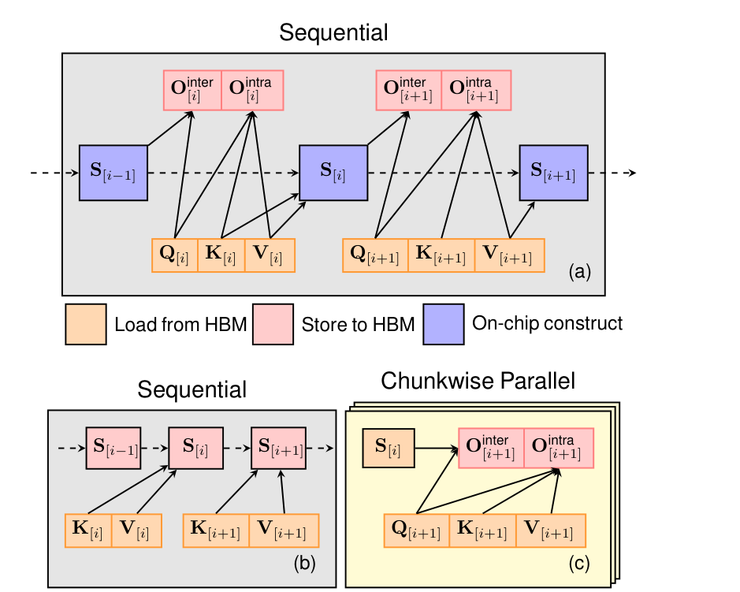
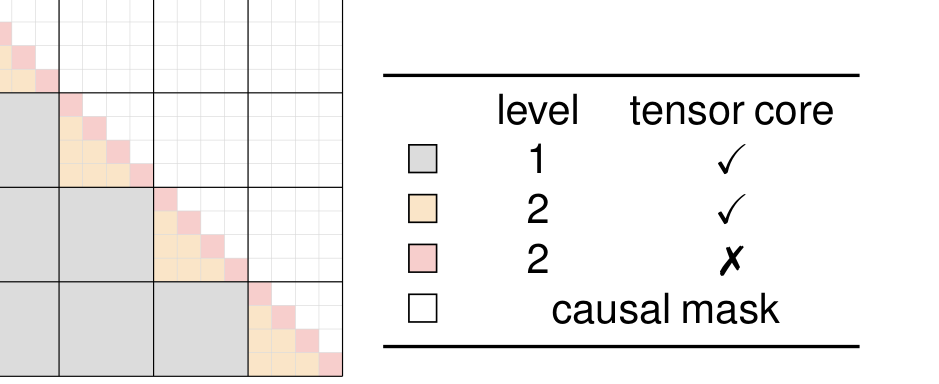

# Gated Linear Attention

## 来源

- 文件：`raw/2312.06635v6.pdf`
- 标题：Gated Linear Attention Transformers with Hardware-Efficient Training
- 团队 / 日期：Songlin Yang、Bailin Wang（MIT，共同一作）；Yikang Shen、Rameswar Panda（MIT-IBM Watson AI Lab）；Yoon Kim（MIT）；arXiv:2312.06635v6，2024-08-27；ICML 2024（PMLR 235）
- 代码：[sustcsonglin/flash-linear-attention](https://github.com/sustcsonglin/flash-linear-attention)（摘要）
- 定位：**方法论文**。给线性注意力加上**数据相关、channel-wise** 遗忘门，并给出能吃 tensor core 的 chunkwise 训练算法。实验载体是 340M / 1.3B 研究检查点。不发布命名产品基座。机制归属 [线性注意力与 delta rule](../concepts/linear-attention-and-delta-rule.md)：它是 **Diag(α_t) 衰减 + 外积写入**，**没有** $(I-\beta kk^\top)$。

**不建模型页。** 生产上的细粒度门是 [Kimi Linear](kimi-linear.md) 的 KDA，把本页的 channel-wise 门接到 [Gated DeltaNet](gated-delta-net.md) 的 delta 上。

## 核心结论

1. **朴素线性注意力缺遗忘门。** 递推 $S_t=S_{t-1}+k_t^\top v_t$ 从不衰减；RetNet / TransNormerLLM 加的是**全局、与数据无关**的标量 $\gamma$（§1、§4）。1D RNN 里数据相关门早就关键，线性注意力这边还没做成可高效训的形式。
2. **GLA 的门是 $S_t=\mathrm{Diag}(\alpha_t)S_{t-1}+k_t^\top v_t$。** $\alpha_t$ 由低秩投影 + sigmoid 从当前 token 算出，每个特征维独立遗忘（Eq. 3、§4.1）。这是矩阵状态上的 **Hadamard / 对角门**，不是 delta 的定向擦写。
3. **FlashLinearAttention 是本页的 I/O-aware 算法名**（§3），不是后来仓库里所有算子的总称。先给无门线性注意力做 chunkwise tiling（可物化 / 不物化 chunk 状态），再推广到带门的二级 chunk：子块之间半精度 matmul，子块内对数域全精度（Figure 3）。
4. **中等规模可追 LLaMA 配方。** 340M / 15B token 与 1.3B / 100B token，同数据对照 Transformer++、RetNet、Mamba（Table 2）。1.3B 平均准确率 51.0，略高于 Transformer++ 50.9 与 Mamba 50.0。长序列外推和召回任务上优于其他亚二次模型，仍落后 softmax 的信息抽取（Table 3、Figure 5）。

> Figure 1（原文截图，§3.3）："(a) FLASHLINEARATTENTION without materialization. This version is more memory-efficient. (b-c) FLASHLINEARATTENTION with materialization. This version enables sequence-level chunkwise parallelism."

## 机制（已据原文核实）

无门线性注意力（Eq. 1）就是外积累加：

$$
S_t = S_{t-1} + k_t^\top v_t,\qquad o_t = q_t S_t.
$$

GLA 把门做成对角（Eq. 3）：

$$
S_t = \mathrm{Diag}(\alpha_t)\,S_{t-1} + k_t^\top v_t = (\alpha_t^\top\mathbf{1})\odot S_{t-1} + k_t^\top v_t.
$$

$\alpha_t=\sigma(x_t W_\alpha^1 W_\alpha^2)^{1/\tau}$，$W_\alpha^1\in\mathbb{R}^{d\times 16}$，$W_\alpha^2\in\mathbb{R}^{16\times d_k}$，$\tau=16$ 让遗忘偏慢（§4.4）。一层 GLA 参数量仍约 $4d^2$，与标准注意力同级。

Table 1 把当时几家的 $G_t$ 收成同一记号：Mamba 是满秩、不好改成 matmul；Mamba-2 / mLSTM / Gated Retention 是**标量** $\gamma_t\mathbf{1}^\top\mathbf{1}$；GLA / HGRN-2 / RWKV-6 是 **$\alpha_t^\top\mathbf{1}$（按 key 维）**。本页实现针对 GLA 这一档；作者写它也能改编给同结构的其他模型。

并行形式要把累积乘积 $b_t=\prod_{j=1}^t\alpha_j$ 除进 key，长序列会下溢，所以 intra-chunk 要走对数域（Eq. 4）。这破坏半精度 matmul。解法是**二级 chunk**（Figure 3）：子块之间仍用半精度；对角子块才全精度。这就是 Kimi Linear 后来说「GLA 要对数域 + 二级 full-precision chunking」的原文。

> Figure 3（原文截图，§4.3）："Attention-style map to illustrate the chunkwise computations in GLA. The inter-chunk dependencies (in gray) are not directly computed in the chunkwise form … The intra-chunk dependencies are modeled via secondary chunking/tiling where the inter-sub-chunk part (in orange) is computed by half-precision matmuls while the intra-sub-chunk part (in pink) is computed in full precision in log space."

完整层还带 per-head LayerNorm、Swish 输出门 $r_t$ 和 SwiGLU FFN，宏观仍是 Transformer 残差栈（§4.4）。

## 评测要点

Table 2（零样本；末列是准确率类任务平均）：

| 规模 | 模型 | Wiki ppl ↓ | LAMBADA ppl ↓ | 平均 acc ↑ |
| --- | --- | ---: | ---: | ---: |
| 340M / 15B | Transformer++ | 28.39 | 42.69 | 41.2 |
| | RetNet | 32.33 | 49.19 | 41.0 |
| | Mamba | 28.39 | 39.66 | 41.8 |
| | **GLA** | 28.65 | 43.35 | 41.5 |
| 1.3B / 100B | Transformer++ | 16.85 | 13.44 | 50.9 |
| | RetNet | 18.64 | 17.27 | 48.9 |
| | Mamba | 17.06 | 13.89 | 50.0 |
| | **GLA** | **17.22** | 14.47 | **51.0** |

召回：合成 MQAR 上矩阵状态模型（Mamba / RetNet / GLA）强于 Hyena / RWKV-4，GLA 强于 RetNet（Figure 4）。真实抽取 FDA / SWDE 上所有亚二次模型都明显落后 Transformer++；1.3B GLA 的 FDA 19.9 vs Transformer++ 27.4 vs Mamba 6.2（Table 3）。

外推：2K 预训练的 GLA 在 SlimPajama 可看到约 18K；Mamba 过 4K 就差。8K 直训或 12×2K TBPTT 对 GLA 几乎无差（Figure 5）。

消融（340M / 7B token，Table 4）：只把 RetNet 的标量门改成数据相关标量仍不够，**细粒度门必要**；4 head 是显存与质量折中，1 head 略好但贵。

吞吐：1.3B、单卡 H100，长序列上高于同规模 Mamba（Figure 6、§5.3）。

## 与已有沉淀的关系

- **KDA 的 channel-wise 门来自本页，delta 不来自本页。** [Kimi Linear](kimi-linear.md) 把 GDN 的 head-wise 标量 $\alpha_t$ 换成 $\mathrm{Diag}(\alpha_t)$，「思路承自 GLA」。GLA 自己的写入仍是 $k^\top v$，没有 $\beta$、没有按 key 擦旧。
- **GDN 走的是另一条门。** [Gated DeltaNet](gated-delta-net.md) 在 Mamba-2 式**标量**门上加 delta。先有 GLA 的细门、再有 GDN 的 delta，KDA 才把两者叠起来。不要写成 GDN 从 GLA 升级而来。
- **FlashLinearAttention 算法 ≠ 后来的 FLA 仓库总称。** 本页 §3 把 I/O-aware chunkwise 实现命名为 FLASHLINEARATTENTION。[Lightning Attention-2](lightning-attention-2.md) 是同代的因果线性 tiling（标量 $\lambda$，块内左乘、块间右乘），不是本页的带门二级 chunk。后来 `flash-linear-attention` 仓库把 Lightning / GLA / RetNet / GDN 收在一起，那是实现层伞名，见 Lightning-2 来源页。
- **[Mamba-2](mamba-2.md) 在 Table 1 是标量门档。** 本页讨论的 Mamba 主要是 Mamba-1（满秩 $G_t$、SRAM 物化、状态不能太大）；Mamba-2 的标量恒等 $A$ 是后作对照。
- **[RWKV](rwkv.md) 在本页是 MQAR 弱基线（RWKV-4）和 Table 1 的 RWKV-6 参数化。** RWKV-4 不是矩阵状态线性注意力。

## 待追问

- 低秩门投影秩固定 16、$\tau=16$，有没有随宽度放大的规则？原文没给 7B+ 配置。
- Table 1 把 RWKV-6 写成与 GLA 同结构的 $\alpha_t^\top\mathbf{1}$。RWKV-4 原文的 WKV 不是这块；RWKV-7 的 generalized delta 更不在本页。
- 本页 FlashLinearAttention 的 Triton kernel 与 Lightning-2 的 kernel 是否在无门、标量衰减设定下数值等价，两边都没有对照。

## 相关页面

- 概念：[线性注意力与 delta rule](../concepts/linear-attention-and-delta-rule.md)
- 同族对照：[Lightning Attention-2](lightning-attention-2.md)（标量衰减 tiling）、[Mamba-2](mamba-2.md)（SSD，标量恒等 SSM）、[RWKV](rwkv.md)（channel-wise 1D WKV，不是矩阵 $S$）
- 后作：[Gated DeltaNet](gated-delta-net.md)（标量门 + delta）、[Kimi Linear](kimi-linear.md)（GLA 式细门 + delta）
