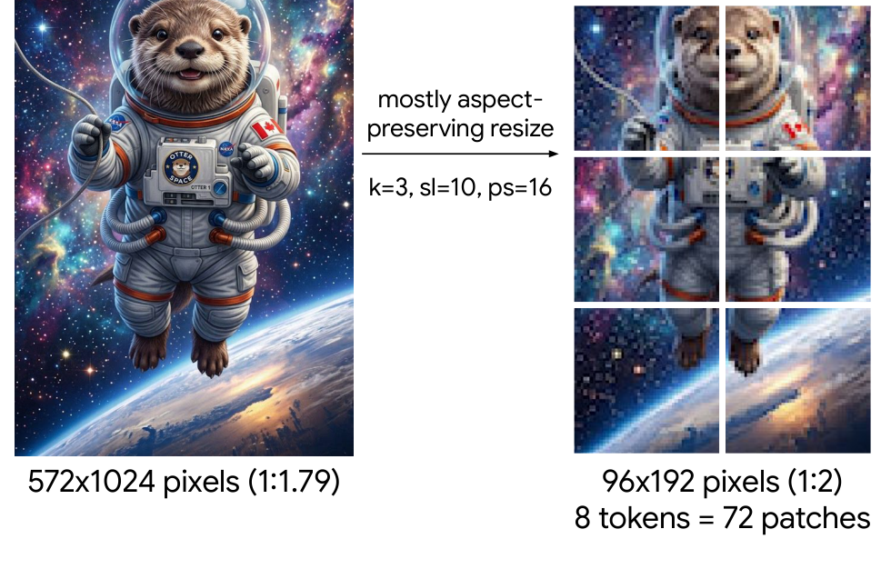
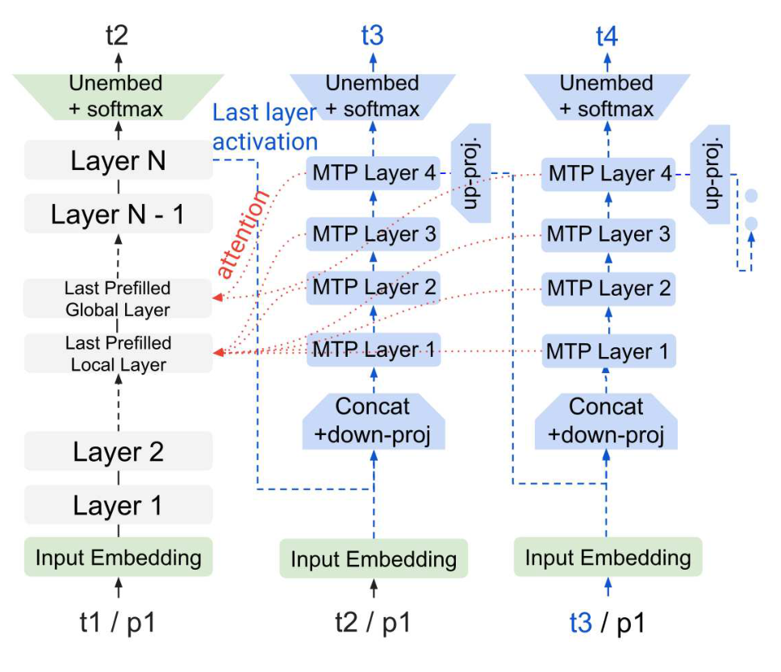

# Gemma 4 技术报告

## 来源

- **PDF**：`raw/2607.02770v1.pdf`
- **标题**：Gemma 4 Technical Report
- **日期**：2026-06-19（arXiv v1 提交 2026-07-02）
- **团队**：Gemma Team, Google DeepMind
- **arXiv**：[2607.02770](https://arxiv.org/abs/2607.02770v1)
- **许可**：Apache 2.0

## 核心结论

Gemma 4 是 Gemma 家族第四代开放权重模型，包含 dense（E2B / E4B / 12B / 31B）和 MoE（26B-A4B）五种变体，规模从 2.3B 到 31B 总参数。报告的核心贡献集中在四个方面：

1. **原生多模态**：所有变体支持文本 + 图像 + 音频输入。E2B/E4B 用冻结的 ViT 视觉编码器（150M）和 USM 音频编码器（305M）；12B 首次采用 **encoder-free 架构**，用轻量投影模块直接把 48×48 图像 patch 和 40ms 音频 chunk 送入 LLM embedding 空间，去掉独立编码器。

2. **长上下文效率**：沿用 Gemma 3 的 local SWA + global attention 混合（E2B 用 4:1，其余 5:1），但新增三项优化：全局层 **values = keys**（key 复用为 value，E2B/E4B 除外）、全局层用 **p-RoPE（p=0.25）**、KV cache sharing（E2B 20/35、E4B 18/42）。组合后全局 KV cache 减少 **37.5%**。

3. **计算效率**：训练一个自回归 MTP drafter head 用于 speculative decoding，drafter 是 4 层小 Transformer，通过 cross-attention 复用主模型 KV，**无需 MTP prefill**，支持任意 draft 长度。同时提供 **QAT（quantization-aware training）** 量化模型，E2B 从 4.6GB 降到 0.8GB。

4. **Thinking mode**：在响应前输出推理轨迹（类似 OpenAI o1），显著提升数学和编码能力。AIME 2026 从 non-thinking 的 67.6 跳到 thinking 的 89.2（31B）。

Gemma 4 31B 在 Arena Text 排行榜上是 **top open dense model**（Elo 1451），超过 Gemma 3 27B（1366）并逼近 GLM-5（1457）、DeepSeek-V4 Pro（1456）等更大 MoE 模型。E2B（2.3B 有效参数）在多个 benchmark 上匹配 Gemma 3 27B，实现约 10× 参数效率提升。

## 架构与训练

### 模型架构

所有 Gemma 4 模型均为 decoder-only Transformer，使用 pre-norm + post-norm 的 RMSNorm 和 QKNorm。五种变体的参数分配如下：

| 模型 | 音频编码器 | 视觉编码器 | Embedder | Einsums | Drafter |
| --- | ---: | ---: | ---: | ---: | ---: |
| E2B | 305M | 150M | 400M + 2,340M | 1,870M | 76M |
| E4B | 305M | 150M | 670M + 2,820M | 3,940M | 77M |
| 12B | - | - | 1,000M | 10,890M | 400M |
| 26B-A4B\* | - | 550M | 740M | 24,500M / 2,800M(active) | 430M |
| 31B | - | 550M | 1,410M | 29,290M | 500M |

> Table 1 参数表。词表 262k。Encoder 参数含 per-layer embeddings（沿用 Gemma 3n 设计），有效参数分别为 2.3B（总 5B）和 4.5B（总 8B）。星标为 MoE，按激活参数定义。

**26B-A4B 的 MoE 配置**（已据 [HF config](https://huggingface.co/google/gemma-4-26B-A4B-it/resolve/main/config.json) 核实）：128 个 expert，每 token 激活 8 个（`top_k_experts=8`），无 shared expert；30 层，5:1 SWA/GA 交替（`layer_types` 逐层列出），sliding_window=1024；`num_attention_heads=16`、`num_key_value_heads=8`（GQA），全局层 `partial_rotary_factor=0.25`（p-RoPE）。

### 长上下文设计

混合 SWA/GA 模式延续 Gemma 3：E2B 用 4:1 local:global，其余 5:1。关键改进：

- **Key-as-value**：全局注意力层直接复用 key 作为 value（values = keys），E2B/E4B 除外。这减少了 value 投影和 KV cache 的存储。
- **p-RoPE**：全局层用 p-RoPE（p=0.25），局部层用标准 RoPE。全局/局部 RoPE base 分别为 1M 和 10k。
- **KV cache sharing**：E2B 共享比 20/35，E4B 为 18/42。
- 组合效果：**全局 KV cache 减少 37.5%**。

### Vision modality

E2B/E4B 配 150M ViT（patch size 16, 12 heads, 16 layers），大模型配 550M ViT（16 heads, 27 layers）。ViT 支持可变宽高比，用 axial 2D-RoPE + non-causal attention + 2D 绝对位置编码。最大视觉 token 数 N_max ∈ {70, 140, 280, 560, 1120}，通过 aspect-ratio preserving resize（见 Algorithm 1）适配任意输入尺寸。

> Figure 2 | Image resizing. patch_size=16, pooling_kernel_size=3, max_soft_tokens=10。图像先 resize 到最接近目标 token 数的 pooled patch 尺寸，72 个 patch 经 ViT 编码后 3×3 pool 成 8 个 soft token。（§ Appendix, Figure 2 + Algorithm 1）

### Audio modality

E2B/E4B 用 305M 音频编码器（USM 架构：2 层下采样卷积 + 12 层 Conformer），处理 40ms / 16kHz 的 Mel filterbank 输入。不使用 vector quantization，LLM 直接接收连续表示。相比 Gemma 3n 的 680M，参数减少 55%。

### Encoder-free 架构（12B）

12B 模型从零训练，**完全去掉独立编码器**：

- **视觉**：48×48×3 RGB patch 经单个大 matmul（35M 参数）投影到 LLM embedding 空间，加 2D 坐标位置编码 + LayerNorm。
- **音频**：原始音频以 40ms / 16kHz 切成 640 维向量，直接投影到 LLM embedding 空间。音频是时间序列，不需要额外位置编码。

Table 8 的 FLEURS ASR 和 CoVoST 翻译结果显示，12B encoder-free 模型的音频性能**接近** E2B/E4B（有编码器），证明去掉专用编码器后仍可达到有竞争力的音频-文本能力。

### MTP drafter

> Figure 1 | The autoregressive MTP drafter (blue blocks on the right) is fed activations and KV cache from the main model (gray blocks).（§ 2.6 Multi-Token Prediction Drafter）

drafter 是一个 4 层自回归 Transformer，接收主模型上一层的 activation 和 token embedding，通过 cross-attention 访问主模型 KV cache，逐步生成 draft token。model dimension 为 256（E2B/E4B）或 1024（26B-A4B / 31B），含 3 层 local + 1 层 global attention。

E2B/E4B drafter 的效率优化：用 top-k on token clusters 替换全词表投影，把最终矩阵乘法从 d×262,000 降到 d×4,096，保持类似的 acceptance rate。

### QAT 量化

提供两种量化格式：

- **mobile quantization**：per-channel 低 bitwidth 权重（int2 + int4 混合）+ int8 activation。用于 E2B/E4B。
- **Q4_0**：blockwise 量化。用于 12B / 26B-A4B / 31B。

32k context 下的内存占用（权重 + int8 KV cache）：

| 模型 | bf16 | 量化 | +KV cache |
| --- | ---: | ---: | ---: |
| E2B | 4.6 GB | 0.8 GB | +0.05 GB |
| E4B | 9.0 GB | 2.3 GB | +0.14 GB |
| 12B | 24.0 GB | 7.65 GB | +0.28 GB |
| 26B-A4B | 52.0 / 7.6 GB | 16.2 / 2.8 GB | +0.28 GB |
| 31B | 64.0 GB | 19.2 GB | +1.10 GB |

> Table 3。† 为 mobile quantization，‡ 为 Q4_0。

为支持 fp16 稳定推理，每个 block 引入一个 scalar scale 限制 activation 范围。编码器也做 QAT：150M ViT 的 W8A8 使前向内存减半（400MB → 200MB），延迟比 Gemma 3n 降 44%；音频编码器 on-disk 从 390MB 降到 87MB（-78%）。

### 预训练

- **数据**：大规模多模态数据（web 文档、代码、图像、音频），截止 2025-01。E2B/E4B/12B 含音频数据。
- **Tokenizer**：与 Gemini 相同的 SentencePiece，split digits + 保留空格 + byte-level encoding，262k 词表。
- **基础设施**：TPUv5p（12B）和 TPUv6e（其余）。大模型用 Slice-Granularity Elasticity 实现故障后秒级恢复。优化器状态用 ZeRO-3 分片，多 pod 训练走 Pathways data replica reduction。
- **TPU 配置**：E2B 4,096 chips / E4B 6,144 / 12B 12,288 / 26B-A4B 6,144 / 31B 10,240。

## 后训练

预训练模型经 instruction tuning 转为 IT 模型，流程类似 Gemma 3，核心差异是加入 **thinking mode**：

- **Thinking mode**：模型在回答前输出推理轨迹。通过 `<|think|>` 在 leading system turn 激活，thinking trace 用 `<|channel>thought ...<channel|>` 标记。
- **数据过滤**：过滤个人信息、不安全输出、错误自我识别、重复样本。加入鼓励 in-context attribution、hedging、refusal 的数据子集以减少幻觉。
- **PT vs IT 格式**：PT 模型输出 `<eos>` 结束生成，IT 模型输出 `<turn|>`。fine-tune 需添加对应的 end token。
- **Function calling**：`<|tool>declaration:...<tool|>` 声明函数，`<|tool_call>call:...<tool_call|>` 调用函数。

## 评测要点

### Arena Text（人类盲评 Elo）

Gemma 4 31B 以 Elo 1451 排名 open dense 模型第一，超过 Gemma 3 27B（1366，排名 157）。26B-A4B 以 1438 排名 61。两者均逼近 GLM-5（1457）、DeepSeek-V4 Pro（1456）等大 MoE 模型。closed 模型 Claude Fable 5 以 1508 居首。

### 静态 benchmark（thinking mode）

| Benchmark | 31B | 26B-A4B | 12B | E4B | E2B | Gemma 3 27B(non-thinking) |
| --- | ---: | ---: | ---: | ---: | ---: | ---: |
| MMLU Pro | 85.2 | 82.6 | 77.2 | 69.4 | 60.0 | 67.6 |
| AIME 2026 | 89.2 | 88.3 | 77.5 | 42.5 | 37.5 | 20.8 |
| LiveCodeBench v6 | 80.0 | 77.1 | 72.0 | 52.0 | 44.0 | 29.1 |
| Codeforces Elo | 2150 | 1718 | 1659 | 940 | 633 | 110 |
| GPQA Diamond | 84.3 | 82.3 | 78.8 | 58.6 | 43.4 | 42.4 |
| HLE | 19.5 | 8.7 | 5.2 | - | - | - |
| Terminal Bench Hard | 36.0 | 14.0 | 18.0 | 8.0 | 3.0 | 4.0 |

> Table 5 节选。所有 Gemma 4 模型在 thinking mode 下评测。

### 视觉 benchmark（thinking，N_max=1120）

| Benchmark | 31B | 26B-A4B | 12B | E4B | E2B |
| --- | ---: | ---: | ---: | ---: | ---: |
| MMMU Pro | 76.9 | 73.8 | 69.1 | 52.6 | 44.2 |
| MATH-Vision | 85.6 | 82.4 | 79.7 | 59.5 | 52.4 |
| InfographicVQA | 92.0 | 89.3 | 88.4 | 70.0 | 63.9 |

> Table 6 节选。

### 长上下文 benchmark

| Benchmark | Context | 31B | 26B-A4B | 12B | E4B | E2B | Gemma 3 27B |
| --- | --- | ---: | ---: | ---: | ---: | ---: | ---: |
| RULER | 32k | 96.8 | 97.3 | 96.4 | 95.2 | 83.0 | 91.1 |
| RULER | 128k | 96.4 | 89.8 | 91.2 | 86.6 | 70.4 | 66.0 |
| LOFT Recall@k | 128k | 79.5 | 66.3 | 66.4 | 58.5 | 50.5 | 8.6 |
| GraphWalks F1 | <128k | 82.3 | 72.6 | 71.0 | 50.9 | 4.1 | 32.8 |
| MTOB (eng→kgv) | ~128k | 52.9 | 50.0 | 45.1 | 37.8 | 15.4 | 41.0 |

> Table 9 节选。Gemma 4 在 128k 长上下文上全面超越 Gemma 3 27B。E4B 在 RULER 128k 上以 86.6 vs 66.0 大幅领先。

### 音频 benchmark

E2B/E4B 在 FLEURS ASR 和 CoVoST 翻译上均优于 Gemma 3n 对应尺寸，尽管音频编码器从 680M 减到 305M、on-disk 从 390MB 减到 87MB。E2B 翻译 BLEU 相对提升 12%，ASR WER 相对改善 17%。

## 待追问

- 预训练数据规模（token 数）和训练步数未公开。
- Thinking mode 的训练数据构成和 RL 策略未详述（仅提及"similar to Gemma 3"）。
- p-RoPE 的 p=0.25 选择依据和消融结果未给出。
- Encoder-free 12B 在音频任务上与有编码器的 E2B/E4B 仍有差距（Table 8 vs Table 7），差距来源是编码器本身还是训练数据量？

## 相关页面

- 模型：[Gemma 4](../models/gemma-4.md)
- 概念：[高效长上下文注意力](../concepts/efficient-long-context-attention.md)（混合 SWA/GA 路线）
- 概念：[多 Token 预测](../concepts/multi-token-prediction.md)（MTP drafter 设计）
- 概念：[MoE 前沿模型扩展](../concepts/moe-frontier-model-scaling.md)（26B-A4B 的激活参数定位）
- 比较：[2026 前沿模型技术报告对比](../comparisons/2026-open-model-technical-reports.md)
