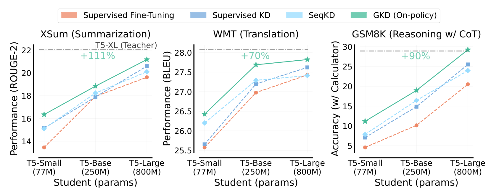
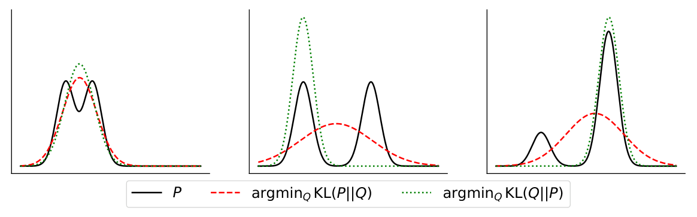
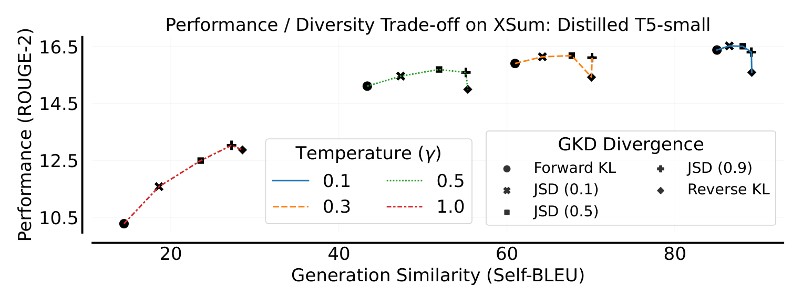

# GKD：On-Policy Distillation of Language Models

## 来源

- 原始文件：[`raw/2306.13649v3.pdf`](../../raw/2306.13649v3.pdf)
- 标题：On-Policy Distillation of Language Models: Learning from Self-Generated Mistakes
- 会议版本：ICLR 2024（PDF 首页标注 `Published as a conference paper at ICLR 2024`；arXiv v1 为 2023-06，本文所用 v3 为 2024-01-17）
- 作者：Rishabh Agarwal\*、Nino Vieillard\*（共同一作），Yongchao Zhou、Piotr Stanczyk、Sabela Ramos、Matthieu Geist、Olivier Bachem
- 单位：Google DeepMind / Mila / University of Toronto
- 原网址：<https://arxiv.org/abs/2306.13649>
- 模型链接：**未建模型页**——论文不发布新模型实体，student / teacher 都是公开的 T5v1.1 与 FLAN-T5（`§A.2`）
- 实验规模：teacher 为 SFT T5-XL（~3B），student 为 T5-small / base / large（77M / 250M / 800M），即 student 比 teacher 小 38× / 12× / 3.8×（`§4`）

## 为什么这篇在 wiki 里独占一席

它是「OPD」这个词在 LLM 上的**算法源头**：把自回归语言模型的蒸馏重写成 imitation learning，并把「用什么数据」和「用什么发散度」拆成两个可以独立调节的旋钮。在此之前，本 wiki 的 [OPD 数学依据](../concepts/multi-teacher-on-policy-distillation.md#数学依据opd-为什么-work) 一节已经在引用它的结论（student 为什么能超越 teacher、reverse-KL 的 mode-seeking），但只以裸链接出现，论证骨架实际架在 [Thinking Machines Lab 博客](thinking-machines-on-policy-distillation.md) 与教科书直觉上。本页把这条一手出处补齐，并校准其中两处口径（见下）。

## 核心结论

1. **问题被定义为 exposure bias，而非容量不足**：常用蒸馏（SeqKD、supervised KD）都在固定的输出序列集合上训 student，而推理时 student 走的是自己生成的分布，二者的 mismatch 会沿自回归链路级联放大（`§1`、`§3.1`）。论文的处方不是更好的损失，而是**换数据来源**。
2. **GKD 只加两个旋钮**：`λ`（student 自生成数据的比例）与 `D`（teacher–student 逐 token 分布之间的发散度）。supervised KD 与 on-policy KD 都是它的特例（`§3.1`、Algorithm 1）。
3. **发散度是可选的，不是给定的**：论文的结论原话是「optimal divergence seems to be task-dependent」。实测中 XSum 温度采样下 reverse KL / JSD(0.9) 最好、forward KL 明显差；GSM8K 上 forward KL 表现不差；指令微调上 reverse KL 大幅优于 forward KL（`§3.1`、`Figure 4`、`Figure 7`、`Figure 10`）。
4. **on-policy 数据比例这一维本身就是主要增益来源**：纯 student 数据（λ=1）与混合（λ=0.5）一致优于纯固定数据集（λ=0）（`§4.2`、`Figure 6`）；GSM8K 上「只要 on-policy 数据不低于 25%，比例越高越好」（`§4.3`、`Figure 8`）。
5. **可以与 RL 同时做**：把 RLHF 里「向初始 policy 正则」换成「向 teacher 正则」，得到一项 reward 加一项蒸馏的加权目标（`§3.2`、Eq 5）。论文自称是首个同时做蒸馏与 RL 微调的工作。
6. **不需要对采样过程反传**：on-policy 的期望取自 student，但梯度不穿过采样过程，因此训练更接近监督学习、更稳定（`§3.1`）。这也是论文与 MiniLLM 的分工点（见下文）。
7. **数据效率高于基线 KD**：只用 5% 的 XSum 训练集、且**不含 ground-truth 摘要**时，on-policy GKD 已超过用全量数据 + ground-truth 的 supervised KD 与 ImitKD（`§4.1`、`Figure 3`）。
8. **有前置条件**：论文明确假设 student 已能生成质量尚可的序列（实验里都从 SFT 后的 student 起步），并把这一点类比成两阶段 RLHF 的 SFT 段（`§3.1` Remark）。

> Figure 1: Comparing GKD with KD approaches across different student model sizes.（`§1`）

## 方法：两个旋钮

### 目标函数

逐 token 的分布差异按序列长度归一（`Eq 2`）：

$$D\!\left(p_T \,\|\, p_S^{\theta}\right)(y|x) := \frac{1}{L_y}\sum_{n=1}^{L_y} D\!\left(p_T(\cdot|y_{<n},x)\,\|\,p_S^{\theta}(\cdot|y_{<n},x)\right)$$

GKD 的目标是固定数据集与 student 自生成数据的混合（`§3.1`）：

$$\mathcal{L}_{\text{GKD}}(\theta) := (1-\lambda)\,\mathbb{E}_{(x,y)\sim(X,Y)}\!\left[D(p_T\|p_S^{\theta})(y|x)\right] + \lambda\,\mathbb{E}_{x\sim X}\!\left[\mathbb{E}_{y\sim p_S(\cdot|x)}\!\left[D(p_T\|p_S^{\theta})(y|x)\right]\right]$$

其中 λ 是 student 数据比例，且**不对 student 的采样分布反传**。两个端点是已知方法：

| λ | D | 得到的方法 |
| --- | --- | --- |
| 0 | forward KL | supervised KD（`Eq 3`：在固定数据集上最小化 teacher–student 的 token 级 KL） |
| 1 | forward KL | on-policy KD（`Eq 4`） |
| 0.5 | forward KL（λ 非增 schedule） | ImitKD 可表达为该形式 |
| 0 | total variation（序列级 f-divergence） | f-distill 是 GKD 的另一个特例 |

论文进一步统一了发散度的选择：`JSD(β)` 在 forward KL 与 reverse KL 之间插值，且 $\lim_{\beta\to 0} D_{\text{JSD}(\beta)}/\beta = D_{\text{KL}}$，所以 β→0 时梯度行为接近 forward KL、β→1 时接近 reverse KL（`Eq 1`、引 Huszár 2015）。

### 方向约定：GKD 与 2026 年 OPD 的差异点

这是本页最需要校准的一处口径。GKD 按 `§Preliminaries` 的定义把 $D_{\text{KL}}(P\|Q)$ 叫 forward KL、$D_{\text{KL}}(Q\|P)$ 叫 reverse KL；而它的 supervised KD（`Eq 3`）与 on-policy KD（`Eq 4`）**都用 teacher 在前的方向**，即论文所称的 forward KL。原文在 `§3.1` 把这个实例关系写得很直白：on-policy 与 supervised KD 分别是 GKD 取 forward KL、λ=1 与 λ=0 的实例。

于是有两层需要分清：

- **「on-policy」与「用哪个方向的 KL」是两个独立维度**。GKD 的 on-policy 标准实例是 teacher-first（mean-seeking）方向；reverse KL 在 GKD 里只是 Figure 4 / 6 / 7 / 10 里被对比的一支。
- **2025–2026 各家 OPD 取的是另一支**：Thinking Machines 博客、MiMo MOPD、GLM-5 公式 2 用的都是 student 在前的 $D_{\text{KL}}(\pi_\theta\|\pi_T)$（本 wiki 对比页与数学依据节记的就是这一支）。所以「OPD = on-policy + reverse KL」是**后来收敛出的配方**，不是 GKD 原文的默认选择；把它当成本文结论会误读这篇论文。

另一处结构性差异：GKD 的损失是在**整个词表上**的逐 token 分布 KL（`Eq 2`），由直接反传优化；而现代 token-level OPD 把同一目标换成 student 采样 token 的 log-ratio 作为 advantage、走 RL 训练栈。按这个分法，[DeepSeek-V4](../models/deepseek-v4.md) 的 full-vocabulary OPD 形式上最接近 GKD，MiMo / GLM-5 的 token-level advantage 则是同一目标的**另一种估计器**——本 wiki 数学依据节第一层记的正是这条估计器关系。

> Figure A.16: Mode-seeking vs Model-covering KL with capacity mismatch. ... See Le (2017) to replicate this plot.（`§A.7`）

这张图是 wiki 现有的 forward / reverse KL 行为对照表的**一手出处**，但它成立的前提要照抄：论文的表述是「在容量失配下用 $Q_\theta$ 近似 $P$，最小化 reverse 与 forward KL 分别导致 mean-seeking 与 mode-seeking」，作图设置是**连续、单峰高斯 Q 拟合双峰 P**（`Figure A.16` caption）。把它推广到离散、词表级的 LLM 蒸馏是推论，不是本篇的结论——[AKL（arXiv:2404.02657）](https://arxiv.org/abs/2404.02657) 恰恰证明这两条刻画在 LLM KD 下不成立（外部佐证，本 wiki 未收录其原文，详见待追问）。

### 发散度的实测排序

> Figure 4: Effect of Divergence on Performance and Diversity. ... Transitioning from forward KL to reverse KL, through generalized JSD, leads to decreased diversity, attributed to the enhanced mode-seeking characteristic of the divergence.（`§4.1`）

论文对这条权衡的机制表述与后来各家一致：forward KL 要求 student 覆盖 teacher 的整个支撑集，容量不足时会**给低概率 token 分配质量**，导致幻觉与低质量生成；reverse KL 优先 teacher 高概率的 token，避免低质量但**牺牲多样性**（`§3.1`「Choice of Divergence in GKD」）。实测排序：

| 设置 | 最优发散度 | 出处 |
| --- | --- | --- |
| XSum，温度采样评估（γ=1） | reverse KL 与 JSD(0.9) 最好，forward KL 明显最差 | `Figure 4`、`Figure A.12` |
| XSum，贪心评估 | 各发散度差异很小，on-policy 与否才是决定因素 | `Figure A.13` |
| WMT en-de | 广义 JSD 优于 forward / reverse KL，且 student 越大差距越小 | `Figure 6`、`§4.2` |
| GSM8K（4-shot CoT） | forward KL 与 reverse KL 都不差，固定数据集上 reverse KL 更好 | `Figure 7`、`§4.3` |
| FLAN 指令微调（MMLU / BBH） | on-policy + reverse KL 大幅优于 supervised KD / ImitKD | `Figure 10` |

论文对指令微调偏好 reverse KL 给出的解释是**假设性**的：mode-seeking 让模型聚焦于指令指定的主意图与行为，从而优先掌握核心行为而非次要细节（`§4.4`）。

### 与 RL 的耦合

把 RLHF / RLAIF 的正则项从「初始 policy」换成「teacher」，就得到 GKD 的 RL 变体（`Eq 5`）：

$$\mathbb{E}_{x\sim X}\!\left[(1-\alpha)\,\mathbb{E}_{y\sim p_S^{\theta}}[r(y)] - \alpha\,\mathbb{E}_{y\sim p_S}\!\left[D(p_T\|p_S^{\theta})(y|x)\right]\right]$$

α 控制蒸馏相对 RL 的强度（α=1 即退化为纯蒸馏）。论文建议只做过小改动的前提下用 reverse KL 或 JSD(0.9) 接进现有 RL 流程（`§3.2`）。XSum 上的 RLAIF + on-policy GKD 实验中，α 增大时 ROUGE-2 上升、事实一致性增益下降（`Figure 5`）。

## 数据与效率

| 任务 | 设置 | 结果 |
| --- | --- | --- |
| XSum 摘要 | T5-XL → small/base/large | 相对训练前 student 的平均增益是基线 KD 方法的 **2.1×**；T5-small 已超过 few-shot PaLM（540B），模型小 7000×（`§1`、`§4.1`） |
| WMT14 en-de | T5-XL → small/base，beam search，3 seed 平均 | 平均增益是基线的 **1.7×**；相对 ImitKD +53%、相对 f-distill +162%（`§1`、`Figure A.15`） |
| GSM8K（4-shot CoT + 计算器） | FLAN T5-XL（27.9）→ small/base/large | 平均增益是基线的 **1.9×**；**只用 student 自生成 CoT** 优于用固定 CoT 数据集或两者混合（`§4.3`） |
| FLAN 指令微调 | FLAN2021（5.36M 样本） | on-policy + reverse KL 最好；论文报 MMLU / BBH 上绝对 **+1% / +2%**，teacher FLAN T5-XL 为 52.4% / 41%（`§1`、`Figure 10`） |
| 自蒸馏（附录） | FLAN T5-Large 同时当 teacher 与 student | on-policy GKD 变体优于 supervised KD，且**自蒸馏后的 student 超过 teacher**（teacher 20.5%，student 未蒸馏前 14.4%）（`§A.1`、`Figure A.11`） |

采样开销：student 自生成的额外计算约为固定数据集方案（自生成 vs 固定数据集）的 **1.8× / 2× / 2.2×**，对应 student–teacher 参数比 38× / 12× / 3.8×（`§A.2`）。论文的辩护是：真实场景的主要成本在推理服务而非微调，且 RLHF + GKD 的开销较小（只需 teacher 前向取 logits）。

## 与现有 wiki 页的关系

- **[OPD 数学依据](../concepts/multi-teacher-on-policy-distillation.md#数学依据opd-为什么-work)**：本页为其第一层（目标形式）与第二层（发散度方向）提供一手出处，并补上「on-policy 程度」这一维——原页把 `λ` 轴缺失了。第三层（on-policy 消除 exposure bias）的 IL 论证来源即本篇 `§3.1`（向上追到 Ross et al. 2011 DAgger）。
- **[Thinking Machines Lab On-Policy Distillation 博客](thinking-machines-on-policy-distillation.md)**：该博客的 per-token reverse KL 属于本页 Figure 4 谱系中的一支（β→1 端），本页是其直接祖先之一。
- **[nrehiew 博客：SFT, RL, and OPD Through a Distributional Lens](nrehiew-sft-rl-opd.md)**：该页「Student 为什么能超越 Teacher」引的 Agarwal et al. 现象，一手出处即本页 `§A.1` 的自蒸馏实验。
- **[On-Policy Distillation 跨报告对比](../comparisons/on-policy-distillation.md)**：比较页的轴二（KL 形式的工程权衡）目前只覆盖 token-level vs full-vocab 这一维；本页提供的是它的上游菜单——发散度方向与 β 谱系。
- **[MiniLLM](minillm.md)**（同期另一支源头）：本篇 `§Related Work` 给了对 concurrent work MiniLLM 的定位——MiniLLM 同样把蒸馏当 RL，在序列级优化 reverse KL 并用 policy gradient；论文主张 GKD 更简单稳定（不对采样过程反传），并指出 MiniLLM 依赖一系列针对高方差、reward hacking、生成长度偏置的稳定化技巧。MiniLLM 侧的对称表述在其 `§4`（把 GKD 列为 concurrent work）。这是两篇源头论文之间唯一的原文级对照。

## 待追问

- **`§4.4` 的 student 规模与 Figure 10 caption 口径不一致**：正文写「把我们蒸馏后的 FLAN T5-**Base** student 在两个 held-out 套件上评测」，而 Figure 10 的三张子图标题是 `FLAN T5-XL → Base`，caption 里的 student 数字（MMLU 35.6% / BBH 31.25%）却标为 T5-**large**。两处不可换算、不可相减，需回原文或原作者代码确认后才能引用具体分数。
- **「+2% / +1%」的对比基线未指名**：`§1` 只写「held-out BBH 与 MMLU 上的绝对准确率提升」，没有说明是相对 supervised KD、ImitKD 还是原始 student，引用时应保留这一不确定性。
- **λ 轴在 2026 的 OPD 实现里没有等价物**：GKD 明确说 GSM8K 上 on-policy 数据低于 25% 时增益不稳定（`Figure 8`），而 MiMo / GLM-5 / V4 的 token-level OPD 事实上都取 λ=1，且都没有做混合比例的消融。是这一维在大模型场景下不再重要，还是被工程默认值掩盖了？
- **forward KL 的 mode-covering 刻画能推多远**：本篇 Figure A.16 是连续单峰高斯拟合双峰 P 的容量失配图，[AKL](https://arxiv.org/abs/2404.02657)（外部佐证，未收原文）证明该刻画在离散 LLM KD 下不成立、forward / reverse KL 收敛到同一目标，差异只在早期 epoch 分别侧重 head 与 tail。GKD 的实测排序（比如指令微调上 reverse KL 大幅胜出）与「两者收敛到同一目标」如何共存？
- **论文没有 teacher 数 > 1 的实验**：GKD 的 λ 混合是「固定数据集 vs student 自生成」，不含多 teacher 路由；它在多大程度上是 [MOPD](../concepts/multi-teacher-on-policy-distillation.md) 的前身，属于本页综合而非原文结论。
- **`§1`「7000× smaller」的口径**：540B / 77M ≈ 7000，指向 T5-small；论文未在正文点明是哪个 student，需谨慎引用。

## 相关页面

- [Multi-Teacher On-Policy Distillation](../concepts/multi-teacher-on-policy-distillation.md)：承载跨家共用的 OPD 数学依据，本页校准其第一层与第二层。
- [Thinking Machines Lab On-Policy Distillation 博客](thinking-machines-on-policy-distillation.md)：2025-10 把 OPD 推成后训练主流叙事的一手博客。
- [nrehiew 博客：SFT, RL, and OPD Through a Distributional Lens](nrehiew-sft-rl-opd.md)：分布视角下 SFT / RL / OPD 的三轴对照。
- [On-Policy Distillation 跨报告对比](../comparisons/on-policy-distillation.md)：MiMo / V4 / Qwen3 / Qwen3-VL / GLM-5 等报告里 OPD 的用法对比。
- [Agentic 模型的后训练](../concepts/post-training-for-agentic-models.md)：OPD 在整条后训练流水线里的位置。
