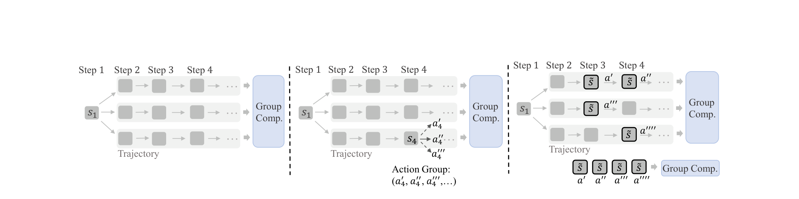
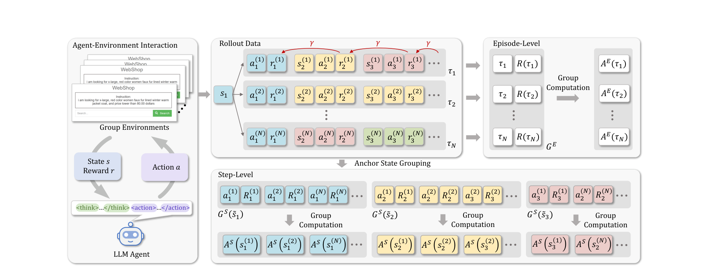
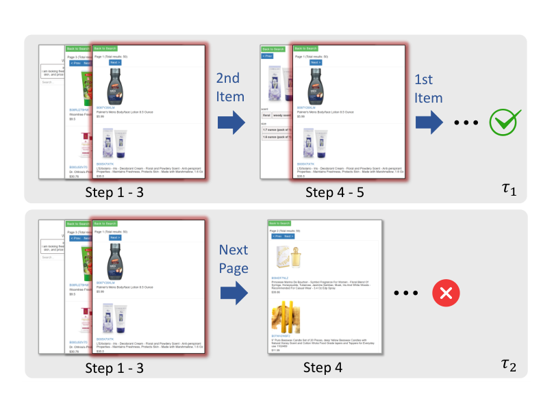
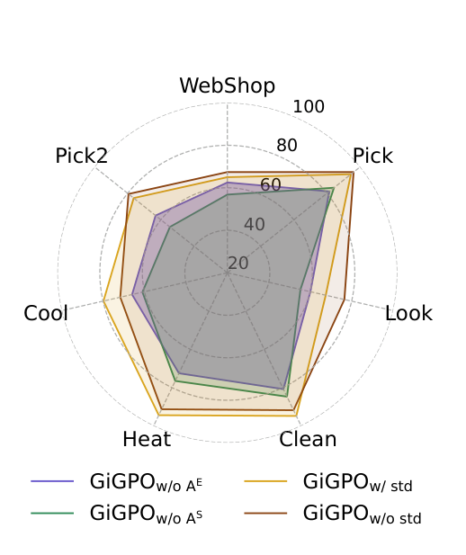
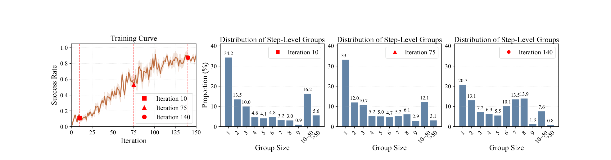
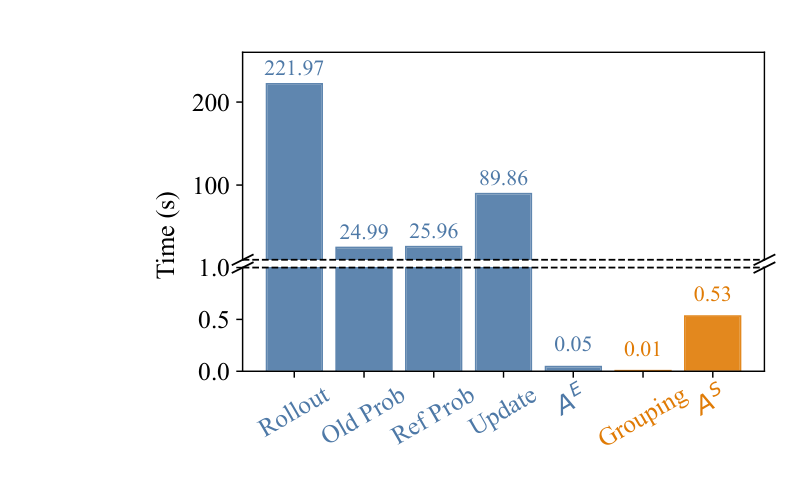
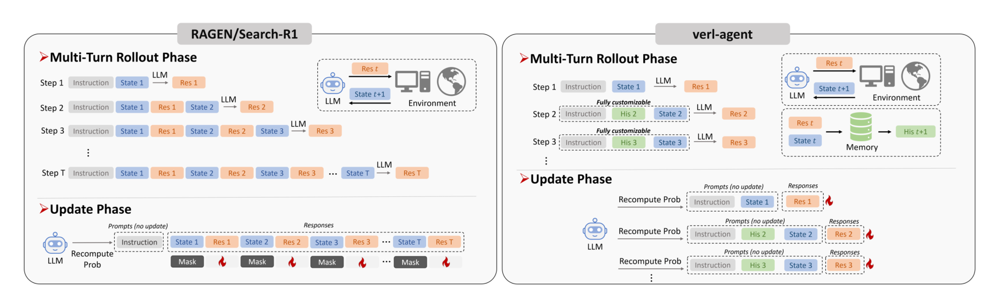

# Group-in-Group Policy Optimization（GiGPO）

## 来源

- 文件：`raw/Feng 等 - 2025 - Group-in-Group Policy Optimization for LLM Agent Training.pdf`
- 标题：Group-in-Group Policy Optimization for LLM Agent Training
- 团队 / 日期：Nanyang Technological University + Skywork AI；arXiv:2505.10978v3，2025-10-28；NeurIPS 2025 poster
- arXiv：<https://arxiv.org/abs/2505.10978>
- OpenReview：<https://openreview.net/forum?id=QXEhBMNrCW>
- 代码：<https://github.com/langfengQ/verl-agent>（基于 veRL 的 step-wise 多轮 agent RL 框架）
- 定位：面向长周期、稀疏奖励 LLM agent 的 group-based RL 算法论文；不发布独立模型。主实验把 GiGPO 套到 Qwen2.5-1.5B/3B/7B-Instruct 上，在 ALFWorld、WebShop 与 search-augmented QA 验证 step-level credit assignment。
- 命名：论文正式名是 **GiGPO**（Group-in-Group Policy Optimization）。部分二次文档写作 GiGRPO；本页以原文为准。

## 核心结论

1. **问题定义**：GRPO / RLOO 这类 group-based RL 在单轮数学、代码上有效，是因为奖励即时、credit assignment 简单。多轮 agent 轨迹可达数十步、上万 token（ALFWorld 上限 50 步 / 20k+ token），奖励常只在终局出现；把整条轨迹当成一个 group 成员，会抹掉 step 之间的好坏（§1、Figure 1 left）。
2. **算法核心**：GiGPO 保留 critic-free、低显存、稳定收敛，同时嵌两层相对优势（§4）：
   - **Episode-level** $A^E(\tau_i)$：同一任务、同一初始状态下采 $N$ 条完整轨迹，用总回报做宏相对优势，等价于轨迹级 GRPO。
   - **Step-level** $A^S(a_t^{(i)})$：用 **anchor state grouping** 事后把跨轨迹（甚至同一轨迹内）重复出现的环境状态聚成组，比较同一状态下不同动作的折扣回报，得到微相对优势。不额外 rollout。
3. **合成优势**：$A(a_t^{(i)}) = A^E(\tau_i) + \omega A^S(a_t^{(i)})$，再套 clipped importance sampling + KL（Eq. 8–9）。默认 $\omega=1$、$\gamma=0.95$。
4. **效果主张**（Table 1、Table 2，3 个随机种子）：相对 GRPO，`GiGPO w/o std` 在 1.5B 上 ALFWorld 总体成功率 +13.3 个百分点（72.8→86.1）、WebShop 成功率 +10.6（56.8→67.4）；7B 上 +12.6（77.6→90.2）和 +9.1（66.1→75.2）。Search QA 平均 3B 42.1 / 7B 47.2。摘要里的「> 12% / > 9%」对应这些百分点差，不是相对涨幅。
5. **成本主张**：与 GRPO 共用同一 actor、同一组 rollout；GPU 显存与 LLM rollout 相同。Figure 6 在 ALFWorld / 1.5B 上报 grouping 0.01s、step advantage 0.53s，对照 rollout+old/ref prob+update 合计 362.83s。论文写「< 0.002% time cost」；按图中秒数相除约 0.15%，精确百分比应以 Figure 6 的秒数为准。
6. **下界**：若没有任何状态重复，则 $A^S=0$，GiGPO 退化为 GRPO（§6）。这是作者自己标出的性能下界，不是额外保证。

## 方法：在已有 group rollout 上事后构造 step 组

> 论文 Figure 1 原文标题："Comparison of multi-turn LLM agent training. Left: Vanilla GRPO rolls out a group of full trajectories and computes episode-level advantages. Middle: Constructing step-level groups via additional per-state rollouts ... enables fine-grained feedback but incurs prohibitive computational cost. Right: GiGPO efficiently achieves fine-grained credit assignment by aggregating distinct actions taken from the same environment state $\tilde s$ across the trajectories."（§4）

中路（每状态额外 rollout）的问题有两层：LLM forward 成本爆炸，以及从未真正执行的假想动作很难给奖励。GiGPO 的关键观察是：同一任务、同一初始状态下，group 内轨迹会因为无效动作或循环反复碰到同一网页、同一房间、同一搜索结果页。这些重复状态就是免费的 step-level 对照组。

> 论文 Figure 2 原文标题："Overview of GiGPO. The agent interacts with a group of environments initialized with identical states to generate a set of trajectories $\{\tau_i\}_{i=1}^{N}$. States with the same color represent the same environment state. GiGPO performs two-dimensional group computations (episode-level $A^E$ and step-level $A^S$) to produce hierarchical relative advantages that guide fine-grained policy optimization."（§4）

### Episode relative advantage

在固定任务 $x$ 与相同初始状态 $s_1^{(1)}=\cdots=s_1^{(N)}$ 下采 $N$ 条轨迹，总回报 $R(\tau_i)=\sum_t r_t^{(i)}$（终局二元奖励时即 0/1）。组内归一化：

$$
A^E(\tau_i)=\frac{R(\tau_i)-\mathrm{mean}(\{R(\tau_j)\})}{F_{\mathrm{norm}}(\{R(\tau_j)\})}
$$

$F_{\mathrm{norm}}=\mathrm{std}$ 是 GRPO 默认；作者同时报告 $F_{\mathrm{norm}}=1$。Appendix C 证明后者只是 RLOO 的常数倍，可被学习率吸收，因此 unbiased up to scaling。正文指出长周期任务里低方差组（全成或全败）会被 std 放大梯度，Look / Pick2 / WebShop 这类较难任务上 `w/o std` 往往更稳（§4.1、§5.2）。

### Anchor state grouping 与 step relative advantage

令 $\mathcal{U}$ 为 group 内全部不同环境状态。每个 $\tilde s\in\mathcal{U}$ 是一个 anchor，对应 step 组

$$
G^S(\tilde s)=\bigl\{(a_t^{(i)},R_t^{(i)}) \mid s_t^{(i)}=\tilde s\bigr\}
$$

其中 $R_t^{(i)}=\sum_{k=t}^{T}\gamma^{k-t} r_k^{(i)}$ 是从该步起的折扣回报，而不是即时 $r_t$。实现上用 hashmap 做离线键分组，不增加 LLM 调用。组内同样做 mean / $F_{\mathrm{norm}}$ 得到 $A^S(a_t^{(i)})$（Eq. 4–7）。

Search-augmented QA 上状态几乎不会字节级相等，作者改用 longest matching subsequence 相似度 $>0.9$ 做 grouping（§5.1）。这是对「精确状态匹配」假设的工程放松，不是主实验 ALFWorld / WebShop 的默认设置。

> 论文 Figure 3 原文标题："Illustration of step-level grouping in WebShop. Both $\tau_1$ and $\tau_2$ encounter the same environment state multiple times: a search results page (highlighted by the red border). Top: $\tau_1$ eventually succeeds. Bottom: $\tau_2$ leads to failure."（§4.2）

### 目标函数

$$
A(a_t^{(i)})=A^E(\tau_i)+\omega A^S(a_t^{(i)})
$$

$$
\mathcal{J}_{\mathrm{GiGPO}}(\theta)=\mathbb{E}\Bigl[\frac{1}{NT}\sum_{i,t}\min\bigl(\rho_\theta(a_t^{(i)})A(a_t^{(i)}),\ \mathrm{clip}(\rho_\theta(a_t^{(i)}),1\pm\epsilon)\,A(a_t^{(i)})\bigr)\Bigr]-\beta D_{\mathrm{KL}}(\pi_\theta\|\pi_{\mathrm{ref}})
$$

$\rho_\theta$ 是逐步 importance ratio。Appendix D Algorithm 1 把相对 GRPO 的增量标成斜体：build $G^S$、算 $A^S$、相加。$\omega$ 默认 1，未对主表调参；Appendix E.5 在 WebShop / 1.5B 上扫 $[0,1.4]$，峰值在 $\omega=0.8$（成功率 68.3），$\omega=1.0$ 为 67.4，$[0.4,1.2]$ 相对平坦。

## 实验信号

### ALFWorld 与 WebShop（Table 1）

ALFWorld：3827 任务、六类家务（Pick / Look / Clean / Heat / Cool / Pick2），最多 50 步。WebShop：110 万商品、1.2 万指令，最多 15 步。Group size $N=8$，16 组并行共 128 环境；成功奖励 10、失败 0、非法动作 −0.1；history length = 2。1.5B 用 2×H100、7B 用 4×H100，各 150 iteration。闭源 prompting（GPT-4o、Gemini-2.5-Pro）和 ReAct / Reflexion 明显低于 RL。总体成功率（%）：

| Backbone | PPO | RLOO | GRPO | GiGPO w/ std | GiGPO w/o std |
| --- | ---: | ---: | ---: | ---: | ---: |
| Qwen2.5-1.5B ALFWorld All | 54.4±3.1 | 69.7±2.5 | 72.8±3.6 | 86.7±1.7 | 86.1±4.7 |
| Qwen2.5-1.5B WebShop Succ. | 51.5±2.9 | 52.1±6.7 | 56.8±3.8 | 65.0±3.2 | 67.4±4.5 |
| Qwen2.5-7B ALFWorld All | 80.4±2.7 | 75.5±4.6 | 77.6±5.2 | 90.8±1.3 | 90.2±2.3 |
| Qwen2.5-7B WebShop Succ. | 68.7±5.1 | 65.7±4.0 | 66.1±3.7 | 72.8±3.2 | 75.2±3.8 |

WebShop 同时报 score：1.5B 上 GiGPO w/o std 83.5±1.8 vs GRPO 75.8±3.5；7B 上 86.2±2.6 vs 79.3±2.8。PPO 需要 critic，论文把它写成「更复杂、更久」但没有给出 wall-clock 对照表。

### Search-augmented QA（Table 2）

在 NQ + HotpotQA 上训练（$F_{\mathrm{norm}}=\mathrm{std}$），评测含 in-domain（NQ、HotpotQA）与 OOD（TriviaQA、PopQA、2Wiki、MuSiQue、Bamboogle）。$N=5$，最多 4 turn，E5 retriever。GiGPO 平均 3B 42.1 / 7B 47.2，高于 Search-R1（32.5 / 38.5）和 ZeroSearch（31.7 / 39.1）。7B 在最多 3 次工具调用约束下，单跳平均约 0.9 次、多跳约 1.6 次，论文把它和 OTC 的 1.0 / 1.7 并列，归因于重复 query 被收进同一 step 组后被压掉。这是作者对 tool-call 次数的解释，不是 OTC 论文的对照实验。

### 消融、组大小动态、正交性

> 论文 Figure 4 原文标题："Ablation results. The y-axis shows success rate (%)."（§5.4）

去掉 episode 信号会失去轨迹级连贯性；去掉 step 信号在 Cool / Pick2 / WebShop 上跌得更重。两种 $F_{\mathrm{norm}}$ 的差距小于这两项结构消融。

> 论文 Figure 5 原文标题："Dynamics of step-level groups during the training in ALFWorld. Left: Success rate over training iterations. ... Right: Distribution of step-level group sizes at those checkpoints."（§5.5）

全文训练过程中 size-1 组始终 <35%，即超过 65% 的状态会跨轨迹重复，anchor grouping 不是偶发。早期大组对应无效动作和死循环；后期收敛到「8 条轨迹行为一致」。

> 论文 Figure 6 原文标题："Per-iteration training time breakdown of GiGPO. Blue bars indicate shared components with GRPO. Orange bars show GiGPO-specific additions. The y-axis uses a broken scale to accommodate small values."（§5.6）

Appendix E.4 把 DAPO 的 dynamic sampling + clip-higher 接到 GiGPO，得到 `GiGPO_dynamic`：WebShop / 1.5B 成功率 GRPO 56.8 → DAPO 66.1 → GiGPO_dynamic 75.0。这是论文给出的「层次核心与单轮 group-based 技巧正交」证据，不是完整 factorial。

Appendix E.3 把同一算法接到 Qwen2.5-VL-3B：Sokoban 6×6 上 GiGPO w/o std 81.0 vs GRPO 67.1；EZPoints 上两者都到 100.0（prompting 仅 3.1）。这是 VLM agent 的补充实验，规模小于主表。

## 配套框架 verl-agent

> 论文 Figure 7 原文标题："Open-source agentic training framework comparison. Left: RAGEN/Search-R1 concatenates the full history at every step, leading to rapidly expanding context. Right: verl-agent adopts a step-wise multi-turn rollout with flexible per-step input construction and memory control."（Appendix A）

verl-agent 宣称的能力包括：step-wise 多轮（不拼接全历史）、可定制 memory、gym 风格并行 group 环境、Qwen3 / Qwen2.5 / LLaMA3.2 + LoRA、Qwen2.5-VL、以及 GiGPO / GRPO / PPO / DAPO / RLOO。这些是框架描述，不是 GiGPO 算法本身的消融。

## 与现有 wiki 页的关系

- 与 [ARPO](agentic-reinforced-policy-optimization.md) 的关系：两者都针对多轮 agent 的 step-level 信号，但不在同一层。ARPO **多花 rollout**：在高熵工具步分叉 partial trajectories。GiGPO **不花额外 rollout**：对已经采到的 group 做同状态对照。理论上可叠加；论文没有和 ARPO 对照。
- 与 [DAPO](dapo.md) 的关系：Appendix E.4 的 `GiGPO_dynamic` 是目前 wiki 里少有的「group-based recipe × agent step-level advantage」同表证据。
- 与 [VAPO](vapo.md) 的关系：VAPO 用 critic + GAE 给 long-CoT 做 token-level credit；GiGPO 坚持 critic-free，用重复状态代替 value model。没有共同实验。
- 与 [SAO](single-rollout-asynchronous-optimization.md) 的关系：GiGPO 依赖同一初始状态的一组轨迹；SAO 认为异步下这组轨迹不该等齐。一个要组，一个拆组。
- 与 [LLM RL policy optimization 对比](../comparisons/llm-rl-policy-optimization.md) 的关系：GiGPO 应放在 **advantage 的构造单元** 轴——episode 组 + 同状态 step 组——而不是 ratio / clipping / 采样位置轴。

## 待追问

- Anchor 依赖状态匹配。网页 DOM、终端 transcript、代码仓库状态几乎不会精确相等；相似度阈值 0.9 只在 search QA 上试过。换 embedding 或结构等价后，$A^S$ 还稳不稳？
- 论文自己的下界是「无重复则退回 GRPO」。真实 SWE / GUI 长轨迹里重复率是否仍有 Figure 5 那种 >65%？
- $\omega=1$ 未对主表调参；WebShop 扫参峰值在 0.8。主结果对 $\omega$ 的敏感度只有这一张 1.5B 表。
- Figure 6 的秒数与正文「< 0.002%」数量级不一致；应把开销读成「相对 rollout 可忽略」，不要引用 0.002% 这个精确值。
- 没有 coding agent / 真实浏览器 / 生产 harness 实验；ALFWorld 与 WebShop 的 admissible action 集合比开放工具集干净得多。
- 与 ARPO 的关系未做对照：同一预算下，把探索花在高熵分叉上，还是花在同状态对照上，哪一个更划算？

## 相关页面

- 概念：[Group-in-Group Policy Optimization](../concepts/group-in-group-policy-optimization.md)
- 概念：[Agentic 模型的后训练](../concepts/post-training-for-agentic-models.md)、[Agentic Reinforced Policy Optimization](../concepts/agentic-reinforced-policy-optimization.md)、[Single-Rollout Asynchronous Optimization](../concepts/single-rollout-asynchronous-optimization.md)、[Agentic 评测体系](../concepts/agentic-evaluation-benchmarks.md)
- 比较：[LLM RL policy optimization 对比](../comparisons/llm-rl-policy-optimization.md)
- 相邻算法：[DAPO](dapo.md)、[VAPO](vapo.md)、[Agentic Reinforced Policy Optimization](agentic-reinforced-policy-optimization.md)、[Single-Rollout Asynchronous Optimization](single-rollout-asynchronous-optimization.md)
