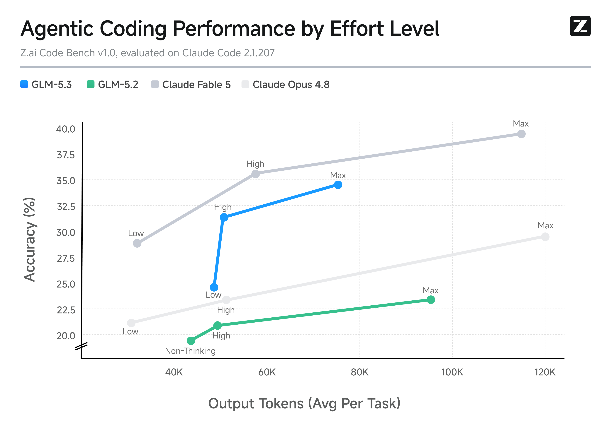

# GLM-5.3 官方发布博客

## 来源

- 原文：[GLM-5.3: Frontier Coding with Emergent Cyber Capabilities](https://z.ai/blog/glm-5.3)
- 发布日期：2026-08-14
- 团队：Z.ai
- 模型页：[GLM-5.3](../models/glm-5-3.md)
- 相关前作：[GLM-5 技术报告](glm-5.md)

## 这页在本 wiki 的定位（重要）

这是模型发布博客，不是技术报告；按本 wiki 的证据规则，它对 GLM-5.3 的公开声明属于**外部佐证**，不能替代尚未公开的模型架构、参数量或训练配方一手报告。它最有价值的不是“又一个榜单”，而是给出了 Z.ai 如何把既有 RL stack 扩到更多真实、可验证长周期环境的工程描述。

## 核心结论

Z.ai 明确称 GLM-5.3 与 GLM-5.2 使用同一 base model，发布版相对 5.2 的增益全部来自后训练的环境、任务多样性与计算量扩展（来源：[GLM-5.3 官方发布博客](https://z.ai/blog/glm-5.3)）。因此，不能把它的能力提升归因于未披露的新架构、参数规模或预训练语料。

博客描述的环境生成链条是：research agent 从真实工作中归纳任务模式，合成为带多步依赖和隐藏状态的可执行环境；judge agent 尝试解题以检查可解性；verifier 不看参考解生成，再由 solver trajectory 发现并封堵 reward shortcut。通过 oracle、no-op 与 unsolved-state 检查的 verifier 才提供可直接训练的二元 reward（来源：[GLM-5.3 官方发布博客](https://z.ai/blog/glm-5.3)）。这是 [Agentic engineering](../concepts/agentic-engineering.md) 中“环境本身是可扩展训练数据基础设施”的又一实例。

## 后训练与系统

博客称 GLM-5.3 延续了 GLM-5.2 的 SAO with compaction，并以开源 `slime` 承载后训练：Megatron 负责训练、SGLang 负责 rollout，数学、代码、sandbox、verifier 和 agent 环境以数据生成接入同一 dataflow，而非为每类任务改写训练循环（来源：[GLM-5.3 官方发布博客](https://z.ai/blog/glm-5.3)）。SAO 的算法定义见 [Single-Rollout Asynchronous Optimization](single-rollout-asynchronous-optimization.md)；该论文声明用于 GLM-5.2，但 **compaction 不在论文正文**，本页不能把它回写成算法机制。

该版本还公开了三项系统侧扩展：

- 为多 teacher OPD 提供 dynamic teacher switching / prefetch，避免为每个 teacher 常驻独立 inference service；
- 对训练与 rollout 做全数值对齐，博客称平均 log-prob 差异控制到 $10^{-7}$ 量级；
- 按 rollout 环境的特征自动配置 prefill/decode 资源比例与并发度。对长周期 coding RL，作者报告端到端训练吞吐提高超过 2.3 倍。

这些都是作者公开声明，未给出可复现实验配置或消融，故只能作为系统设计信号，而非独立验证的因果结论。它与 [异步 Agent RL](../concepts/asynchronous-agent-rl.md) 的核心问题一致：长尾轨迹下，训练—推理对齐、缓存、调度与环境质量会共同决定 RL 是否能规模化。

## 评测要点

公开评测均为厂商自报，且 harness、上下文、预算并不完全一致，不应把同表横向数字当作严格排名。

| 评测 | GLM-5.3 | GLM-5.2 | 发布页披露的关键条件 |
| --- | ---: | ---: | --- |
| Terminal-Bench 3.0 | 28.3 | 4.6 | Claude Code 2.1.207 harness；400K context、128K max output、avg@3；单 rollout 最多 600 turns / 10 小时 |
| DeepSWE v1.1 | 66.9 | 46.2 | mini-swe-agent；400K context、6 小时 timeout |
| Agents' Last Exam（CLI） | 28.5 | 23.8 | Claude Code harness；1M context、64K max output；105 个隔离 Docker 任务 |
| CyberGym | 84.5 | 77.2 | Claude Code 2.1.207、无 web tools；1,507 tasks、single-run Pass@1 |
| ExploitBench | 54.4 | 24.4 | 300 interaction rounds；41 tasks、3 revisions 的 capability coverage 平均 |

> 发布页图注："Agentic Coding Performance by Effort Level"；Z.ai Code Bench v1.0，在 Claude Code 2.1.207 上评测（来源：[GLM-5.3 官方发布博客](https://z.ai/blog/glm-5.3)）。

安全能力部分只记录评测和披露治理信号：作者称在后训练混入漏洞发现数据与环境后，能力从单点缺陷识别扩展到多阶段 exploitation chain 推理；其公开披露台账记录已公开和仍在披露中的发现。该说法及 2,436 个发现等统计仍待独立审计，本文不展开任何利用步骤（来源：[Z.ai Security Disclosure Ledger](https://cvd.z.ai/)）。

## 待追问

- GLM-5.2 base model 的参数、注意力架构与 GLM-5 的关系尚未由本页披露；不能因同属 GLM-5 家族而直接等同。
- 环境生成的真实任务来源、人工介入比例、去重方式和 verifier 的 false-positive / false-negative 率未公开。
- Z.ai Code Bench 是私有基准；其任务、checklist、污染控制与统计不确定性未开放，不能作为公开 benchmark 的替代。
- 训练—rollout 的 $10^{-7}$ log-prob 对齐、2.3 倍吞吐和网络安全发现统计均缺少独立复现或方法细节。

## 相关页面

- [GLM-5.3](../models/glm-5-3.md)
- [GLM-5 技术报告](glm-5.md)
- [Agentic engineering](../concepts/agentic-engineering.md)
- [Agentic 模型的后训练](../concepts/post-training-for-agentic-models.md)
- [异步 Agent RL](../concepts/asynchronous-agent-rl.md)
- [Single-Rollout Asynchronous Optimization](single-rollout-asynchronous-optimization.md)
- [Agentic 评测体系](../concepts/agentic-evaluation-benchmarks.md)
