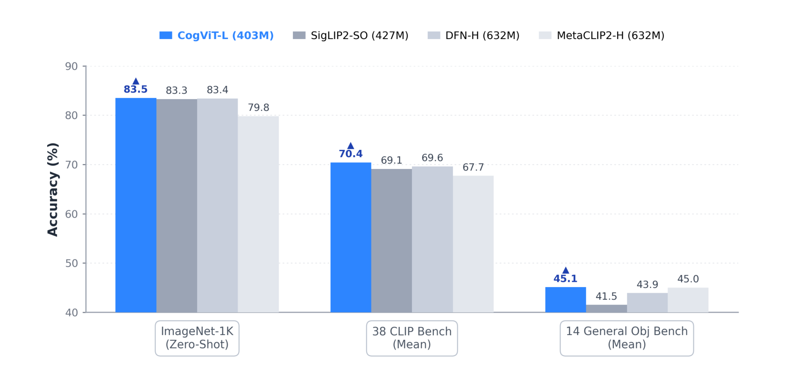
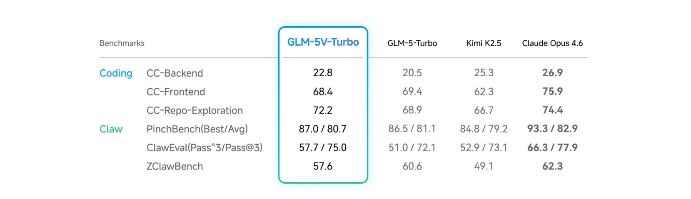

# GLM-5V-Turbo 技术报告

## 来源

- 原始 PDF：[raw/2604.26752v3.pdf](../../raw/2604.26752v3.pdf)
- 标题：GLM-5V-Turbo: Toward a Native Foundation Model for Multimodal Agents
- 版本/日期：arXiv:2604.26752v3，2026-04
- 团队：GLM-5V-Turbo Team（Z.ai & Tsinghua University），Tech Leads: Wenyi Hong, Xiaotao Gu
- 模型页：[GLM-5V-Turbo](../models/glm-5v-turbo.md)
- 前作模型页：[GLM-5](../models/glm-5.md)（纯文本基座 GLM-5-Turbo 的完整技术报告）

## 核心结论

GLM-5V-Turbo 是 [GLM-5](../models/glm-5.md) 家族的多模态扩展，定位为面向 multimodal agent 的原生基座模型。核心理念是：多模态感知不是语言模型的辅助接口，而是 reasoning、planning、tool use、execution 的核心组件。报告不以参数量/训练 token 数为主轴（全文未披露总参数和训练量），而是围绕模型设计、多模态训练、RL、工具链扩展和 agent 框架集成五条线展开。

三个 design lens 贯穿全文：（1）感知仍是高层能力的天花板——许多看似高层的失败始于模型看不准；（2）agent 能力更适合分层优化而非 monolithic end-to-end 训练——低层任务更易构造、标注、验证，高层任务在低层不牢时直接推会失稳；（3）端到端长周期任务的关键是清晰的任务规格、可靠的结果验证和受控的评测流程，而非简单拉长 horizon。

## 架构与训练

### CogViT 视觉编码器

CogViT 是面向多模态细粒度理解的参数高效视觉编码器，采用两阶段预训练配方：

第一阶段用 distillation-based masked image modeling 增强视觉表示：student ViT 在 SigLIP2（语义表示）和 DINOv3（纹理特征）双 teacher 的特征空间中重建被遮蔽区域（35% masking ratio，224×224 分辨率），训练数据按质量感知混合（80% 高质量自然图像 + 10% instruction-following + 10% 科学图像），用 Muon optimizer + cosine decay，并引入 QK-Norm 稳定大规模训练。

第二阶段转向 contrastive image-text pretraining 做跨模态对齐：用 NaFlex 方案处理变尺寸输入并保持原始宽高比，global batch size 扩展到 64K，8B 双语（中英）图文语料，SigLIP loss 的双向分布式实现，Muon 给 vision/text/projection 三组件分派不同学习率和衰减计划。

> Figure 1（原文截图，§ 2.1 CogViT Vision Encoder）：CogViT-L 在三个零样本 benchmark 上以 403M 参数超过 427M–632M 的竞品编码器。

### Multimodal Multi-Token Prediction（MMTP）

MMTP 是 [MTP](../concepts/multi-token-prediction.md) 的多模态扩展，核心问题是：图像 token 如何传递给 MTP head？报告系统对比三种方案：

| 方案 | 做法 | 优劣 |
| --- | --- | --- |
| 直接传递视觉 embedding | 把 LLM backbone 输入的视觉 embedding 送入 MTP head | 需跨 pipeline-parallel 阶段传播视觉 embedding，通信复杂度高 |
| 全部遮蔽视觉 token | MTP head 输入遮蔽所有视觉 token，退化为 text-only MTP | 简单但丢失视觉信息 |
| 共享 learnable `<\|image\|>` token | 保留视觉位置信息，但用共享可学习特殊 token 替代视觉 token | **最终采用**：无需跨阶段传播视觉 embedding，兼容 sequence/context parallelism，0.5B 消融显示训练 loss 更低、收敛更稳 |

报告假设 `<\|image\|>` token 方案更优的原因是 MTP head 通常轻量，可能没有足够建模能力吸收分布与文本 embedding 差异较大的视觉表示；用统一形式输入缓解了优化难度。

### 多模态 RL

GLM-5V-Turbo 在 30+ 任务类别上做联合 RL 优化，涵盖感知、推理和 agentic 能力。关键技术包括 UI-to-code 任务中的 relative visual policy optimization。报告观察到 RL 相比 SFT 的一个核心特性：跨域干扰更弱——多域可同时稳定提升，而 SFT 常见跨域 trade-off。在窄分布单任务 RL 易振荡的场景下，多任务协同训练通过暴露更丰富的策略分布使优化更稳定。推理行为模式可跨域迁移：一个域学到的推理行为有时在另一个域产生可测量的收益。

RL 基础设施层面有四项工程改进：

- 统一 VLM RL Gym：为单步和多步任务提供一致环境接口；独立 reward 系统集中编排多验证器（规则验证器本地同步执行，模型 judge 异步 API 调用），每样本携带 data-source tag 做来源级指标聚合。
- 全流程解耦与异步重叠：rollout 推理、reward 计算、batch 构建和权重传输解耦，每请求注册完成回调使 reward 计算无需等整批 rollout 完成；支持按完成数或时间阈值的 early-abort，被中止的 prompt 可缓存复用。
- 多模态细粒度内存管理：标准 recompute 方案针对文本设计，不解决多模态引入的内存瓶颈；对 ViT 和 projector 分别设计 recompute + CPU offloading 策略，防止激活内存随图片数线性增长。
- 拓扑感知分区与动态负载均衡：长视频等变长视觉输入的 CP/TP 分区前移到 data-loading 阶段，消除跨 rank patch 聚合，异步 all-to-all 通信精确分发。

### 多模态工具链与 agent 框架集成

报告列出一套多模态工具集（Table 1），覆盖通用识别（植物/地点/人物）、多模态搜索（文本/以图搜图/相似图/学术）、浏览器、图像处理（裁剪/标注框/标注点/几何/3D 框/视频跟踪）、创作（网页/PPT）和深度研究。GLM-5V-Turbo 还集成外部 agent 框架：Claude Code 处理终端和文件系统逻辑，AutoClaw 提供 GUI 自动化的\"手\"，GLM-5V-Turbo 作为 vision-language 控制器，构成完整的 perception-planning-execution 闭环。

官方提供 15 个 skill（Table 2），分三类：native skill（PDF-to-Web / PDF-to-PPT / Web Replication / PRD-to-App / Stock Analyst）、external tool skill（Image Captioning / Visual Grounding / Doc-based Writing / Resume Screening / Prompt Generation）和 specialized skill（基于 GLM-OCR 和 GLM-Image 的 OCR/表格/手写/公式识别 + 图像生成）。

### ImageMining：视觉中心深度搜索 benchmark

ImageMining 是报告自建的视觉中心深度搜索评测，217 个测试用例覆盖 7 个领域（社交/娱乐/产品/地点/富文本/自然/科学）和 5 类推理（通用识别/时空推理/事件推理/文本推理/视觉搜索）。与传统 VQA 不同，ImageMining 要求模型通过多步工具调用主动挖掘视觉输入（如局部裁剪放大细节再搜索），核心约束是 \"Visual Jump\"：发现过程中的中间推理跳必须涉及视觉转换，迫使模型解析图像而非依赖文本捷径或参数知识。

## 评测要点

> Figure 4（原文截图，§ 5 Evaluation）：多模态 coding / tool-use / GUI agent 三类 benchmark 横向对比。

> Figure 5（原文截图，§ 5 Evaluation）：文本 coding 和 Claw agent benchmark 横向对比，含与纯文本基座 GLM-5-Turbo 的直接对照。

核心评测数据（已据原文 Figure 4/5 核实）：

多模态 coding / tool-use / GUI agent：

| Benchmark | GLM-5V-Turbo | Kimi K2.5 | Claude Opus 4.6 |
| --- | --- | --- | --- |
| Design2Code | 94.8 | 91.3 | 77.3 |
| Flame-VLM-Code | 93.8 | 88.8 | 98.8 |
| Vision2Web | 31.0 | 33.2 | 43.5 |
| ImageMining | 30.7 | 24.4 | — |
| BrowseComp-VL | 51.9 | 42.9 | 35.9 |
| MMSearch | 72.9 | 58.7 | 63.8 |
| MMSearch-Plus | 30.0 | 25.6 | 25.6 |
| SimpleVQA | 78.2 | 71.5 | 63.2 |
| Facts | 58.6 | 57.8 | — |
| V\* | 89.0 | 84.3 | 66.5 |
| OSWorld | 62.3 | 63.3 | 72.2 |
| AndroidWorld | 75.7 | 43.1 | 62.0 |
| WebVoyager | 88.5 | 84.3 | 88.0 |

文本 coding / Claw agent：

| Benchmark | GLM-5V-Turbo | GLM-5-Turbo | Kimi K2.5 | Claude Opus 4.6 |
| --- | --- | --- | --- | --- |
| CC-Backend | 22.8 | 20.5 | 25.3 | 26.9 |
| CC-Frontend | 68.4 | 69.4 | 62.3 | 75.9 |
| CC-Repo-Exploration | 72.2 | 68.9 | 66.7 | 74.4 |
| PinchBench (Best/Avg) | 87.0 / 80.7 | 86.5 / 81.1 | 84.8 / 79.2 | 93.3 / 82.9 |
| ClawEval (Pass³/Pass@3) | 57.7 / 75.0 | 51.0 / 72.1 | 52.9 / 73.1 | 66.3 / 77.9 |
| ZClawBench | 57.6 | 60.6 | 49.1 | 62.3 |

RL 阶段相比 SFT 的增益（§ 2.3 原文）：RefCOCO-avg +4.8%、PointBench +3.2%、MVBench +5.6%、SUNRGBD +7.7%、OCRBench +4.2%、CharXiv +7.7%、MMMU/Pro/MathVista/LogicVista +1.8%、OSWorld +4.9%、CC-Backend +0.2%、MMSearch +3.5%。

一个关键发现是：GLM-5V-Turbo 在 CC-Backend、CC-Frontend、CC-RepoExploration 上甚至超过其纯文本基座 GLM-5-Turbo，说明多模态扩展没有侵蚀文本 coding 能力。

## 待追问

- 报告未披露总参数量、激活参数量、训练 token 数、LLM backbone 架构细节（是否沿用 GLM-5 的 DSA + MoE），这些信息可能在 GLM-5 主报告或 HF config 中。
- CogViT 的参数量（Figure 1 显示 CogViT-L 为 403M）与 LLM backbone 的连接方式（projector 结构）未详细说明。
- MMTP 的 `<\|image\|>` token 方案与 GLM-5 的参数共享 MTP 层如何配合？是否同样共享参数？
- relative visual policy optimization 的具体算法形式（引用 [45] UI2Code^n）未展开。
- RL 的 30+ 任务类别清单和各自 reward 设计未完整列出。
- ImageMining 的 217 个测试用例是否开源？\"Visual Jump\" 的自动化检测如何实现？
