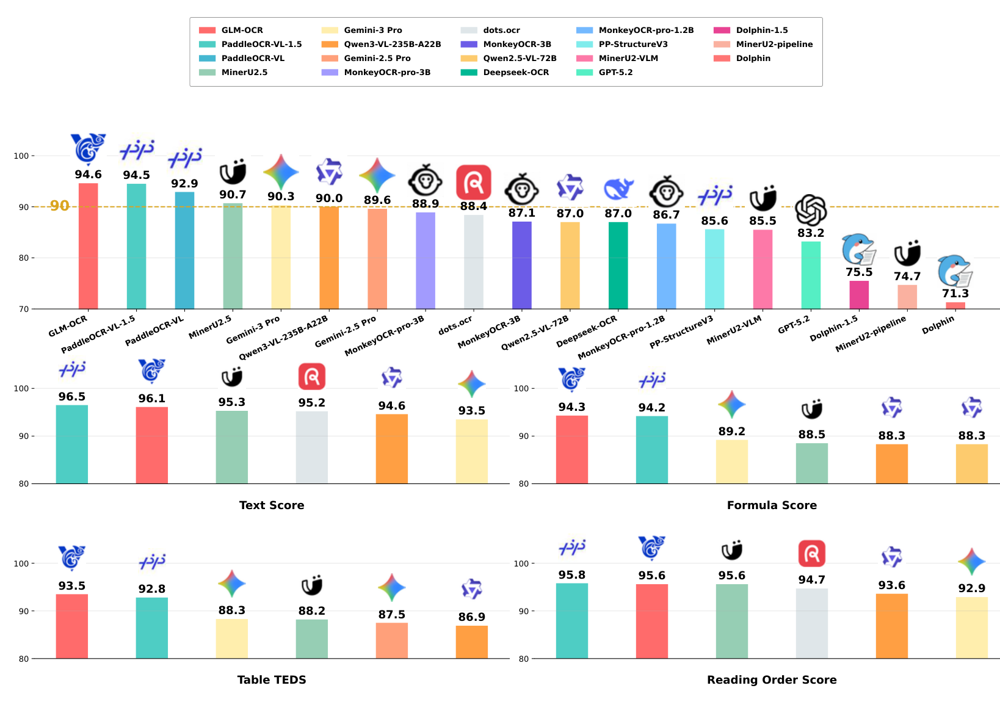
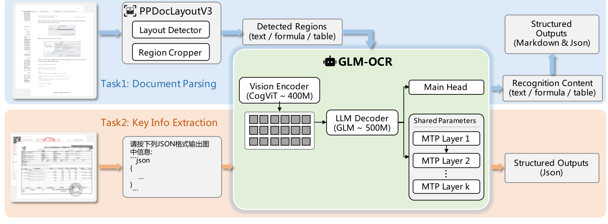

# GLM-OCR

## 来源

- PDF：`raw/2603.10910v2.pdf`（17 页）
- arXiv：[2603.10910](https://arxiv.org/abs/2603.10910)（v2，2026-03-16）
- 团队：智谱 AI（Zhipu AI / zai-org）+ 清华大学
- 模型：[GLM-OCR](../models/glm-ocr.md)
- 代码 / 模型 / Demo：[GitHub](https://github.com/zai-org/GLM-OCR) / [HuggingFace](https://huggingface.co/zai-org/GLM-OCR) / [ocr.z.ai](https://ocr.z.ai/)

## 核心结论

GLM-OCR 是面向真实生产系统的轻量多模态 OCR 模型，核心论点是**不靠大模型 scaling，而是靠架构-解码-任务结构对齐来拿效率增益**。三个设计动机：

1. **解耦两阶段降幻觉**：小模型处理复杂布局易幻觉和重复生成，显式引入布局分析模块把复杂布局拆成多个简单子问题，且分区域后可并行识别提效。
2. **文档解析与 KIE 统一**：两者都是「视觉条件下的结构化生成」，共享视觉-文本对齐 / 布局推理 / 结构化输出能力，用 task-specific prompt 控制输出格式而非各自独立 pipeline，提升参数效率与跨任务迁移。
3. **MTP 对齐 OCR 的确定性特征**：标准自回归逐 token 解码对 OCR 这种「强局部依赖 + 显式结构监督」的确定性任务低效。引入 [Multi-Token Prediction](../concepts/multi-token-prediction.md)（MTP）同时预测多 token，减少解码步数，并鼓励模型向前规划，产出更少「破损」标签、更鲁棒的结构化输出。

> Figure 1: Performance of GLM-OCR on OmniDocBench v1.5（§ 1 Introduction）。注意这是 **v1.5**（非 v1.6），0.9B 超过 235B 通用 VLM。

结果：OmniDocBench v1.5 Overall 94.62 居首（0.9B），超过 PaddleOCR-VL-1.5（94.50）、MinerU2.5（90.67）、Qwen3-VL-235B（89.15）、Gemini-3 Pro（90.33）。吞吐 1.86 pages/s（PDF），约为 MinerU2.5（0.48）的 3.9×。

## 架构与训练

### 模型架构

> Figure 2: Overall architecture and workflow（§ 2.1 Model Overview）。

GLM-OCR Core 走视觉-语言生成范式：

- **视觉编码器（CogViT，~400M）**：从文档图像提取高层视觉表示。[GLM-5V-Turbo](glm-5v-turbo.md) 同样使用 CogViT 视觉编码器，是同族视觉前端。
- **LLM 解码器（GLM，~500M）**：自回归语言模型，以视觉 embedding（经 connector 投影到语言空间）和文本 prompt 为前缀 token，生成结构化输出（Markdown / JSON）。

### MTP 机制（核心加速点）

除主预测头外，附加 **k 个共享参数辅助头**同时预测未来 k 个 token。这些头共享相同参数但被训练来建模不同未来偏移。推理时每步生成多 token，降延迟并鼓励更好的局部结构一致性。

关键数字（已据原文核实）：
- 训练时预测 **10 tokens/step**
- 推理时平均生成 **5.2 tokens/step**
- 约 **50% 吞吐提升**
- 共享参数方案显著降低 MTP 引入的额外 GPU 内存开销（引用 [35] = [GLM-5](glm-5.md) 的参数共享思路）

这与 [DSpark](dspark.md)（推测解码 drafter）、[HunyuanOCR-1.5](hunyuan-ocr-1.5.md) DFlash（block-diffusion draft）、[Gemma 4](../models/gemma-4.md) MTP drafter 同属 MTP 加速家族，但 GLM-OCR 的特点是 **MTP 同时作为训练目标（不只是推理加速）**，且用共享参数而非独立 draft model 控内存。详见 [多 Token 预测](../concepts/multi-token-prediction.md)。

### 两阶段 pipeline + 双任务

- **Task 1 文档解析**：PP-DocLayout-V3 布局分析 → 区域裁剪 → 各区域独立进 GLM-OCR Core → Merge & Post Process 还原阅读顺序，输出 Markdown/JSON。模块化设计降幻觉、支持并行。
- **Task 2 KIE**：全图直接进 GLM-OCR Core + task-specific prompt（如「按 JSON schema 抽发票字段」），不依赖显式布局裁剪，模型在 prompt 指导下隐式 attend 相关视觉区域。

两任务统一为「条件结构化生成」，仅预处理策略和 prompt 不同。

### 训练配方

| Stage | Phase | 数据类型 |
| --- | --- | --- |
| Stage 1 | 视觉编码器训练 | 图文对、grounding/retrieval（数十亿图文对，MIM + CLIP 双目标 + 大 ViT 蒸馏） |
| Stage 2.1 | VL 预训练 | 图文对、文档解析、grounding、VQA（GLM-0.5B 接 ViT 联合预训练对齐多模态） |
| Stage 2.2 | MTP 预训练 | 文档解析、grounding、VQA（引入 MTP 目标适配解码器） |
| Stage 3 | SFT with MTP | 文字/公式/表格识别、KIE（MTP 保持开启保证训练-推理一致，数据按子任务平衡防过拟合） |
| Stage 4 | RL | 文字/公式/表格识别、KIE |

## 后训练

Stage 4 用 [GRPO](../comparisons/llm-rl-policy-optimization.md)（Group Relative Policy Optimization）提升结构化输出可靠性和任务准确率。训练样本由 SFT 模型 rollout 生成，自动评测后按难度分层构造分级优化集。Reward 设计 task-aware，整合准确性指标和结构验证信号：

| 任务 | 主准确性 reward | 附加约束 |
| --- | --- | --- |
| 文字识别 | 归一化 edit distance | 重复惩罚 |
| 公式识别 | CDM score | 结构合法性检查 |
| 表格识别 | TEDS score | 标签闭合验证、结构解析 |
| KIE | field-level F1 | JSON 解析验证、缺失/重复字段惩罚 |

> 全局正则化：重复率惩罚 + 畸形结构惩罚。

这与 [MinerU2.5-Pro](mineru-2-5-pro.md) Stage 3（GRPO + 任务指标直接作 reward + DAPO clip-higher/dynamic sampling）、[HunyuanOCR-1.5](hunyuan-ocr-1.5.md) Stage 3（IcePop + 三组件 reward）同属「GRPO + 结构化输出 RL 对齐」家族，区别在 reward 设计的 task-aware 粒度（GLM-OCR 每任务独立 reward + 全局正则；MinerU2.5-Pro 直接用评测指标；HunyuanOCR-1.5 加退化抑制 reward）。

## 评测要点

### 公开 benchmark（Table 3/4）

| 数据集 | GLM-OCR | PaddleOCR-VL-1.5 | MinerU2.5 | dots.ocr | Gemini-3 Pro | GPT-5.2 |
| --- | --- | --- | --- | --- | --- | --- |
| OmniDocBench v1.5 | **94.6** | 94.5 | 90.7 | 88.4 | 90.3 | 85.4 |
| OCRBench (Text) | **94.0** | 75.3 | 75.3 | 92.1 | 91.9 | 83.7 |
| UniMERNet | **96.5** | 96.1 | 96.4 | 90.0 | 96.4 | 90.5 |
| PubTabNet | 85.2 | 84.6 | 88.4 | 71.0 | 91.4 | 84.4 |
| TEDS_TEST | **86.0** | 83.3 | 85.4 | 62.4 | 81.8 | 67.6 |
| Nanonets-KIE | 93.7 | – | – | – | 95.2 | 87.5 |
| Handwritten-KIE | 86.1 | – | – | – | 94.5 | 78.2 |

OmniDocBench v1.5 细分（Table 4，Overall 94.62）：表格识别绝对最佳（TableTEDS 93.96 / TEDS-S 96.39）；PaddleOCR-VL-1.5 在 TextEdit（0.035 vs 0.040）和 FormulaCDM（94.21 vs 93.90）略胜，但 GLM-OCR 靠表格解析能力拿 Overall 第一。

### 自建真实场景（Table 5，六类）

| 任务 | GLM-OCR | PaddleOCR-VL-1.5 | dots.ocr | Gemini-3 Pro |
| --- | --- | --- | --- | --- |
| Code Document | **84.7** | 75.8 | 80.8 | 86.9 |
| Real-world Table | **91.5** | 86.1 | 81.8 | 90.6 |
| Handwritten Text | 87.0 | 87.4 | 71.7 | 90.0 |
| Multilingual Text | 69.3 | 54.8 | 65.1 | 86.2 |
| Seal Recognition | **90.5** | 42.2 | 63.0 | 91.3 |
| Receipt KIE | **94.5** | – | – | 97.3 |

六类中五类开源第一。印章识别 90.5 碾压 dots.ocr（63.0），接近 Gemini-3 Pro（91.3）。Receipt KIE 94.5 超 GPT-5.2（83.5）。

### 吞吐（Table 6）

| 模型 | Image (pages/s) | PDF (pages/s) |
| --- | --- | --- |
| **GLM-OCR** | **0.67** | **1.86** |
| PaddleOCR-VL-1.5 | 0.39 | 1.22 |
| Deepseek-OCR2 | 0.32 | – |
| MinerU2.5 | 0.18 | 0.48 |
| dots.ocr | 0.10 | – |

单副本单并发下，GLM-OCR PDF 吞吐约为 MinerU2.5 的 3.9×、dots.ocr 的 18.6×（image）。MTP 是主要加速来源。

### 部署

支持 vLLM / SGLang / Ollama，MaaS API 统一定价 0.2 RMB/百万 token（1 RMB 约处理 2000 张 A4 扫描图或 200 个简单 PDF），约为传统 OCR 成本的 1/10。LLaMA-Factory 全量微调支持。

## 跨源评测版本差异

**同一模型（GLM-OCR）在两个 OmniDocBench 版本上的分数**：

- 本报告自报 OmniDocBench **v1.5** = 94.62（Table 4）
- [MinerU2.5-Pro](mineru-2-5-pro.md) Table 2 统一重测 GLM-OCR 在 **v1.6** = 95.15（Full）

v1.6 比 v1.5 高 0.53 分。MinerU2.5-Pro 引入的 [MGAM](mineru-2-5-pro.md)（Multi-Granularity Adaptive Matching）修正 v1.5 的粒度匹配偏差，一般会提分（消除粒度惩罚）。此处 v1.6 > v1.5 符合预期。**读 GLM-OCR 分数时须区分 v1.5 自报分与 v1.6 统一重测分**——这与 [HunyuanOCR 1.0 的 92.03 vs 89.87 分歧](hunyuan-ocr-1.5.md)方向相反（HunyuanOCR 统一重测反而降，根因未明；GLM-OCR 统一重测升，符合 MGAM 提分预期）。

## 待追问

- **MTP 的 k 值与共享参数细节**：训练预测 10 tokens/step，推理平均 5.2 tokens/step——推理时 k 是多少？10 个头全用还是子集？共享参数方案具体如何实现（引用 GLM-5 [35] 但未展开）？与 [DSpark](dspark.md) 独立 drafter、[HunyuanOCR-1.5](hunyuan-ocr-1.5.md) DFlash block-diffusion 的接受率/内存 trade-off 缺乏直接对比。
- **MTP 在高并发下是否有 DSpark 指出的静态多 token drafter 吞吐反噬**：报告只给单副本单并发吞吐，c>1 时加速比是否衰减？[HunyuanOCR-1.5](hunyuan-ocr-1.5.md) DFlash 在 c=32 时加速比已从 2.14× 降到 1.80×。
- **Stage 4 RL 的 GRPO 配置**：论文称用 GRPO + 难度分层 + task-aware reward，但 clip / dynamic sampling / 是否沿用 DAPO recipe 未明确，无法与 MinerU2.5-Pro Stage 3 / HunyuanOCR IcePop 直接对比。
- **CogViT 与 GLM-5V-Turbo 的 CogViT 是否同源同权重**：两者都用 CogViT 视觉编码器，但 GLM-OCR 的 CogViT ~400M 是否就是 [GLM-5V-Turbo](glm-5v-turbo.md) 的同款？是否从 GLM-5V-Turbo 初始化？
- **PP-DocLayout-V3 的错误传播**：Limitations §6.1 承认两阶段 pipeline 有错误传播（布局检测不准则下游降级），但未给布局错误对最终分数的定量影响。
- **v1.5→v1.6 的 0.53 分提升是否全归 MGAM**：MinerU2.5-Pro 统一重测环境除 MGAM 外是否还有其他变更（test 子集、评测代码）？

## 相关页面

- [GLM-OCR](../models/glm-ocr.md) - 模型身份页
- [MinerU2.5-Pro](mineru-2-5-pro.md) - 头号竞争者，v1.6 上 95.69 > GLM-OCR 95.15；数据中心方法论 vs MTP 加速路线对照
- [HunyuanOCR-1.5](hunyuan-ocr-1.5.md) - 同属轻量 OCR VLM，DFlash 推测解码 vs MTP 共享参数多头
- [多 Token 预测](../concepts/multi-token-prediction.md) - MTP 在 OCR 域的应用（训练+推理共用共享参数多头）
- [GLM-5V-Turbo](glm-5v-turbo.md) - 同用 CogViT 视觉编码器
- [LLM RL policy optimization 对比](../comparisons/llm-rl-policy-optimization.md) - Stage 4 GRPO + task-aware reward
