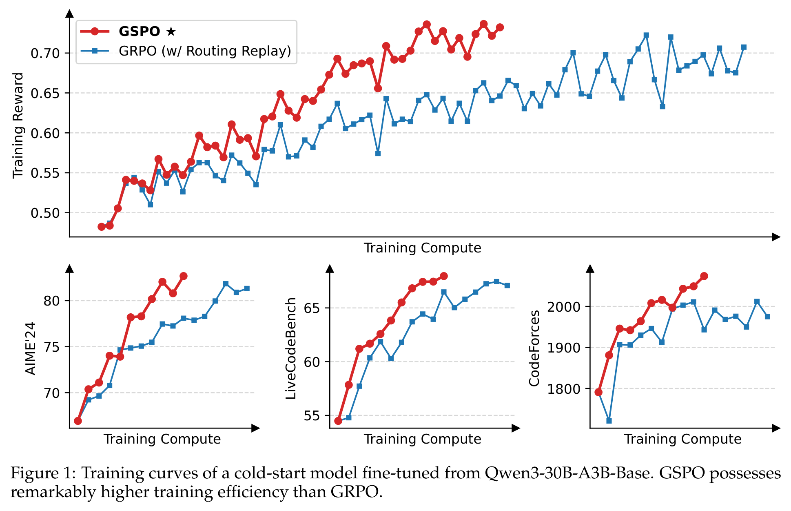
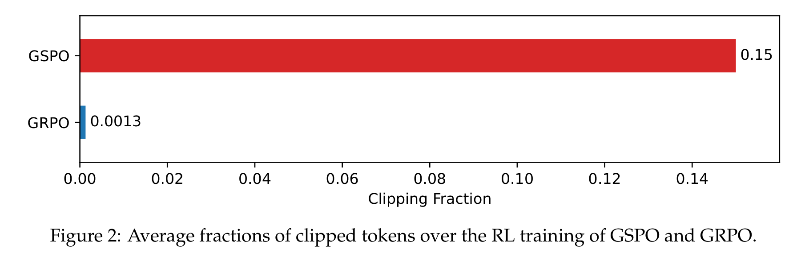
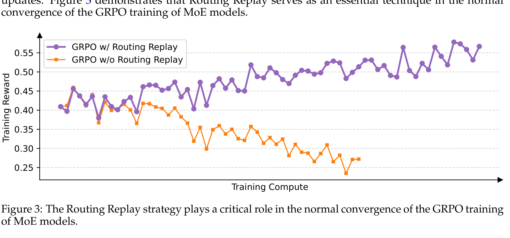

# Group Sequence Policy Optimization（GSPO）

## 来源

- 文件：`raw/Zheng 等 - 2025 - Group sequence policy optimization.pdf`
- 标题：Group Sequence Policy Optimization
- 团队 / 日期：Qwen Team, Alibaba Inc.；2025-07-29
- 定位：LLM RL policy optimization 方法论文；不是新模型报告。论文称 GSPO 已贡献于 latest Qwen3 models 的改进。

## 核心结论

1. **GSPO 的主张很直接**：GRPO 的 token-level importance ratio 用错了 importance sampling 的单位。reward 是 sequence-level，优化和 clipping 也应该按 sequence likelihood ratio 做，而不是逐 token 做（§3–§4.1）。
2. **sequence-level ratio**：GSPO 定义 $s_i(\theta) = (\pi_\theta(y_i|x) / \pi_{\theta_{old}}(y_i|x))^{1/|y_i|}$，即 token log-ratio 的几何平均；长度归一化让不同长度 response 的 ratio 落在统一数值范围（§4.1）。
3. **为什么比 GRPO 稳**：GRPO 中每个 token 按自己的 ratio 加权，长序列中噪声会累积，还会被 clipping 放大；GSPO 对同一 response 的所有 token 使用同一个 sequence-level weight，避免 token-level ratio 噪声主导梯度（§4.2）。
4. **MoE 是关键应用场景**：Qwen3-30B-A3B 这类 MoE 中，同一 rollout 样本在一次梯度更新后约 10% activated experts 会变化；这会让 GRPO token-level ratio 不稳定。以前要靠 Routing Replay 缓解；GSPO 不依赖 Routing Replay 也能稳定训练（§5.3、Figure 3）。
5. **基础设施影响**：因为 GSPO 只需要 sequence-level likelihood，对训练引擎/推理引擎之间的精度差更容忍，有机会直接使用 inference engine 返回的 likelihood，少做 training engine 重算，利于 training-inference disaggregated RL（§5.4）。

## 方法：把优化单元和 reward 单元对齐

GRPO 的目标按 token ratio 写：

$$
w_{i,t}(\theta)=\frac{\pi_\theta(y_{i,t}|x,y_{i,<t})}{\pi_{\theta_{old}}(y_{i,t}|x,y_{i,<t})}
$$

但 advantage $\hat A_i$ 来自整条 response reward 的 group-normalization，所有 token 共享同一个 sequence-level reward。GSPO 认为这里的 mismatch 是根因：token-level off-policy correction 并不对应 sequence-level reward。

GSPO 改用 sequence likelihood ratio：

$$
s_i(\theta)=\left[\frac{\pi_\theta(y_i|x)}{\pi_{\theta_{old}}(y_i|x)}\right]^{1/|y_i|}
=\exp\left(\frac{1}{|y_i|}\sum_t \log \frac{\pi_\theta(y_{i,t}|x,y_{i,<t})}{\pi_{\theta_{old}}(y_{i,t}|x,y_{i,<t})}\right)
$$

并在 response 级别做 clipped objective：

$$
J_{GSPO}=\mathbb{E}\left[\frac{1}{G}\sum_i \min(s_i\hat A_i,\ clip(s_i,1-\epsilon,1+\epsilon)\hat A_i)\right]
$$

这样 reward、importance ratio、clipping 和 optimization 的基本单位都变成 response / sequence。

## 实验信号

> 论文 Figure 1 原文标题："Training curves of a cold-start model fine-tuned from Qwen3-30B-A3B-Base. GSPO possesses remarkably higher training efficiency than GRPO."（§5.1）

实验设置（§5.1）：cold-start model fine-tuned from Qwen3-30B-A3B-Base；AIME'24 用 average Pass@1 over 32 samplings；LiveCodeBench 用 average Pass@1 over 8 samplings；CodeForces 用 Elo；每个 rollout batch 分成 4 个 mini-batches。GSPO clip range 量级很小：left/right clipping ranges 为 3e-4 / 4e-4；GRPO baseline 为 0.2 / 0.27。

一个反直觉观察：GSPO clip 掉的 token fraction 比 GRPO 大两个数量级，但训练效率反而更高。

> 论文 Figure 2 原文标题："Average fractions of clipped tokens over the RL training of GSPO and GRPO."（§5.2）

## MoE 稳定性：GSPO 替代 Routing Replay 的原因

MoE RL 里，old policy rollout 时激活的 experts 和当前 policy 训练时激活的 experts 可能不一致。论文给出 Qwen3-30B-A3B 例子：一次 gradient update 后，同一 rollout sample 在新旧 policy 下约 10% activated experts 不同。这会让 GRPO 的 token-level ratio $w_{i,t}$ 既反映 policy probability 变化，也混入 routing network 变化，ratio 大幅抖动。

之前 Qwen 的 workaround 是 Routing Replay：缓存 $\pi_{\theta_{old}}$ 的 activated experts，在 $\pi_\theta$ 计算 token ratio 时 replay 同样 routing mode，让新旧 ratio 用同一个 activated network。但这带来 memory / communication overhead，也限制 MoE 实际容量。

> 论文 Figure 3 原文标题："The Routing Replay strategy plays a critical role in the normal convergence of the GRPO training of MoE models."（§5.3）

GSPO 的核心 insight 是：MoE 即使单 token activated experts 有波动，整体 sequence likelihood 仍更稳定，因为模型总体 language modeling ability 没崩。因此 sequence-level ratio 对 expert-activation volatility 不敏感。

## GSPO-token：给多轮 RL 留的接口

论文也给出 GSPO-token 变体：数值上与 GSPO 等价，但写成 token-level objective，并用 stop-gradient 让每个 token 的数值 ratio 等于 sequence ratio。若所有 token advantage 都相同，GSPO-token 与 GSPO 目标、clipping condition、理论梯度一致；但它允许未来在 multi-turn RL 中做 token-wise advantage customization（§4.3）。

这对 [Agentic Reinforced Policy Optimization](agentic-reinforced-policy-optimization.md) 有潜在关系：ARPO 需要 shared / individual token advantage attribution；GSPO-token 说明 sequence-level ratio 并不必然排斥 finer-grained advantage，只是不能再回到 GRPO 式不稳定的 raw token ratio。

## 与其他页面的关系

- [LLM RL policy optimization 对比](../comparisons/llm-rl-policy-optimization.md)：GSPO 是「sequence-level importance sampling 派」，从理论上重写 GRPO 的 ratio / clipping 单元。
- [Soft Adaptive Policy Optimization](soft-adaptive-policy-optimization.md)：SAPO 继承 GSPO 的 sequence-coherence 目标，但认为 GSPO hard clipping 会整条 sequence 丢掉 near-on-policy token 的学习信号，因此改成 token-adaptive soft gate。
- [Qwen3 技术报告](qwen3.md)：本论文称 GSPO contributed to latest Qwen3 models，但不是 Qwen3 2025-05 技术报告正文的一部分；回写 Qwen3 页时需标作后续外部算法。

## 待追问

- GSPO clip range 量级（3e-4/4e-4）与 GRPO（0.2/0.27）差异很大；不同模型规模/任务是否需要重新标定？
- sequence-level ratio 在超长 response 上是否会掩盖局部坏 token 的 off-policy 问题？SAPO 正是沿这个方向批评并改造 GSPO。
- GSPO-token 在真正 multi-turn tool-use RL 里的 advantage 设计如何做？论文只说明形式可能，未给 agent 实验。
- 「GSPO contributed to latest Qwen3 models」具体对应 Qwen3 哪个版本/哪次后训练，论文没有细化。

## 相关页面

- 比较：[LLM RL policy optimization 对比](../comparisons/llm-rl-policy-optimization.md)
- 相邻算法：[DAPO](dapo.md)、[Soft Adaptive Policy Optimization](soft-adaptive-policy-optimization.md)、[Agentic Reinforced Policy Optimization](agentic-reinforced-policy-optimization.md)
- 模型/来源：[Qwen3 技术报告](qwen3.md)、[Qwen3-VL 技术报告](qwen3-vl.md)
