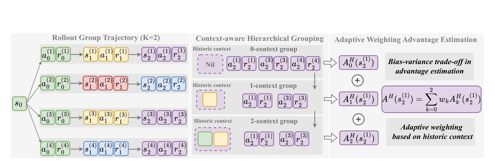

# Hierarchy-of-Groups Policy Optimization（HGPO）

## 来源

- 文件：`raw/2602.22817v1.pdf`
- 标题：Hierarchy-of-Groups Policy Optimization for Long-Horizon Agentic Tasks
- 团队 / 日期：Shuo He、Lang Feng、Qi Wei、Xin Cheng、Lei Feng、Bo An；Nanyang Technological University + Southeast University；arXiv:2602.22817v1，2026-02-26；ICLR 2026
- arXiv：<https://arxiv.org/abs/2602.22817>
- OpenReview：<https://openreview.net/forum?id=T8Dev99qnz>
- 代码：<https://github.com/langfengQ/verl-agent/tree/master/recipe/hgpo>
- 定位：面向长周期、稀疏终局奖励 LLM agent 的 critic-free group-based RL 算法论文，不发布独立模型。主实验是 Qwen2.5-1.5B/7B-Instruct 上的 ALFWorld 与 WebShop。

## 核心结论

1. **问题不是只看 state 是否相同**：在 step-wise agent RL 中，两个 step 即使当前环境状态相同，memory 中保留的近期交互也可能不同；若仍把它们放进同一组比较回报，实际是在不同 effective prompt 下估计同一个 relative advantage（§1、§4.1、Figure 1）。论文称此为 historical context inconsistency。
2. **HGPO 的解法**：先按当前 state 建 0-context group，再按最近 1 到 $K$ 个历史 state 的共同前缀建立逐层收缩的 group；每层各算 group-relative advantage，最后以偏向更长历史的权重聚合（§4.2、Eq. 3–7）。这不增加 rollout，也不需要 critic 或额外模型。
3. **它刻意不只用“Oracle”组**：完整历史也一致的组偏差最低，但在现有 rollout 中很少且规模小；HGPO 保留大而粗的低层组来压方差，并让高层组降低偏差（§1、§4.1、Proposition 4.1）。这是条件性的 bias–variance 分析，不是无条件收敛保证。
4. **实验证据有边界**：在同一 rollout、同一 actor 和相同 GPU memory 约束下，HGPO 在两套受控文字环境中整体优于 GRPO / GiGPO；但 7B 的少数单项仍低于 GiGPO，且没有开放网页、GUI、SWE 或非精确状态匹配实验（Table 1）。

## 方法：把“同 state”细分成一致程度不同的历史组

> Figure 3: Overview of HGPO. The LLM-based agent interacts with a set of environments initialized from the same state $s_0$, producing four group trajectories.（§4.2）

对同一任务初始化 $N$ 份相同环境，rollout 第 $i$ 条轨迹为 $\tau_i=\{(s_t^{(i)},a_t^{(i)})\}_{t=1}^{T}$。论文的 step-wise 框架不把整条历史都塞入训练 prompt，而是让 memory 只保存最近 $K\ll T$ 轮；这解决上下文长度膨胀，却引入“当前 state 相同但 memory 历史不同”的比较混杂（§3、§4.1）。

对一个 step，$k$-context operator 取当前 state 及此前最多 $k$ 个 state：

$$
C_k(s_t^{(i)})=(s_{t-k}^{(i)},\ldots,s_t^{(i)}),\qquad k\in[0,K].
$$

于是第 $k$ 层组是所有有相同 $C_k$ 的 step：

$$
G_k^H(s_t^{(i)})=\{(j,n):C_k(s_t^{(i)})=C_k(s_n^{(j)})\}.
$$

因此 $G_0^H\supseteq G_1^H\supseteq\cdots\supseteq G_K^H$：$k=0$ 正是 GiGPO 所用的同 state grouping；$k=K$ 最接近作者定义的 Oracle group。组越深，条件越接近有效 prompt，但样本越少（§4.2、Eq. 3–5）。实现只是对已收集 rollout 做离线 hashmap lookup。

对每一步先以终局奖励的折扣回报 $R_t^{(i)}=\sum_{j=t}^{T}\gamma^{j-t}r_j^{(i)}$ 作为 step reward；再在每层组内做均值中心化和标准差归一化得到 $A_k^H$。最终 advantage 是

$$
A^H(s_t^{(i)})=\sum_{k=0}^{K}w_kA_k^H(s_t^{(i)}),\qquad
w_k=\frac{(k+1)^\alpha}{\sum_{l=0}^{K}(l+1)^\alpha}.
$$

这里的“adaptive weighting”是**按历史深度的固定单调权重**，不是由每个样本不确定性学习出的权重；主实验设 $\alpha=1$，并跳过 zero-advantage group（§5.1、Eq. 7）。聚合后的 $A^H$ 再进入逐步 clipped importance-ratio surrogate 加 KL penalty（Eq. 8）；HGPO 改的是 advantage estimator，不改 GiGPO/GRPO 的逐步 ratio 单元。

### 理论主张的适用条件

Proposition 4.1 假定：历史越一致，单层 estimator bias 单调下降；组越小，variance 单调上升；不同层 estimator 之间 covariance 为零（Appendix B）。在这些条件下，加权估计的 bias 介于 0-context 和最深层 estimator 之间，variance 也被权重平方项约束。这解释了设计目标，但并未从环境动力学推出这些假设，也没有证明对真实 summary memory、随机网页或语义相近 state 仍成立。

## 实验信号

所有 group-based 方法使用 $N=8$，每个 rollout 16 组、共 128 个环境，成功奖励 10、失败 0、非法动作 −0.1，$\gamma=0.95$；ALFWorld 最多 50 步、WebShop 最多 30 步。1.5B 在 2×H100、7B 在 4×H100 上训练 160 iteration（§5.1、Appendix C.3）。表中是三种测试 seed 的均值和标准差。

| Backbone / memory $K$ | 指标 | GiGPO | HGPO | 读法 |
| --- | --- | ---: | ---: | --- |
| 1.5B / 2 | ALFWorld in / out success | 90.16 / 84.76 | **92.77 / 90.16** | 两项均升，OOD 差距更大 |
| 1.5B / 4 | WebShop score / success | 86.80 / 73.24 | **90.64 / 78.12** | 两项均升 |
| 7B / 2 | WebShop score / success | 88.93 / 77.60 | **88.96 / 78.51** | 增益较小 |
| 7B / 4 | ALFWorld in / out success | **95.63 / 95.18** | 95.96 / 94.87 | in 略升、OOD 略降 |

完整 Table 1 显示 HGPO 在 1.5B 的提升显著大于 7B；作者解释为小模型 rollout 更长、更冗余，因而 context inconsistency 的影响更大（§5.2）。这是一项论文解释，不是对模型规模的一般规律。$\alpha$ 消融也显示没有单一最优设置：$K=2$ 时 uniform 权重（$\alpha=0$）常更好，$K=4$ 时 $\alpha=1$ 更好，而 $α=2$ 又会因高层小组的方差变大而下降（Table 4、§5.4）。

计算上，作者只把 HGPO 新增工作计为 group hashing 与 advantage computation；ALFWorld / 1.5B 的 Table 3 中，HGPO 每 iteration 额外时间为 0.246–0.693 s，而共享 rollout、old/reference probability 和 update 为 282.5–297.8 s。因而能说其对**这套**训练配置的额外 wall-clock 很小；不能把该比例外推到长上下文、昂贵的 state canonicalization 或非确定性环境（§5.3、Table 3）。

## 与现有 wiki 页的关系

- [GiGPO](gigpo.md) 把当前环境 state 相同的 step 看成可免费对照的 anchor；HGPO 保留这一 rollout 预算和 critic-free 结构，但指出有限 history memory 下它们未必有相同 effective prompt。两篇论文没有同一份原始 GiGPO 实现的因果归因实验，HGPO 的“偏差”证据来自自己的 tracking 分析（Figure 2）。
- [ARPO](agentic-reinforced-policy-optimization.md) 通过在高熵工具步追加 partial rollout 改善 step signal；HGPO 不追加采样，而是在既有轨迹内换更严格的比较条件。两者理论上可组合，但没有同预算对照。
- [SAO](single-rollout-asynchronous-optimization.md) 取消 group sampling、以 critic 补回 baseline；HGPO 则依赖一组相同初始状态的 rollout，属于同步 group-based 分支。
- [LLM RL policy optimization 对比](../comparisons/llm-rl-policy-optimization.md) 将它归为 advantage 构造层：不是新 ratio、clip 或 reward，而是 history-aware 的 step-group baseline。

## 待追问

- 论文用 raw、可分解的历史 state 建 $C_k$；若 memory 是摘要、检索片段或隐状态，什么才是“历史一致”？作者仅在结论提出 embedding similarity 作为未来方向。
- $G_K^H$ 被视为最接近 Oracle 的组，但相同最近 $K$ 个 state 是否已足以让 action prompt 相同，取决于 task description、action history、system prompt 与 memory 实现。
- Proposition 4.1 的零 covariance、bias 单调和 variance 单调假设没有在实验中逐项检验；学得的 uncertainty weight 能否优于固定 $\alpha$ 仍是开放问题。
- 仅在 ALFWorld / WebShop 与 Qwen2.5-1.5B/7B 验证。开放浏览、GUI、SWE 和随机工具环境里，state equality / state canonicalization 的成本与错误配对风险仍未知。

## 相关页面

- 概念：[Hierarchy-of-Groups Policy Optimization](../concepts/hierarchy-of-groups-policy-optimization.md)、[Group-in-Group Policy Optimization](../concepts/group-in-group-policy-optimization.md)、[Agentic 模型的后训练](../concepts/post-training-for-agentic-models.md)
- 相邻算法：[GiGPO](gigpo.md)、[Agentic Reinforced Policy Optimization](agentic-reinforced-policy-optimization.md)、[Single-Rollout Asynchronous Optimization](single-rollout-asynchronous-optimization.md)、[DAPO](dapo.md)
- 比较：[LLM RL policy optimization 对比](../comparisons/llm-rl-policy-optimization.md)
