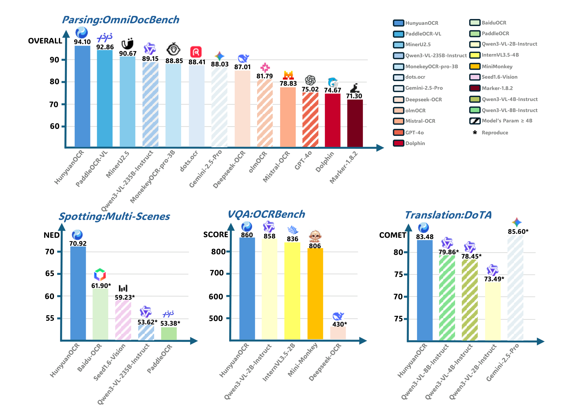
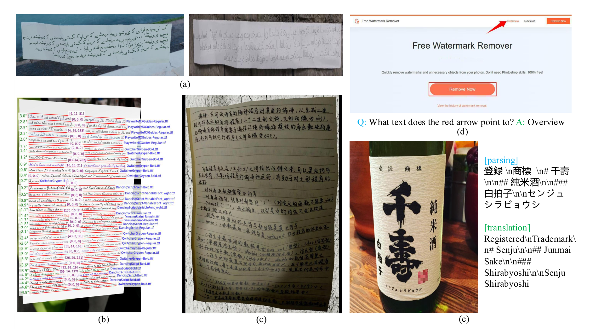

# HunyuanOCR 1.0

## 来源

- PDF：`raw/2511.19575v2.pdf`（36 页，含附录）
- arXiv：[2511.19575](https://arxiv.org/abs/2511.19575)（v2，2025-12-11）
- 团队：Tencent Hunyuan Vision Team（Project Leader: Chengquan Zhang；Core: Pengyuan Lyu、Xingyu Wan、Gengluo Li、Shangpin Peng）
- 模型：[HunyuanOCR-1.0](../models/hunyuan-ocr-1.0.md)
- 后作：[HunyuanOCR-1.5](hunyuan-ocr-1.5.md)（arXiv:2607.04884）沿用本架构，不重设计
- 开源：[HuggingFace](https://huggingface.co/tencent/HunyuanOCR) / [GitHub](https://github.com/Tencent-Hunyuan/HunyuanOCR)；提供 vLLM 部署

原文标题只写 HunyuanOCR。本库用 **1.0** 与后作区分，不覆盖 `hunyuan-ocr-1.5`。

## 核心结论

HunyuanOCR 是面向 OCR 的商业级开源轻量 VLM（约 1B）：原生分辨率 ViT + MLP adapter + 轻量 LLM，把 spotting / parsing / IE / VQA / 图像翻译收进一次推理，去掉布局分析等前置模块。

三点主张（原文确证，§1、Abstract）：

1. **全能与轻量同框**：同一 1B 模型覆盖感知（spotting、parsing）与语义（IE、VQA、翻译），对照「窄专家模型」和「过大的通用 VLM」。
2. **纯端到端**：训练和推理都不依赖 layout 级联，消除 pipeline 误差放大。
3. **数据 + RL**：约 2 亿图文对；行业内首次把 RL 写成 OCR 任务上的显著增益（附录 C.3：parsing OmniDocBench 92.5→94.1）。

> Figure 1: Performance comparison of HunyuanOCR and other SOTA models.（首页）

读这张图时须钉版本：94.10 跟的是 Ouyang et al. (2024) 官方协议，附录 D 把同一套基准写成 OmniDocBench **1.5**。后作 1.5 自报本模型 v1.6 = 92.03；[MinerU2.5-Pro](mineru-2-5-pro.md) 统一重测 v1.6 Full = 89.87。三套数不可混用。

## 架构与训练

### 模型架构

> Figure 2: The Architecture of HunyuanOCR: An end-to-end framework integrating Native Resolution Visual Encoder, Adaptive MLP Connector, and a Lightweight Language Model for diverse OCR tasks.（§ 3 Model Design）

三模块（原文确证，§3）：

- **Hunyuan-ViT（约 0.4B）**：建在 SigLIP-v2-400M 上，混合生成–判别联合训练。按原图宽高比分 patch，ViT 全局注意力，避免拉伸。面向长文档、低质量扫描。
- **Adaptive MLP Connector**：可学习 pooling，在空间维压缩高分辨率特征，保留文字密集区。
- **Hunyuan-0.5B**：稠密 LLM，带 **XD-RoPE**：把常规 RoPE 拆成 text / height / width / time 四个子空间，对齐 1D 文本、2D 版面和 3D 时空。本报告用它做多栏与跨页；原生视频编码不是本页任务。

后作 [HunyuanOCR-1.5](hunyuan-ocr-1.5.md) 写本模型视觉上限 2K、上下文 32K，1.5 升到 4K / 128K。2K 上限是 1.5 的转述，本 PDF 未写死最大边长。

### 任务与输出格式

统一指令模板（附录 Table 7 建议用中文指令做评测）：

| 任务 | 输出约定 |
| --- | --- |
| Spotting | `<ref>text</ref><quad>(x1,y1),(x2,y2)</quad>`，坐标归一化到 [0, 1000] |
| 元素解析 | 公式 → LaTeX；表 → HTML；图 → Mermaid 或 Markdown |
| 整页解析 | 正文 Markdown，表 HTML，公式 LaTeX，按阅读序；忽略页眉页脚 |
| IE | 单字段或 JSON 多字段；另有视频截图字幕 |
| 翻译 | 14+ 源语言 → 中/英；文档向与场景向两套 prompt |

IE 覆盖 30 类卡证/票据（附录 Table 8）。翻译能力受 0.5B 语言模型限制；作者建议高要求场景级联 Hunyuan-MT-7B（§6.4）。

### 数据

约 **2 亿**图文对，九类场景（街景、文档、广告、手写、截图、卡证票据、游戏界面、视频帧、艺术字），**130+** 语言（§4.2）。

> Figure 3: Illustration of image data synthesis and data augmentation results for the HunyuanOCR data pipeline.（§ 4.2 Data Pipelines）

三条管线：扩展 SynthDog 做 130+ 语段落渲染（LTR/RTL、连写）；自研 Warping 模拟折痕/运动模糊/光照；Hard Sample Retrieval → VLM 造 QA → 多模型交叉验证。

### 四阶段预训练（Table 2）

| 阶段 | 目的 | 可训练 | 学习率 | tokens | 序列长 | 数据 |
| --- | --- | --- | --- | --- | --- | --- |
| Stage-1 | 视觉–语言对齐 | ViT + Adapter（LLM 冻结） | 3e-4 → 3e-5 | 50B | 8k | caption + 合成 OCR，纯文本 ≤10% |
| Stage-2 | 多模态预训练 | 全参 | 2e-4 → 5e-5 | 300B | 8k | spotting/parsing/翻译/VQA 合成 |
| Stage-3 | 长上下文 | 全参 | 8e-5 → 5e-6 | 80B | 32k | 长文 + 实拍自动标注 + 长文档 + IE |
| Stage-4 | 应用向 SFT | 全参 | 2e-5 → 1e-6 | 24B | 32k | 人工标注 + hard-negative + 统一指令 |

合计约 454B tokens。Stage-4 统一指令与输出格式，给后续 RL 的 schema 惩罚打底。[HunyuanOCR-1.5](hunyuan-ocr-1.5.md) 复用前两阶段，只重规划 Stage3。

## 后训练

GRPO（DeepSeekMath 式组内相对优势 + clip + KL 项写在 Eq. 1），**无显式 KL 系数**（附录 Table 9：`KL loss coefficient = 0`）。N=8、温度 0.85、top-p 0.95、top-k 50；actor LR 8e-7、Adam、constant、global batch 512、max prompt 6144 / max response 16384。超长或 schema 不合直接 reward=0。

任务自适应 reward（§5.2.2）：

- **Spotting**：IoU 最大匹配后，reward = 1 − 归一化 edit distance；未匹配框记 0。
- **Parsing**：整页与参考的归一化 edit distance。
- **VQA**：LLM-as-judge 二值，只看内容对错。
- **翻译**：judge 打 [0, 5]，debiased 映到 [0, 1]，拉大 2–4 分中段分辨率。

数据侧：LLM 过滤可刷题样本、丢低多样性/零方差、按 pass-rate 去掉过易和不可解。

附录 C.3：RL 后 spotting 在 Art/Screen 各涨 2+ 分；parsing OmniDocBench **92.5→94.1**；IE 约 +2；OCRBench 平均 +3.3。这是后作 IcePop 之前、本系列的 GRPO 配方。

## 评测要点

### OmniDocBench（Table 4，Ouyang 2024 协议 = v1.5）

| 模型 | 类型 | 参数 | OmniDocBench Overall↑ | Wild-OmniDocBench Overall↑ | DocML |
| --- | --- | --- | ---: | ---: | ---: |
| Gemini-2.5-Pro | 通用 VLM | — | 88.03 | 80.59 | 82.64 |
| Qwen3-VL-235B | 通用 VLM | 235B | 89.15 | 79.69 | 81.40 |
| MinerU2.5 | 模块化 | 1.2B | 90.67 | 70.91 | 52.05 |
| PaddleOCR-VL | 模块化 | 0.9B | 92.86 | 72.19 | 57.42 |
| dots.ocr | 端到端 | 3B | 88.41 | 78.01 | 77.50 |
| DeepSeek-OCR | 端到端 | 3B | 87.01 | 74.23 | 57.22 |
| **HunyuanOCR** | 端到端 | **1B** | **94.10** | **85.21** | **91.03** |

Wild-OmniDocBench：把原页打印再折、弯、变光照后重拍。DocML：14 种非中英高频语言，内部集。元素裁块（附录 Table 10，OmniDocBench 1.5）：Table overall TEDS 0.9574、Formula overall CDM 0.9695。

### 其他

- **Spotting**（自建 9×100=900 图，Table 3）：Overall 70.92，超 BaiduOCR 61.90、Seed-1.6-Vision 59.23、PaddleOCR 53.38。Gemini-2.5-Pro 仅 23.44（通用 VLM 不擅长坐标格式）。
- **IE / 字幕**（Table 5）：卡证 92.29、票据 92.53、视频字幕 92.87，大幅超过 Gemini-2.5-Pro（80.59 / 80.66 / 53.65）。
- **OCRBench**：860。Abstract 写的是 **<3B VLM SOTA**（对照 Qwen3-VL-2B 858、DeepSeek-OCR 430）；Seed-1.6-Vision 881、Qwen3-VL-235B 920 更大。
- **翻译**（Table 6，COMET）：DoTA en2zh 83.48，超 Qwen3-VL-8B 79.86，低于 Gemini-2.5-Flash 85.60。ICDAR 2025 DIMT Track 2.2 OCR-free Small Model 第一。

### 跨源分数（原文确证 + 后作/统一重测）

| 口径 | 分数 | 来源 |
| --- | ---: | --- |
| OmniDocBench（Ouyang 2024 / v1.5） | **94.10** | 本报告 Table 4 |
| OmniDocBench v1.6 自报 | 92.03 | [HunyuanOCR-1.5](hunyuan-ocr-1.5.md) 对照表 |
| OmniDocBench v1.6 Full 统一重测 | 89.87 | [MinerU2.5-Pro](mineru-2-5-pro.md) Table 2 |

v1.5→v1.6 自报掉 2.07；同属 v1.6 的自报与 MinerU 统一重测再差 2.16。MGAM 通常提分，这里统一重测更低，差异主要不像单纯粒度修正。

## 待追问

- 本 PDF 未写死视觉最大边长；1.5 说 1.0 是 2K。checkpoint 配置是否坐实 2K，本页不能升级为原文确证。
- XD-RoPE 的 time 子空间在 1.0 任务里实际用了多少？字幕抽取是视频截图，不是原生视频流。
- GRPO Eq. 1 写了 KL 项，附录 Table 9 却是 `KL loss coefficient = 0`。β 是否始终为 0，还是公式抄了 DeepSeekMath 通式。
- Wild-OmniDocBench / DocML 当时写「将公开」；本页未核是否已放。
- 94.10 vs 92.03 vs 89.87：v1.5 / v1.6 自报已经对上版本；**92.03 vs 89.87 仍未在任一报告里归因**。

## 相关页面

- 模型：[HunyuanOCR-1.0](../models/hunyuan-ocr-1.0.md)
- 后作：[HunyuanOCR-1.5](hunyuan-ocr-1.5.md)（同架构；DFlash + Agentic Data Flow + IcePop）
- 同代轻量 OCR：[MinerU2.5](mineru-2-5.md)、[MinerU2.5-Pro](mineru-2-5-pro.md)（1.0 的 v1.6 统一重测）、[GLM-OCR](glm-ocr.md)（v1.5 上 94.62 vs 本页 94.10）、[Unlimited OCR](unlimited-ocr.md)
- RL：[DeepSeekMath](deepseekmath.md)（GRPO）、[Ring-1T](ring-1t.md)（后作改用 IcePop）
- 评测版本：[Agentic 评测体系](../concepts/agentic-evaluation-benchmarks.md)
