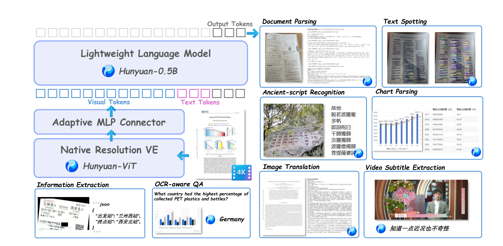
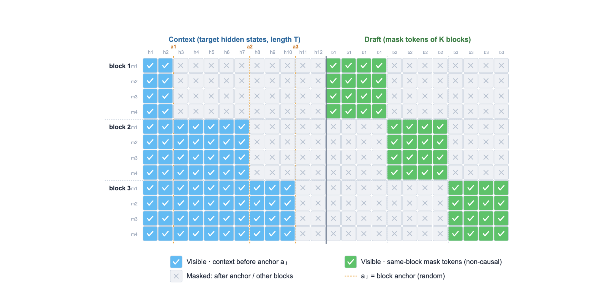
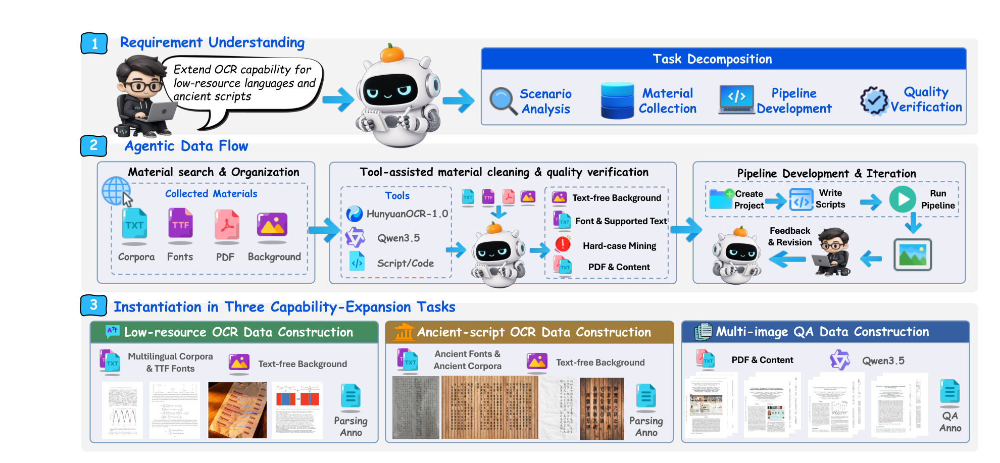

# HunyuanOCR-1.5

## 来源

- PDF：`raw/2607.04884v1.pdf`（26 页）
- arXiv：[2607.04884](https://arxiv.org/abs/2607.04884)
- 团队：中科院信工所 + 腾讯（大语言模型部）+ 南开大学
- 模型：[HunyuanOCR-1.5](../models/hunyuan-ocr-1.5.md)
- 日期：2026-07-07

## 核心结论

HunyuanOCR-1.5 不重新设计 HunyuanOCR-1.0 的架构，而是围绕「更快」和「更好」两个目标做系统升级：

1. **更快——DFlash 推测解码**：把 block-diffusion draft model 适配到 OCR 解码，在保持输出分布不变的前提下，Transformers 推理 6.37× 加速、vLLM 2.14× 加速，是所有轻量 OCR VLM 中最快的。
2. **更好——Agentic Data Flow**：agent 驱动的数据构造系统，把模型弱点转化为可执行数据需求，自主完成物料搜索、质量验证和 pipeline 开发，系统提升古文字 OCR、低资源多语言、多图 QA 等长尾能力。
3. **评测**：OmniDocBench v1.6 总分 94.74（1B 模型 SOTA），CHAOS-Bench 文档幻觉 recall 14.15（远超其他 OCR 模型的 3–6），Chronicles-OCR 古文字 0.54/0.79（1B 内 SOTA，碾压 3B 级 expert OCR）。

## 架构与训练

### 模型架构

> Figure 1: Overview of the HunyuanOCR-1.5 architecture.（§ 3.1 Model Architecture）

架构沿用 HunyuanOCR-1.0 的紧凑端到端设计：原生分辨率视觉编码器（Hunyuan-ViT）+ Adaptive MLP Connector + 轻量 LLM（Hunyuan-0.5B + XD-RoPE）。唯一的 backbone 升级是视觉编码器最大分辨率从 2K 扩展到 4K，使模型能保留原生宽高比和空间布局，处理高密度文档、超大表格和复杂图表。

### DFlash 推测解码

DFlash 是一种基于 block-diffusion 的推测解码框架：轻量 draft model 并行生成一个 token block，target model 一次性验证。核心思路是利用单请求或低并发场景下 AR 解码的 memory-bandwidth bottleneck——大量算力闲置，DFlash 用这些闲置算力并行 draft，减少 AR 步数。

> Figure 2: Overview of DFlash training with a joint FlexAttention mask.（§ 3.2 Multi-token Prediction）

训练时 target model 冻结，只训练 DFlash draft model。用 block-diagonal FlexAttention mask 实现一次 forward 同时训练 K 个 block：每个 block 可 attend 到自己 anchor 之前的 target hidden states 和同 block 内的 mask tokens（non-causal），不同 block 间隔离。损失为 position-weighted next-token cross-entropy，指数衰减权重降低远位置（更难预测）的损失权重：

$$w_k^{(j)} = \mathbb{I}[k > 0] \cdot \mathbb{I}[\text{valid}] \cdot \exp(-\max(k-1, 0)/\gamma)$$

Draft model 配置：~90.7M 参数，block size B=16，n=16 anchors/sequence，γ=7.0，5 层 Transformer，从 target model 最后 5 层初始化。

加速效果：

| 框架 | AR 延迟 (s) | DFlash 延迟 (s) | 加速比 | 有效接受长度 |
| --- | --- | --- | --- | --- |
| Transformers | 34.85 | 5.47 | 6.37× | 8.89 |
| vLLM | 3.03 | 1.41 | 2.14× | 8.36 |

输出越长加速越明显（vLLM：0–256 token 1.31× → 2048+ token 2.30×），表格类输出加速最大（vLLM table 2.39× vs text 1.81×），因为结构化输出的局部规律性强、draft 接受率更高。DFlash 还通过 llama.cpp 支持 PC 端部署。

### Agentic Data Flow

> Figure 3: Overview of Agentic Data Flow.（§ 4 Agentic Data Flow）

Agentic Data Flow 不是简单扩大数据量，而是面向模型弱点的数据构造系统。算法工程师用自然语言描述目标能力需求（如「为低资源语言构造合成 OCR 数据」），agent 自主分解任务、确定所需物料和工具调用、开发数据 pipeline，并在生产过程中与算法工程师持续交互迭代。

Agent 配备的工具：web search、OCR 服务、VLM 服务、文件处理脚本、图像清洗工具、数据生成工具。物料准备阶段 agent 自动测试字体渲染兼容性、维护语言-字体-支持词汇映射、对候选图批量跑 HunyuanOCR-1.0 挖掘 hard case。Pipeline 开发阶段 agent 创建项目、写渲染/QA 生成脚本、支持多种布局/增强/输出格式，根据反馈多轮修订。

三个实例化：

- **低资源 OCR**：自动收集多语语料和 TTF 字体，基于 SynthText/SynthDoG 思想开发多语言合成 pipeline，覆盖 331 种语言。
- **古文字 OCR**：聚焦汉字七种历史形态，用古字体 + 古语料 + 无文字背景合成。
- **多图 QA**：用 PDF + 内容 + Qwen3.5 做解析和 QA 标注。

### 训练流程

预训练复用 HunyuanOCR-1.0 前两阶段，只重规划 Stage3：注入 Agentic Data Flow 产出的能力扩展数据 + 多图理解数据 + 历史 OCR 数据，同时把最大分辨率提升到 4K、上下文窗口扩展到 128K。

SFT 阶段建立干净、高度结构化的基础：精炼训练数据、统一 prompt 接口。

RL 阶段使用 IcePop（GRPO 变体）+ 三组件 reward 系统：

![RL 框架总览：三组件 reward 系统协同优化 OCR 模型。左：文档解析事实性 reward（plain text edit distance + table/chart element-specific）；中：QA 一致性判官 reward（LLM-as-judge，VQA 二值、翻译软分 [0,5]）；右：退化抑制 reward（overlong penalty + repeated fragment penalty）。](../assets/hunyuan-ocr-1.5/fig4-rl-framework.png)

> Figure 4: Overview of the RL framework.（§ 5.3 Reinforcement Learning）

1. **文档解析事实性 reward**：把输出拆为 plain text + special elements（table/chart），plain text 用归一化 edit distance，table 用改进的 TEDS（解决结构黑盒和字符级 edit distance 不准的问题），chart 用 element-specific 评分。
2. **QA 一致性判官 reward**：LLM-as-judge 验证模型回答与参考的语义一致性。VQA 为二值（0/1），翻译为软分 [0, 5] 并做 debiased mapping 扩展中段分辨率。
3. **退化抑制 reward**：overlong output penalty（超长直接 reward=0）+ repeated fragment penalty（检测连续重复模式，reward=0），抑制 OCR 长输出的退化。

IcePop 的关键是 train-inference ratio mask：用 $c_{i,t} = \pi_{\text{train}} / \pi_{\text{infer}}$ 的比值落在 $[\alpha_m, \beta_m]$ 区间内的 token 才参与更新，区间外的 token $s_{i,t}=0$ 不贡献梯度。

## 评测要点

OmniDocBench v1.6（端到端文档解析）总分 94.74，是 1B 级模型 SOTA，超过多数 3B–4B 级 expert OCR 和通用 VLM：

| 模型 | 类型 | 参数量 | OmniDocBench v1.6 |
| --- | --- | --- | --- |
| dots.ocr | End-to-end | 3B | 90.77 |
| Unlimited-OCR | End-to-end | 3B-A0.5B | 93.92 |
| HunyuanOCR-1.0 | End-to-end | 1B | 92.03 |
| HunyuanOCR-1.5 | End-to-end | 1B | **94.74** |

长尾能力亮点：

- **Chronicles-OCR（古文字）**：archaic 0.54 / mature 0.79，1B 模型 SOTA，远超 3B 级 expert OCR（dots.ocr 0.05/0.47，DeepSeek-OCR 0.01/0.24），甚至超过 GPT-5（0.06/0.41）和 Gemini 3.1 Pro（0.18/0.68）。
- **CHAOS-Bench（文档幻觉）**：page-avg recall 14.15，远超其他 OCR 模型（3–6），验证退化抑制 reward 的效果。
- **MORE（低资源多语言）**：overall 91.90（1B），超越 PaddleOCR-VL-1.6（89.88/0.9B）和多数 3B 级模型。
- **TableVerse-5K**：TEDS 78.23 / TEDS-S 84.84。

推理速度：DFlash 在 vLLM 下 1.408s/page（0.706 page/s），比 dots.ocr 快 5.08×、比 DeepSeek-OCR 2 快 3.88×、比 Unlimited-OCR 快 2.60×。

## 待追问

- DFlash 的 draft model（90.7M / 5 层）在高并发下是否有 DSpark 论文指出的静态多 token drafter 吞吐反噬问题？报告只给了 c=1 到 c=32 的数据，c=32 时加速比已从 2.14× 降到 1.80×。
- Agentic Data Flow 的 agent 具体用什么模型驱动？报告提到 Qwen3.5 参与标注，但 agent 本身的 backbone 未明确。
- IcePop 的 train-inference ratio mask 与 GLM-5 的 token-level clipping、GSPO 的 sequence-level ratio 之间是什么关系？三者都在 GRPO 框架上改 ratio/clipping 粒度。

## 相关页面

- [HunyuanOCR-1.5](../models/hunyuan-ocr-1.5.md) - 模型身份页
- [Unlimited OCR Works](unlimited-ocr.md) - 同属 OCR VLM 家族，走恒定 KV cache attention 路线（R-SWA）而非推测解码
- [多 Token 预测](multi-token-prediction.md) - DFlash 作为 block-diffusion 推测解码变体
- [Agentic Engineering](agentic-engineering.md) - Agentic Data Flow 作为 agent 驱动自动化的一个实例
