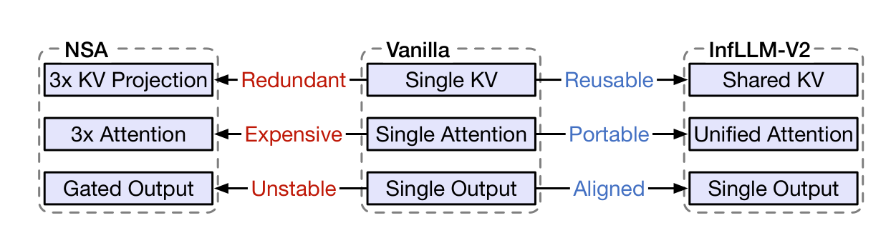
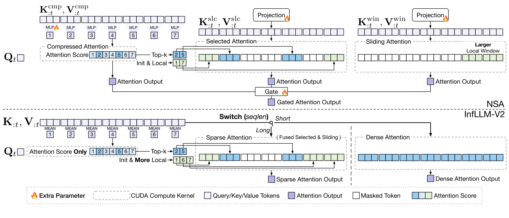
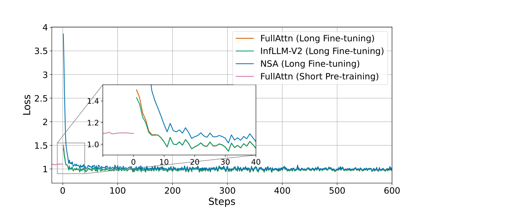

# InfLLM-V2

## 来源

- 文件：`raw/2509.24663v1.pdf`
- 标题：InfLLM-V2: Dense-Sparse Switchable Attention for Seamless Short-to-Long Adaptation
- 团队 / 日期：Weilin Zhao（清华）、Zihan Zhou / Zhou Su 等（OpenBMB）；通讯 Chaojun Xiao、Xu Han、Zhiyuan Liu；arXiv:2509.24663v1，2025-09-29（预印本，Under review）
- 权重：[openbmb/MiniCPM4.1-8B](https://huggingface.co/openbmb/MiniCPM4.1-8B)；kernel：[OpenBMB/infllmv2_cuda_impl](https://github.com/OpenBMB/infllmv2_cuda_impl)
- 定位：**方法论文**。在 GQA 上做可训练块稀疏，目标是「短序列 dense 预训练 → 长序列稀疏微调」这条常规流程，而不是 NSA 那种从头稀疏。对照表见 [稀疏注意力机制对比](../comparisons/sparse-attention-mechanisms.md)。

模型页：[MiniCPM4.1](../models/minicpm-4.1.md)。不要和 [MiniCPM-o 4.5](../models/minicpm-o-4-5.md) 混。

## 核心结论

1. **NSA 的三套 KV 对短→长不友好。** [NSA](nsa.md) 三支独立投影 + 三路注意力 + 门控，从单输出 dense 切过去会破坏已学表示，短序列还要跑三路（§1、Figure 1）。作者用同一 8B dense 检查点做长微调时，NSA 的 loss 先炸再慢慢掉，InfLLM-V2 贴着 FullAttn（Figure 5）。这是 **short-to-long 设定**下的对照，不能用来否定 NSA 原文的从头稀疏预训练。
2. **零额外注意力参数。** 共用预训练的 $W_K,W_V$；压缩支路改成无参 pooling，只产出块分 $S^{\mathrm{cmp}}$，不进输出；Selected 与 Sliding 并成一路 Sparse Attention，按序列长度切回 Dense（§3.2、Figure 2）。
3. **不是 2024 InfLLM。** InfLLM（Xiao et al., 2024a）是训练后、training-free 的 context memory，本页 Table 1 里 INFLLM 一行平均 27.94。InfLLM-V2 是可训练、可切换的块稀疏。比较页旧行「零样本无参 dense→sparse」应作废。
4. **8B、5B 长文本 token。** 先 8T / 4k dense 预训练，再 5B token 适应到 32k（四档长度 1:1:1:1）。RULER-32k 稀疏 82.62 vs FullAttn 84.26（约 98.1%）；长推理平均 42.66 vs 42.79（约 99.7%）（Table 1、Table 3、摘要）。端到端 4090 上 prefill 2.13×、decode 2.32×（可见 token 6k，W4A16，Figure 7）。

> Figure 1（原文截图，§1）："The comparison of Vanilla Full Attention, NSA (Yuan et al., 2025), and our InfLLM-V2."

## 机制（已据原文核实）

底座是 GQA（§3.1）。Sparse Attention 对 query $i$ 的可见块是

$$
I(i)=I_{\mathrm{init}}\cup I_{\mathrm{local}}(i)\cup I_{\mathrm{topk}}(i),
$$

固定初始块 + 扩大后的局部块（覆盖原 Sliding 窗，$N_{\mathrm{local}}\ge\lceil w/B\rceil+1$）+ 压缩分数 top-k（Eq. 2–3、Figure 3）。实验 $|I|=96$（1 init + 63 top-k + 32 local），$B=64$，可见 token $96\times 64=6\mathrm{k}$（§4.1）。

压缩不再用 NSA 的 MLP（去掉压缩输出后 MLP 无梯度），改 **3 段 pooling**（§3.3、Figure 4）：mean-pool 得 $K^{C1}$（$l_{C1}=B/2=32$，$s_{C1}=B/4=16$）→ 与 $Q$ 打分 → GQA 组内求和成共享分 → max-pool 得到块分 $S^{\mathrm{cmp}}$。组内共享选块，不是每 head 独立 indexer。

块选择的 I/O 是瓶颈。作者把组内求和熔进 FlashAttention 式 SRAM 循环，并用更粗的 $K^{C2}$ 近似 softmax 的 lse，把两遍计算从 2× 降到约 1.25×（Algorithm 1、§3.4）。消融：带 LSE 近似的选择核在 A100 128k 上 56.59 ms vs 不近似 75.36 ms，RULER 平均 82.62 vs 82.09（Table 5、Table 1）。

短序列按长度开关切回同一套参数的 dense attention，所以短任务不必走稀疏（§3.2、Table 4）。

> Figure 2（原文截图，§3.1–3.2）："The overview of NSA and InfLLM-V2. InfLLM-V2 uses a shared KV for both Sparse Attention and Dense Attention. InfLLM-V2 fuses Selected Attention and Sliding Attention and eliminates the output of Compressed Attention. InfLLM-V2 introduces no extra parameters."

## 评测要点

8B GQA：$d=4096$，$h_q=32$，$h_{kv}=2$，$d_h=128$。短预训练 8T token、4k、batch 8M，WSD 学习率（§4.1）。NSA 对照用开源 Triton 实现，三套 KV 从 dense 复制初始化（脚注 2）。

> Figure 5（原文截图，§4）："The training loss of models. We only show the last few iterations of the short pretraining."

Table 1 RULER-32k 平均：FullAttn **84.26**；InfLLM-V2 Sparse **82.62**；InfLLM-V2 Dense 88.32；NSA 59.92；MInference 73.22；InfLLM（training-free）27.94；SHORT+YaRN 40.63。

Table 2：LongBench Sparse 42.54 vs Full 42.30；LongPPL 2.12 vs 2.06。NSA LongPPL 4.24。

Table 3 长推理（MATH-500 / AIME 24/25 / LCB v5/v6 平均）：Full 42.79，Sparse **42.66**，NSA 37.28。Sparse 在 MATH-500 / AIME 24 上高于 Full。

Table 4 短任务：Dense 模式平均 66.76 vs FullAttn 67.41 vs SHORT 67.73；NSA 60.63。切回 dense 不崩。

Kernel（Figure 6，$|I|=16$）：相对 FlashAttention-2，A100 128k 最高 7.4×，4090 9.3×；NSA 同设定约 3.5×。摘要「4× faster」是相对 dense 的整体陈述，不是 Figure 6 某一根柱。

## 与已有沉淀的关系

- **相对 [NSA](nsa.md)**：同是块稀疏 + 压缩分选题。NSA 三支独立 K/V、压缩支路有输出、从头稀疏 + LM loss。InfLLM-V2 共享 KV、压缩只打分、短→长 5B。作者的 NSA 数字是 **同一 8B 短检查点上的适应**，和 NSA 原文 27B 从头训不是同一协议。
- **相对 [MoBA](moba.md)**：related work 把 MoBA / SeerAttention 写成 query 分块、主要加速 prefill（§2.2）。InfLLM-V2 做 token 级可见块，声称 prefill 和 decode 都加速。MoBA 无额外 indexer 参数；InfLLM-V2 也无新投影，但有 pooling 选择器。
- **相对 [DSA](../concepts/deepseek-sparse-attention.md)**：DSA 有独立 lightning indexer 和 KL。InfLLM-V2 没有独立 indexer 参数、没有 KL，选择分来自 pooled key。
- 比较页旧「InfLLM-V2 零样本无参」来自 NSA ingest 时的二手行，**已被本页推翻**：需要 5B 长微调，架构修改无参不等于训练免费。

## 证据边界与阅读提示

- NSA 对照是第三方 Triton，不是 DeepSeek 原文 kernel；速度与质量两边都可能吃亏。
- 跨层是否复用 $I(i)$：每层独立，没有 IndexCache 实验。

## 待追问

- **需补外部来源**：MiniCPM4.1-8B 与 §4 这只 8B GQA 是否同一检查点？原文只说「based on the InfLLM-V2 framework」开源了 MiniCPM4.1。
- **需实验或作者披露**：没有 RL / agentic 稳定性。top-k 是否非确定，本页没写。

## 相关页面

- 模型：[MiniCPM4.1](../models/minicpm-4.1.md)
- 对比：[稀疏注意力机制对比](../comparisons/sparse-attention-mechanisms.md)
- 概念：[高效长上下文注意力](../concepts/efficient-long-context-attention.md)、[DeepSeek Sparse Attention](../concepts/deepseek-sparse-attention.md)
- 前作与对照：[NSA](nsa.md)（三分支，不是本页）、[MoBA](moba.md)、[MSA](msa.md)
- 不要混淆：[MiniCPM-o 4.5](minicpm-o-4-5.md)（全模态交互，不是 InfLLM-V2）
