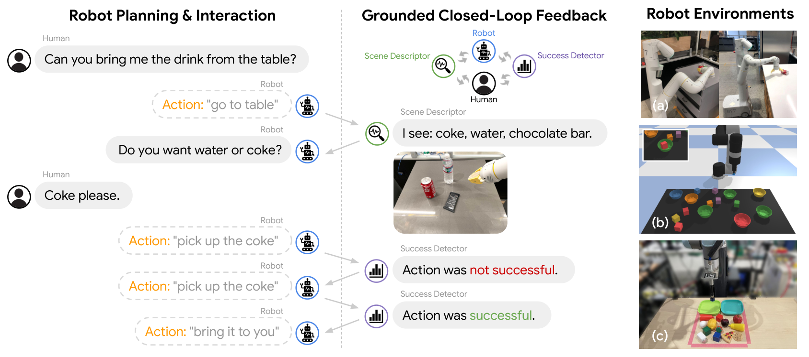
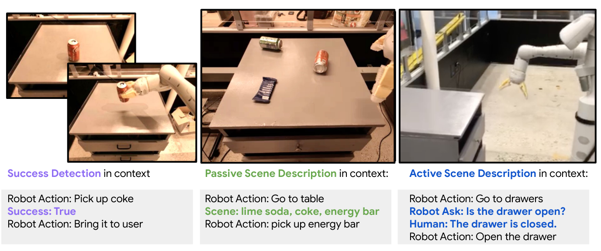
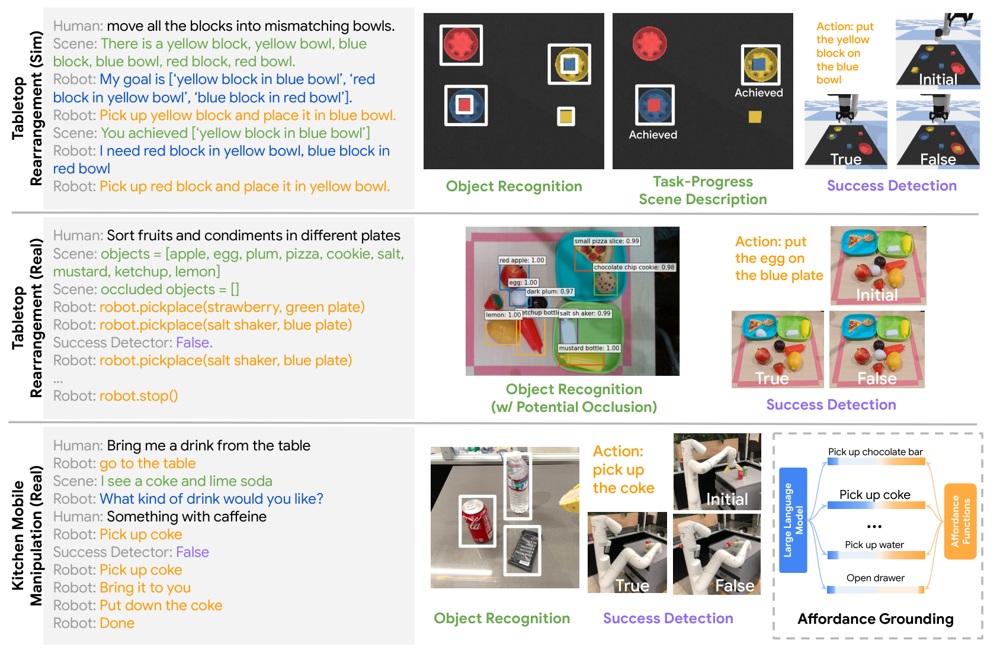

# Inner Monologue

## 来源

- 文件：`raw/2207.05608v1.pdf`
- 标题：Inner Monologue: Embodied Reasoning through Planning with Language Models
- 团队 / 日期：Wenlong Huang、Fei Xia、Ted Xiao（并列一作）等，Robotics at Google；arXiv:2207.05608v1，2022-07-12；PDF 元数据标 CoRL 2022
- 项目页：[innermonologue.github.io](https://innermonologue.github.io)（外部；视频不能升级为原文确证）
- 定位：**方法论文**。在冻结 LLM + 预训练短程技能之上，把环境反馈写成自然语言，注入规划 prompt，形成闭环。不是一组要发布的 VLA 权重。机制对照 [SayCan](saycan.md)：那边每步只通过 value function 看世界；本页让 LLM **读到**成功/场景/人类的文字。

**不建模型页。** 三个域用不同 LLM（InstructGPT / PaLM）和不同低层技能，规划器不做具身 SFT。

不要把它读成 [RT-2](rt-2.md) 的 VLA。LLM 选的是技能描述或 `pickplace` 原语，不输出末端动作。

## 核心结论

SayCan 和 Huang et al. 2022 的零样本规划都假定「提出的每一步会被成功执行」（§2）。动态环境或差的低层策略会让开环计划崩。Inner Monologue 的主张是：只要反馈能写成文字，冻结 LLM 就能用 few-shot prompt 做重试、重规划和问人，**不再训规划器**（§3.2）。

三类反馈（§3.3、Figure 2）：

| 类 | 谁写进 prompt | 何时给 |
| --- | --- | --- |
| Success Detection | 低层技能成没成（二分类写成句子） | 每步之后 |
| Passive Scene Description | 物体列表、任务进度等结构化场景 | 每步自动注入 |
| Active Scene Description | LLM 自己提问，人（或本页未做的 VQA）回答 | 规划器主动问才给 |

三个域上闭环都抬高了高层指令完成率。厨房 120 次评估：SayCan 30.8% → 加 Success 48.7% → 再加 Object 60.4%；人为扰动时 SayCan 接近 0，Inner Monologue 还能完成（Table 3）。

> Figure 1（原文截图，§1）："Inner Monologue enables grounded closed-loop feedback for robot planning with large language models by leveraging a collection of perception models (e.g., scene descriptors and success detectors) in tandem with pretrained language-conditioned robot skills."

## 架构与训练

**没有新权重。** 「不 finetune，只 few-shot prompting」（§3.2）；附录给完整 prompt。低层是已训好的短程策略 $\pi_k\in\Pi$，带短语言描述 $\ell_k$。规划器是预训练 LLM，观测 $o$ 以文本追加进指令或由规划器索取（§3.1）。

作者强调这是案例研究，不绑定某一种 LLM、某一种控制融合、某一种反馈抽取（§3.2）。三个实现因此不一样，共享的只是「文字反馈进同一条 prompt」。

> Figure 2（原文截图，§3.3）："Success Detection gives task-specific task completion information, Passive Scene Description gives structured semantic scene information at every planning step, and Active Scene Description gives unstructured semantic information only when queried by the LLM planner."

> Figure 3（原文截图，§4）："Sharing across the domains is the same Inner Monologue formulation … In real-world kitchen mobile manipulation domain (bottom), we additionally ground the actions using pre-trained affordance functions built in [21], which do not communicate back to the language model."

厨房这条必须读准：**affordance 仍是 SayCan 的乘积接地，不进 Inner Monologue 的文字环。** 进 LLM 的是 Success 检测器和（本页用人工的）物体识别。不要写成「Inner Monologue 替换了 value function」。

| 域 | LLM | 低层 | 反馈 |
| --- | --- | --- | --- |
| 仿真桌面（Ravens） | InstructGPT | CLIPort / Transporter 式 pick-place | 脚本 Object / Success / 任务进度 Scene |
| 真机桌面（UR5e） | InstructGPT | 脚本吸盘 pick-place（LLM 解析目标物体） | MDETR 可见/消失物体；框启发式 Success |
| 真机厨房（Everyday Robots） | PaLM | SayCan 那套语言条件技能 + value function | 学成的视觉成功检测；人工 Object；可选 Human 问答 |

仿真里 Object + Scene 因组合状态还加了 chain-of-thought（§4.1）。

## 后训练

无。规划 LLM 冻结。技能、成功检测器、MDETR 都是现成模块。厨房实验「构建在 [21] 之上」（Acknowledgments）。

## 评测要点

**仿真桌面**（Table 1，50 episode，测试时加观测/策略/放置噪声；$k=15$ 步封顶）。CLIPort 直接吃长指令；`+oracle` 是有人告诉它何时停。Inner Monologue 的 LLM 自己停。

节选：未见任务上 CLIPort（含 oracle）全 0；Object + Scene 在「匹配碗」82%、「错配碗」86%。Seen 的「stack all the blocks」上 CLIPort+oracle 32% 高于 Object+Scene 的 26%——闭环不是处处赢单体策略。作者结论是：LLM 反馈让规划器在失败时重试/重规划，并保住对未见任务的泛化。

**真机桌面**（Table 2，每任务 10 次，动作再加 $\sigma=4$ mm 噪声）：

| | Object | Success | Object+Success |
| --- | ---: | ---: | ---: |
| 补完 3 块堆叠 | 20% | 40% | **100%** |
| 把食物和调料分开 | 20% | 40% | **80%** |
| Total | 20% | 40% | **90%** |

两条反馈互补；真实感知本身就吵。

**厨房**（Table 3，120 次；三族：操作 / 抽屉 / 长程移动操作；一半加人为扰动）：

| | SayCan | +Success | +Object+Success |
| --- | ---: | ---: | ---: |
| 无扰动 操作 / 移动 / 抽屉 | 50 / 50 / 83.3 | 62.5 / 50 / 83.3 | **75 / 75 / 100** |
| 有扰动 操作 / 移动 / 抽屉 | 12.5 / 0 / 0 | 25 / 25 / 44.4 | **33.3 / 75 / 44.4** |
| **Total** | **30.8%** | **48.7%** | **60.4%** |

无扰动时 SayCan 已经能做；加反馈主要吃自然失败。有扰动时开环几乎不能重试。Figure 4：扰动下只有 Inner Monologue 变体还在完成指令。不要拿 60.4% 去填 SayCan 的 101 条 74%——协议、扰动、题集都不同。

**涌现**（§4.4、Figure 5）：prompt 里没示范过的行为——中途改目标、不可行时另提目标、中文改指令、事后问场景。作者写 consistency 参差，受当时 LLM 能力限制。

## 证据边界与阅读提示

- Active Scene Description 本页只用人类，没用 VQA。
- 低层策略范围仍是上限（§5）：规划再聪明也做不出技能库里没有的动作。这和 [EmbodiSkill](embodiskill.md) 改技能正文、[ASPIRE](aspire.md) 扩程序库不是同一层。

## 待追问

- **现有材料待核**：仿真和厨房的场景描述大量靠脚本或人（§5）；学成描述器只在附录 Table 5，本页未核。
- **需实验或作者披露**：成功检测器的假阳/假阴会引入新失败（§5）；没有把检测器准确率钉到主表。

## 相关页面

- 开环前作，厨房实验叠在它的 affordance 上：[SayCan](saycan.md)
- 概念：[Vision-Language-Action](../concepts/vision-language-action.md)（本页仍是分层 LLM planner，**不是** VLA）
- 固定技能合同 / 程序库 / 技能正文，都不是本页的文字反馈环：[EmbodiedSkills](embodied-skills.md) · [ASPIRE](aspire.md) · [EmbodiSkill](embodiskill.md) · [具身 skill 自进化](../concepts/embodied-skill-self-evolution.md)
- RT-2 针对的分层接法：[RT-2](rt-2.md)
