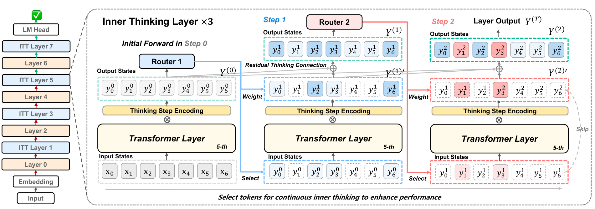

## 来源

- **标题**：Inner Thinking Transformer: Leveraging Dynamic Depth Scaling to Foster Adaptive Internal Thinking。
- **版本**：[ACL 2025 正式 PDF](https://aclanthology.org/2025.acl-long.1369.pdf)，页码 28241–28259；[arXiv](https://arxiv.org/abs/2502.13842) 首发于 2025-02-19。
- **团队**：百度、中科院信息工程研究所、国科大、北京师范大学；第一作者 Yilong Chen，论文注明工作完成于百度实习期间。
- **模型**：[ITT 实验模型族](../models/inner-thinking-transformer.md)。缩写为 **ITT**，不是 IIT。
- **核验范围**：直接核对官方 PDF 的正文、图表和附录；本地 `raw/` 尚无副本。下文“官方 PDF 直接核对”指该一手材料，不冒充已归档的 `raw/` 证据。网页摘要与正式 PDF 的摘要并不一致，采用具体章节和表格定位。

## 核心结论

ITT 把循环放在**单个 Transformer 层内部**：先完整前向，再让被路由选中的 token 多次复用该层参数。它把“算几次”和“哪些 token 值得继续算”结合起来，属于 [Looped Transformers](../concepts/looped-transformers.md) 的细粒度自适应计算路线（官方 PDF 直接核对，§3.2–3.3、Figure 3、§A.5）。

主实验在同一 50B-token 预训练配方下比较普通 Transformer、Loop 和 ITT。Table 1 的 162M ITT ×4 平均分为 42.1，普通 162M 为 40.4，普通 466M 为 43.6；因此“96.5% 表现”是 **42.1 / 43.6 的平均分比例**，不是准确率达到 96.5%，也不是证明全面替代更大模型（官方 PDF 直接核对，§4.1–4.2、Table 1；比例为本页复算）。

**保留方法价值，限制结果外推**：正式 PDF 的摘要、主体和附录存在规模及数字不一致。可靠入口是能逐项对照的主表与机制图；不能把摘要的“355M 匹配 1B”当成已经由 Table 1 证实的结论，详见下文证据边界。

## 架构与训练

> “ITT uses Adaptive Token Routing to select and weight important tokens for each inner thinking step.”（原图注节选，Figure 3，p. 28244）

### 三个组件各自解决什么

| 组件 | 原文机制 | 阅读边界 |
| --- | --- | --- |
| Adaptive Token Routing（ATR） | 线性预测器为当前 token 状态打分；按预算选 Top-K 子集进行额外变换，并用路由权重调节贡献 | 自适应的是 token 身份；训练选择方案和预算受预设配置约束，不等于无预算的自主停机 |
| Residual Thinking Connection（RTC） | 复用层变换，累积各步骤输出，而非只保留最后一次循环结果 | 与普通 residual connection 的关系由具体更新式决定，不能仅凭名称断言无梯度问题 |
| Thinking Step Encoding | 每一步有可学习的向量，与该步输出逐元素相乘 | 是步骤相关的乘性调制，不是序列位置编码，也不意味着各步共享全部附加参数 |

以上来自官方 PDF §3.2–3.3、Eqs. 4–7、Algorithm 1。原文 Eq. 4 将 RTC 写为：

$$x^{(t)}=\sum_{i=1}^{t} f\bigl(x^{(i-1)}\bigr)\odot\phi^{(i)}.$$

这是**未合入 ATR 的 RTC 表达式**；实际 ITT 还包含初始全量前向、选中 token 的加权更新和绕行分支。Figure 3 中 ×3 表示一次初始前向加两次额外步骤；主实验将每隔一层替换成 Loop 或 ITT 层，不能把 ×4 读成所有层都执行四次。层主干参数复用，但 router 与 step encoding 本身可学习，因此“无需扩参”宜理解为无需按有效深度复制整套主干（官方 PDF 直接核对，§3、§4.1；参数措辞为本页限定解释）。

**ATR 不等于已经实现按正确性自动退出**：§3.1 的 early-exit 定义使用真实目标的损失阈值，是概念说明；可执行机制是按得分选择 token。Algorithm 1 每一步重新路由，没有给出永久退出状态，所以不应推断某一步跳过的 token 此后永不参与（官方 PDF 直接核对，§3.1、§3.3、Algorithm 1；后半句为算法阅读推断）。

### 预训练配置

- 主体模型遵循 LLaMA2 架构，从随机初始化训练，不是对公开 LLaMA2-7B 权重进行无训练循环改造。
- RedPajama 50B 训练 tokens、2M 验证 tokens；序列长 4096，全局 batch 256，50,000 steps，学习率 3e-4，8 张 A100 80GB；基线与 ITT 使用相同数据和训练设置。
- Table 5 的三种模型均为 8 层，hidden size 分别为 1024／1536／2048，总参数标为 162M／230M／466M；目标为语言建模交叉熵。

定位：官方 PDF §3.3、§4.1、Table 5。同 token 预算不等于同 FLOPs：循环在训练和推理时均增加计算。

## 后训练

附录 §A.4 的指令微调实验报告，在 GSM8K 上全量 SFT 20 epochs，最终列出的 step 1703：Base 为 37.0%，ITT ×2 为 42.6%，提升 **5.6 个百分点**（Table 6）。作者将骨干写作“GPT-2-xl (1.8B)”；本页保留为**原文标称身份，待核验**，不将其与主体的 LLaMA2 风格小模型混用。该表支持局部 SFT 增益，但不构成匹配 FLOPs 的广泛推理能力结论。

## 评测要点

### 主表：参数效率与计算成本分开看

| 参数规模 | 普通 Transformer 平均分 | Loop ×4 平均分 | ITT ×4 平均分 | ITT 相对普通模型 |
| --- | ---: | ---: | ---: | ---: |
| 162M | 40.4 | 40.7 | 42.1 | +1.7 个百分点 |
| 230M | 41.8 | 42.2 | 43.9 | +2.1 个百分点 |
| 466M | 43.6 | 43.8 | 45.3 | +1.7 个百分点 |

定位：官方 PDF Table 1。这里转录作者的 Avg.，不将“优于基线”解释成每个任务都赢。正文称 11 个基准，但主表实际列出 SciQ、PIQA、WinoGrande、ARC-E、ARC-C、HellaSwag、LogiQA、BoolQ、LAMBADA、MMLU 共 **10 个任务列**；额外任务及平均分口径需要作者澄清。

162M 的 FLOPs 列为普通模型 1.88、Loop ×4 为 4.70、ITT ×4 为 3.29；**ITT 相对 Loop ×4 少约 30%，但仍为普通模型的约 1.75 倍**。本页只保留原表数值与比例，表头未清晰标出计量单位，不补写 GFLOPs，也不将 FLOPs 节省换算成实测时延。数据节省 43.2% 对应 Figure 4 / §4.2 所述达到 162M 基线表现时使用 56.8% 训练数据，不能解释为全任务、全规模统一少训 43.2%。

### 固定权重下的推理预算调整

| 162M 配置：三个额外步骤的选择率 | FLOPs（原表） | 验证 PPL ↓ |
| --- | ---: | ---: |
| ITT ×4：70%／70%／70%（训练配置） | 3.85 | 10.52 |
| ITT ×4：50%／50%／50% | 3.29 | 10.47 |
| ITT ×4：70%／70%／90% | 4.04 | 10.21 |
| ITT：90%／90%／0%（跳过一步） | 3.57 | 10.40 |
| Loop ×4：100%／100%／100% | 4.70 | 10.78 |

定位：官方 PDF Table 2。该实验支持**调整已训练步骤的参与率或移除一步**，不是无限增加未见步骤的证明。Figure 5 的不同 ×2／×3／×4 配置经过训练，不应整张图都称作同一 checkpoint 的零训练深度外推。

### 消融与正式版的证据边界

Table 3 以 ITT ×4 的 PPL 10.25 为基准：去掉 RTC 为 11.02，去掉 ATR 为 10.44，去掉步骤编码为 10.56。它支持 RTC 在这组消融中的影响最大；但“因此模型学会了可靠的逐步推理”仍超出这组 PPL 证据。

直接核对官方 PDF 时发现以下冲突，保留在此供后续复查：

- **规模冲突**：摘要称 355M／1B／3B，正文与 Table 1 / Table 5 是 162M／230M／466M，Limitations 仍说最高 466M。附录另有 1.88B 与“等效”层数配置，不能自动补齐摘要对照。
- **大模型数字冲突**：Table 8 的 50B-token PPL 为 6.00 → 5.68，紧邻文字却写 8.00 → 7.00；10B 行也与文字不符。大规模收益暂不作为核心结论。
- **消融数字冲突**：步骤编码的 10.56 − 10.25 = 0.31，与正文相符，但 Table 3 括号写 +0.22；Table 2 相同 50% 选择率配置的 10.47 与 Table 3 的 10.25 也未交代差异。
- **理论边界**：§3.4 / §A.3 依赖小残差、误差收缩等条件。小更新本身不足以保证向目标收缩；本页不将其写成实际 Transformer 必然几何收敛的定理。此判断是本页的数学审读，不是作者自行承认的限制。

## 待追问

- **需补外部来源**：ATR 的序列级 Top-K 在自回归训练／解码中如何保持因果一致？只处理选中 token 时，其 attention 能访问哪些未选中 token 的 KV？Algorithm 1 的 KV 参数不足以确定缓存实现。
- **需实验或作者披露**：层内循环的 router、选择／散射和缓存读写开销会不会抵消 FLOPs 优势？需要真实 prefill／decode 时延、吞吐与 KV 内存测量。
- **需补外部来源**：正式版摘要、Table 8、消融表和 benchmark 数量的冲突，是否有勘误或可复现实验代码？在解决前不采用更大模型的强宣传结论。
- **需实验或作者披露**：固定 Top-K 预算与真正 learned halting 的收益如何区分？能否在相同总 FLOPs 下比较统一循环、ATR 和逐 token 停机？

## 相关页面

- [Mixture-of-Recursions（MoR）](mixture-of-recursions.md) — 对照层内／层栈复用、永久退出、Top-K 因果性及 KV 语义；不能用 MoR 的实现补全 ITT 未说明的部分。
- [ITT 实验模型族](../models/inner-thinking-transformer.md) — 主体模型身份与附录规模边界。
- [Looped Transformers](../concepts/looped-transformers.md) — 将 ITT 放在层内复用与 token 选择的交叉位置。
